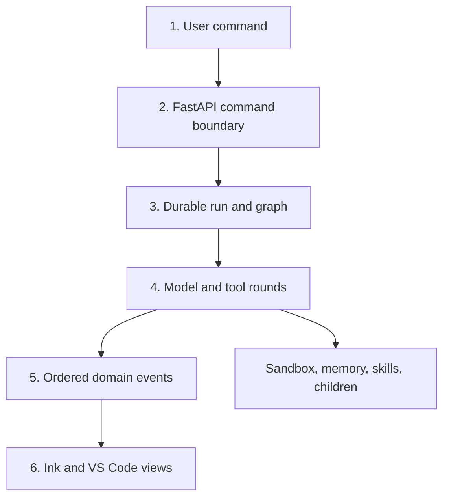
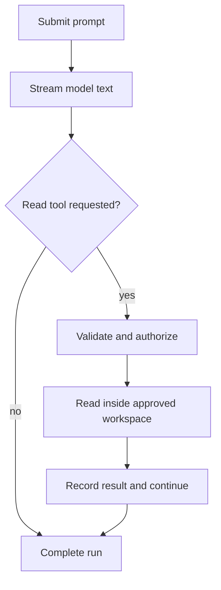

# CLI Agent Platform: Start Here

> A source-backed build guide for moving this repository's runtime behavior into
> a Python/FastAPI backend, a React Ink CLI, and a VS Code extension.

## What you are building

You are not building a chatbot with a shell command attached. You are building
a durable agent platform with four cooperating products:

| Product | Responsibility |
| --- | --- |
| FastAPI control plane | Authenticates commands, owns sessions/runs, persists state, and streams ordered events. |
| LangGraph runtime | Calls the model, validates and authorizes tools, records results, pauses, resumes, delegates, and stops safely. |
| React Ink CLI | Gives the user immediate text, live activity, steering, approvals, agent controls, and reconnect support. |
| VS Code extension | Projects the same backend state into chat, trees, diffs, editors, commands, and status surfaces. |

The target design preserves behavior found in this TypeScript repository. It
does not imply that the Python backend already exists here.

## Evidence legend

Every architecture document uses these labels:

| Label | Meaning |
| --- | --- |
| **CURRENT** | Directly implemented in this repository and linked to source. |
| **TARGET** | The Python/FastAPI/LangGraph equivalent we should implement. |
| **GAP** | Referenced by the repository or required by the target, but not implemented in the visible source tree. |
| **DECISION** | A deliberate target choice where several valid implementations exist. |

If prose conflicts with source, source wins for **CURRENT** behavior. If a
target contract conflicts with an older overview, the detailed SRS wins.

## The system in one view

This diagram answers only one question: which layer owns each stage of a user
request?



How to read it:

1. The client submits an idempotent command; it does not mutate graph state.
2. FastAPI validates identity, workspace scope, protocol version, and command.
3. The application service creates or resumes a durable run.
4. LangGraph performs model/tool rounds inside policy and budget boundaries.
5. State changes commit with ordered events; events are not reconstructed from logs.
6. Both clients replay and reduce the same event stream.
7. Tools, children, memory, skills, and sandboxes are runtime services, not UI shortcuts.

## Read this in build order

Do not read the documentation alphabetically. Build in dependency order:

| Stage | Read first | What becomes buildable |
| --- | --- | --- |
| 0. Orient | [Current Repository](project-architecture/01-current-repository.md) | A source map and migration boundary. |
| 1. Freeze contracts | [Runtime SRS](runtime-srs/README.md) | IDs, tool calls, permissions, events, and persistence vocabulary. |
| 2. Build the safe core | [Tool Contract](runtime-srs/01-tool-contract.md), [Permission System](runtime-srs/03-permission-system.md) | Read/search tools through one validated executor. |
| 3. Build the loop | [Agent Architecture](agent-architecture/README.md), [Control Loop](agent-architecture/02-langgraph-control-loop.md) | A model-driven loop with durable pauses and typed stop reasons. |
| 4. Make it recoverable | [Checkpointing](agent-architecture/03-state-checkpointing-and-recovery.md), [Artifacts and History](execution-architecture/02-artifacts-and-history.md) | Crash recovery, idempotency, large output storage, and file rewind. |
| 5. Make it feel fast | [CLI Architecture](cli-architecture/README.md), [CLI Improvements](cli-improvements/README.md) | Streaming text, tool overlap, live steering, terminal conformance, cancellation, reconnect, and measurable release evidence. |
| 6. Add second client | [VS Code Extension](project-architecture/06-vscode-extension.md) | Native trees/diffs plus a restricted webview over the same protocol. |
| 7. Isolate powerful execution | [Sandbox and Resources](execution-architecture/01-sandbox-and-resources.md) | Local/server placement, quotas, network policy, and sandbox providers. |
| 8. Add memory | [Memory Architecture](memory-architecture/README.md) | Session summaries and durable, scoped, source-aware memory. |
| 9. Add reusable workflows | [Skills Architecture](skills-architecture/README.md) | Local skills, a skill builder, discovery, review, and safe fetch. |
| 10. Add delegation | [Multi-Agent Control](cli-architecture/03-multi-agent-control.md) | Child runs, teams, steering, stop-one, and stop-all after budgets/isolation exist. |
| 11. Harden and ship | [Risk and Test Matrix](execution-architecture/03-risk-and-test-matrix.md), [Roadmap](project-architecture/09-delivery-roadmap.md) | Adversarial tests, operations, rollout, and acceptance. |

## Folder story

### `project-architecture/`

The product story. Start here to understand the existing repository, target
system boundaries, FastAPI service, runtime, clients, protocol, security, and
delivery sequence. These are orientation documents; detailed contracts live in
the SRS folders.

### `runtime-srs/`

The contract story. This folder defines tool schemas, the complete tool
catalog, authorization, API/events, relational data, and which Python type is
appropriate at each boundary. Implement this before adding sophisticated
agents.

### `agent-architecture/`

The control story. This folder owns LangGraph state, nodes, continuation,
termination, checkpointing, replay, recovery, and observable interactions. The
graph chooses what happens; tools only implement capabilities.

### `cli-architecture/`

The interaction story. This folder explains fast streaming, the command queue,
messages sent while work is running, background agents, teams, and precise
cancel/shutdown semantics.

### `cli-improvements/`

The implementation-readiness story. This folder rates the architecture/SRS,
adds CLI-specific normative IDs, closes terminal/input/reconnect/performance
gaps, and maps improvements to tests and release evidence.

### `memory-architecture/`

The learning story. This folder separates bounded conversation context,
session summary, durable user/project memory, agent-scoped memory, retrieval,
consolidation, stale-memory correction, retention, and deletion.

### `skills-architecture/`

The reusable-workflow story. This folder defines `SKILL.md`, local discovery,
invocation, inline versus forked execution, the session-to-skill builder, and a
safe discover-then-fetch design for remote skills.

### `execution-architecture/`

The containment story. This folder owns sandbox adapters, local/server resource
scheduling, artifacts, file history, threat controls, and adversarial tests.

## Recommended target tree

Keep the agent architecture in its own backend package. Do not place the loop
inside API routes or individual tools.

```text
backend/
  api/                    # FastAPI HTTP/WebSocket adapters
  application/            # command handlers and transaction boundaries
  agent/                  # LangGraph state, graph, nodes, guards, delegation
  tools/                  # contracts, registry, executor, built-ins, MCP adapters
  permissions/            # policy, grants, approval lifecycle
  memory/                 # context, session, durable, retrieval, consolidation
  skills/                 # loader, registry, builder, search/fetch, evaluation
  execution/              # sandbox providers, scheduler, workers, artifacts
  persistence/            # SQLAlchemy repositories and graph checkpointer
  protocol/               # Pydantic command/event/API schemas
  observability/          # audit, metrics, traces, safe logs

packages/
  protocol-ts/            # generated TypeScript schemas/types
  client-core/            # transport, replay, reducer, command client
  ink-cli/                # React Ink presentation
  vscode-extension/       # extension host, webview, tree/diff adapters
```

## First usable vertical slice

The first release should prove one complete trajectory:

**Question:** what is the smallest safe prompt-to-tool-to-answer product path?



How to read it: the model either completes naturally or requests a validated
read. A tool result returns to the model through the same guarded loop; it does
not bypass persistence, authorization, or the configured safety envelope.

Build acceptance:

1. A CLI can create a session and submit one idempotent command.
2. Visible model text appears before the response completes.
3. `Read` arguments are Pydantic-validated and project-contained.
4. The result is paired with exactly one tool-use ID.
5. The graph loops because tool calls exist, not because of a fixed happy-path count.
6. A configurable guard still stops runaway execution with a typed reason.
7. Restarting CLI replays the same ordered timeline without duplicate text.

## Scenario index

| Scenario | Primary specification |
| --- | --- |
| Send a message while the main agent works | [Live Steering](cli-architecture/02-live-steering.md) |
| Send a message to a running or stopped child | [Multi-Agent Control](cli-architecture/03-multi-agent-control.md) |
| Start independent agents concurrently | [Multi-Agent Control](cli-architecture/03-multi-agent-control.md) |
| Decide whether delegation is rational | [Multi-Agent Control](cli-architecture/03-multi-agent-control.md) |
| Stop foreground work, one task, or all agents | [Live Steering](cli-architecture/02-live-steering.md), [Multi-Agent Control](cli-architecture/03-multi-agent-control.md) |
| Recover after server/client failure | [Checkpointing](agent-architecture/03-state-checkpointing-and-recovery.md) |
| Prevent infinite loops and hallucinated completion | [Risk and Test Matrix](execution-architecture/03-risk-and-test-matrix.md) |
| Prevent data leakage and memory poisoning | [Memory Safety](memory-architecture/03-safety-retention-and-deletion.md), [Risk and Test Matrix](execution-architecture/03-risk-and-test-matrix.md) |
| Run on PC or server resources | [Sandbox and Resources](execution-architecture/01-sandbox-and-resources.md) |
| Preserve outputs and project history | [Artifacts and History](execution-architecture/02-artifacts-and-history.md) |
| Build a skill from a successful session | [Skill Contract and Builder](skills-architecture/01-skill-contract-and-builder.md) |
| Search and fetch a missing skill | [Skill Discovery](skills-architecture/02-discovery-search-and-fetch.md) |
| Review and prioritize CLI improvements | [CLI Improvement Program](cli-improvements/README.md) |
| Trace every CLI requirement to release evidence | [CLI Traceability](cli-improvements/04-traceability-and-delivery.md) |

## Documentation UX

All graphs follow [Readable Diagram Standard](diagram-standard.md). Each graph:

- answers one question;
- uses short labels and top-down flow by default;
- stays small enough to read without zoom;
- is followed by a numbered explanation;
- separates current behavior from target behavior;
- treats prose, schemas, and requirements as canonical.
