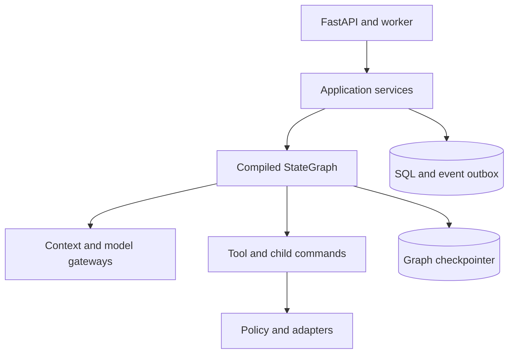
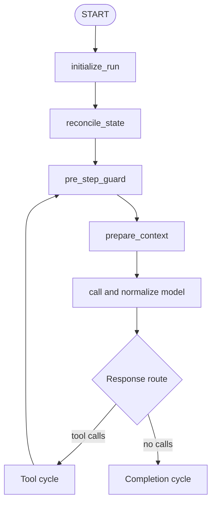
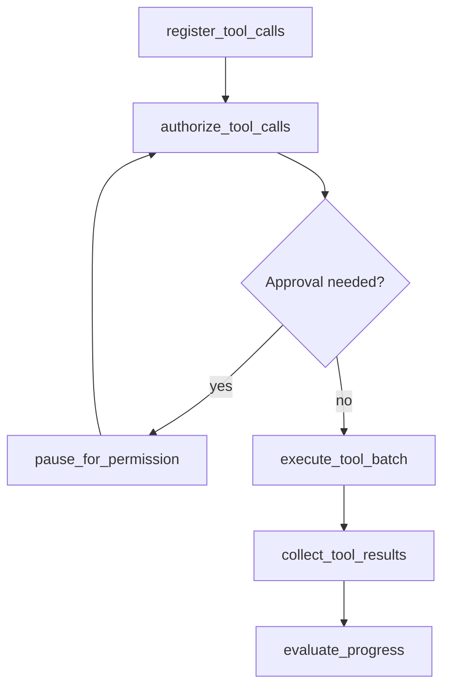
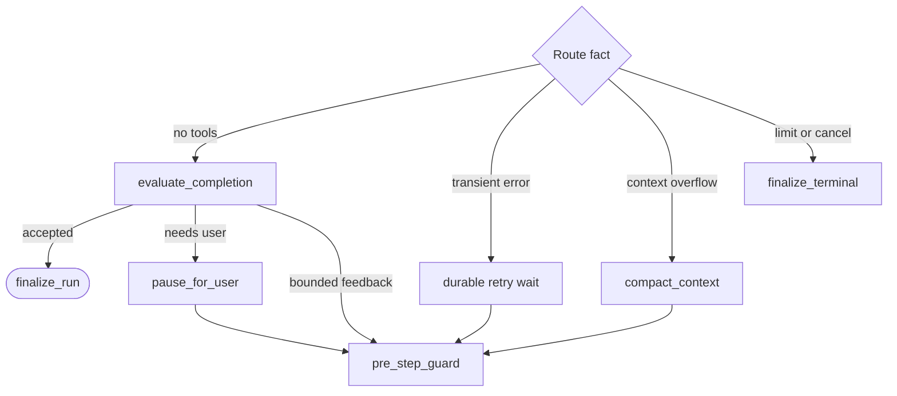
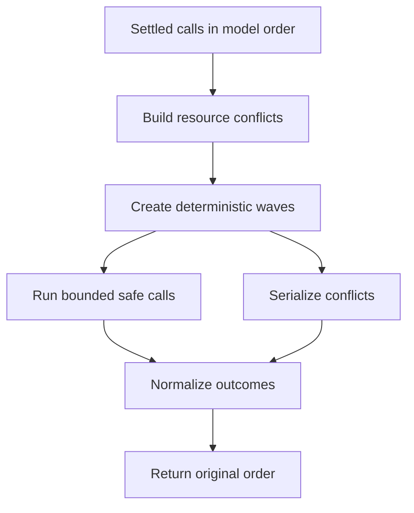
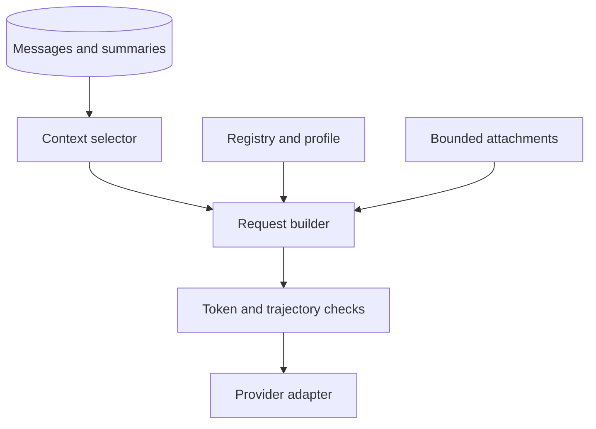
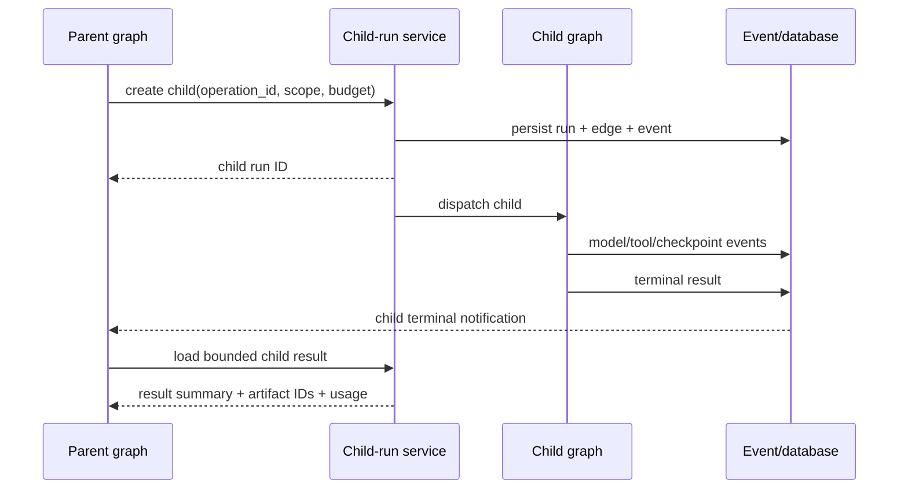

# Agent Runtime SRS

> Normative responsibilities and graph topology for the Python agent runtime.

[Agent architecture index](README.md) | [Docs start page](../README.md) | [Diagram standard](../diagram-standard.md)

## Repository evidence and target boundary

| Status | Source | Behavior reused |
| --- | --- | --- |
| **CURRENT** | [`query.ts`](../../query.ts) | Explicit streaming model/tool rounds, result adjacency, cancellation, queue injection, and turn guard. |
| **CURRENT** | [`Tool.ts`](../../Tool.ts) | Tool metadata/context boundary and executor-facing behavior. |
| **CURRENT** | [`StreamingToolExecutor.ts`](../../services/tools/StreamingToolExecutor.ts) | Early execution, bounded concurrency semantics, progress, and ordered settlement. |
| **CURRENT** | [`AgentTool.tsx`](../../tools/AgentTool/AgentTool.tsx) | Child/background run behavior, worktree isolation, and resume metadata. |
| **TARGET** | This SRS | Named LangGraph nodes, durable SQL commands/events, checkpoints, and independent child threads. |

## Scope

The agent runtime begins after FastAPI durably accepts a run command and ends
after the run reaches a typed terminal state. It coordinates model calls,
context construction, tools, permissions, user waits, child agents, recovery,
and finalization.

It does not implement filesystem, shell, web, MCP, database, editor, or UI
effects directly. Those belong to capability adapters behind application
services.

## Goals

`AGT-001`: Express every continuation, wait, retry, and terminal path as a named,
observable, checkpointed graph transition.

`AGT-002`: Keep model/provider behavior, tool execution, permissions, graph
control, and clients replaceable behind explicit contracts.

`AGT-003`: Support main agents, child/subagents, teammate runs, forked skills,
scheduled runs, and remote runs through one runtime with bounded profiles.

`AGT-004`: Preserve provider-valid conversation trajectories: assistant
tool-use blocks are followed by matching tool-result blocks before the next
model request.

`AGT-005`: Make crash recovery safe without claiming impossible exactly-once
semantics for arbitrary external effects.

`AGT-006`: Stream useful visible progress while retaining one durable canonical
history.

## Non-goals

- The graph does not expose or persist private chain-of-thought.
- The graph does not let the model alter its own permissions or hard budgets.
- The graph does not use in-memory callbacks as durable state.
- The graph does not use LangGraph checkpoints as the user-visible transcript or
  security audit database.
- The graph does not hide a second recursive agent loop inside a tool adapter.
- The graph does not guarantee completion of an impossible/underspecified task;
  it guarantees bounded, explainable execution.

## Agent roles

| Role | Purpose | Parent | User-visible response | Default capability |
| --- | --- | --- | --- | --- |
| Main agent | Owns one foreground user turn. | None in run tree | Yes | Session/workspace profile |
| Subagent | Bounded delegated investigation or implementation. | Main/child run | Returns result to parent | Intersection of parent and subagent profile |
| Teammate | Longer-lived peer sharing a team/task board. | Coordinator/root run | Through messages/tasks | Explicit team profile |
| Forked skill | Runs skill instructions in isolated child context. | Calling run | Returns result to caller | Skill profile intersection |
| Scheduled agent | Executes approved schedule profile. | Optional prior run | Event/notification result | Stored schedule scope only |
| Remote agent | Executes authenticated remote trigger. | Optional coordinator | Protocol result | Stored trigger scope only |
| Coordinator | Delegates, receives child outcomes, synthesizes. | Usually root/main | Yes if main | No implicit child capability union |

`AGT-010`: Every role is represented by an `agent_runs` row and a LangGraph
thread/namespace. A background task ID without a run record is insufficient.

`AGT-011`: Agent profile is versioned immutable input defining system
instructions, allowed tool families, model policy, context policy, child policy,
and default budgets. It is not project-controlled executable code.

`AGT-012`: The effective child capability set is an intersection, never a union:

```text
deployment policy
  intersect workspace policy
  intersect parent effective scope
  intersect selected child profile
  intersect delegation-specific scope
```

## Component boundaries

**Question:** which component owns graph decisions versus durable effects?



How to read it:

1. HTTP handlers and workers invoke use cases; they do not contain the loop.
2. Application services own transactions, authorization, idempotency, and queries.
3. The graph owns semantic order and routing.
4. Context/model gateways translate bounded data to provider operations.
5. Tool/child work is requested through stable application command IDs.
6. Policy and adapters own concrete external effects.
7. SQL/outbox owns product history; the checkpointer owns resumable graph channels.

### Graph owns

- node routing and continuation reason;
- bounded graph state and reducers;
- model/tool/interrupt ordering;
- checkpoint points and graph-version compatibility;
- recovery and no-progress routing;
- parent/child join semantics;
- finalization routing.

### Application services own

- transactions, state transitions, idempotency, event sequence, and audit;
- registry snapshots and context projections;
- tool and permission records;
- session/run/message/task/artifact records;
- actor/workspace authorization;
- child-run creation/cancellation commands.

### Adapters own

- provider SDK and streaming protocol translation;
- concrete filesystem/process/web/MCP/editor operations;
- external idempotency/reconciliation and cancellation;
- artifact backend and checkpointer implementation.

`AGT-020`: A graph node calls application interfaces with stable command IDs. It
MUST NOT write ORM rows directly or publish socket events directly.

`AGT-021`: Nodes are safe to invoke again with the same `run_id`, node operation
ID, and input fingerprint. Domain command idempotency returns the existing
result instead of duplicating records.

## Graph topology

The topology is split into three readable views. The semantic node names in
these graphs are the implementation contract even if adjacent pure nodes are
combined after profiling.

### Main cycle

**Question:** how does a run reach tools or completion?



How to read it:

1. Initialization binds profile, registry, policy, budget, and immutable identity.
2. Reconciliation resolves stale checkpoint/domain facts before new effects.
3. Guard checks cancellation, deadline, budgets, policy epoch, and no progress.
4. Context is bounded and provider-valid; compaction is a subflow when needed.
5. Model streaming settles into one canonical normalized response.
6. Actual tool blocks route to the tool cycle; no-tool response routes to completion.
7. A successful tool cycle returns through guards rather than calling the model directly.

### Tool cycle

**Question:** how does one assistant tool batch return to the model safely?



Denied/invalid calls are already terminal results and do not execute. A pause
resumes by loading durable decisions, then re-evaluates the exact request
revision. Collection returns calls in original model order.

### Completion, recovery, and terminal routing

**Question:** what happens when normal continuation is not immediately possible?



Fatal provider/integrity failures use `finalize_failure`. Retry, compaction,
completion feedback, and user waits each have independent budgets and stable
continuation reasons.

The exact compiled graph may combine pure nodes for efficiency, but events and
state transitions MUST retain these semantic phases.

## Graph state versus runtime context

Graph state is checkpointable data; runtime context is reconstructed trusted
dependencies. The canonical shapes are defined in
[Python Types and Performance](../runtime-srs/06-python-types-and-performance.md).

Minimum state facts:

| Group | Fields |
| --- | --- |
| Identity | session, run, workspace, turn, parent/root run IDs |
| Compatibility | graph version, registry snapshot ID, policy epoch |
| Conversation | bounded model-context messages and latest durable message/event high-water marks |
| Routing | current/next route, continuation reason, pending wait ID |
| Tools | proposed/pending/completed call IDs and result ordering |
| Children | pending/completed child IDs and join policy |
| Budgets | model/tool calls, tokens, cost, deadline counters/limits |
| Recovery | node operation ID, checkpoint/domain high-water mark, retry/no-progress counters |
| Result | final message ID and stop reason when terminal |

`AGT-030`: IDs reference application records. Large content, schemas, complete
audit evidence, and artifacts are not copied into state.

`AGT-031`: State reducers are deterministic and tested under parallel updates.
No node mutates the input dictionary in place; it returns a partial update.

## Node contracts

### `initialize_run`

Inputs: authenticated run/session/workspace IDs and graph invocation metadata.

Responsibilities:

- load run/profile/status and verify this graph version may own it;
- bind/verify immutable tool registry snapshot and effective capability scope;
- initialize budget counters, route, and event high-water mark;
- reconstruct runtime context outside state;
- emit/run the idempotent `run.started` transition if not already started.

Routes to reconciliation. It never calls a model or tool.

### `reconcile_state`

Compares checkpoint facts to application rows after initial start and every
uncertain recovery. It:

- resolves already-committed node commands by stable operation ID;
- loads settled permissions/questions that a stale checkpoint still calls
  pending;
- finds tool/model attempts left claimed/running by a dead worker;
- marks/reconciles uncertain external effects according to idempotency class;
- advances state to the durable domain high-water mark;
- refuses resume under an incompatible graph/registry/schema change unless a
  migration exists.

### `pre_step_guard`

Checks before every expensive or side-effecting step:

- run/session cancellation and runtime draining;
- absolute deadline and per-step remaining timeout;
- model/tool/token/cost/child budgets;
- workspace trust/policy epoch changes requiring reauthorization;
- recursion/graph remaining steps;
- provider and adapter circuit status;
- current node retry/no-progress bounds.

It returns a typed route; it does not raise a generic exception for expected
budget/cancel outcomes.

### `prepare_context`

Loads the model-visible projection and constructs a deterministic bounded
request:

1. versioned agent/system profile;
2. applicable policy/mode reminders without secret rule internals;
3. optional skill instructions and safe workspace context;
4. retained conversation trajectory and compaction summaries;
5. matching tool results and child outcomes;
6. exact tool registry definitions selected for this call;
7. bounded editor/user attachments;
8. continuation/error feedback when a prior phase requires it.

It records input token estimate and context manifest/hash. Provider SDK objects
are created later by the gateway.

`AGT-040`: Context construction is deterministic for the same durable snapshot,
registry, profile, and provider adapter version, except explicitly recorded
ephemeral metadata such as current time.

`AGT-041`: Provider-specific ordering and tool-result invariants are validated
before request dispatch. An orphan tool use/result is a recoverable internal
consistency error, not a malformed provider request.

### `compact_context`

Compaction changes the model context view, not immutable product history. It:

- selects a safe boundary that does not split a tool-use/result trajectory;
- creates a summary using the configured deterministic/model-assisted policy;
- stores source message IDs/hash, summary message/artifact, token counts, and
  provenance;
- replaces older context entries with a summary reference in graph state;
- emits `context.compacted`.

`AGT-042`: Compaction has bounded attempts per model call. A context that cannot
fit after configured recovery stops with `context_limit_exceeded`; it does not
loop forever.

### `call_model`

The model gateway receives a normalized immutable request and streams typed
events:

```python
class ModelGateway(Protocol):
    async def stream(
        self,
        request: ModelRequest,
        *,
        operation_id: str,
        cancellation: CancellationToken,
    ) -> AsyncIterator[ModelStreamEvent]:
        ...
```

Responsibilities:

- claim model budget and create logical call/attempt before provider request;
- translate normalized messages/tools to provider API;
- enforce connect/read/overall deadlines and cancellation;
- stream visible assistant text through bounded provisional events;
- accumulate the canonical provider response without trusting partial deltas as
  durable completion;
- record provider request ID, usage, stop category, latency, and safe failure;
- never automatically retry after a complete ambiguous response without
  adapter-specific idempotency evidence.

`AGT-050`: Provider stop reasons are advisory. Routing is based on normalized
content blocks: the presence of valid tool calls routes to tools; their absence
routes to completion. This mirrors the current repository's defensive behavior
in [`query.ts`](../../query.ts), which notes that a tool-use stop reason is not
always reliable.

`AGT-051`: Stream interruption before a canonical completed response yields a
typed incomplete attempt. Partial assistant text may remain visible as cancelled
output but is not sent back as a normal completed assistant message unless the
provider adapter can prove completion.

### `normalize_model_response`

Validates and maps provider output into provider-neutral blocks:

- visible text/status blocks;
- zero or more tool-use blocks with provider tool-use ID, canonical name lookup,
  and raw arguments;
- supported media/structured output blocks;
- normalized finish category and usage;
- provider-encrypted reasoning metadata only as opaque restricted data if needed
  for provider continuation, never user-visible reasoning.

Malformed tool calls become explicit rejected tool results when the provider
trajectory can safely continue. An irrecoverably malformed response enters the
provider recovery/failure path.

### `register_tool_calls`

Creates one durable logical `tool_calls` record per normalized tool-use block,
preserving original order. It resolves aliases through the model call's exact
registry snapshot, validates schemas/semantics, normalizes resources, computes
risk and argument hash, and creates rejected results for unknown/invalid calls.

The node uses one idempotent batch command keyed by model call and response hash.

### `authorize_tool_calls`

Calls the policy engine for each validated call and stores full decisions.

- `allow` calls become ready to schedule;
- `deny` calls receive a normal denied tool result so the model can react;
- `ask` calls create durable permission requests/interrupt data;
- intrinsic user-interaction tools create typed user waits rather than being
  faked as ordinary permission prompts.

`AGT-060`: Authorization may be evaluated in parallel as pure work, but final
decisions and request/event sequences are committed deterministically.

### `pause_for_permission` / `pause_for_user`

These nodes persist the wait and checkpoint, then invoke a LangGraph interrupt.
The interrupt payload contains IDs, revision, safe review projection, and
allowed choices. It does not contain live callback functions or unrestricted
tool arguments.

Resume input is an authenticated command result loaded from the application DB,
not blindly trusted client JSON passed directly to the node.

### `execute_tool_batch`

Passes only settled calls to the central executor. Scheduling follows tool
metadata and normalized resource locks:



How to read it:

1. Provider order remains the result order, not necessarily execution order.
2. Normalized paths/resources and explicit dependencies create conflicts.
3. Each wave is deterministic for the same registry/input snapshot.
4. Safe calls consume bounded scheduler capacity; conflicting calls serialize.
5. Success, failure, denial, cancellation, and unknown effects normalize equally.
6. Ordered collection reconstructs the provider-valid tool-result batch.

Tool errors are data returned to the model unless a runtime integrity failure
prevents constructing a valid result. One tool failure does not erase sibling
results.

`AGT-061`: The graph does not infer concurrency from read-only alone. It obeys
the tool contract, resource conflict graph, global/per-run limits, and adapters.

`AGT-062`: Side-effecting calls are not automatically retried by the graph.
Retry policy belongs to the tool attempt/idempotency contract and reconciliation
service.

### `collect_tool_results`

Persists/loads exactly one terminal result for every tool-use block and appends
provider-valid result blocks in the original order. It includes denied,
cancelled, invalid, failed, and unknown-outcome results, not only successes.

`AGT-070`: The graph MUST NOT call the model until every tool call from that
assistant response has a terminal result, except an explicitly supported
streaming-tool protocol whose provider contract is separately proven.

`AGT-071`: If cancellation interrupts a batch, every unstarted/running call gets
a durable cancelled or uncertain terminal state and matching result block before
the run terminates or resumes.

### `evaluate_progress`

Calculates a fingerprint from meaningful state:

- normalized unresolved objective/task set;
- latest assistant/tool/result signatures;
- changed files/resources/tasks;
- child outcomes;
- error/recovery category;
- context compaction boundary.

It increments repeat/no-progress counters and chooses continue or a typed safety
stop. Similar text alone is not sufficient to claim progress.

### `evaluate_completion`

Runs only when the normalized response has no tool calls. It:

- verifies the assistant message is complete and persistable;
- evaluates configured stop/completion hooks once for this response hash;
- supports a bounded hook-requested continuation with an explicit feedback
  message;
- routes intrinsic user questions/plan approval to a durable user wait;
- applies final task/budget policy;
- accepts natural model completion otherwise.

`AGT-080`: Stop hooks cannot directly execute hidden tools or mutate graph state.
They return a validated decision: `accept`, `continue_with_feedback`,
`wait_for_user`, or `fail`, plus bounded safe data.

`AGT-081`: Repeated hook feedback is fingerprinted and bounded independently to
prevent the error/feedback/retry spiral that the current implementation already
guards against in prompt and stop-hook recovery paths.

### Finalization nodes

Finalization is idempotent and terminal:

- settle streaming message into canonical completed/cancelled form;
- calculate authoritative usage/cost from model and tool records;
- settle pending calls/children according to cancellation policy;
- release leases/locks and schedule safe cleanup;
- transition run/turn/session status;
- write stop reason, result summary, final checkpoint reference, and terminal
  events;
- wake parent run/join service when this is a child.

Expected terminal stop reasons include:

| Category | Examples |
| --- | --- |
| Success | `model_completed`, `plan_approved`, `child_result_returned` |
| User/system stop | `cancelled_by_user`, `runtime_shutdown`, `hook_stopped` |
| Budget | `model_call_limit`, `tool_call_limit`, `token_limit`, `cost_limit`, `deadline` |
| Progress | `no_progress`, `repeated_tool_cycle`, `recursion_limit` |
| Context/provider | `context_limit_exceeded`, `provider_unavailable`, `content_filtered` |
| Integrity/security | `checkpoint_incompatible`, `policy_denied_run`, `outcome_unknown_requires_review` |
| Failure | `internal_invariant_failed`, `tool_result_incomplete`, `child_join_failed` |

## Context architecture

Conversation storage and model context are separate projections:



How to read it:

1. Immutable history and summaries remain in application storage.
2. Selector chooses a bounded, trajectory-safe projection.
3. Builder combines that projection with the exact registry/profile snapshot.
4. Attachments are authorized and size-bounded before inclusion.
5. Token and tool-use/result invariants are checked before provider translation.
6. The adapter never receives unrestricted database/session objects.

`AGT-090`: Each model call stores a context manifest containing selected message
IDs/block hashes, summary IDs, registry snapshot, profile version, token
estimate, and normalized request hash.

`AGT-091`: Context selection never drops a tool result while retaining its
assistant tool-use block, or vice versa.

`AGT-092`: Child context is purpose-built from delegation prompt, selected
evidence, profile, and bounded parent context. It does not copy the entire parent
state by default.

`AGT-093`: Tool descriptions and project instructions are untrusted prompt
content. They do not alter policy or system-level capability scope.

## Child agent architecture

### Spawn

The `Agent` tool is a request to create a child run. After schema/permission
approval, the child-run service atomically creates:

- child run and parent edge;
- immutable delegation input message/artifact;
- child profile/model/capability/registry snapshot;
- child budgets and deadline not exceeding parent remaining scope;
- `agent.spawned` event and durable work item.

The tool either blocks for the child result or returns a background task/run ID
according to its contract.

### Execution

Each child runs the same compiled graph with a distinct `run_id`, checkpoint
namespace, cancellation token, event scope, and model context. Child tool calls
pass through normal permission policy.

### Join

**Question:** how does a parent observe child completion after a process restart?



How to read it:

1. Persist the child and parent edge before dispatch so a restart can recover ownership.
2. Child execution writes normal model/tool/checkpoint events under its own run ID.
3. Parent wake-up is based on durable terminal state, not an in-memory future.
4. Join loads a bounded structured result plus artifact IDs and usage for policy/budget accounting.

`AGT-100`: Parent wait references child IDs and join policy (`all`, `first_valid`,
or explicitly configured quorum). It does not hold an in-memory future.

`AGT-101`: Parent cancellation propagates to descendants by default. Detached
background runs require explicit product policy and continue under their own
owner/budget, never as orphan workers.

`AGT-102`: Child results are validated, bounded, and treated as untrusted model
content. The parent receives summaries/artifact references, not hidden child
reasoning or unrestricted state.

`AGT-103`: Shared task/file access uses normal optimistic concurrency and
resource locks. Agents do not coordinate by mutating each other's checkpoint.

## Skills, hooks, and plugins

| Extension point | Allowed role | Forbidden role |
| --- | --- | --- |
| Skill | Adds versioned prompt/instructions; may request forked child profile | Cannot grant capabilities or execute at load time |
| Pre/post tool hook | Returns validated allow-neutral metadata, rewrite candidate, feedback, or stop decision | Cannot call adapter around executor or forge result |
| Completion hook | Accepts or requests bounded continuation/wait | Cannot hide infinite recursive loop |
| Plugin | Registers signed/approved schemas/adapters through registry | Cannot import into graph state or bypass policy/events |
| MCP | Dynamic capability adapter through registry/executor | Cannot be a graph node with direct authority |

`AGT-110`: Every extension execution has timeout, cancellation, provenance,
version/hash, output schema, and error policy.

`AGT-111`: A hook input rewrite creates a new canonical argument hash and restarts
validation/permission. A hook cannot mutate an approved request in place.

## Cancellation

Cancellation is hierarchical and durable:

1. API command sets `stop_requested_at`, reason, actor, and event.
2. Worker polling/event signal wakes the owning graph.
3. Model gateway cancels provider stream where supported.
4. Tool executor signals process groups/adapters and marks every call outcome.
5. Child-run service propagates to non-detached descendants.
6. Graph reaches finalization after bounded cleanup deadline.

`AGT-120`: Cancellation is not a Python task cancellation alone. Durable state
ensures another worker observes and completes cleanup after a crash.

`AGT-121`: Shield only the short critical sections required to persist terminal
evidence. Do not shield model/tool I/O from cancellation.

`AGT-122`: If an effect cannot be safely interrupted, cancellation records
`cancellation_pending` and later reconciles its terminal certainty.

## Error taxonomy and retry ownership

| Error | Owner | Default |
| --- | --- | --- |
| Invalid model/tool payload | Normalizer/executor | Return typed feedback or fail malformed response |
| Provider transient before response | Model gateway/graph retry node | Bounded retry with backoff/deadline |
| Provider rate limit | Scheduler/model gateway | Respect retry-after and budgets |
| Tool retry-safe transient | Tool executor | Bounded contract-specific retry |
| Tool side effect uncertain | Reconciliation service | No blind retry; user/operator review if needed |
| Database transaction conflict | Application service | Short bounded retry with same operation ID |
| Permission denied/expired | Policy domain | Normal tool result or terminal if run itself denied |
| Checkpoint incompatible | Recovery node | Stop or explicit migration; never guess |
| Context too large | Context nodes | Bounded compaction/reduction then typed stop |
| Client disconnected | API transport | No graph failure; durable run/wait continues |

`AGT-130`: Retry counters are persisted and consume deadline/budget. Process
restart does not reset them.

`AGT-131`: Backoff waits are checkpointed/durable scheduler work, not
`asyncio.sleep()` that loses state for long delays.

## Worker ownership and scaling

Local MVP may run graph work in the FastAPI process, but the application
boundary must permit a separate worker process later.

- a worker claims a run with lease/heartbeat and compare-and-swap revision;
- only the lease owner advances a run, while idempotency protects stale work;
- lease expiry allows recovery after reconciliation;
- long permission/user waits release worker capacity;
- per-workspace/session advisory coordination prevents two foreground owners;
- provider/tool/global concurrency quotas are enforced outside one graph task.

`AGT-140`: Do not depend on Python process globals for run correctness. Caches
may improve performance but are reconstructable and version-keyed.

## Configuration

Each run stores or references immutable versions of:

- graph topology/version;
- agent profile/system prompt version;
- model/provider profile;
- tool registry and schemas;
- permission mode and starting policy epoch;
- context/compaction strategy;
- budget/timeout/no-progress policy;
- enabled hook/plugin/MCP manifests;
- event and state schema versions.

Mutable deployment policy may still revoke/deny future operations. A stored
profile is reproducibility evidence, not a right to ignore current hard rules.

## Verification

Required graph tests:

1. no-tool model response takes the completion/final path;
2. one and multiple tool calls produce matching ordered result blocks and call
   the model again;
3. allow/ask/deny mixtures settle every call correctly;
4. a permission/user wait survives graph worker and client restart;
5. all terminal/cancel paths settle streamed messages, tools, and child runs;
6. repeated node invocation with the same operation ID creates no duplicates;
7. provider stop reason disagreement does not route incorrectly;
8. context compaction never splits a tool trajectory;
9. parent and child budgets/cancellation/capabilities remain bounded;
10. concurrency-safe tools parallelize while conflicts serialize;
11. hook feedback and provider recovery cannot form an unbounded loop;
12. every route emits a reason visible in state/events/traces.

## Release acceptance

The runtime is ready when a complete edit task can execute through model,
read/search, durable write approval, tool results, second model call, and natural
completion; when that flow survives termination at every node boundary; and
when the CLI and VS Code timeline show the same parent/child/tool/permission
state from persisted records.
