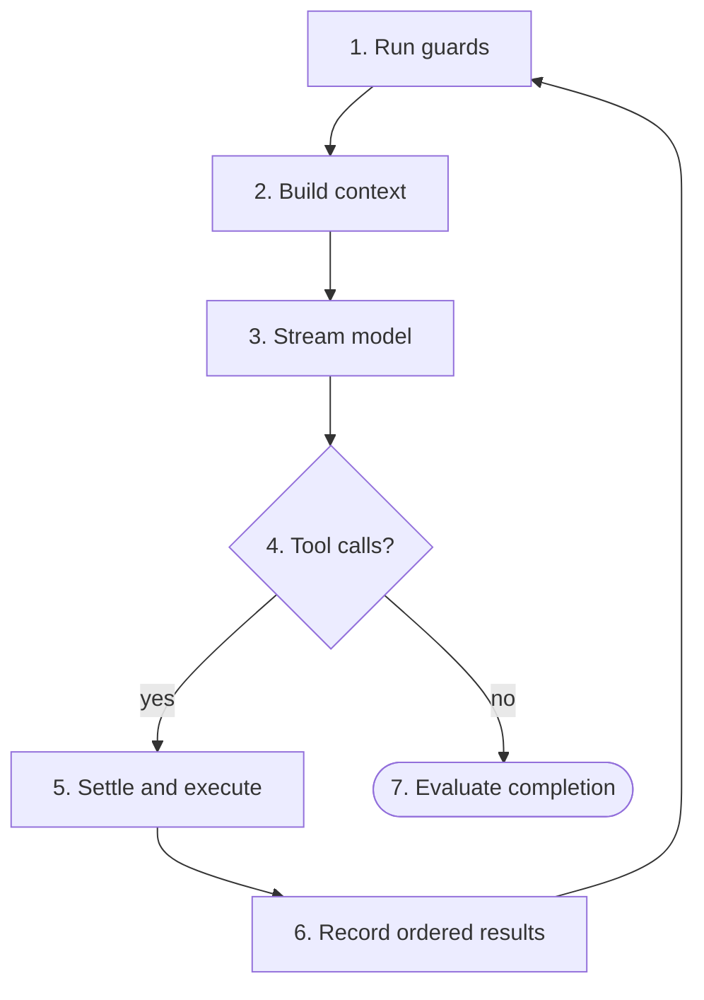
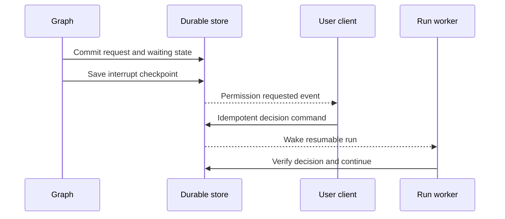

# LangGraph Control Loop

> Normative continuation, pause, retry, and termination logic for the custom
> `StateGraph`.

[Agent architecture index](README.md) | [Docs start page](../README.md) | [Diagram standard](../diagram-standard.md)

## Direct answer: do not use a small hard-coded loop count

The agent loop should be **model-driven inside a configurable safety envelope**:

```text
model returns tool calls
  -> validate, authorize, execute, append every tool result
  -> call model again

model returns no tool calls
  -> run completion policy/hooks
  -> finish unless a bounded continuation or human wait is requested
```

Use hard bounds, but make each bound explicit and meaningful: model calls, tool
calls, tokens, cost, elapsed deadline, child agents, per-node retries, repeated
operation cycles, no-progress cycles, and LangGraph recursion steps. Do not use
an unexplained `for range(10)` as the main completion policy.

`LOOP-001`: Natural completion occurs when a canonical model response contains
no tool calls and completion evaluation returns `accept`.

`LOOP-002`: A response containing one or more tool calls continues only after
every call has a matching terminal tool result recorded in provider-valid order.

`LOOP-003`: Safety limits terminate with stable reasons and preserved partial
work. They do not masquerade as successful model completion.

`LOOP-004`: LangGraph `recursion_limit` is a final circuit breaker, not the
product's notion of turns. Product guards SHOULD stop first with a more useful
reason.

## Current repository behavior to preserve

The TypeScript runtime in [`query.ts`](../../query.ts) currently uses an explicit
`while (true)`. During streaming it sets a follow-up flag whenever a tool-use
block appears because the provider stop reason is not considered reliable. If
there is no follow-up, it processes bounded recovery, stop hooks, and token
budget behavior before returning. If there are tool calls, it executes them,
collects matching results, checks cancellation/hook stop/optional maximum turns,
updates state, and iterates.

The target graph does not copy the large function. It preserves these semantics
as independently testable nodes and edges.

## One loop cycle

**Question:** what causes another model call in the normal path?



How to read it:

1. Cancellation, budgets, deadline, policy epoch, and no-progress guard run first.
2. The context service produces a bounded provider request and manifest.
3. The model gateway emits visible deltas and one canonical normalized response.
4. Actual tool-use blocks determine the route; provider stop text is supporting evidence.
5. Calls validate, authorize, pause if needed, and execute under scheduling policy.
6. Every call receives one terminal result in provider-valid order before looping.
7. A no-tool response is only a completion proposal; hooks/requirements decide acceptance.

Permission pause is a separate path because it can outlive clients/workers:



The decision is valid without a live graph worker. Resume always reloads the
exact request revision and authenticated decision from durable state.

## Routing facts, not provider guesses

The normalizer produces this provider-neutral decision input:

```python
from typing import Literal, TypedDict


class NormalizedResponseRoute(TypedDict):
    response_id: str
    response_hash: str
    canonical_complete: bool
    visible_message_id: str | None
    tool_call_ids: list[str]
    provider_stop_category: Literal[
        "final",
        "tool_calls",
        "length",
        "content_filter",
        "cancelled",
        "error",
        "unknown",
    ]
    recoverable_error_code: str | None
```

Routing order:

1. If cancellation is durable, route to cancellation finalization.
2. If no canonical response completed, route to provider recovery/failure.
3. If any valid/rejected model tool-use blocks exist, route to tool settlement.
4. If provider reports length/context/media truncation, route to bounded recovery
   even if it emitted partial text.
5. If no tool-use blocks and response is complete, route to completion
   evaluation.
6. Any impossible combination routes to an internal invariant failure, not an
   inferred success.

`LOOP-010`: Tool-call content wins over an inconsistent provider `stop_reason`.
The raw stop reason remains telemetry/evidence.

`LOOP-011`: A malformed tool call still receives a rejected result when a valid
provider trajectory can be constructed. It counts against tool-call/no-progress
budgets.

## Conditional routing table

| Current phase | Fact | Next phase | Continuation reason |
| --- | --- | --- | --- |
| Guard | Cancel requested | Terminal cancellation | `cancel_requested` |
| Guard | Deadline/budget exhausted | Terminal limit | Exact limit code |
| Guard | Policy/registry incompatible | Reconcile or terminal | `runtime_contract_changed` |
| Context | Request fits | Model | `context_ready` |
| Context | Compactable overflow | Compaction then context | `context_compaction` |
| Context | Recovery exhausted | Terminal failure | `context_limit_exceeded` |
| Model | Transient pre-response error | Retry wait | Provider error code |
| Model | Complete response with calls | Tool registration | `model_requested_tools` |
| Model | Complete response without calls | Completion evaluation | `model_proposed_completion` |
| Tools | One or more asks | Durable permission wait | `permission_required` |
| Tools | All settled | Execute batch | `tool_batch_settled` |
| Tool result | Results complete | Progress guard | `tool_results_recorded` |
| Progress | Meaningful change and budget remains | Guard/model cycle | `continue_after_tools` |
| Progress | Repeated/no progress threshold | Terminal safety stop | `no_progress`/`repeated_cycle` |
| Completion | Accept | Finalize success | `natural_completion` |
| Completion | Hook feedback | Progress/guard/model | `completion_feedback` |
| Completion | Human decision needed | Durable user wait | `user_interaction_required` |
| Wait | Valid response/decision | Reconcile and resume | `interrupt_resolved` |
| Wait | Denied/expired/cancelled | Tool result or terminal | Exact decision code |

Every route is stored in run state/event data so the interaction timeline can
answer why another model call occurred.

## Safety envelope

### Required limits

| Limit | Counts | Why separate |
| --- | --- | --- |
| `max_model_calls` | Logical model calls, including completion-feedback continuations | Direct loop/provider/cost bound |
| `max_model_attempts_per_call` | Transport attempts for one logical request | Provider transient retry bound |
| `max_tool_calls` | Every proposed call, including invalid/denied | Prevents bypass through failed calls |
| `max_tool_attempts` | Executor attempts | Controls adapter retries |
| `max_parallel_tools` | Simultaneous attempts | Resource/concurrency bound |
| `max_child_runs` | Created descendants or direct children per policy | Prevents fork explosion |
| `max_agent_depth` | Parent-child depth | Prevents recursive delegation |
| `max_input_tokens`, `max_output_tokens` | Authoritative provider usage/estimates | Context/generation budget |
| `max_cost_micros` | Model plus priced tool/provider cost | Spend control |
| `deadline_at` | End-to-end wall-clock deadline excluding or including user wait per profile | Operational bound |
| `max_no_progress_cycles` | Consecutive model/tool cycles without meaningful change | Semantic loop detection |
| `max_repeated_signature` | Same normalized operation pattern | Exact/near-exact cycle detection |
| `max_completion_feedback` | Stop-hook continuation count | Prevents hook spirals |
| `recursion_limit` | LangGraph supersteps | Last-resort topology circuit breaker |

`LOOP-020`: Limits are loaded from a versioned run profile and persisted with
the run. They may have deployment defaults but are not scattered literal values
inside nodes.

`LOOP-021`: A parent reserves/allocates child budgets atomically. Concurrent
children cannot each spend the parent's full remaining budget.

`LOOP-022`: Invalid, denied, cancelled, and failed operations consume relevant
attempt/call budgets; otherwise an agent can loop without accounting.

`LOOP-023`: User/permission wait time policy is explicit. Interactive runs MAY
pause the active-work deadline while retaining an absolute expiry; remote and
scheduled runs normally use a fixed absolute deadline.

### Guard ordering

Before a model call, tool batch, child spawn, retry, or continuation:

1. invariant and checkpoint compatibility;
2. cancellation/runtime drain;
3. security/trust/policy epoch;
4. absolute deadline;
5. operation-specific count budget;
6. token/cost reservation;
7. no-progress/repetition;
8. adapter availability/concurrency quota;
9. LangGraph remaining steps.

The first terminal guard wins; all evaluated facts are recorded.

## No-progress and cycle detection

A fixed turn count prevents infinite work but also stops legitimate long tasks.
No-progress detection provides a better semantic bound.

### Operation signature

For every completed model/tool cycle, compute a privacy-preserving signature
from canonical facts:

```text
hash(
  objective/task-state hash,
  sorted normalized tool names + argument hashes,
  result code + selected result fingerprint,
  changed resource versions,
  child result IDs/statuses,
  completion/hook feedback code,
  context summary boundary
)
```

Do not include timestamps, generated IDs, latency, or random provider metadata,
which would make every cycle appear new.

### Meaningful progress

At least one of these can reset the no-progress counter:

- a requested task/acceptance condition becomes satisfied;
- a source/resource version changes as intended;
- a new relevant fact/result differs materially from previous evidence;
- a blocking permission/user question is resolved;
- a child returns new relevant evidence;
- a previously failing verification changes state;
- context recovery removes a real overflow and enables a successful call.

Merely rephrasing assistant text, repeating the same denied/invalid call,
re-reading unchanged files, or receiving the same error does not reset it.

`LOOP-030`: The default no-progress policy warns/injects structured feedback
before terminal stop when budget permits. Feedback itself is bounded and cannot
reset the counter unless behavior changes.

`LOOP-031`: Exact repeated destructive or external calls stop earlier than
repeated safe reads, unless the tool contract declares repeat behavior useful.

`LOOP-032`: The detector stores hashes/safe facts, not full secret arguments or
hidden reasoning.

## Tool batch behavior

A model response may contain several calls. The loop treats it as one settlement
batch:

1. persist all calls in model order;
2. validate independently;
3. authorize independently;
4. pause once with one or several permission review requests according to UI
   policy;
5. convert deny/invalid calls to terminal results;
6. build dependencies/conflicts for allowed calls;
7. execute bounded safe waves;
8. settle every call, including cancellation/unknown outcomes;
9. append one provider-valid tool-result message preserving model order;
10. evaluate progress, then return to the model.

`LOOP-040`: One pending approval does not permit already-approved side-effecting
sibling calls to run unless batch policy explicitly allows partial execution and
the review UI states that behavior. Conservative MVP waits for the batch to be
settled before effects.

`LOOP-041`: Read-only independent calls MAY run while an unrelated call awaits
approval only if provider trajectory, cancellation, and result ordering remain
correct. This is an optimization after the conservative path is proven.

`LOOP-042`: A tool result is delivered once. Progress chunks/events are not fed
back as additional result messages unless the tool/provider contract explicitly
defines streaming results.

## Durable interrupts

Permission, question, plan approval, and certain child joins are graph waits.
Use a checkpointer plus stable `thread_id`/namespace.

Official LangGraph interrupt behavior resumes the node from its beginning, so
side effects before `interrupt()` must be idempotent. See the
[LangGraph interrupts guide](https://docs.langchain.com/oss/python/langgraph/interrupts).

Recommended pattern:

```python
from typing import Any

from langgraph.types import interrupt


async def pause_for_permission(
    state: AgentState,
    runtime: "Runtime[AgentRuntime]",
) -> dict[str, Any]:
    # This command is idempotent because the node runs again after resume.
    wait = await runtime.context.command_service.ensure_permission_wait(
        run_id=state["run_id"],
        tool_call_ids=tuple(state["pending_tool_call_ids"]),
        operation_id=state["node_operation_id"],
    )

    resume_hint = interrupt(
        {
            "kind": "permission",
            "request_ids": wait.request_ids,
            "event_sequence": wait.event_sequence,
        }
    )

    # Treat resume data only as a correlation hint. Load authenticated durable
    # decisions and verify hashes/revisions in the application service.
    resolution = await runtime.context.command_service.load_wait_resolution(
        wait_id=wait.wait_id,
        resume_hint=resume_hint,
    )
    return {
        "pending_wait_id": None,
        "route": "permission",
        "continuation_reason": resolution.reason,
    }
```

Resume externally with a command associated with the same thread/run, for
example a LangGraph `Command(resume=...)` after the FastAPI permission decision
transaction commits.

`LOOP-050`: The interrupt payload is a presentation reference, not the sole copy
of the request and not authority to execute.

`LOOP-051`: A stale/duplicate resume loads current durable state and becomes a
no-op or typed conflict. It cannot consume approval twice.

`LOOP-052`: A run releases worker capacity while interrupted. Client disconnect
does not cancel or auto-resolve it.

## Completion hooks and continuation

Completion policy sees a safe immutable summary:

```python
class CompletionDecision(TypedDict):
    action: Literal["accept", "continue", "wait_user", "fail"]
    reason_code: str
    feedback_message_id: str | None
    wait_id: str | None
```

Rules:

- run only after a complete no-tool model response;
- key execution by response hash so recovery does not run a hook twice;
- validate hook output and enforce timeout;
- each `continue` appends one visible/inspectable feedback message;
- consume `max_completion_feedback` and normal model-call/token budgets;
- repeat of the same hook feedback/response hash terminates as
  `completion_feedback_cycle`;
- model/provider errors do not go through ordinary completion hooks;
- a hook cannot mark a failed/partial provider response successful.

`LOOP-060`: The user MAY configure no completion hooks. In that case a complete
no-tool response ends naturally without another model call.

## Provider recovery

Recoverable categories are explicit:

| Failure | Possible recovery | Bound |
| --- | --- | --- |
| Connection/rate/transient before response | Same logical request retry with backoff | attempts, deadline, provider policy |
| Context too long | Commit pending context collapses, compact, or remove eligible media | one/few strategy stages |
| Output length | Retry with approved larger output cap or continuation message | output-recovery count |
| Media too large/unsupported | Replace with bounded extract/description when policy allows | media-recovery count |
| Authentication/model unavailable | Fail or configured fallback profile | no blind cross-model behavior change |
| Content filter | Record safe terminal category or bounded alternative request | policy-specific |
| Partial stream disconnect | Resume only if provider supports proven continuation; otherwise typed incomplete attempt | no duplicate complete message |

`LOOP-070`: Recovery strategy and counters are state, events, and profile data.
They do not reset when the process restarts.

`LOOP-071`: A fallback model/tool registry change creates a new logical model
call/context manifest and is visible. It cannot silently reinterpret an existing
approved tool call.

## Graph construction sketch

This is an architecture sketch, not a copy-ready implementation; pin the
LangGraph version and test exact imports/configuration in the backend package.

```python
from langgraph.graph import END, START, StateGraph


def build_agent_graph(*, checkpointer: "BaseCheckpointSaver"):
    graph = StateGraph(AgentState, context_schema=AgentRuntime)

    graph.add_node("initialize", initialize_run)
    graph.add_node("reconcile", reconcile_state)
    graph.add_node("guard", pre_step_guard)
    graph.add_node("prepare_context", prepare_context)
    graph.add_node("compact", compact_context)
    graph.add_node("model", call_model)
    graph.add_node("normalize", normalize_model_response)
    graph.add_node("register_tools", register_tool_calls)
    graph.add_node("authorize", authorize_tool_calls)
    graph.add_node("permission_wait", pause_for_permission)
    graph.add_node("execute_tools", execute_tool_batch)
    graph.add_node("collect_results", collect_tool_results)
    graph.add_node("progress", evaluate_progress)
    graph.add_node("completion", evaluate_completion)
    graph.add_node("user_wait", pause_for_user)
    graph.add_node("retry_wait", durable_retry_wait)
    graph.add_node("finalize", finalize_run)

    graph.add_edge(START, "initialize")
    graph.add_edge("initialize", "reconcile")
    graph.add_edge("reconcile", "guard")

    graph.add_conditional_edges(
        "guard",
        route_after_guard,
        {"continue": "prepare_context", "terminal": "finalize"},
    )
    graph.add_conditional_edges(
        "prepare_context",
        route_context,
        {"ready": "model", "compact": "compact", "terminal": "finalize"},
    )
    graph.add_edge("compact", "prepare_context")
    graph.add_edge("model", "normalize")
    graph.add_conditional_edges(
        "normalize",
        route_model_response,
        {
            "tools": "register_tools",
            "completion": "completion",
            "retry": "retry_wait",
            "terminal": "finalize",
        },
    )
    graph.add_edge("register_tools", "authorize")
    graph.add_conditional_edges(
        "authorize",
        route_authorization,
        {"wait": "permission_wait", "execute": "execute_tools"},
    )
    graph.add_edge("permission_wait", "authorize")
    graph.add_edge("execute_tools", "collect_results")
    graph.add_edge("collect_results", "progress")
    graph.add_conditional_edges(
        "progress",
        route_progress,
        {"continue": "guard", "terminal": "finalize"},
    )
    graph.add_conditional_edges(
        "completion",
        route_completion,
        {
            "accept": "finalize",
            "continue": "progress",
            "wait": "user_wait",
            "terminal": "finalize",
        },
    )
    graph.add_edge("user_wait", "guard")
    graph.add_edge("retry_wait", "guard")
    graph.add_edge("finalize", END)

    return graph.compile(checkpointer=checkpointer)
```

Invoke/resume with:

```python
config = {
    "configurable": {"thread_id": run_id},
    # Set above legitimate expected graph steps; product guards should fire first.
    "recursion_limit": graph_step_safety_limit,
}
```

Official LangGraph documents configurable recursion limits and typed recursion
errors in its [Graph API guide](https://docs.langchain.com/oss/python/langgraph/graph-api).

`LOOP-080`: The graph is compiled once per topology/checkpointer configuration,
not rebuilt per model cycle.

`LOOP-081`: Conditional route functions are pure, exhaustive over their enum,
and unit tested. They do not query the database or call providers.

`LOOP-082`: The graph step safety limit is derived from profile worst-case node
steps and remains higher than product model/tool limits, while still finite.

## Terminal behavior

Every exit creates one `RunTerminalResult`:

```python
class RunTerminalResult(TypedDict):
    run_id: str
    status: Literal[
        "completed",
        "failed",
        "cancelled",
        "timed_out",
        "budget_exceeded",
        "needs_review",
    ]
    stop_reason: str
    final_message_id: str | None
    partial_work_preserved: bool
    retryable: bool
    recovery_action: str | None
```

`LOOP-090`: Hitting a limit does not fabricate an assistant final answer. The
client shows the latest complete visible output plus the terminal reason and
preserved artifacts.

`LOOP-091`: A recursion exception is caught at the worker boundary, reconciled,
and finalized as `recursion_limit`; it is not returned as a raw stack trace.

`LOOP-092`: If finalization itself transiently fails, durable work remains in
`finalizing` and is retried idempotently. The worker does not emit a terminal
event before terminal records commit.

## Test matrix

| Scenario | Expected model-call count/path |
| --- | --- |
| Direct answer | One model call, completion, finalization. |
| Read then answer | Model -> read -> result -> model -> completion. |
| Two parallel reads | Model -> register both -> parallel execute -> ordered results -> model. |
| Edit asks then approved | Model -> permission interrupt -> resume -> edit -> model. |
| Edit denied | Model -> denied result -> model may finish/choose alternative. |
| Invalid tool input | Rejected result -> model; no adapter execution. |
| Stop hook feedback | No-tool response -> one bounded feedback -> model again. |
| Repeated hook loop | Stops at completion-feedback bound. |
| Same failed command repeated | Warning/feedback then `repeated_tool_cycle`. |
| Provider context overflow | Bounded compaction/retry then success or typed terminal. |
| Cancellation during tool | Settle call/result certainty, cancel descendants, terminal cancel. |
| Restart during approval | Same request/revision resumes once. |
| Restart after external effect before completion write | Reconcile; never blind duplicate. |
| Graph safety breaker | Typed `recursion_limit`, preserved timeline/checkpoint. |

Property tests generate route fact combinations and assert exactly one valid
next edge, no successful path with unsettled tool calls, and no continuation
without budget accounting.

## Release acceptance

The loop is correct when it completes direct answers naturally, supports an
arbitrary legitimate number of tool cycles within configured budgets, halts
repeated/no-progress behavior with an explicit reason, and can be interrupted
or killed at every edge without losing or duplicating the user-visible
trajectory.
