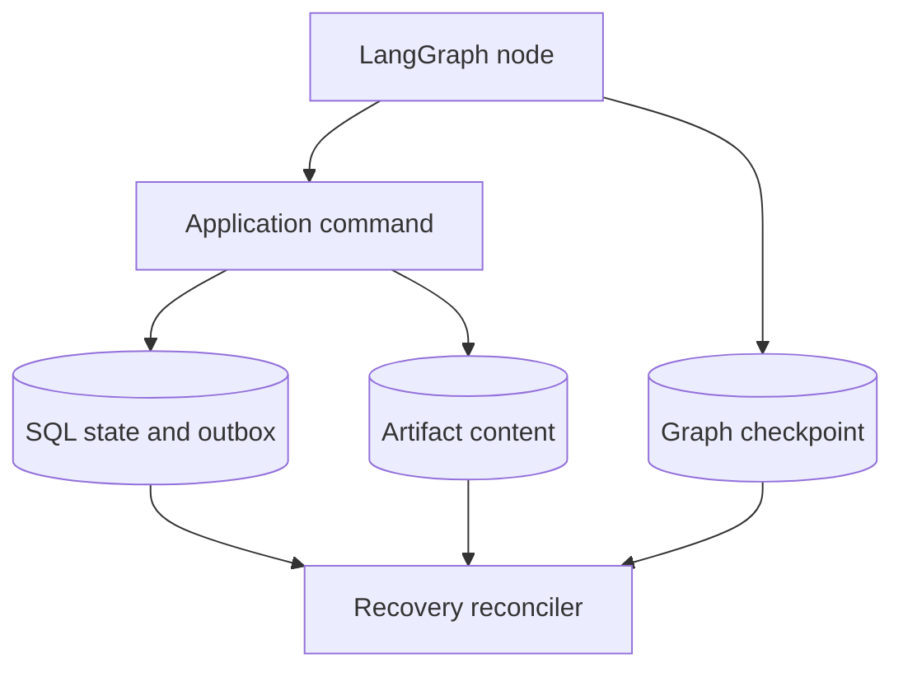
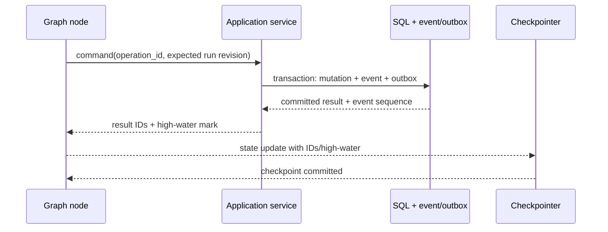
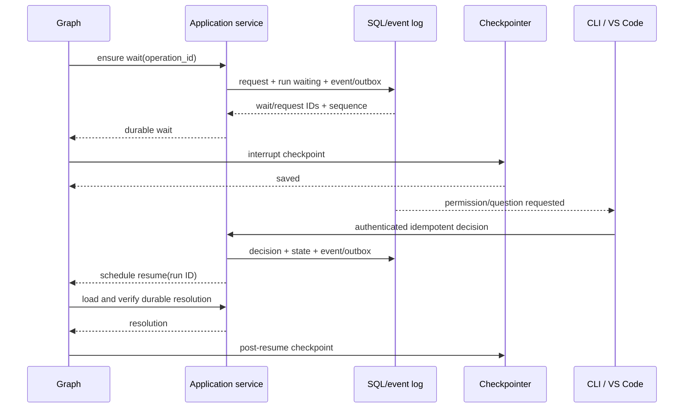
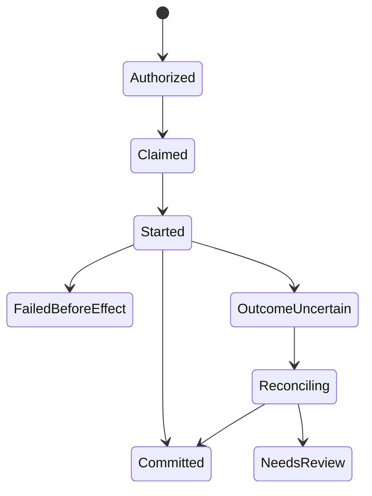

# State, Checkpointing, and Recovery

> Normative graph state, checkpoint, interrupt, idempotency, and crash-recovery
> design.

[Agent architecture index](README.md) | [Docs start page](../README.md) | [Diagram standard](../diagram-standard.md)

## Repository evidence and target boundary

| Status | Source | Behavior reused |
| --- | --- | --- |
| **CURRENT** | [`query.ts`](../../query.ts) | Explicit model/tool loop, interruption, turn guard, and recoverable continuation state. |
| **CURRENT** | [`sessionStorage.ts`](../../utils/sessionStorage.ts) | Append-oriented message/queue/file-history persistence and resume chains. |
| **CURRENT** | [`fileHistory.ts`](../../utils/fileHistory.ts) | Pre-edit backup, snapshot, diff, rewind, and restore from logs. |
| **CURRENT** | [`resumeAgent.ts`](../../tools/AgentTool/resumeAgent.ts) | Child-agent transcript reconstruction and continuation. |
| **TARGET** | This SRS | LangGraph checkpointer plus SQL/outbox reconciliation and operation idempotency. |

## Persistence model

LangGraph persistence checkpoints graph state at graph steps and enables human
interrupts, fault recovery, history, and time-travel-style replay. See the
official [LangGraph persistence guide](https://docs.langchain.com/oss/python/langgraph/persistence).

This product uses it with an application database, not instead of one.

**Question:** which store is authoritative for which recovery concern?



How to read it:

1. A graph node decides semantic work and carries bounded resumable state.
2. Side-effect intent goes through an idempotent application command.
3. Product history, security state, operation outcome, and events commit in SQL.
4. The checkpointer stores resumable graph channels, not the complete product database.
5. Large immutable bytes live in the artifact store with SQL manifests.
6. Recovery compares all high-water IDs before allowing another effect.

`CHK-001`: The application database is canonical for messages, model/tool calls,
permissions, user answers, events, artifacts, tasks, run status, and usage.

`CHK-002`: The checkpointer is canonical only for resumable graph channel state
at a recorded point. Deleting checkpoints may remove resume/time-travel ability
but MUST NOT remove product history or authorization evidence.

`CHK-003`: A graph state reference never substitutes for an application foreign
key/invariant. Both stores correlate through run, operation, checkpoint, wait,
and event high-water IDs.

## Thread and namespace identity

Use:

| Key | Value |
| --- | --- |
| LangGraph `thread_id` | `run_id` |
| Checkpoint namespace | Graph name/version and optional controlled branch namespace |
| Application grouping | `session_id`, `turn_id`, parent/root run IDs in SQL |
| Child graph | Its own `run_id` thread, linked by `run_edges` |

`CHK-010`: Do not place main and child agents in one checkpointer thread merely
because they share a session. Independent waits, retries, cancellation, and
retention require independent run threads.

`CHK-011`: A resumed invocation verifies that authenticated application run ID,
checkpointer thread ID, stored state run ID, and graph version all agree.

`CHK-012`: Thread/namespace IDs are server-generated and never accepted as
unvalidated arbitrary checkpointer selectors from clients.

## State schema

The precise Python representation is a `TypedDict`, as specified in
[Python Types and Performance](../runtime-srs/06-python-types-and-performance.md).
The logical fields are:

### Identity and compatibility

| Field | Purpose |
| --- | --- |
| `session_id`, `turn_id`, `run_id` | Application identity. |
| `workspace_id` | Resource/policy scope. |
| `parent_run_id`, `root_run_id` | Child lineage/cancellation. |
| `graph_name`, `graph_version` | Topology/state migration. |
| `state_schema_version` | Serialized channel shape. |
| `registry_snapshot_id` | Exact tool contract view. |
| `policy_epoch` | Last reconciled security epoch. |
| `profile_version` | Agent/context/budget behavior. |

### Conversation and context

| Field | Purpose |
| --- | --- |
| `messages` | Bounded provider-neutral model context with deterministic reducer. |
| `latest_message_ordinal` | Application transcript high-water mark. |
| `context_manifest_id` | Exact most recent model request projection. |
| `compaction_summary_ids` | Active context summaries. |
| `streaming_message_id` | Provisional output to settle/recover. |

The complete transcript is not copied here. Message/content records remain in
SQL and large blocks in artifacts.

### Routing and work

| Field | Purpose |
| --- | --- |
| `route` | Exhaustive next semantic phase. |
| `continuation_reason` | Why the graph advances/repeats. |
| `node_operation_id` | Stable idempotency key for current logical node work. |
| `last_domain_event_sequence` | SQL event high-water observed by graph. |
| `current_model_call_id` | Logical provider operation. |
| `pending_tool_call_ids` | Proposed calls not fully settled. |
| `completed_tool_call_ids` | Calls ready in provider order. |
| `pending_wait_id` | Permission/question/plan/join wait. |
| `pending_child_run_ids` | Children required by join policy. |
| `completed_child_run_ids` | Settled children. |

### Budgets and recovery

| Field | Purpose |
| --- | --- |
| model/tool/token/cost counters | Cached graph routing facts, reconciled to SQL. |
| `deadline_at` | Absolute bound. |
| `provider_retry_count` | Current logical call recovery. |
| `context_recovery_count` | Bounded compaction/media/output recovery. |
| `completion_feedback_count` | Stop-hook continuation bound. |
| `last_progress_fingerprint` | Cycle detection. |
| `no_progress_count`, `repeat_count` | Semantic loop guards. |
| `recovery_required` | Forces reconciliation before any effect. |

### Terminal projection

| Field | Purpose |
| --- | --- |
| `final_message_id` | Completed visible response if any. |
| `terminal_status`, `stop_reason` | Typed final outcome. |
| `partial_work_preserved` | Client guidance. |

`CHK-020`: State has a serialized byte limit. Nodes write artifacts/summaries and
keep IDs when a value would exceed it.

`CHK-021`: State contains no credentials, callbacks, DB sessions, model clients,
WebSockets, file handles, subprocesses, tasks/futures, locks, raw ORM rows, or
unbounded output.

`CHK-022`: Counters in graph state are routing caches. SQL budget records are
authoritative and reconciliation corrects stale checkpoint counters before a
new reservation.

## Checkpoint locations

Checkpoint at semantic graph boundaries, including:

1. run initialization/reconciliation;
2. context/compaction completion;
3. model call canonical completion or recoverable failure routing;
4. tool-call registration/authorization settlement;
5. immediately before durable interrupt return;
6. after resume resolution is applied;
7. tool-result collection;
8. child creation/join update;
9. retry scheduling/wakeup;
10. terminal finalization.

The compiled checkpointer normally records every superstep. Graph design SHOULD
combine only side-effect-free tiny phases when measured overhead requires it;
it MUST preserve recoverable application command boundaries.

`CHK-030`: There is a durable checkpoint before releasing a worker for a long
wait and a terminal checkpoint after application finalization.

`CHK-031`: Do not checkpoint token-by-token model deltas. Deltas are bounded
events/provisional message state; canonical model completion is a checkpoint
boundary.

`CHK-032`: Checkpoint success never proves an external side effect committed.
Only the tool/model attempt record and reconciliation evidence establish that.

## Operation IDs and idempotent nodes

LangGraph may execute a node again after resume/recovery. Each side-effecting
application command therefore has a stable operation ID.

Recommended derivation:

```text
operation_id = hash(
  run_id,
  graph_version,
  semantic_node_name,
  logical_cycle_ordinal,
  immutable input fingerprint
)
```

The raw hash may be represented by an opaque generated command ID stored in
state. It MUST remain stable across retry/replay of the same logical work and
change when effect-relevant input changes.

Examples:

| Node command | Natural uniqueness |
| --- | --- |
| Start run | `(run_id, "start")` |
| Register model call | `(run_id, model_call_ordinal)` |
| Persist model response | `(model_call_id, response_hash)` |
| Register tool batch | `(model_call_id, response_hash)` |
| Create permission wait | `(tool_call_id, arguments_hash, request_revision)` |
| Create child | `(parent_run_id, tool_call_id, child_ordinal)` |
| Append tool-result message | `(model_call_id, tool_batch_hash)` |
| Run completion hook | `(run_id, response_hash, hook_id, hook_version)` |
| Finalize run | `(run_id, terminal_revision)` |

`CHK-040`: Application services place a uniqueness constraint on natural
operation identity and return the committed result for a duplicate command.

`CHK-041`: Node code MUST tolerate "already completed" and advance state from
the stored result rather than treating it as an error.

`CHK-042`: Random IDs generated inside a replayable node are persisted before
use or derived from stable identity. Generating a new call/message ID on each
replay is forbidden.

## Cross-store consistency handshake

The application database and checkpointer may not share a transaction. Use
domain-event high-water marks and idempotent reconciliation.

### Normal node completion



Crash after SQL commit but before checkpoint: node replays the same operation ID,
loads the committed result, and writes the missing state/checkpoint.

Crash after checkpoint but before socket broadcast: outbox replays the committed
event. Client projection remains correct.

`CHK-050`: A node MUST NOT update checkpoint state to claim a domain mutation
before the application transaction commits.

`CHK-051`: Event broadcaster never controls graph progress. Events are delivered
from outbox after commit and may be replayed at least once.

### Durable interrupt handshake



Crash after request commit but before interrupt checkpoint: recovery sees a run
waiting with a durable request, invokes the same node, receives the same request,
and records the interrupt.

Decision before checkpoint finishes is permitted: resume scheduling waits until
the run is claimable, then reconciliation loads the settled decision.

`CHK-052`: The API decision transaction does not depend on a live graph worker.

`CHK-053`: Resume input is not a permission decision by itself. The node loads
the authenticated decision, exact revision/hash, and policy result from SQL.

## External side effects

Exactly-once execution cannot be promised for every filesystem/process/network
operation. The system provides **exactly-once intent recording plus
idempotent/reconciled effect handling** according to tool contract.

### Effect states



How to read it:

1. Authorization is durable before a worker claim.
2. A claim has lease/fencing identity before process start.
3. `Committed` proves the observed effect; `FailedBeforeEffect` may be retry-safe.
4. Partial or unknown effects collapse into `OutcomeUncertain` for this readable view.
5. Reconciliation uses adapter/resource evidence, never model confidence.
6. If proof is insufficient, `NeedsReview` blocks automatic retry.

The database retains the more precise `partial`, `outcome_unknown`,
`abandoned_before_start`, and retry eligibility fields described below.

### Idempotency classes

| Class | Example | Crash after invocation behavior |
| --- | --- | --- |
| `pure` | Schema calculation | Recompute. |
| `retry_safe` | Bounded read/search | Retry after stale attempt lease. |
| `effect_idempotent` | Provider/API call with stable downstream key | Query/retry using same key. |
| `reconcilable` | Atomic file edit with before/after hashes | Inspect resource; classify committed/not committed/conflict. |
| `non_retryable` | Arbitrary shell command/external message without downstream dedupe | Mark unknown and require evidence/review. |
| `unknown` | Dynamic MCP lacking proven contract | Never automatic retry after started. |

`CHK-060`: Tool metadata declares idempotency class and reconciliation adapter.
Missing classification defaults to `unknown`.

`CHK-061`: The executor commits authorized intent/attempt before invoking the
adapter, and commits observed outcome afterward. It never holds SQL transactions
across the effect.

`CHK-062`: A worker claim has a token, revision, and heartbeat. A stale worker
cannot overwrite an outcome committed by a new owner.

`CHK-063`: Unknown/partial outcomes are returned to the graph/model only through
a safe result that explicitly says the effect may have occurred. They are never
silently converted to retryable failure.

### File-write reconciliation

For approved edit/write:

1. record canonical target identity, precondition hash, intended result hash,
   patch artifact, and operation ID;
2. open/recheck target safely and stage atomic replacement;
3. commit/rename and sync according to durability policy;
4. record observed resulting identity/hash;
5. after crash, compare target with before/intended hashes:

| Observation | Outcome |
| --- | --- |
| Intended hash/identity | Already committed; do not write again. |
| Original precondition unchanged | Safe to retry if approval/policy still valid. |
| Different content | Conflict/unknown; do not overwrite. |
| Target missing when create intended | Safe retry if parent identity/policy unchanged. |
| Target exists with intended create hash | Already committed. |

### Shell reconciliation

An arbitrary shell command cannot generally be reconciled from exit status after
the process and worker disappear. The executor uses process group identity,
captured start metadata, output artifacts, and a supervisor when possible, but:

- never launches a second copy merely because heartbeat expired;
- first attempts to locate/reattach/terminate the known process;
- marks unknown if completion/effects cannot be proven;
- requires user/operator review or lets the model reason from an explicit
  uncertain result;
- uses command-specific idempotency only when a dedicated adapter proves it.

### External API/MCP reconciliation

- send a stable idempotency key when the API/server supports one;
- persist provider request/operation IDs;
- query operation status before retry when supported;
- treat MCP as `unknown` unless its local adapter/manifest has a verified
  idempotency contract;
- schema/server identity change blocks reconciliation until reviewed.

## Model-call recovery

Model calls are external operations but normally have no user side effect beyond
cost and generated content.

| Crash point | Recovery |
| --- | --- |
| Before attempt record commits | No provider call should occur; retry logical node. |
| Attempt committed, provider not invoked | Lease expiry marks abandoned; retry within policy. |
| During stream, no canonical completion | Settle provisional message cancelled/incomplete; retry logical request only per provider policy. |
| Provider completed and SQL response committed | Replay node loads canonical response; no second call. |
| Provider likely completed but response not committed | Use provider request retrieval/idempotency if supported; otherwise mark uncertain cost/response and bounded retry/fail policy. |
| SQL response committed, checkpoint missing | Replay persistence operation and advance checkpoint. |

`CHK-070`: Visible stream deltas are provisional. A partial stream is never
mistaken for a canonical assistant completion/tool call set.

`CHK-071`: Provider retries retain one logical context/request hash and separate
attempt rows. A materially changed prompt/model/tool snapshot is a new logical
call.

## Child-run and join recovery

Child creation is an idempotent application command keyed to the parent tool
call/delegation ordinal. On replay it returns the same child run.

Join waits store child IDs and policy in SQL/state. Parent recovery queries
child terminal records rather than waiting on in-memory futures.

`CHK-080`: Parent completion/cancellation cannot orphan a child accidentally.
Each child is joined, cancelled, or explicitly detached under a persisted
ownership transfer policy.

`CHK-081`: Child terminal notification is an optimization. Parent reconciliation
always derives truth from child rows, so a lost event does not block forever.

## Recovery coordinator

At runtime startup and periodically, a coordinator scans bounded indexed sets:

- active runs with expired worker leases;
- runs waiting with settled/expired/cancelled interactions;
- model/tool attempts with stale heartbeat;
- finalizing runs lacking terminal event/checkpoint;
- parent waits whose children are terminal;
- retry waits whose wake time passed;
- outbox records not published;
- pending artifact uploads past deadline.

For each run it acquires an exclusive recovery lease, loads SQL state and latest
compatible checkpoint, writes a `run.recovery_started` audit/event record, and
invokes reconciliation before any new effect.

`CHK-090`: Recovery work is bounded, rate-limited, and tenant/workspace scoped.
One corrupt run cannot prevent runtime readiness for all other sessions.

`CHK-091`: If no compatible checkpoint exists, the system may reconstruct only
at documented safe boundaries from SQL. It MUST NOT invent mid-node provider or
tool state.

`CHK-092`: A run that cannot be safely resumed becomes `needs_review` or failed
with a precise recovery action; it does not remain indefinitely `running`.

## Recovery matrix

| Durable SQL state | Checkpoint state | Required action |
| --- | --- | --- |
| Run queued | None | Start graph with initial state. |
| Run running, no active attempt | Behind SQL high-water | Replay node commands, advance checkpoint. |
| Run waiting, request pending | Before interrupt | Re-enter idempotent wait node and checkpoint interrupt. |
| Run waiting, request settled | Interrupt pending | Resume/reconcile from durable decision. |
| Tool attempt started, retry-safe, stale | Before result | Reconcile then retry only if proven not committed. |
| Tool attempt started, unknown | Any | Mark outcome unknown; no automatic retry. |
| Model response committed | Before normalize/register | Load response and replay pure/idempotent downstream nodes. |
| Checkpoint ahead of SQL event high-water | Any | Stop effects; verify whether checkpoint write violated ordering/corrupt state. |
| Run terminal | Nonterminal checkpoint | Do not resume work; write/repair terminal checkpoint. |
| Run nonterminal | Terminal checkpoint | Invariant failure; compare terminal operation/event and repair only from evidence. |
| Checkpoint incompatible version | Any | Apply explicit state migration or stop `checkpoint_incompatible`. |

`CHK-100`: "Checkpoint ahead of SQL" is treated as an integrity signal because
nodes are required to commit domain state before claiming it in state.

## State and graph versioning

Every checkpoint records:

- graph name and semantic version/build hash;
- state schema version;
- node/routing enum version;
- agent profile version;
- registry snapshot and tool schema hashes;
- checkpoint serializer/checkpointer version;
- latest domain event sequence.

Migration options:

| Change | Strategy |
| --- | --- |
| Add optional state key with safe default | Lazy state migration on load. |
| Rename/split state key | Explicit pure migration from exact versions. |
| Change reducer meaning | New graph/state version and tested migration. |
| Remove/rename active node | Compatibility routing shim or finish old graph version. |
| Tool schema changes | Historical run keeps snapshot; pending approval invalidates if execution contract changed. |
| Permission semantics hardening | Current hard policy applies; reauthorize future effects. |
| Incompatible provider trajectory format | Stop or reconstruct only from canonical SQL messages via explicit migration. |

`CHK-110`: A migration is pure, deterministic, version-to-version, size-bounded,
and records before/after state hashes. It cannot execute tools or call models.

`CHK-111`: If migration confidence is insufficient, preserve history and stop
with recovery guidance. Never discard unknown keys and continue effects.

## Time travel and branching

Checkpoint history can support debugging or user-created branches, but replaying
past state as the same run can duplicate effects.

Rules:

- inspection is read-only and may show checkpoint/state differences;
- resuming from a historical checkpoint creates a **new branch run ID** and
  checkpoint thread/namespace;
- branch metadata references source run/checkpoint/event high-water;
- historical tool results may be included as evidence, but side effects are not
  claimed as new branch effects;
- uncommitted historical tool calls are not auto-executed;
- permissions/grants are reevaluated under current policy; exact approvals from
  the source branch do not transfer;
- budgets, child ownership, messages, and events are independent and visibly
  linked as a branch.

`CHK-120`: Production "retry from here" is a fork, not destructive rewind of the
audit/transcript.

## Serialization, encryption, and retention

- Use a safe, versioned serializer supported by the chosen checkpointer.
- Do not accept untrusted pickle/checkpoint bytes.
- Encrypt checkpoint storage at rest; use application-level encryption when
  checkpointer/database threat model requires it.
- Redact/minimize state before checkpoint rather than relying only on disk
  encryption.
- Limit state nesting, list lengths, message bytes, and artifact references.
- Retain interrupt and terminal checkpoints longer than ordinary intermediate
  checkpoints.
- Compact old intermediate checkpoints only after no active branch/wait depends
  on them and application history is durable.
- Deleting a session covers SQL, artifacts, checkpointer threads/namespaces,
  caches, and backups according to policy.

`CHK-130`: Checkpoint access is scoped to the authenticated application's run.
Raw checkpoint inspection is an operator/debug capability and is audited.

`CHK-131`: Secrets MUST NOT enter checkpoint state. If a provider continuation
requires opaque sensitive data, store it as a restricted encrypted artifact and
checkpoint only its ID.

## Failure handling

| Failure | Behavior |
| --- | --- |
| Checkpointer unavailable before work | Do not start resumable/side-effecting run; return retryable unavailable. |
| Checkpoint write fails after SQL commit | Mark recovery needed; replay idempotent node after storage returns. |
| SQL unavailable | Do not advance graph or execute effects. |
| Artifact finalization fails | Keep result pending/failed with no dangling available link; retry safe upload finalization. |
| Outbox unavailable | SQL event/outbox still commits; dispatcher catches up. |
| Worker split-brain | Lease token/CAS rejects stale writes; stale external outcome goes to reconciliation. |
| Corrupt state bytes | Quarantine checkpoint, attempt explicit prior checkpoint/SQL reconstruction, never deserialize unsafely. |
| Missing node in old graph | Use versioned compatibility graph or stop with migration requirement. |

## Verification and fault injection

Automated crash injection MUST terminate the worker at least at these points:

1. before and after each application command commit;
2. before and after each checkpoint write;
3. before provider request, after first stream delta, and after canonical response;
4. before adapter invocation, during operation, after effect, and before outcome
   commit;
5. before permission request event, after event, after interrupt checkpoint,
   after decision, and before resume;
6. before/after child creation and terminal join notification;
7. before final state mutation, event, checkpoint, and worker lease release.

Assertions after each restart:

- no duplicate model/tool/message/permission/child natural identity;
- no blind repeat of unknown side effects;
- every event sequence remains contiguous;
- every model tool-use block eventually has one terminal result or the run has a
  typed integrity terminal state;
- budget and retry counters never decrease;
- settled approval is consumed at most once;
- parent/child cancellation ownership is complete;
- final projection is identical whether or not the crash occurred.

Property tests randomize checkpoint lag, duplicate resumes, stale leases,
concurrent workers, policy changes, and artifact/outbox delays.

## Release acceptance

Recovery is ready when the process can be killed at every graph and external-
effect boundary in a realistic read/edit/shell/child-agent scenario and, after
restart, the system either continues once, reconciles explicitly, or stops for
review without losing history, duplicating a known side effect, or granting new
authority.
