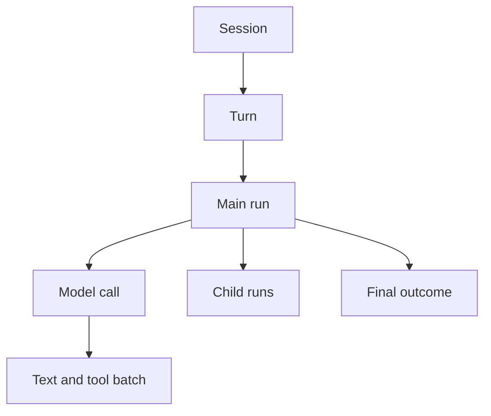
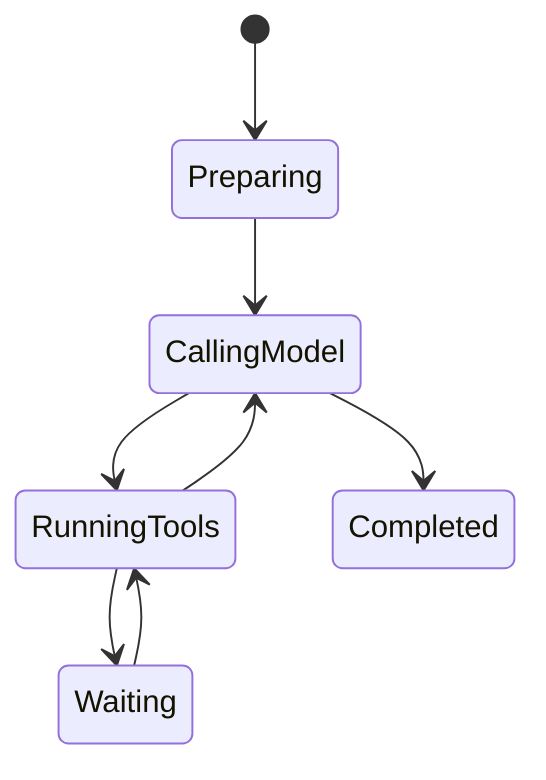
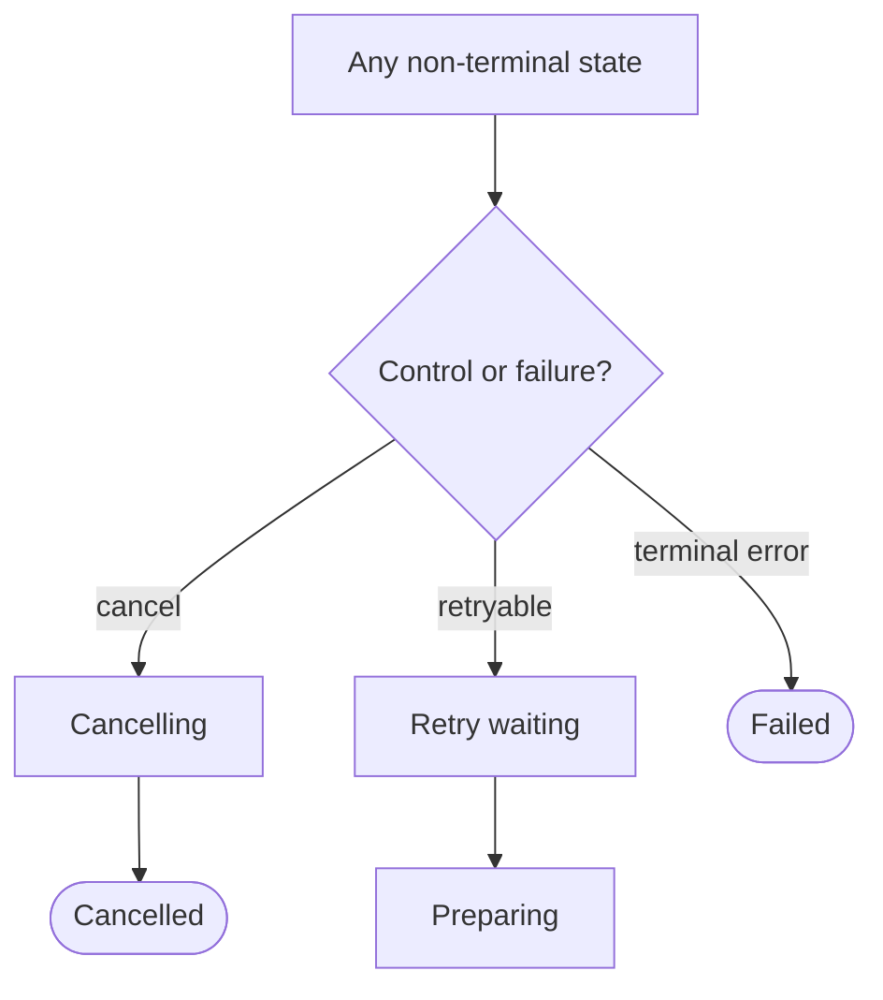
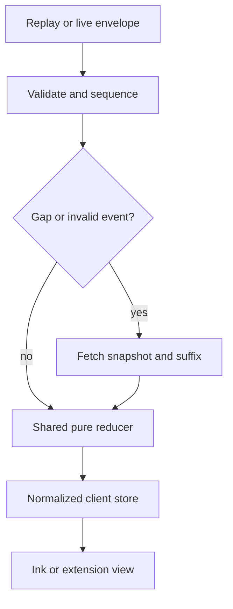

# Observability and Agent Interactions

> Normative user-visible timeline, operational telemetry, audit, redaction, and
> client presentation for main and child agent activity.

[Agent architecture index](README.md) | [Docs start page](../README.md) | [Diagram standard](../diagram-standard.md)

## Repository evidence and target boundary

| Status | Source | Behavior reused |
| --- | --- | --- |
| **CURRENT** | [`StreamingToolExecutor.ts`](../../services/tools/StreamingToolExecutor.ts) | Immediate progress, stable tool IDs, ordered settlement, and interruptibility state. |
| **CURRENT** | [`AgentProgressLine.tsx`](../../components/AgentProgressLine.tsx), [`CoordinatorAgentStatus.tsx`](../../components/CoordinatorAgentStatus.tsx) | Compact agent progress and coordinator status presentation. |
| **CURRENT** | [`BackgroundTasksDialog.tsx`](../../components/tasks/BackgroundTasksDialog.tsx) | Inspectable background-task state and controls. |
| **CURRENT** | [`sessionStorage.ts`](../../utils/sessionStorage.ts) | Durable transcript/history entries while ephemeral progress stays out of the causal chain. |
| **TARGET** | This SRS | Normalized durable interaction records, generated client protocol, OpenTelemetry, and shared Ink/VS Code reducer. |

The target generalizes existing UI/runtime behavior. It does not claim that the
normalized SQL interaction timeline or shared client package already exists.

## Product goal

Users need to answer, at any moment:

- What is the agent doing now?
- Why did it continue, pause, retry, or stop?
- Which model, tool, file, command, URL, MCP server, child, or task is involved?
- What permission is needed and what exactly will it authorize?
- What changed, what failed, and what can be retried safely?
- How much time, token, tool, and cost budget has been used?
- Can I cancel this operation, open its artifact, or inspect more detail?

The answer is a structured interaction timeline, not private chain-of-thought.

`OBS-001`: The runtime exposes visible assistant output, actions, safe inputs,
results, state transitions, decisions, summaries, and measured telemetry. It
MUST NOT require or claim to expose hidden model reasoning.

`OBS-002`: CLI and VS Code are projections of the same durable interaction/event
records. They may use different layouts but cannot disagree about state,
permission scope, or terminal outcomes.

`OBS-003`: Every running/waiting state has a current activity, start time,
responsible run, cancellation behavior, and next expected transition.

## Three observability layers

| Layer | Audience | Source | Content |
| --- | --- | --- | --- |
| Interaction timeline | User | Domain records + session events | Model/tool/permission/agent/task activity and artifacts |
| Operational telemetry | Developer/operator | OpenTelemetry-compatible traces, metrics, structured logs | Latency, error, saturation, retry, state/adapter metadata |
| Security audit | Authorized user/admin | Append-only audit/permission data | Actor, action, target, policy evidence, decisions, delivery |

These layers correlate by runtime/workspace/session/run/turn/model-call/tool-call
and request IDs, but have different access and retention policies.

`OBS-010`: Logs are not used as the client event source, and the user timeline
is not treated as a complete security audit.

## Interaction hierarchy

**Question:** how does a user-visible turn nest its major work?



How to read it:

1. A session contains ordered user turns.
2. A turn creates/resumes one main run.
3. The main run owns model/tool rounds and delegation.
4. Every model attempt has its own timing, usage, and normalized route.
5. Text/tool items expand separately, including permission and result detail.
6. Child runs retain their own nested timeline and link to the parent.
7. The turn settles with one typed outcome and supporting artifacts.

Clients virtualize/collapse nested relationships so a large agent tree does not
flood the terminal or extension host. Detailed tool and child descendants are
loaded when their parent row expands rather than drawn in this overview.

## Visibility levels

Users can choose a presentation level; all derive from the same data.

| Level | Shows | Intended use |
| --- | --- | --- |
| `compact` | Current phase, meaningful tool summaries, permissions, final outcome | Normal CLI work |
| `standard` | Every model call, tool, child, retry, context and budget transition | Default inspectable workflow |
| `diagnostic` | Attempt IDs, hashes, timings, routing reasons, checkpoints, safe policy evidence | Debugging/support |

`OBS-020`: Visibility level changes presentation only. It does not enable secret
content, hidden reasoning, unauthorized artifacts, or broader audit access.

`OBS-021`: Critical events such as permission requests, uncertain side effects,
cancellation, security alerts, and terminal failure cannot be hidden by compact
mode.

## Timeline item contract

The query API returns a stable read model built from normalized domain tables:

```json
{
  "interaction_id": "int_01J...",
  "session_id": "ses_01J...",
  "run_id": "run_01J...",
  "parent_interaction_id": "int_01J...",
  "ordinal": 42,
  "kind": "tool_call",
  "status": "waiting_permission",
  "started_at": "2026-08-22T18:30:02.100Z",
  "completed_at": null,
  "title": "Edit src/auth.py",
  "summary": "Replace the expired-token branch",
  "reason_code": "approval_required",
  "severity": "normal",
  "details": {
    "tool_call_id": "tc_01J...",
    "tool_name": "Edit",
    "risk": "medium",
    "resource_labels": ["src/auth.py"]
  },
  "artifacts": [
    {"artifact_id": "art_01J...", "kind": "diff", "label": "Review diff"}
  ],
  "actions": [
    {"kind": "permission.review", "target_id": "perm_01J..."},
    {"kind": "run.cancel", "target_id": "run_01J..."}
  ],
  "latest_sequence": 144
}
```

Allowed `kind` values include:

- `run`, `model_call`, `assistant_message`, `context_compaction`;
- `tool_batch`, `tool_call`, `tool_attempt`, `artifact`;
- `permission`, `question`, `plan_approval`;
- `child_run`, `agent_message`, `task`, `schedule`;
- `retry_wait`, `recovery`, `warning`, `terminal`.

`OBS-030`: Timeline titles/summaries are backend-generated from typed safe facts
or a bounded dedicated summarizer. Raw tool descriptions/model strings do not
become trusted UI labels without sanitization.

`OBS-031`: Interaction ordinal is stable for the materialized timeline.
Streaming events update an existing item by ID; they do not create a new row for
every token/spinner tick.

`OBS-032`: Available actions are server-authorized action descriptors. Clients
do not infer that a cancel/approve/retry button is valid from status alone.

## What each interaction shows

### Run header

| Field | Display |
| --- | --- |
| Identity | Main/child label, agent profile, parent link |
| Status | Queued, running, waiting, retrying, cancelling, terminal |
| Current node | User-friendly phase plus diagnostic node name |
| Objective | User/delegation summary, bounded and editable only through command |
| Model | Active profile/model and fallback change notices |
| Permission | Mode and workspace trust, not secret policy internals |
| Budget | Model/tool calls, input/output tokens, cost, elapsed/deadline, children |
| Controls | Cancel, inspect, open parent/child, approved resume actions |

### Model call

Show:

- logical model-call number and retry attempt;
- provider/model profile and tool registry snapshot change if relevant;
- context composition counts: messages, summaries, attachments, tools, estimated
  and actual input tokens;
- queue, time-to-first-visible-text, total latency, usage, and cost;
- normalized completion route: requested tools, proposed completion, context
  recovery, retry, filter, cancelled, or failure;
- visible assistant text as it streams;
- context compaction/recovery with source boundary and token reduction;
- safe provider error and retry timing.

Do not show raw system prompts, hidden reasoning, secret headers, complete provider
request payloads, or other users' cache identifiers. A restricted opt-in trace
artifact may store approved payload details under separate access/retention.

`OBS-040`: UI labels such as "Calling model" or "Checking completion" describe
runtime phases. They MUST NOT invent first-person thoughts or present generated
status text as factual reasoning unless explicitly emitted as visible assistant
content.

### Tool call

Every tool item shows:

| Field | Requirement |
| --- | --- |
| Tool | Canonical name and user-facing action name |
| Source | Built-in/plugin/MCP identity and schema version in details |
| Input | Tool-specific safe summary; exact approved review artifact where authorized |
| Target | Normalized workspace path, command/cwd, URL origin, MCP server/tool, task, or channel |
| Risk/permission | Computed risk, outcome/reason, grant scope if used |
| Scheduling | Queued/running, parallel group, conflicts/waits |
| Progress | Phase and bounded measurable completed/total when real |
| Result | Success/failure/denied/cancelled/unknown, preview, artifacts |
| Timing | Queue, execution, total duration and attempts |
| Side effect | `none`, `committed`, `partial`, `unknown` prominently |

Tool-specific details:

- Read/search: path/pattern, match/line count, truncation, result artifact.
- Edit/write: create/update, precondition hash status, bounded diff, resulting
  file hash, user-modified warning.
- Shell: exact command/cwd/sandbox/timeout, parsed segments, exit status, bounded
  stdout/stderr or artifacts, process/background ID.
- Web: safe query or normalized origin/path, redirects, content type/size, source
  links/artifact without credentials.
- Agent: child run/profile/model/budget/scope, live nested status, final summary.
- MCP: server identity, tool/schema hash, annotation-versus-local risk, result.

`OBS-041`: Truncation is always disclosed with original/retained size and a
permission-checked artifact action when available.

`OBS-042`: An uncertain side effect uses warning severity and explicit recovery
text. It is never rendered as an ordinary failed call with a generic retry
button.

### Permission and user interaction

Show the full review contract from
[Permission System](../runtime-srs/03-permission-system.md): exact resources,
argument/diff/command review, risk, reason, sandbox/network scope, choices,
expiry, and changed-request warnings.

All observers see that a run is waiting. Only the current authorized interaction
lease/client shows actionable controls, unless multi-approver policy says
otherwise.

`OBS-050`: When one client resolves an interaction, every connected client
receives the same `permission.resolved`/question event and removes or disables
stale controls.

`OBS-051`: Persistent allow scope is visually distinct from allow-once. The
scope text comes from backend structured selectors, not a generic "always" label.

### Child agents

Child runs appear as collapsible tree items with:

- delegation objective and parent;
- profile/model/status/current phase;
- capability and budget summary;
- task ownership and dependencies;
- nested model/tool/permission activity according to access;
- messages to/from parent/teammates;
- usage, final result summary, artifacts, and stop reason;
- cancel action and propagation behavior.

`OBS-060`: Background status is never only "running". At a bounded heartbeat
interval it reports a meaningful current phase or explicitly says it is waiting
on provider, tool, permission, user, child, retry time, or capacity.

## Visible state machine

**Question:** what normal states must a client explain?



How to read it:

1. `Preparing` builds/rebuilds bounded context and registry state.
2. `CallingModel` includes queue, provider wait, and visible text streaming subphases.
3. `RunningTools` includes validation, authorization, scheduling, and execution subphases.
4. A tool round returns to the model only after ordered result settlement.
5. `Waiting` identifies permission, user, retry time, child, or capacity as a reason code.
6. `Completed` requires completion policy, not only model prose.

Cancellation and failure are shown separately because they can begin from any
active/waiting state:



How to read it:

1. Cancellation first enters `Cancelling` so in-flight operations can settle safely.
2. Retryable failure waits under a bounded retry policy before returning to preparation.
3. A terminal error goes directly to `Failed`; it must not masquerade as model completion.
4. Every path emits a precise reason code for recovery and UI projection.

Backend fields retain precise substate and reason codes. Clients map those
facts to friendly phrasing without changing meaning.

## React Ink CLI experience

### Layout

```text
+ Project / session - model - mode - trust - budget - connection +
| User prompt                                                     |
|                                                                 |
| Assistant                                                       |
| Streaming visible response...                                  |
|                                                                 |
| Activity                                                        |
|  1 Read src/auth.py                         completed   42 ms   |
|  2 Grep "refresh_token" src/                completed   67 ms   |
|  3 Edit src/auth.py                         needs approval      |
|    18-line diff - medium risk - workspace write                |
|    [Allow once] [Allow in workspace] [Edit] [Deny]             |
|                                                                 |
| Agent researcher                                               |
|  Searching tests - 2/5 tool calls - 4.1s                       |
+ Status: waiting for permission - Esc cancel - Ctrl+O details --+
| > prompt                                                        |
+-----------------------------------------------------------------+
```

Guidelines:

- Keep final assistant text visually primary; activity is structured support.
- Use stable rows updated in place for live work instead of endless log output.
- Expand details on demand; preserve a plain transcript/export mode.
- Use color plus text/icon/shape, never color alone.
- Respect terminal width: stack details below 80 columns and truncate only with
  an explicit indicator/action.
- Reserve keys by context and show them; do not steal normal text-entry keys.
- Make permissions focus-safe and keyboard complete.
- Show reconnect/replay state without clearing accepted drafts.
- Virtualize/collapse completed child/tool rows for long sessions.

`OBS-070`: Ink components subscribe to a client-side normalized store/reducer,
not directly to WebSocket callbacks. Replay and live events take the same reducer
path.

`OBS-071`: The CLI remains useful without animation and when output is piped or
`TERM=dumb`: emit a deterministic line-oriented timeline and final result.

### CLI detail panel

The detail view has tabs/sections appropriate to the item:

- Summary
- Input / review
- Output
- Diff
- Permission evidence
- Attempts / timing
- Related events
- Artifacts
- Parent/children

Secret/restricted tabs are omitted rather than shown as empty leaked metadata.

## VS Code extension experience

Use VS Code-native surfaces where they fit and a webview only for composed
conversation/timeline UI:

| Surface | Purpose |
| --- | --- |
| Activity bar view container | Sessions, agents, tasks, pending approvals |
| Webview view/panel | Rich conversation and nested interaction timeline |
| Tree view | Child runs/tasks/artifacts with native accessibility/context menus |
| Diff editor | Approved edit/write review and applied change |
| Text document/content provider | Read-only tool output/log/artifact views |
| Status bar | Current session/run status and pending approval count |
| Notifications | Critical terminal/permission events only, with focus-safe actions |
| Commands | Start/cancel/inspect/open artifact/review permission/switch session |

Security boundary:

- extension host owns authenticated backend connection and VS Code API access;
- webview receives a minimal typed projection through `postMessage`;
- webview has a restrictive CSP, nonce scripts, no arbitrary remote content, and
  sanitized markdown;
- links and commands are allowlisted typed actions;
- workspace/editor data returned through editor RPC is bounded, hashed, and
  treated as untrusted by the backend;
- tokens, absolute protected paths, secrets, and unrestricted file content never
  enter webview state.

`OBS-080`: The webview and Ink UI use generated TypeScript protocol types and a
shared pure event reducer package where runtime constraints permit.

`OBS-081`: Opening a diff/artifact reauthorizes content access at request time;
an old event's artifact ID is not a bearer capability.

`OBS-082`: VS Code reconnection requests replay from the last reducer-committed
sequence. A stale webview is replaced from extension-host snapshot state.

## Event-to-view projection

**Question:** how do replay and live events reach either UI safely?



How to read it:

1. Historical replay and WebSocket events use the same envelope.
2. The client validates schema, event ID, and monotonic sequence first.
3. A gap stops normal application instead of guessing missing state.
4. Snapshot plus suffix rebuilds server projection while preserving local drafts/UI state.
5. One deterministic reducer handles both recovery and normal delivery.
6. Views subscribe through narrow selectors.
7. The extension host sends only a minimal authorized projection to its webview.

`OBS-090`: Client local state is divided into server projection and local UI
state. A snapshot replaces only server projection; drafts, scroll position,
expanded rows, and preferences remain local when safe.

`OBS-091`: Reducers are deterministic and have fixture tests proving snapshot +
replay equals complete-log projection.

`OBS-092`: Provisional text/tool progress is keyed by durable entity ID and
settled by canonical completion events. Reconnect may replace provisional state.

## Interaction query and filters

`GET /sessions/{id}/interactions` supports typed filters:

- run/root/parent ID;
- kinds and statuses;
- tool/model/agent profile;
- permission/side-effect/error only;
- sequence/time cursor;
- minimum severity;
- text search over explicitly indexed safe titles/summaries only.

Diagnostic view may request safe evidence expansions but retrieves large/detail
content by permission-checked artifact/query endpoints.

`OBS-100`: Filtering never changes event sequence tracking. A filtered live view
still detects gaps using all envelope sequences or a server-defined filtered
cursor protocol.

## Distributed traces

Use OpenTelemetry-compatible trace structure:

```text
session/turn command span
  run span
    graph node span: prepare_context
    model call span
      provider attempt span
      stream processing span
    graph node span: authorize_tools
      permission evaluation span
    tool batch span
      tool call/attempt span A
      tool call/attempt span B
    checkpoint span
    event/outbox transaction span
    child run link/span (linked context, potentially separate trace)
```

Required low-cardinality span attributes:

- runtime/backend version and environment;
- workspace/session/run kind using IDs only where telemetry policy permits;
- graph/node/profile version;
- provider/model and normalized outcome;
- tool canonical name/source kind, risk, permission outcome;
- attempt number, retry category, timeout/cancel;
- input/output token and byte counts;
- artifact/checkpoint/event counts and latency;
- terminal status/reason.

`OBS-110`: Prompt text, model output, file/command body, tool arguments/results,
URLs with paths/query, environment values, secrets, and user source code are off
by default in traces.

`OBS-111`: High-cardinality IDs are sampled/hashed or retained only in local
restricted telemetry according to deployment. Correlation with support bundles
uses explicit authorized export.

`OBS-112`: Async parallel tool spans use correct parent/link context and preserve
individual timings rather than one misleading serial duration.

## Structured logs

Every log is a typed JSON object in production with:

- timestamp, severity, code, component, message template;
- runtime/request/correlation/causation IDs as policy permits;
- workspace/session/run/model/tool/permission entity IDs;
- graph node and operation ID;
- attempt, duration, result/reason/retryability;
- safe bounded structured fields;
- exception class/stack only in restricted server logs.

`OBS-120`: Logs use stable event codes; operators do not parse human message text
to detect failures.

`OBS-121`: A central redaction processor runs before every sink. Error paths and
third-party SDK logging receive the same secret-canary tests as normal paths.

`OBS-122`: Model/tool text does not become a log message template. If restricted
debug capture is enabled, it is an encrypted expiring artifact with audit access.

## Metrics

Recommended metric families:

| Metric | Type/labels |
| --- | --- |
| `agent_runs_total` | Counter by kind, terminal status/reason, profile |
| `agent_runs_active` | Gauge by kind/status |
| `agent_run_duration_seconds` | Histogram by kind/status/profile |
| `agent_model_calls_total` | Counter by provider/model/outcome/retry category |
| `agent_model_latency_seconds` | Histogram by provider/model/outcome |
| `agent_model_ttft_seconds` | Histogram by provider/model |
| `agent_tokens_total` | Counter by provider/model/direction/cache class |
| `agent_tool_calls_total` | Counter by canonical tool/source/outcome/risk |
| `agent_tool_duration_seconds` | Histogram by tool/outcome |
| `agent_permission_requests_total` | Counter by capability/risk/outcome/scope |
| `agent_permission_wait_seconds` | Histogram by capability/outcome |
| `agent_checkpoints_total` | Counter by result/reason |
| `agent_checkpoint_duration_seconds` | Histogram by backend/result |
| `agent_recoveries_total` | Counter by recovered entity/outcome |
| `agent_event_lag_seconds` | Gauge/histogram for outbox/socket delivery |
| `agent_ws_connections` | Gauge by client type/status |
| `agent_ws_resync_total` | Counter by reason/client type |
| `agent_artifact_bytes_total` | Counter by kind/sensitivity/direction |
| `agent_budget_exceeded_total` | Counter by budget kind/profile |
| `agent_no_progress_total` | Counter by stop/warning/profile |

Do not label metrics by session ID, path, command, URL, raw error string, prompt,
or arbitrary tool/plugin name without bounded catalog controls.

`OBS-130`: Metrics have declared units, aggregation, bounded label sets, and
ownership. Histograms use buckets based on measured workload/SLOs.

## Health and alerts

Operational alerts should focus on user impact:

- run queue/active saturation and oldest queued age;
- provider failure/rate-limit or tool timeout increase;
- permission wait age/expired request anomaly;
- checkpoint or SQL failure and recovery backlog;
- stale run/tool worker leases;
- outbox/event delivery lag and socket resync spike;
- unknown side-effect outcomes;
- budget/no-progress termination spike;
- artifact failure/storage pressure;
- secret redaction canary detection;
- MCP/plugin identity/schema unexpected changes.

Alerts link to safe run/entity IDs and an operator runbook, not raw user content.

## State transition explanation

Every `run.status_changed` and graph route records:

| Field | Example |
| --- | --- |
| `from`, `to` | `running` -> `waiting_permission` |
| `phase` | `authorize_tool_calls` |
| `reason_code` | `approval_required` |
| `reason_summary` | `Edit requires workspace write approval` |
| `caused_by` | Tool call and model call IDs |
| `next_expected` | `Authenticated permission decision` |
| `budget_snapshot` | Calls/tokens/cost/deadline used/remaining |
| `event_sequence` | Durable observation order |

`OBS-140`: A model is not asked to explain backend routing after the fact. The
runtime explains it from deterministic route facts.

## Safe debugging and support bundle

An explicit support export can include:

- runtime/client/backend versions and capabilities;
- graph/profile/schema/registry hashes;
- redacted run/interaction timeline and route facts;
- model/tool attempt metadata, usage, timings, safe errors;
- checkpoint metadata/state-key sizes and compatibility, not secret values;
- permission reason codes/rule IDs without secret selectors;
- event sequence/gap/outbox health;
- sanitized logs/traces for selected time/run;
- database integrity/migration status;
- user-selected artifacts after a preview and consent.

`OBS-150`: Bundle creation is permission-gated, shows categories/size, performs
secret scanning, encrypts when exported, expires temporary content, and records
who created/downloaded it.

`OBS-151`: The default bundle excludes prompt/source/tool bodies and credentials.
Adding content is opt-in per category/artifact.

## Accessibility and reliability

- All statuses and risks have text labels; color is supplemental.
- Progress uses determinate values only when real totals exist; otherwise state
  phase plus elapsed time.
- Screen-reader/live-region updates are rate-limited and prioritize permissions,
  failures, and completion over token deltas.
- Focus remains stable as rows update; modal approval does not unexpectedly
  dismiss on background events.
- Keyboard navigation reaches every action, diff, child, and error detail.
- Timestamps offer relative and absolute forms; durations use consistent units.
- Copy/export produces plain structured text without terminal escape sequences.
- A reconnecting/offline banner distinguishes local draft state from last
  confirmed server sequence.

`OBS-160`: UI rendering failure cannot resolve permission, cancel a run, or
advance a client sequence. Commands require explicit application-service calls.

## Performance and sampling

- Coalesce visible text deltas by short time/size window while preserving
  canonical completion.
- Rate-limit progress events; adapters emit only meaningful phase/count changes.
- Virtualize long timelines/trees and page older interactions.
- Compute expensive diffs/summaries once as artifacts/read models.
- Sample successful low-level operational spans, but retain error/unknown-
  outcome/security traces according to policy.
- Never sample away canonical domain events required to rebuild client state.
- Keep metric dimensions bounded and preaggregate high-volume counts.

`OBS-170`: Observability overhead is benchmarked independently. Disabling
optional traces may reduce overhead; it MUST NOT disable audit, permissions,
domain events, terminal records, or cancellation.

## Verification

Required tests:

1. every graph route/status maps to one user-facing phase/reason;
2. snapshot/replay/live events yield identical interaction trees in CLI and
   extension reducers;
3. permission controls disappear immediately after another client settles them;
4. child nesting, parallel tools, retry attempts, and cancellation remain
   comprehensible under event interleaving;
5. no hidden reasoning/system prompt/secret canary enters event, log, trace,
   metric label, webview, or support bundle;
6. uncertain effects are visually distinct and cannot expose a generic retry;
7. terminal/piped CLI and accessible VS Code flows retain all critical meaning;
8. slow client/replay gap/provisional stream replacement does not duplicate rows
   or lose canonical text;
9. observability backends failing do not corrupt run state, while required audit
   failure blocks protected execution as specified;
10. interaction timeline can explain every extra model call, permission wait,
    retry, child spawn, and terminal stop from stored facts.

## Release acceptance

Interaction visibility is ready when a user can begin a task in Ink, open the
same session in VS Code, observe the same main/child/model/tool timeline, approve
an exact diff in either client, reconnect during execution, and understand the
final changes, limits, failures, and stop reason without access to private model
reasoning or unrestricted logs.
