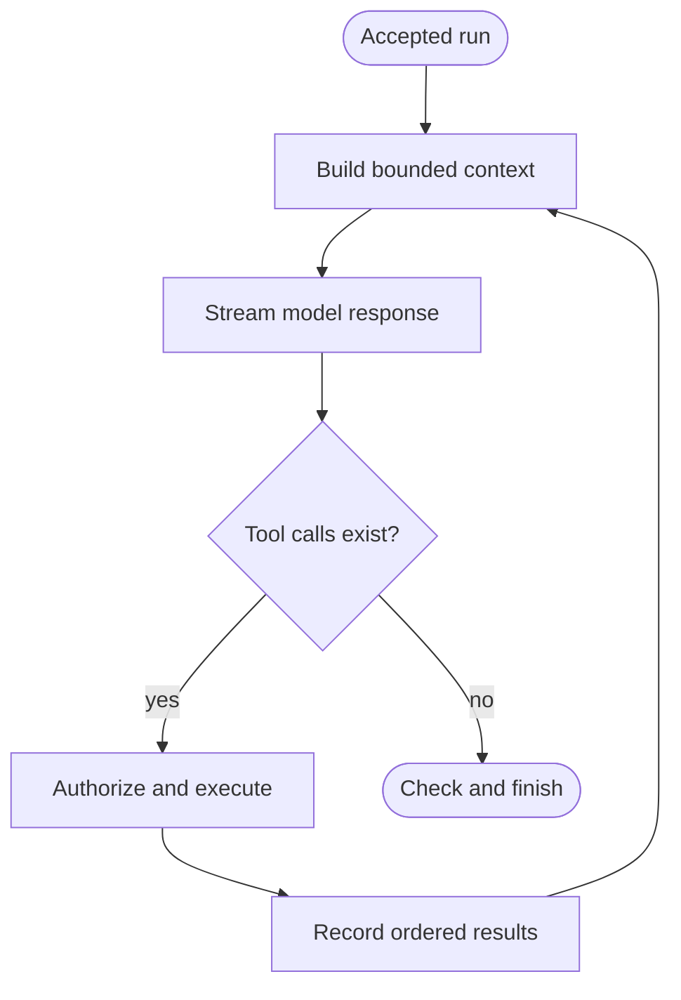

# Agent Architecture

> Separate implementation specification for the FastAPI/LangGraph agent
> runtime, control loop, recovery, child agents, and visible interactions.

[Docs start page](../README.md) | [Diagram standard](../diagram-standard.md)

## Key decision

Use a **custom LangGraph `StateGraph` with model-driven conditional routing and
a hard safety envelope**.

- Do not set an arbitrary small loop count and stop a healthy agent merely
  because it reached that number.
- Do route back to the model whenever its response contains valid tool calls and
  all results have been recorded.
- Do finish naturally when the model returns no tool calls and completion hooks
  accept the response.
- Do enforce configurable model-call, tool-call, token, cost, deadline,
  cancellation, recursion, and no-progress guards.
- Do pause permissions/user questions as durable interrupts so CLI/VS Code may
  disconnect and later resume the same exact run.

LangGraph's recursion limit is the final graph-level circuit breaker. Product
budgets and no-progress detection provide meaningful stop reasons before that
breaker is reached.

## Why this is a separate folder

Tool definitions describe capabilities. The agent graph describes **when and
why** the model, permission engine, tools, user, and child agents run. Keeping
them separate prevents tool adapters from owning orchestration and lets the
graph evolve without changing every tool contract.

Recommended code boundary:

```text
backend/
  agent/                  # graph state, routing, nodes, recovery
  tools/                  # definitions, registry, executor, adapters
  permissions/            # policy and durable decisions
  api/                    # FastAPI commands/events
  persistence/            # application DB and checkpointer adapters
```

## Document map

| Document | Question answered |
| --- | --- |
| [01 - Agent Runtime SRS](01-agent-runtime-srs.md) | What the agent runtime owns, its nodes, roles, boundaries, and subagent rules. |
| [02 - LangGraph Control Loop](02-langgraph-control-loop.md) | Exactly how the loop continues, pauses, recovers, and stops. |
| [03 - State, Checkpointing, and Recovery](03-state-checkpointing-and-recovery.md) | What is checkpointed and how crashes avoid duplicate side effects. |
| [04 - Observability and Interactions](04-observability-and-interactions.md) | How users inspect actions and state without exposing hidden reasoning. |

Supporting contracts:

- [Runtime SRS](../runtime-srs/README.md)
- [Complete Tool Catalog](../runtime-srs/02-tool-catalog.md)
- [Permission System](../runtime-srs/03-permission-system.md)
- [API and Events](../runtime-srs/04-api-and-event-protocol.md)
- [Data Model](../runtime-srs/05-data-model.md)
- [Python Types and Performance](../runtime-srs/06-python-types-and-performance.md)

## Runtime at a glance

**Question:** what is the normal model-driven loop?



How to read it:

1. Load/checkpoint handling occurs before the accepted run reaches this loop.
2. Context includes only authorized, bounded messages, tools, memory, and artifacts.
3. Model text streams while tool-use blocks are normalized.
4. Tool presence, not a provider stop string or small hard-coded count, drives continuation.
5. Permission may create a durable pause; its detailed flow is separate.
6. Exactly one ordered result closes each tool use before the next model call.
7. Completion policy and safety guards decide the terminal outcome.

Read [LangGraph Control Loop](02-langgraph-control-loop.md) for pause, denial,
retry, cancellation, no-progress, and recovery flows. Keeping those paths out of
this overview is intentional so the graph remains readable without zoom.

## Sources and migration status

The current TypeScript loop in [`query.ts`](../../query.ts) is migration
evidence. It already:

- iterates explicitly;
- detects tool-use blocks while streaming rather than trusting one provider stop
  reason;
- executes tools, appends matching tool results, and calls the model again;
- permits stop hooks and recovery to request another iteration;
- enforces cancellation and an optional `maxTurns` guard.

The Python target keeps those outcomes but exposes them as named graph nodes,
durable events, checkpoints, and testable conditional edges.

## Requirement prefixes

| Prefix | Family |
| --- | --- |
| `AGT` | Agent lifecycle, nodes, roles, graph routing, child agents |
| `LOOP` | Continuation and termination behavior |
| `CHK` | State, checkpoint, interrupt, replay, recovery |
| `OBS` | Timeline, metrics, logs, traces, visible interactions |

## Non-negotiable invariants

1. Every model tool-use block receives exactly one matching tool-result block
   before that trajectory calls the model again.
2. No tool adapter runs outside the central executor and permission engine.
3. A pause survives runtime/client restart.
4. A replayed node cannot duplicate a committed message, call, approval, or
   external side effect.
5. Every loop continuation has an explicit reason event and consumes a budget.
6. Every terminal path records a stable stop reason and final checkpoint.
7. Child agents have separate runs, state, budgets, permissions, events, and
   cancellation, linked to their parent.
8. Users can inspect visible actions/results and routing reasons; private hidden
   model reasoning is not required or exposed.
