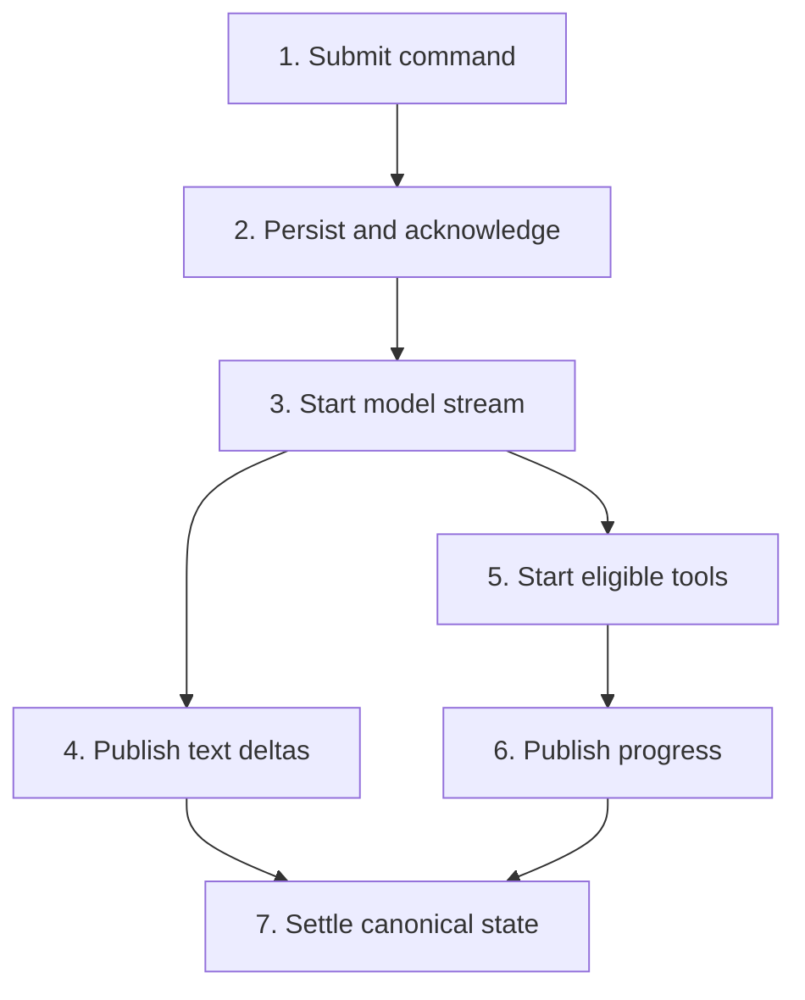

# Fast Response Pipeline

> Reduce time to acknowledgement, first visible state, first text, and first
> useful tool progress without weakening ordering, durability, or permissions.

[CLI architecture index](README.md) | [Docs start page](../README.md) | [Diagram standard](../diagram-standard.md)

## What "fast" means

There are four different latency measurements:

| Measurement | Starts | Ends | Main owner |
| --- | --- | --- | --- |
| Command acknowledgement | Enter | Durable accepted/rejected response | FastAPI/application service |
| First visible state | Enter | `run.accepted` or `run.resumed` rendered | API, event transport, reducer |
| Time to first text | Command accepted | First visible model text delta | Provider and model stream path |
| Time to first useful work | Tool block complete | Tool progress/result visible | Streaming executor and adapter |

Do not report only total completion time. A 20-second task can feel responsive
when acceptance is immediate, text streams early, and activity is truthful.

## Current repository behavior

**CURRENT:** [`query.ts`](../../query.ts) consumes model output as an async
stream. When a complete tool-use block appears, it gives it to
[`StreamingToolExecutor`](../../services/tools/StreamingToolExecutor.ts) before
the model stream necessarily ends.

The executor:

- runs concurrency-safe tools together;
- gives unsafe tools exclusive execution;
- emits progress without waiting for final results;
- buffers final results so provider-required order is preserved;
- cancels eligible siblings after a Bash error;
- distinguishes `cancel` from `block` interrupt behavior;
- discards orphan work when streaming fallback replaces an attempt.

This is the behavior to preserve, not the TypeScript class shape.

## Target fast path

**Question:** what is the shortest safe path from Enter to useful feedback?



How to read it:

1. The CLI generates `command_id` and `idempotency_key` before network I/O.
2. FastAPI writes command/run state and an acceptance event in one transaction.
3. A worker starts the model call without waiting for optional analytics work.
4. Text deltas use a low-latency provisional channel keyed by message ID.
5. A syntactically complete tool call may start after validation and permission.
6. Progress is bounded and replace-in-place.
7. Final text, tool results, usage, and status become canonical durable events.

## Two event classes

Use different guarantees explicitly:

| Class | Examples | Durability | Replay behavior |
| --- | --- | --- | --- |
| Canonical | command accepted, message completed, tool settled, permission requested, terminal state | Required | Replayed exactly by sequence |
| Provisional | text delta, spinner phase, stdout tail, token estimate | Optional/bounded | May be coalesced or replaced by snapshot |

Every provisional stream uses a stable entity ID and revision. A canonical
settlement event contains the final value or artifact reference, so dropping a
delta never loses the finished result.

## Backend execution path

Keep the request handler short:

```python
class SubmitMessageCommand(BaseModel):
    model_config = ConfigDict(extra="forbid")

    command_id: UUID
    session_id: UUID
    client_id: UUID
    idempotency_key: str = Field(min_length=16, max_length=200)
    text: str = Field(min_length=1, max_length=100_000)
    delivery: Literal["next", "interrupt_if_safe"] = "next"
    expected_sequence: int | None = Field(default=None, ge=0)
```

The route should only:

1. authenticate the actor and workspace;
2. validate the Pydantic command;
3. call one application command handler;
4. commit command plus outbox event;
5. signal/wake the run worker;
6. return `202 Accepted` with command status and event cursor.

Model calls, graph traversal, tool execution, artifact I/O, and fan-out do not
run inside the HTTP request transaction.

## Recommended initial latency budgets

These are **TARGET** engineering budgets, not claims about current performance:

| Path | Initial objective |
| --- | --- |
| Local command validation plus acknowledgement | p95 under 100 ms excluding cold start/network |
| Accepted event visible after API acknowledgement | p95 under 150 ms on local deployment |
| Delta coalescing window | 20-50 ms interactive; larger only under backpressure |
| Tool progress update | At most 4-10 visible updates/second per active item |
| CLI reducer/render work | p95 under one 16-33 ms frame for normal timelines |
| Snapshot/replay | Paginated; first useful screen before full history |

Measure first. Adjust per deployment and terminal. Do not delay canonical events
to satisfy a batching metric.

## Model stream and tool overlap

Starting tools early is safe only when all of these hold:

1. The provider emitted a complete tool block with stable ID/name/input.
2. The input validates against the registry snapshot used for this model call.
3. Permission policy has an allow result or a durable approval has resolved.
4. The tool declares scheduling class and resource locks.
5. Streaming fallback can cancel/discard the attempt or idempotency prevents an
   orphan side effect.

Default early execution to read-only/idempotent tools. Delay destructive or
irreversible tools until the assistant response attempt is canonical unless the
adapter has a stronger transaction/idempotency contract.

## Tool scheduler

Use three scheduling classes:

| Class | Examples | Rule |
| --- | --- | --- |
| `parallel_read` | read, glob, grep, independent web fetch | May overlap when resource limits allow. |
| `resource_locked` | edit one path, update task row | May overlap only when normalized resource locks do not conflict. |
| `exclusive` | working-directory mutation, broad shell, context modifier | Runs alone within the run. |

The repository currently exposes a boolean concurrency-safe contract. The
target extends that evidence into explicit lock keys and scheduling classes.

## Ink performance

- Keep server projection in a pure external store and subscribe with narrow selectors.
- Coalesce deltas before dispatch, not by rendering every token then hiding it.
- Keep active rows small; page/collapse completed history.
- Use a circular buffer for bounded stdout tails and retain full output as an artifact.
- Move Markdown parsing, syntax highlighting, and large diff preparation off the input path.
- Never recompute the complete interaction tree on each progress event.
- Prefer stable keys and in-place status updates over append-only spinner messages.
- Pause decorative animation under terminal pressure; never pause input or critical status.

## Backpressure

Fast is not unbounded. Apply pressure in this order:

1. coalesce replaceable deltas for the same entity;
2. drop superseded spinner/progress revisions;
3. slow artifact tails while retaining bytes on disk;
4. page historical canonical events;
5. disconnect a client that cannot keep up and require snapshot replay;
6. never drop permission, terminal, command, or side-effect outcome events.

The current [`HybridTransport.ts`](../../cli/transports/HybridTransport.ts)
demonstrates short stream batching, serialized writes, retry with backoff, and a
bounded close grace period. The target transport should preserve the ordering
principle while making durability guarantees explicit in the backend event log.

## Failure behavior

| Failure | Required response |
| --- | --- |
| Provider stream drops before canonical completion | Mark attempt interrupted; retry only under policy; replace provisional content. |
| Duplicate command POST | Return the original command outcome; do not wake twice. |
| Event gap | Stop applying live events, fetch snapshot/from-sequence replay, then resume. |
| CLI render crash | Runtime continues; reconnect rebuilds server projection. |
| Early tool becomes orphaned | Cancel if possible; otherwise record `side_effect_unknown` and block automatic retry. |
| Client too slow | Coalesce provisional updates or require resync; preserve canonical events. |

## Build checklist

- [ ] Command handler transaction and idempotency test.
- [ ] Outbox/event sequence and replay API.
- [ ] Model delta accumulator with canonical settlement.
- [ ] Streaming tool detector and safe early-start gate.
- [ ] Resource-aware tool scheduler.
- [ ] Pure TypeScript reducer with replay/live equivalence fixtures.
- [ ] Ink render benchmark with long timeline and parallel progress.
- [ ] Disconnect, fallback, duplicate, and backpressure tests.
