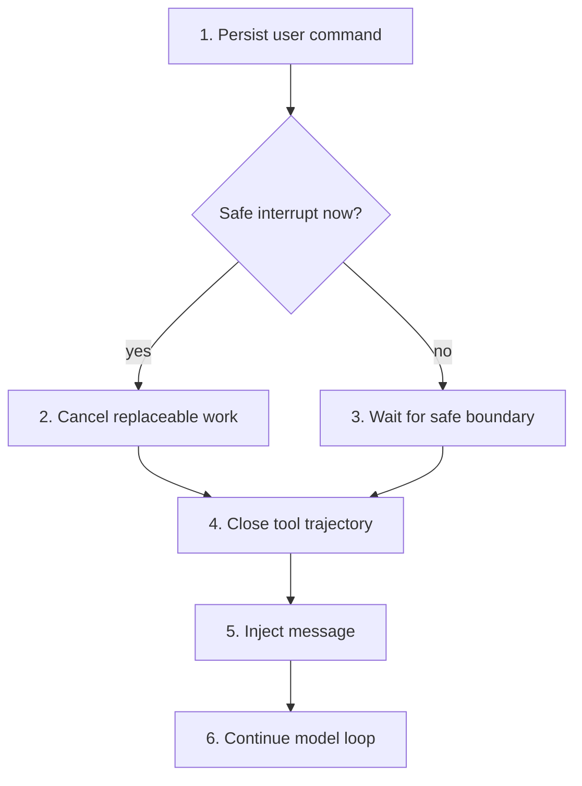
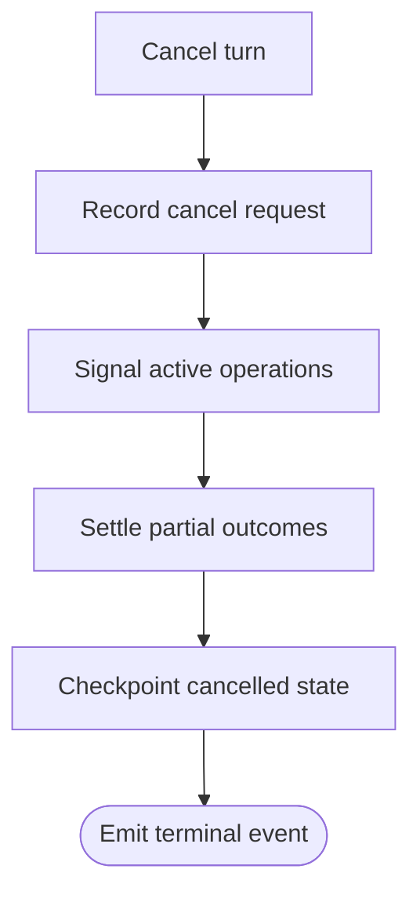

# Live Steering and Command Queue

> Let the user communicate while work continues without breaking tool-result
> ordering or guessing whether input should cancel the current operation.

[CLI architecture index](README.md) | [Docs start page](../README.md) | [Diagram standard](../diagram-standard.md)

## Current repository contract

**CURRENT:** [`messageQueueManager.ts`](../../utils/messageQueueManager.ts)
maintains one queue shared by React and non-React paths.

| Priority | Meaning | Typical producer |
| --- | --- | --- |
| `now` | Earliest safe processing | Explicit urgent control path |
| `next` | Next model-safe boundary | User prompt; some task completions |
| `later` | Do not starve user intent | Background task notifications |

[`handlePromptSubmit.ts`](../../utils/handlePromptSubmit.ts) queues input while
a query is active. When every executing tool declares interrupt behavior
`cancel`, submission may abort the turn with reason `interrupt`; blocking tools
continue and the input remains queued.

After tools finish, [`query.ts`](../../query.ts) takes a scoped queue snapshot,
converts eligible messages into attachments, removes only consumed commands,
and calls the model again. Main-thread user prompts do not leak into subagents.

## Target delivery modes

Expose user intent instead of a hidden timing heuristic:

| Mode | User meaning | Runtime action |
| --- | --- | --- |
| `next` | "Use this as soon as it is safe." | Persist and inject before the next model call. |
| `interrupt_if_safe` | "Stop replaceable work and use this now." | Cancel only if all active operations permit interruption; otherwise remain `next`. |
| `after_turn` | "Do not alter this trajectory." | Start a new turn after current terminal state. |
| `control` | "Pause/cancel/resume/approve a specific entity." | Route to typed control handler, never model text. |

The CLI shows the effective result: `queued for next round`, `interrupting`, or
`scheduled after turn`.

## Message while the agent works

**Question:** when does a newly typed message reach the model?



How to read it:

1. Acceptance is durable before the UI says the message is queued.
2. Safe interrupt means every active operation explicitly supports cancellation.
3. A shell/edit with uncertain side effects blocks submit-interrupt but not queueing.
4. Every emitted tool-use block still receives a matching result or typed rejection.
5. The run claims the command once and records its delivery boundary.
6. The model sees the steering message alongside completed tool results.

## Durable command model

Store commands independently from chat messages:

```python
class QueuedCommand(BaseModel):
    model_config = ConfigDict(extra="forbid")

    command_id: UUID
    session_id: UUID
    target_run_id: UUID
    target_agent_id: UUID | None = None
    kind: Literal["user_message", "task_notification", "control"]
    priority: Literal["now", "next", "later"]
    delivery: Literal["next", "interrupt_if_safe", "after_turn"]
    payload: dict[str, Any]
    status: Literal["accepted", "claimed", "applied", "cancelled", "failed"]
    accepted_sequence: int
    claimed_by_operation_id: UUID | None = None
```

Use Pydantic at the API/event boundary and SQLAlchemy rows in persistence. The
LangGraph state should carry only command IDs/claimed inputs needed for the
current transition, not the whole queue.

## Claim protocol

1. API inserts `queued_command(status=accepted)` with unique `command_id` and
   idempotency key.
2. Worker reaches a declared safe boundary.
3. Transaction selects eligible commands using target scope and priority.
4. Worker marks them `claimed` with `operation_id` and emits `command.claimed`.
5. Graph builds a typed attachment/input and checkpoints.
6. After the next node accepts the input, mark `applied` and emit `command.applied`.
7. Recovery reuses a claim owned by the same operation or releases an expired
   lease before another worker claims it.

This avoids deleting from a queue before checkpointing and losing a message on
crash.

## Safe boundaries

| Boundary | User message allowed? | Why |
| --- | --- | --- |
| Before model request | Yes | No provider trajectory is open. |
| During model text stream | Queue; optional provider cancel | Partial text must be settled/replaced first. |
| Between complete tool call detection and execution | Only if no call was committed, or produce rejection result | Tool-use/result pairing must remain valid. |
| While tools run | Queue; interrupt only all-cancelable | Side effects may already be in flight. |
| After ordered tool results commit | Yes, preferred | This matches current repository injection behavior. |
| Waiting permission/user | Typed response/control only | Free text must not accidentally approve. |
| Terminal | Start/resume a new turn | Previous trajectory is closed. |

## Foreground cancellation

`cancel turn` targets one active run operation. It does not mean stop every
background child.

**Question:** when is cancellation durable and safe to show as complete?



How to read it:

1. Persist an idempotent, explicitly scoped request before signalling work.
2. Signal only operations owned by that target; do not reinterpret "turn" as "all children."
3. Settle partial model/tool outcomes before writing the cancelled checkpoint.
4. Emit the canonical terminal event only after state is recoverable.

Required cancellation fields:

| Field | Purpose |
| --- | --- |
| `cancel_request_id` | Idempotent control identity. |
| `scope` | `operation`, `run`, `task`, `agent`, `agent_tree`, or `team`. |
| `target_id` | Prevents cancelling whichever task happens to be current later. |
| `requested_by` | Audit actor/client. |
| `reason` | `user_cancel`, `steer_interrupt`, `timeout`, `budget`, `shutdown`. |
| `grace_ms` | Cooperative shutdown window before escalation. |
| `expected_version` | Rejects stale UI actions. |

## Race scenarios

| Scenario | Correct outcome |
| --- | --- |
| User submits twice after a slow acknowledgement | Same idempotency key returns one command. |
| User edits/removes a queued message while worker claims it | Optimistic version decides one winner; UI shows applied or cancelled. |
| Permission dialog and free-text message arrive together | Permission response is typed and scoped; text remains queued. |
| Cancel arrives after run completes | Return `already_terminal`; do not alter terminal result. |
| Worker dies after claim before checkpoint | Claim lease expires/recovery reclaims without duplicate application. |
| Two clients steer same session | Backend sequence and command status establish order. |
| Tool ignores cancellation | Mark timeout/unknown effect, quarantine retry, keep command queued for a safe decision. |

## Ink interaction

The input footer should answer three questions before Enter:

```text
Enter: queue for next tool round | Alt+Enter: after turn | Esc: cancel turn
```

When interruption is safe:

```text
Enter: interrupt and steer | Alt+Enter: queue only | Esc: cancel turn
```

Do not silently change a message into cancellation. Make queue items visible,
editable until claimed, and removable through a command with version check.

## Events

Minimum canonical event family:

- `command.accepted`
- `command.updated`
- `command.claimed`
- `command.applied`
- `command.cancelled`
- `run.cancel_requested`
- `operation.cancel_signalled`
- `operation.cancel_settled`
- `run.cancelled`
- `side_effect.unknown`

## Build checklist

- [ ] Durable command table and idempotency constraint.
- [ ] Main/child target-scope tests.
- [ ] Safe-boundary declarations in graph nodes.
- [ ] Cancelability/interrupt behavior on every tool adapter.
- [ ] Claim lease and crash-recovery test.
- [ ] CLI queue editor and explicit delivery-mode labels.
- [ ] Tool-use/result adjacency test under mid-turn steering.
- [ ] Two-client ordering and stale-action test.

## Repository evidence

| Source | Current behavior to retain |
| --- | --- |
| [`messageQueueManager.ts`](../../utils/messageQueueManager.ts) | Queue priorities, FIFO within priority, subscriptions, and queue-operation persistence. |
| [`handlePromptSubmit.ts`](../../utils/handlePromptSubmit.ts) | Active-query queueing and all-cancelable submit interruption. |
| [`query.ts`](../../query.ts) | Safe post-tool injection, command scoping, and remove-only-consumed behavior. |
| [`StreamingToolExecutor.ts`](../../services/tools/StreamingToolExecutor.ts) | `cancel` versus `block`, synthetic rejection results, and sibling cancellation. |
| [`useCancelRequest.ts`](../../hooks/useCancelRequest.ts) | Foreground-first Escape behavior and separation from stop-all. |
