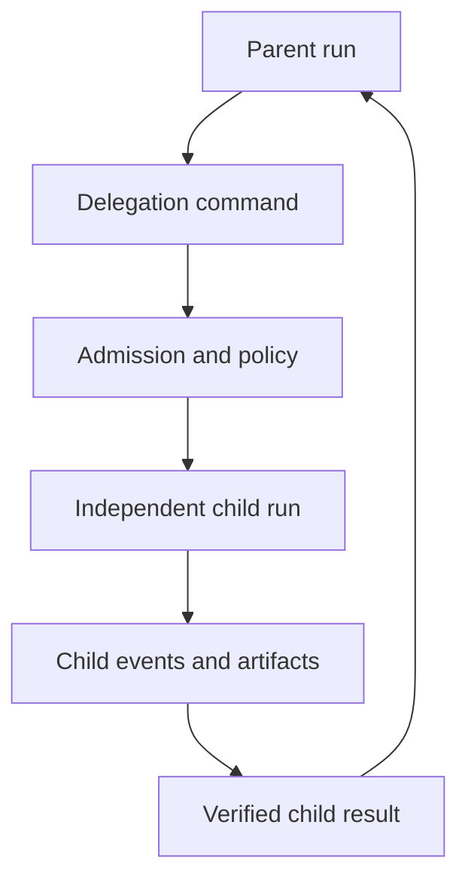
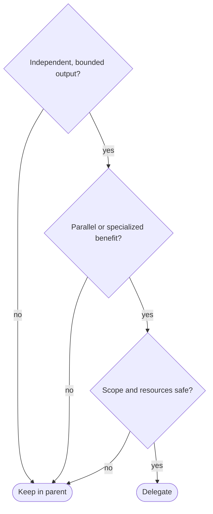
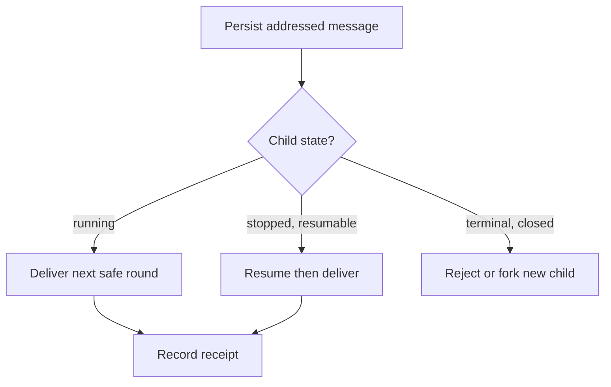
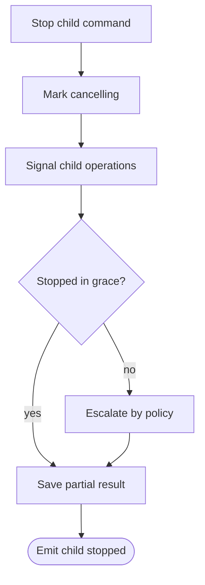

# Multi-Agent Control

> Rational delegation, separate child lifecycles, live messages, bounded
> parallelism, and unambiguous stop behavior.

[CLI architecture index](README.md) | [Docs start page](../README.md) | [Diagram standard](../diagram-standard.md)

## Current repository model

The repository has two related mechanisms:

| Mechanism | CURRENT behavior |
| --- | --- |
| Background/local child | `AgentTool` starts a foreground or background agent, tracks it as a task, stores output, supports naming/resume, and can isolate it in a git worktree. |
| Team/teammate | A leader creates one team, teammates remain alive, exchange locked mailbox messages, claim tasks, and use structured plan/shutdown messages. |

Important current constraints:

- teammates cannot recursively spawn teammates, keeping the roster flat;
- background agents are not aborted just because the main foreground turn gets Escape;
- a running named child receives messages at its next tool round;
- a stopped child can be resumed from its transcript with a new message;
- shutdown is a request/response handshake for teammates;
- team deletion refuses while non-lead members remain active;
- one-task stop and stop-all-agents are different user actions;
- worktree isolation is retained when changes exist and cleaned when unused.

## Target ownership

**Question:** how are parent and child runs related without sharing mutable graph state?



How to read it:

1. The parent records an objective, expected output, and dependency.
2. Delegation is a typed command, not an in-memory function call.
3. Policy checks depth, capabilities, budget, resources, and data scope.
4. The child has its own graph state, checkpoints, permissions, and cancellation.
5. Progress remains inspectable without copying the complete child transcript into the parent.
6. The parent consumes a bounded result contract and verifies required artifacts.

Never let parent and child mutate the same LangGraph state dictionary.

## Decide rationally: delegate or stay local

Delegation has spawn, context, coordination, permission, and merge cost. Use this
gate before asking a model to create more agents.

### Hard "do not delegate" gates

Do not delegate when any is true:

- the next parent action is blocked on a tiny lookup the parent can do directly;
- the task needs continuous access to rapidly changing parent context;
- child and parent would edit the same unisolated files;
- the objective or success artifact cannot be stated precisely;
- required secrets/data are outside the child's authorized scope;
- capacity, cost, depth, or child-count budget is exhausted;
- the operation is irreversible and has no approval/ownership plan.

### Benefit score

After hard gates, estimate:

```text
benefit = parallel_time_saved
        + specialization_value
        + context_isolation_value
        - spawn_and_context_cost
        - coordination_and_merge_cost
        - added_risk_cost
```

Delegate only when benefit is clearly positive and the child result is
independently testable. This score is a deterministic runtime/prompt policy aid,
not permission for a model to ignore hard limits.

### Decision graph



Good delegation examples:

| Parent objective | Children | Why it helps |
| --- | --- | --- |
| Validate a large change | tests, security review, docs-link check | Independent read/test artifacts; parallel critical paths. |
| Investigate separate subsystems | API explorer, CLI explorer, persistence explorer | Context partition and specialized source maps. |
| Implement disjoint packages | protocol package, Ink reducer, backend repository | Disjoint write sets and explicit integration contract. |

Bad delegation examples:

| Task | Better action |
| --- | --- |
| Read one known file | Use the read tool directly. |
| Find one class in two files | Use grep/search. |
| Make intertwined edits to one module | Keep one owner or isolate sequential patches. |
| Ask several children the same vague question | Clarify one objective and avoid duplicate spend. |

## Start multiple agents

Use one batch command so admission sees the complete requested parallel group:

```python
class ChildSpec(BaseModel):
    model_config = ConfigDict(extra="forbid")

    client_child_key: str
    objective: str
    profile: str
    expected_artifacts: list[str] = Field(default_factory=list)
    depends_on: list[str] = Field(default_factory=list)
    isolation: Literal["shared_read", "worktree", "sandbox", "remote"]
    requested_budget: "BudgetRequest"


class SpawnChildrenCommand(BaseModel):
    model_config = ConfigDict(extra="forbid")

    command_id: UUID
    parent_run_id: UUID
    children: list[ChildSpec] = Field(min_length=1, max_length=16)
    start_policy: Literal["all_admitted", "admit_independently"] = "all_admitted"
```

Batch flow:

1. Validate unique child keys and dependency DAG.
2. Intersect each child capability with deployment, workspace, parent, profile,
   and sandbox policies.
3. Reserve child/token/cost/CPU/memory/process slots.
4. Persist child runs and delegation records transactionally.
5. Emit `child.created` for every child.
6. Queue only dependency-ready children.
7. Start up to the scheduler limit; do not equate requested parallelism with
   unlimited physical execution.

## Child permissions

Target effective capability:

```text
effective_child_scope = deployment_policy
                      AND workspace_policy
                      AND parent_delegable_scope
                      AND child_profile_scope
                      AND sandbox_scope
                      AND per-call approval
```

The current `AgentTool` worker path includes a migration behavior where normal
workers can use an `acceptEdits`-style default independent of some parent
restrictions. Do not copy that as the target security rule. Children must never
gain capabilities merely because work moved to the background.

## Message a running or stopped child

**Question:** what happens when a user/parent sends a child a message?



Message records need sender, recipient, parent/team scope, content kind,
sequence, priority, delivery status, and receipt checkpoint. Plain text does not
stand in for structured shutdown, plan approval, or permission decisions.

Delivery priority should preserve the current teammate principle:

1. shutdown/control requests;
2. leader/user intent;
3. direct parent messages;
4. peer messages FIFO;
5. task discovery/background notifications.

Use a database inbox plus wake notification in the server target. File-based
mailboxes are useful source evidence, but not sufficient for multi-host workers.

## Stop semantics

| User action | Scope | Required behavior |
| --- | --- | --- |
| Cancel foreground turn | Main active operation | Signal current model/tools; background children continue. |
| Stop task | One task ID | Validate running status, kill adapter, settle partial output. |
| Stop child | One child run | Cooperative cancel, grace period, force policy, terminal event. |
| Request teammate shutdown | One persistent teammate | Structured request; teammate approves/rejects; leader may escalate by policy. |
| Stop all agents | Descendants selected by scope | Explicit confirmation, cancel tree, aggregate result. |
| Delete team | Team metadata/resources | Allowed only after active members stop; preserve audit/history. |

### Stop one child

**Question:** how does one child stop without losing partial evidence or affecting peers?



How to read it:

1. `cancelling` closes the spawn gate for that child and makes repeated stop requests idempotent.
2. Cooperative cancellation gets a bounded grace period.
3. Escalation may terminate a process tree or revoke a worker lease, but only by configured policy.
4. Partial evidence is saved before the terminal event, even when force was required.

### Stop all

Stop-all takes a snapshot of targeted running child IDs. New children cannot
enter that cancellation scope until it settles. Emit one aggregate operation
plus an outcome per child; do not hide a child that failed to stop.

## Child result contract

A child should return structured evidence, not only prose:

```python
class ChildRunResult(BaseModel):
    model_config = ConfigDict(extra="forbid")

    child_run_id: UUID
    status: Literal["completed", "failed", "cancelled", "blocked"]
    summary: str
    artifact_ids: list[UUID]
    verification: list["VerificationResult"]
    changed_resources: list[str]
    unresolved_risks: list[str]
    usage: "UsageSummary"
```

The parent validates required artifacts and verification before treating the
delegation as complete. This is a target hardening over prompts that simply say
child output should be trusted.

## Data records

Minimum relational records:

- `runs(parent_run_id, root_run_id, kind, status, version)`
- `delegations(parent_run_id, child_run_id, objective, expected_contract)`
- `agent_messages(sender_run_id, recipient_run_id, kind, sequence, status)`
- `tasks(owner_run_id, dependency_graph, claim_lease, status)`
- `resource_reservations(run_id, cpu, memory, process, token, cost)`
- `cancel_operations(scope, target_id, status, grace_deadline)`
- `artifacts(owner_run_id, kind, digest, sensitivity, retention)`

See [Data Model](../runtime-srs/05-data-model.md) for shared run/event/operation
tables and [Artifacts and History](../execution-architecture/02-artifacts-and-history.md)
for content storage.

## Failure scenarios

| Failure | Response |
| --- | --- |
| Child crashes | Lease expires; recover from checkpoint or terminalize once. |
| Parent crashes | Children follow declared orphan policy: continue, pause, or cancel. |
| Duplicate spawn command | Unique parent plus client-child key returns existing child IDs. |
| Two children edit same resource | Admission lock conflict; serialize or isolate worktrees. |
| Child loops | Independent budgets/no-progress guard stop it without consuming parent forever. |
| Message delivered twice | Message ID and receipt checkpoint make application idempotent. |
| Child reports success without artifact | Parent contract remains unsatisfied; request repair or fail. |
| Stop races with completion | Optimistic version yields one terminal state; completion artifacts may remain. |

## Build order

1. Prerequisite: durable runs/events, hierarchical budgets, cancellation, resource admission, and sandbox provider.
2. One read-only child run with separate checkpoint, budget, and parent link.
3. Child progress events and structured final result.
4. Direct addressed messages at safe boundaries.
5. Resume stopped child from transcript/checkpoint.
6. Stop one child and settle partial output.
7. Batch spawn with dependency DAG and admission limits.
8. Add child writes only with worktree/sandbox isolation and artifact merge review.
9. Persistent teammates, tasks, broadcast, and graceful shutdown.
10. Explicit stop-all and team cleanup.

## Repository evidence

| Source | Current behavior to retain or harden |
| --- | --- |
| [`AgentTool.tsx`](../../tools/AgentTool/AgentTool.tsx) | Foreground/background agents, names, async lifetime, worktrees, and flat teammate constraints. |
| [`runAgent.ts`](../../tools/AgentTool/runAgent.ts) | Independent agent loop, MCP lifecycle, tools, model, and max-turn propagation. |
| [`resumeAgent.ts`](../../tools/AgentTool/resumeAgent.ts) | Transcript-based continuation. |
| [`SendMessageTool.ts`](../../tools/SendMessageTool/SendMessageTool.ts) | Running-child queue, stopped-child auto-resume, broadcast, shutdown, and plan response. |
| [`LocalAgentTask.tsx`](../../tasks/LocalAgentTask/LocalAgentTask.tsx) | Pending child messages and next-round draining. |
| [`teammateMailbox.ts`](../../utils/teammateMailbox.ts) | Locked inboxes and typed coordination/permission/sandbox messages. |
| [`inProcessRunner.ts`](../../utils/swarm/inProcessRunner.ts) | Persistent teammate loop and priority of shutdown/leader messages. |
| [`TaskStopTool.ts`](../../tools/TaskStopTool/TaskStopTool.ts) | One-task validation and stop contract. |
| [`useCancelRequest.ts`](../../hooks/useCancelRequest.ts) | Deliberate, confirmed stop-all path. |
| [`TeamCreateTool.ts`](../../tools/TeamCreateTool/TeamCreateTool.ts), [`TeamDeleteTool.ts`](../../tools/TeamDeleteTool/TeamDeleteTool.ts) | One-team lifecycle and active-member cleanup guard. |
