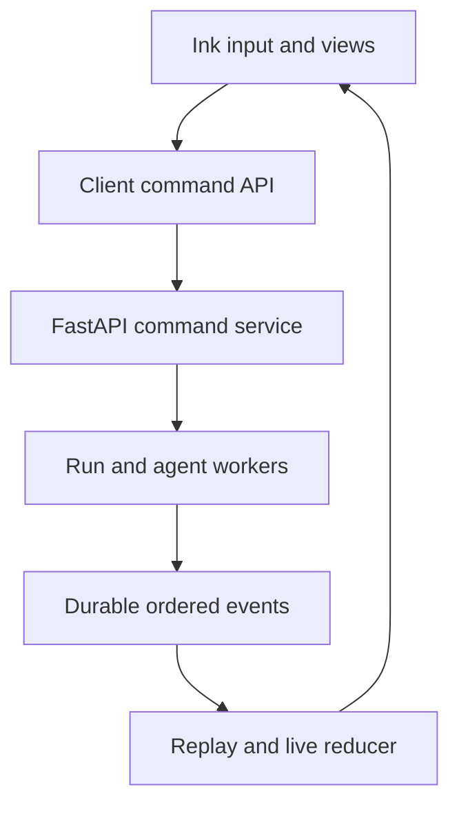

# CLI Architecture

> Fast, steerable, recoverable interaction for a React Ink CLI backed by
> FastAPI and the same event protocol used by the VS Code extension.

[Docs start page](../README.md) | [Project architecture](../project-architecture/README.md) | [Diagram standard](../diagram-standard.md)

## Outcome

After this folder is implemented, a user can:

- see assistant text and tool progress as soon as they are available;
- type another message while the current turn is running;
- choose whether a message queues, steers at the next safe boundary, or
  interrupts cancelable work;
- start, inspect, message, resume, stop, and batch-start child agents;
- reconnect without losing accepted commands, partial display, or run state;
- distinguish stopping the foreground turn, one background task, all agents,
  and gracefully disbanding a team.

## Source status

| Status | Behavior |
| --- | --- |
| **CURRENT** | The repository streams model messages, starts eligible tools while the response is still arriving, and yields progress immediately. |
| **CURRENT** | A process-wide command queue supports `now`, `next`, and `later`; mid-turn prompts are injected at a safe tool-round boundary. |
| **CURRENT** | `SendMessage` queues input for a running child, auto-resumes a stopped child, and routes team messages through locked mailboxes. |
| **CURRENT** | Foreground cancel, task stop, graceful teammate shutdown, and stop-all-agents are separate operations. |
| **TARGET** | FastAPI persists commands and event order so these behaviors survive process and client restarts. |
| **TARGET** | React Ink consumes a shared reducer rather than owning runtime state. |

## One-screen architecture

**Question:** how does the CLI stay responsive without becoming the runtime?



How to read it:

1. Ink captures intent and renders state; it does not call models or tools.
2. The client library adds command IDs, idempotency keys, and connection state.
3. FastAPI authorizes and records commands before acknowledging them.
4. Workers wake the relevant run and apply commands at safe boundaries.
5. Canonical events commit with state changes.
6. Replay and live events pass through the same deterministic reducer.

## Documents

| Document | Build question |
| --- | --- |
| [01 - Fast Response Pipeline](01-fast-response-pipeline.md) | How do we minimize perceived latency without corrupting event order? |
| [02 - Live Steering](02-live-steering.md) | What happens when the user submits input while work is active? |
| [03 - Multi-Agent Control](03-multi-agent-control.md) | When should we delegate, and how do we start/message/stop children safely? |

Implementation review and closure plan:

- [CLI Improvement Program](../cli-improvements/README.md)
- [UX and Terminal Contract](../cli-improvements/02-cli-ux-and-terminal-contract.md)
- [Resilience and Performance](../cli-improvements/03-cli-resilience-and-performance.md)
- [Traceability and Delivery](../cli-improvements/04-traceability-and-delivery.md)

Related contracts:

- [API and Event Protocol](../runtime-srs/04-api-and-event-protocol.md)
- [LangGraph Control Loop](../agent-architecture/02-langgraph-control-loop.md)
- [Observability and Interactions](../agent-architecture/04-observability-and-interactions.md)
- [Sandbox and Resources](../execution-architecture/01-sandbox-and-resources.md)

## UI layout

Use stable regions instead of appending every progress tick:

```text
+ session / branch / model / permission / connection ----------------+
| Conversation                                                        |
|  assistant text streams here                                        |
|                                                                     |
| Activity                                            3 running       |
|  main       calling model                              4.2s         |
|  agent-1    testing auth                               8.1s         |
|  tool-7     pytest tests/auth                          2.0s         |
|                                                                     |
| Queue: 1 next message                                               |
+ Esc turn | stop-one | stop-all | Ctrl+O details -------------------+
| > type while work continues                                         |
+---------------------------------------------------------------------+
```

Presentation rules:

- Stream final assistant text in the visually primary region.
- Update activity rows by stable IDs; do not print one row per token/tick.
- Keep prompt input active unless a focused approval requires exclusive input.
- Show whether Enter will `queue`, `steer`, or `interrupt` before submission.
- Preserve drafts, selection, scroll, and expanded rows across snapshots.
- Provide deterministic line mode for pipes, logs, tests, and `TERM=dumb`.

## Client package boundary

```text
packages/client-core/
  commands.ts            # typed command construction and idempotency
  transport.ts           # HTTP commands plus WebSocket/SSE event stream
  replay.ts              # cursor, gap detection, snapshot recovery
  reducer.ts             # pure server-projection reducer
  selectors.ts           # stable derived views

packages/ink-cli/
  app.tsx
  views/
  input/
  keybindings/
  accessibility/
  line-mode/
```

The VS Code extension should reuse `client-core` and generated protocol types.
Only presentation and editor integration differ.

## Non-negotiable invariants

1. An acknowledged command has a durable record or an explicit non-durable
   local-only classification.
2. One accepted command ID is applied at most once.
3. A user prompt is never silently delivered to a child instead of the main run.
4. Tool results stay adjacent to the tool trajectory required by the provider.
5. Provisional deltas may be replaced; canonical completion events may not.
6. Client disconnect never implies run cancellation.
7. Cancellation identifies its scope and leaves a typed terminal or partial state.
8. Stop-all is a deliberate operation, not a side effect of ordinary Ctrl+C.

## Build order

1. Implement command IDs, event envelopes, replay, and the pure reducer.
2. Stream one model response into stable assistant-message state.
3. Add tool progress and canonical settlement.
4. Add durable `next` steering at the post-tool safe boundary.
5. Add foreground cancellation with operation IDs.
6. Add one background child with status, message, resume, and stop.
7. Add batch spawn and admission control.
8. Add team mailbox semantics only after direct parent-child messaging works.

## Repository evidence

| Source | Evidence reused |
| --- | --- |
| [`query.ts`](../../query.ts) | Streaming response loop, tool-round continuation, queued input injection, and max-turn behavior. |
| [`StreamingToolExecutor.ts`](../../services/tools/StreamingToolExecutor.ts) | Early tool start, concurrency safety, ordered results, progress, and interrupt behavior. |
| [`messageQueueManager.ts`](../../utils/messageQueueManager.ts) | Unified queue, priorities, subscriptions, and persisted queue operations. |
| [`handlePromptSubmit.ts`](../../utils/handlePromptSubmit.ts) | Queue-versus-interrupt decision while a query is active. |
| [`AgentTool.tsx`](../../tools/AgentTool/AgentTool.tsx) | Foreground/background children, worktrees, names, and task registration. |
| [`SendMessageTool.ts`](../../tools/SendMessageTool/SendMessageTool.ts) | Running-agent steering, stopped-agent resume, broadcast, and shutdown messages. |
| [`useCancelRequest.ts`](../../hooks/useCancelRequest.ts) | Foreground cancel, queue pop, and confirmed stop-all behavior. |
