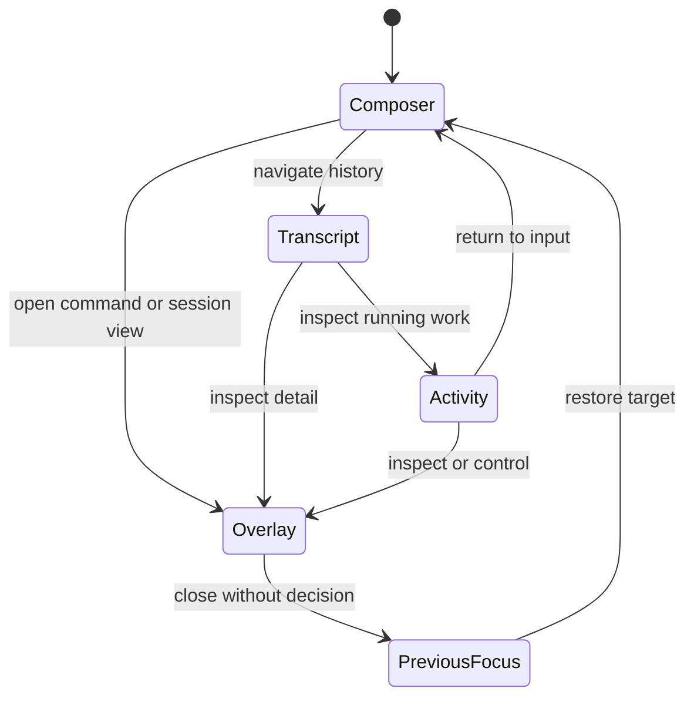

# CLI UX and Terminal Contract

> Normative improvements for focus, input, terminal compatibility,
> accessibility, permissions, and multi-agent control in the React Ink client.

[CLI improvement index](README.md) | [CLI architecture](../cli-architecture/README.md) | [React Ink specification](../project-architecture/05-react-ink-cli.md)

## Baseline

The existing architecture already requires stable screen regions, narrow
selector subscriptions, responsive width modes, semantic theme tokens,
`NO_COLOR`, reduced motion, deterministic line mode, a priority key dispatcher,
and reconnect-safe drafts.

This chapter does not replace those decisions. It removes ambiguity at the
terminal/input boundary and gives release-blocking behavior stable IDs.

The words **MUST**, **MUST NOT**, **SHOULD**, and **MAY** are normative here.

## Separate work state from focus state

The session can be running while the user edits a prompt. Do not encode both
ideas in one enum.

| Dimension | Example values | Owner |
| --- | --- | --- |
| Server work | idle, model streaming, tools running, waiting approval, cancelling, terminal | Backend event projection |
| Client focus | composer, transcript, activity, command palette, permission, diff, session picker | Ink UI state |
| Connection | starting, synchronizing, live, reconnecting, incompatible, offline | Client transport/reducer |

`CLI-UX-001`: Server work, focus, and connection are independent typed state
dimensions. A change in one MUST NOT silently reset another.

`CLI-UX-002`: The composer remains available while work runs unless a focused
security decision explicitly owns input. A pending permission MAY be minimized
without being approved or denied.

## Focus state machine

**Question:** how does focus move without being stolen by streaming updates?



How to read it:

1. Base regions have one active focus owner.
2. Opening an overlay pushes the previous focus target onto a bounded stack.
3. Streaming events update content but never push/pop focus.
4. Closing an overlay restores a still-valid target or falls back to composer.
5. A typed permission decision settles backend state; closing the view alone does not.

`CLI-UX-003`: Every focus transition is caused by a user action, a settled
overlay target, or an explicit connection-failure route. Content/progress
events MUST NOT steal focus.

`CLI-UX-004`: Overlay focus uses a stack with a configured maximum depth.
Opening a recursive/duplicate overlay replaces or focuses the existing entry.

`CLI-UX-005`: When the previously focused entity disappears, focus returns to
the nearest surviving parent region and then to the composer. It MUST NOT point
to a stale row ID.

## Input dispatcher

Use one ordered dispatcher:

1. terminal emergency/quit handling;
2. focused permission or destructive confirmation;
3. top overlay;
4. composer paste/completion/history;
5. focused transcript/activity navigation;
6. global commands;
7. printable text insertion.

Each binding declares:

```typescript
type Keybinding = {
  id: string
  sequence: string[]
  contexts: InputContext[]
  priority: number
  action: string
  description: string
  source: 'managed' | 'default' | 'user'
}
```

`CLI-UX-010`: One input event is consumed by at most one handler. Conflict
resolution is deterministic and visible in `/keys` diagnostics.

`CLI-UX-011`: Managed bindings may reserve emergency/security actions. User
bindings cannot shadow an unbindable cancel/quit recovery path.

`CLI-UX-012`: Chord state has a visible timeout and never delays ordinary text
without showing that a chord is pending.

## Exact Escape and Ctrl+C behavior

`Esc` follows this ladder:

1. close autocomplete or a transient menu;
2. close/minimize the top non-destructive overlay without deciding it;
3. leave transcript/activity navigation and focus the composer;
4. if no UI layer consumed it and a foreground turn is active, submit one
   idempotent cancel-turn command for the displayed run ID;
5. if no foreground turn is active, leave the draft unchanged.

`Ctrl+C` follows this ladder:

1. cancel an active bracketed paste/chord/composer selection;
2. clear a non-empty composer only after configured confirmation behavior;
3. in an empty idle session, first press shows `press again to exit`;
4. second press inside a short visible window exits the client;
5. with active backend work, exit means detach unless the user explicitly chose
   cancel scope; it never becomes stop-all.

`CLI-UX-013`: `Esc`, `Ctrl+C`, cancel-turn, stop-child, stop-all, and client
detach are separate action IDs. No timing heuristic may silently widen scope.

`CLI-UX-014`: A permission overlay consumes neither `Esc` nor `Ctrl+C` as an
allow/deny decision. Only labelled decision actions resolve permission.

`CLI-UX-015`: Repeated cancel/quit input is idempotent and rate-limited. The UI
shows the exact target and accepted/already-terminal status.

## Submit modes and live steering

Before submission, the composer footer MUST display the effective action:

| State | Primary action label | Alternate action |
| --- | --- | --- |
| No active turn | `send` | none |
| Active, non-cancelable operation | `queue for next safe round` | `send after turn` |
| Active, all operations cancelable | `interrupt and steer` or configured `queue` | the other explicit mode |
| Waiting permission/user answer | `queue message` | open typed decision |
| Reconnecting | `keep draft; submission paused` | cancel local draft |
| Incompatible protocol | `update required` | diagnostics/exit |

`CLI-UX-020`: The client sends a typed delivery mode. It MUST NOT infer or
change the mode after the backend accepts the command.

`CLI-UX-021`: A queued message is visible with target run, delivery mode, and
status. It can be edited/deleted only before claim and with expected version.

`CLI-UX-022`: Free text never resolves permission, plan approval, shutdown, or
another typed control request.

## Terminal capability profile

Detect a profile once at startup and refresh on resize/capability changes:

```typescript
type TerminalProfile = {
  stdinTTY: boolean
  stdoutTTY: boolean
  columns: number
  rows: number
  colorDepth: 0 | 4 | 8 | 24
  unicodeLevel: 'ascii' | 'basic' | 'wide'
  bracketedPaste: boolean
  hyperlinks: boolean
  alternateScreen: boolean
  environment: 'posix' | 'conpty' | 'tmux' | 'screen' | 'unknown'
  reducedMotion: boolean
}
```

Profiles:

| Profile | Trigger | Rendering contract |
| --- | --- | --- |
| Interactive full | TTY, sufficient width/height | Stable regions, overlays, activity rail. |
| Interactive compact | TTY below width/height thresholds | One column, abbreviated header, overlays replace panels. |
| Basic TTY | Weak Unicode/color/cursor features | ASCII glyphs, no decorative animation, conservative repaint. |
| Line mode | `TERM=dumb`, explicit flag, unsupported cursor control | Append deterministic semantic lines only. |
| Non-TTY/piped | stdout is redirected | No spinners/control escapes; stdout carries final/selected data, stderr carries status. |
| Machine JSONL | explicit `--output jsonl` | Versioned structured events, no UI prose mixed into stdout. |

`CLI-UX-030`: Terminal environment variables are hints, not security
authority. Unsupported capabilities degrade; they never weaken backend policy.

`CLI-UX-031`: The CLI MUST expose the effective profile in diagnostics and
allow a deterministic override for tests.

`CLI-UX-032`: Machine/pipe modes never emit ANSI cursor movement, OSC links,
spinner frames, or prompts to stdout.

## Width and text safety

JavaScript string length is not terminal width. Rendering must account for
grapheme clusters, combining marks, emoji sequences, East Asian wide cells,
tabs, and control characters.

`CLI-UX-040`: All truncation/wrapping uses a tested terminal-cell-width
function. The renderer MUST NOT slice inside a surrogate pair or grapheme.

`CLI-UX-041`: Untrusted model/tool/file text is sanitized before terminal
rendering. C0/C1 controls, ANSI/CSI/OSC sequences, bidi controls, and unsafe
hyperlinks are escaped, removed, or represented visibly by policy.

`CLI-UX-042`: Copy/export uses original authorized content, while the terminal
view uses sanitized display content. The UI discloses when display was escaped
or truncated.

`CLI-UX-043`: Layout removes decoration in this order: animation, borders,
secondary metadata, side rail, header details. Composer, decisions, errors, and
content meaning remain.

## Paste and composer safety

`CLI-UX-050`: Bracketed paste, when supported, inserts as one bounded operation
and never auto-submits because pasted text contains newline/escape sequences.

`CLI-UX-051`: Large paste shows byte/line count, applies configured limits, and
offers attachment/artifact conversion rather than freezing or silently
truncating.

`CLI-UX-052`: File mentions and command completion insert inert composer text;
they do not read a file or execute a command before submit/authorization.

`CLI-UX-053`: Draft persistence, if enabled, uses protected client-local
storage, is workspace/session scoped, redacted from logs, and is deleted after
acknowledged submission. The default and retention require an ADR.

## Permission and trust presentation

Every decision surface shows:

- normalized action and tool/provider identity;
- target workspace/resource/cwd;
- why approval is required and decision source;
- exact proposed rule/scope and expiry;
- diff/artifact reference where relevant;
- stale revision or changed-input warning;
- allow-once and deny actions;
- persistent options only when generated by backend policy.

`CLI-UX-060`: Client labels cannot turn an `ask`/`deny` into an apparent safe
operation. Risk, scope, and normalized action come from signed/authenticated
backend projection fields.

`CLI-UX-061`: Approving requires request ID, revision, expected argument hash,
and explicit decision. A stale decision reopens current state instead of being
silently applied.

`CLI-UX-062`: A permission view remains usable in compact/basic/line modes and
without color. Persistent scope is never the default focused action.

## Multi-agent presentation

The activity view groups by stable hierarchy:

```text
main run
  foreground turn
  child: tests             running       stop one
  child: security          waiting       message
  child: docs              completed     inspect result
queued commands: 2
```

`CLI-UX-070`: Each agent row displays objective summary, state/reason, elapsed
time, budget warning, changed-resource indicator, and available scoped actions.

`CLI-UX-071`: Stop-one and stop-all use distinct labels, command IDs, and
confirmation surfaces. Stop-all lists the snapshot of targeted child IDs.

`CLI-UX-072`: Child prose cannot create progress status. State and artifacts
come from canonical worker events.

`CLI-UX-073`: A parent/child message shows recipient before submit and delivery
receipt after application. Main-run input is never silently rerouted.

## Accessibility acceptance

`CLI-UX-080`: Every state/risk has a text label and non-color indicator.

`CLI-UX-081`: Reduced motion removes decorative ticks but preserves state
change announcements and elapsed time on demand.

`CLI-UX-082`: Line mode contains every critical message, approval, error,
artifact, and terminal outcome needed to complete a workflow.

`CLI-UX-083`: Golden tests cover no-color, high-contrast theme, ASCII glyphs,
narrow width, low height, line mode, and machine mode.

`CLI-UX-084`: User testing includes keyboard-only operation and at least one
terminal/screen-reader workflow. Findings become regression scenarios rather
than unsupported accessibility claims.

## Minimum UX test scenarios

| Test | Required outcome |
| --- | --- |
| Streaming while typing | Draft and cursor remain unchanged while transcript/activity updates. |
| Permission arrives during paste | Paste remains inert; permission focus/notification does not submit or decide. |
| Esc in diff then Esc on active turn | First closes diff; second targets foreground turn only. |
| Ctrl+C with running child | Client detaches/explains options; child is not killed implicitly. |
| Narrow Unicode content | No broken grapheme, overflow, hidden status, or cursor drift. |
| Malicious terminal output | Escape/bidi controls cannot alter title, links, clipboard, prompt, or prior rows. |
| Reconnect during editing | Draft/focus survive; server-derived rows resync by sequence. |
| Stop-all race | Exact targeted children and per-child outcomes remain visible. |
| Non-TTY pipe | No ANSI/progress noise on stdout; exit status and selected output are deterministic. |

## Build order

1. Terminal profile detector and safe text-width/sanitization primitives.
2. Central input dispatcher with conflict diagnostics.
3. Focus/overlay state machine and stable region shell.
4. Composer with paste, delivery mode, queue visibility, and protected drafts.
5. Permission/diff overlays with stale-revision handling.
6. Transcript/activity projections and multi-agent scoped controls.
7. Compact, basic, line, and machine modes.
8. Golden, terminal-conformance, keyboard-only, and accessibility testing.

