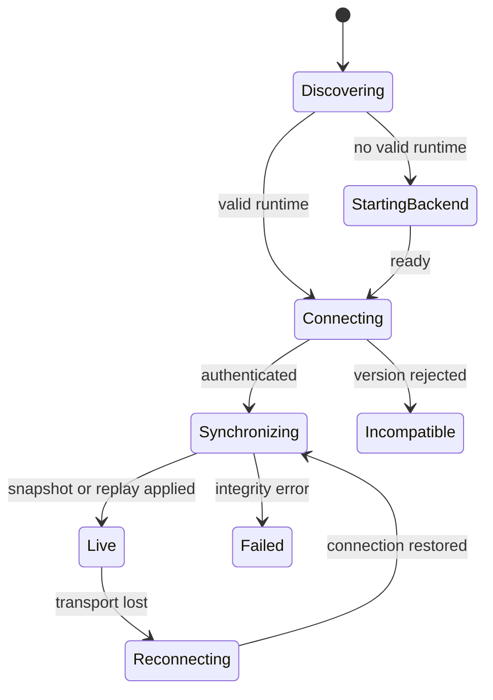

# CLI Resilience and Performance

> Normative improvements for startup, backend discovery, reconnect, replay,
> long sessions, backpressure, diagnostics, and measurable React Ink latency.

[CLI improvement index](README.md) | [Fast response pipeline](../cli-architecture/01-fast-response-pipeline.md) | [API and events](../runtime-srs/04-api-and-event-protocol.md)

## Principle

Fast UI is useful only when it remains correct after duplicate input, event
gaps, backend restart, slow terminals, long transcripts, and process failure.

The words **MUST**, **MUST NOT**, **SHOULD**, and **MAY** are normative here.

## Client-core boundary

```text
generated protocol types/validators
              |
       command construction
              |
    HTTP + WebSocket transport
              |
  snapshot/replay/live normalizer
              |
       pure projection reducer
              |
     selectors -> React Ink views
```

`CLI-RES-001`: The Ink package imports no provider SDK, graph, tool adapter,
permission evaluator, database repository, or backend secret.

`CLI-RES-002`: Replay events, live events, and restored snapshots reach one
validated reducer path. Views never mutate server-derived state directly.

`CLI-RES-003`: The reducer is pure for the same prior state and canonical
event. Time, randomness, terminal size, and network state are passed as
separate local inputs/selectors rather than hidden reducer dependencies.

## Startup state machine

**Question:** how does the CLI become live without showing stale state?



How to read it:

1. Discovery validates owner, address, PID, token source, and version before use.
2. Only a runtime owned/started by this client may be managed as its child.
3. Authentication precedes session metadata or event delivery.
4. `Live` begins only after a snapshot/replay high-water mark is committed.
5. Reconnect returns through synchronization rather than attaching live blindly.
6. Version incompatibility and data-integrity failure are explicit user states.

`CLI-RES-010`: Each startup phase has a timeout, stable error code, duration
metric, safe diagnostic, and retry/exit action.

`CLI-RES-011`: The launcher never kills a shared runtime merely because one
client exits. Ownership and runtime ID must match before restart/termination.

`CLI-RES-012`: A stale/invalid discovery file is quarantined/replaced only by
the process that proves ownership. Its token is never rendered or logged.

`CLI-RES-013`: `Incompatible` distinguishes client-too-old, server-too-old,
unsupported protocol major, missing required capability, and corrupt generated
schema package.

## Command lifecycle

1. Generate `command_id` and idempotency key before network I/O.
2. Keep the draft local while status is `submitting`.
3. Clear/archive the draft only after durable accepted status is received.
4. On timeout, query command status or retry the same identity.
5. Never create a new identity automatically for an ambiguous mutation.

`CLI-RES-020`: Submission timeout is not failure. The UI shows `outcome
unknown; checking` until the canonical command status is known.

`CLI-RES-021`: The client MUST NOT queue side-effecting runtime commands for
offline delivery. Only local drafts/view actions may exist while disconnected.

`CLI-RES-022`: A duplicate accepted command resolves to the existing status and
event cursor. It does not add a duplicate optimistic transcript row.

`CLI-RES-023`: Optimistic UI is limited to clearly provisional local state,
such as a pending prompt row. Canonical event projection replaces it by command
ID rather than appending a second row.

## Reconnect and replay algorithm

1. Freeze application of live events when transport breaks or a sequence gap
   appears.
2. Preserve local draft, focus, scroll anchor, expanded IDs, and view filters.
3. Authenticate a new connection and provide the last successfully reduced
   canonical sequence.
4. If contiguous replay is available, validate and reduce each event exactly
   once.
5. Otherwise fetch a bounded snapshot at sequence `S`, replace only
   server-derived projection, then apply events after `S`.
6. Start live delivery at the exact replay/snapshot high-water mark.
7. Reconcile optimistic commands by command ID/status.
8. Restore scroll by stable message/entity anchor, not raw row offset.

`CLI-RES-030`: The committed client cursor advances only after validation and
successful reduction. Receiving bytes is not application.

`CLI-RES-031`: Exact duplicate event IDs are idempotent. A sequence gap,
conflicting duplicate, unknown critical event, or invalid payload stops
application and requests recovery.

`CLI-RES-032`: An older snapshot never replaces newer committed projection.
Snapshot application records schema version, sequence, and projection digest.

`CLI-RES-033`: Local UI state survives server projection replacement only when
its referenced entities still exist. Stale expanded/focus IDs are pruned.

`CLI-RES-034`: Disconnect never implies run cancellation, permission denial,
or child shutdown.

## Long-session model

Do not keep an unbounded rendered transcript or every artifact byte in memory.

| Layer | Retained in client memory |
| --- | --- |
| Projection index | IDs, order, status, small summaries, pagination cursors. |
| Visible transcript | Window around viewport plus overscan and pinned active rows. |
| Active operations | Bounded current progress/tails keyed by stable ID. |
| Completed output | Bounded preview plus artifact ID; full bytes stay backend-side. |
| Historical pages | LRU cache with explicit item/byte ceiling. |
| Search results | Query-scoped IDs/snippets with cancellation and expiry. |

`CLI-RES-040`: Every client cache has item and byte limits returned by settings
or safe defaults. Eviction preserves canonical cursor and stable anchors.

`CLI-RES-041`: Snapshot and history are paginated/materialized so the first
useful screen can render before full history. Oversized content is an artifact.

`CLI-RES-042`: Completed progress tails are released after canonical outcome;
only bounded summaries/previews remain in the projection.

`CLI-RES-043`: Transcript compaction/replacement is a canonical event. The
client does not independently summarize or delete server conversation state.

## Backpressure

Client processing uses three queues:

| Queue | Content | Rule |
| --- | --- | --- |
| Critical | permissions, questions, terminal states, command results | Never drop; disconnect/resync before overflow corruption. |
| Coalescible | text/progress revisions for same entity | Keep latest compatible revision and coverage metadata. |
| Ephemeral | spinner/heartbeat/queue estimate | Drop safely under pressure. |

`CLI-RES-050`: Backpressure policy is keyed by event class and entity/revision,
not by arbitrary queue age.

`CLI-RES-051`: The renderer may lag/coalesce provisional display but the
reducer must preserve canonical sequence semantics.

`CLI-RES-052`: When queue/lag limits are exceeded, the client enters a visible
`resynchronizing` state instead of continuing with a known-broken projection.

## Performance objectives

These objectives align with the existing fast-response architecture. They are
initial TARGET budgets and must be measured on named profiles.

| Measurement | Initial local objective |
| --- | --- |
| Durable command acknowledgement | p95 under 100 ms excluding cold start/network |
| Accepted event visible after acknowledgement | p95 under 150 ms |
| Delta coalescing window | 20-50 ms under normal interactive load |
| Reducer plus affected render | p95 within one 16-33 ms frame for normal state |
| Active item repaint | At most 4-10 meaningful updates/second/item |
| Input echo while streaming | No visible dropped keystroke; p95 frame objective still holds |
| Snapshot/replay | First useful screen before complete history; measured byte/page budget |
| Cancel command feedback | Immediate local pending state; canonical acceptance follows command SLO |

`CLI-PERF-001`: Each latency span has one start/end definition, correlation ID,
and owner. Metrics do not mix cold start, backend queue, provider, and render
time into one unhelpful number.

`CLI-PERF-002`: No performance objective permits dropping canonical events,
skipping validation, widening permission, or hiding truncation.

`CLI-PERF-003`: Text delta batching is adaptive within configured bounds. Input,
permission, cancel, and terminal updates preempt decorative work.

## Benchmark profiles

Record results for at least:

| Profile | Purpose |
| --- | --- |
| Local baseline | Supported developer laptop, warm backend, standard terminal. |
| Local cold | Backend absent, cold process/module/schema/cache startup. |
| Constrained | Low CPU/memory and slow terminal output. |
| Long session | Large transcript, many completed tools/artifacts, active search. |
| Parallel activity | Model stream plus several read tools/children/progress events. |
| Remote latency | Server deployment with injected latency/jitter/disconnect. |
| Basic terminal | no color, ASCII, conservative cursor support. |
| Line/machine mode | high output volume without interactive rendering. |

Every benchmark report stores commit/build ID, protocol version, OS/runtime,
terminal/profile, hardware class, fixture seed, event counts/bytes, and p50/p95/
p99 or max where appropriate.

`CLI-PERF-010`: CI runs deterministic micro/fixture benchmarks with regression
thresholds. Scheduled/release testing runs the heavier hardware profile suite.

`CLI-PERF-011`: Measure startup phase durations, event lag, reducer duration,
render duration, input latency, resident memory, cache bytes, dropped/coalesced
provisional updates, replay rate, and resync count.

`CLI-PERF-012`: A performance regression waiver names the metric, baseline,
cause, user impact, owner, expiry, and follow-up. It cannot waive correctness.

## Render isolation requirements

`CLI-PERF-020`: Components subscribe through narrow selectors. A spinner tick
must not reparse/re-render the complete transcript.

`CLI-PERF-021`: Markdown parsing, syntax highlighting, diff calculation, and
large search preparation run outside the keystroke/render hot path and are
cancellable by entity revision.

`CLI-PERF-022`: Stable entity keys survive provisional-to-canonical settlement,
replay, and snapshot replacement so React does not remount entire histories.

`CLI-PERF-023`: Windowing preserves selection/copy behavior, scroll anchors,
expanded active rows, and accessibility/line-mode equivalence.

## Diagnostics and privacy

Minimum diagnostics:

- build/runtime/protocol versions and negotiated capabilities;
- safe backend discovery/readiness result;
- connection/replay cursor and gap/resync counters;
- terminal profile and layout mode;
- queue/event/render/reducer metrics;
- redacted recent stable errors and correlation IDs;
- sandbox/provider availability summaries received from backend.

`CLI-RES-060`: Diagnostics and support bundles exclude bearer tokens, model
keys, raw prompts/code/commands, unrestricted paths, artifact bytes, and hidden
graph state by default.

`CLI-RES-061`: Content-bearing diagnostics require explicit opt-in, show exact
categories/retention, and pass redaction before write/export.

`CLI-RES-062`: Exit codes are documented for success, user cancel, invalid
input, authentication, protocol incompatibility, backend unavailable, run
failure, and internal integrity failure.

## Fault scenarios

| Fault | Required client behavior |
| --- | --- |
| Backend starts slowly | Keep startup phase visible, bounded retry/cancel, no duplicate launch. |
| Discovery file is stale | Reject safely, diagnose, start only under ownership rules. |
| Ack response lost | Query/retry same command identity; never duplicate prompt/edit. |
| Socket drops mid-stream | Retain provisional view/draft, reconnect, replay/snapshot, settle canonical state. |
| Event gap/conflict | Stop reducer, resync, surface integrity status if recovery fails. |
| Snapshot too large | Render bounded first page/projection; fetch history lazily. |
| Terminal output blocks | Coalesce/drop provisional display and preserve control/critical capacity. |
| Render component throws | Error boundary retains command/control route; runtime continues. |
| Client process crashes | Backend run continues; next client rebuilds from durable state. |
| Version mismatch | No partial session attach; show exact upgrade/downgrade requirement. |

## Build order

1. Generated validators and golden protocol fixtures.
2. Pure reducer with replay/snapshot/live equivalence tests.
3. Discovery/launcher ownership and startup state machine.
4. Command idempotency/optimistic reconciliation.
5. Reconnect/gap/snapshot state machine.
6. Bounded caches, transcript windowing, and artifact previews.
7. Backpressure classes and resync fallback.
8. Instrumentation and deterministic benchmark fixtures.
9. Redacted diagnostics, support bundle, and fault-injection suite.

