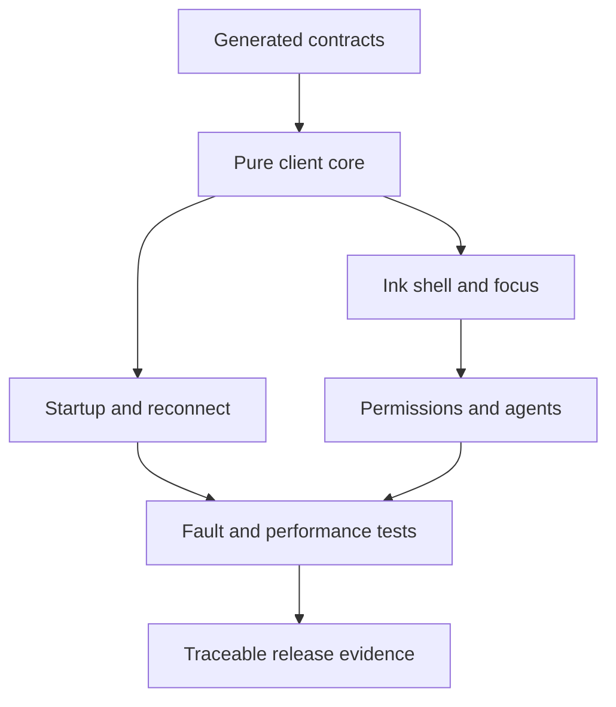

# CLI Traceability and Delivery

> A prioritized backlog and evidence model that turns the CLI architecture and
> improvement requirements into implementable, testable release gates.

[CLI improvement index](README.md) | [Delivery roadmap](../project-architecture/09-delivery-roadmap.md) | [Risk matrix](../execution-architecture/03-risk-and-test-matrix.md)

## Traceability rule

Every enabled release requirement needs:

1. one stable requirement ID;
2. priority and owner;
3. implementation component;
4. one or more test IDs;
5. CI/release job and latest result artifact;
6. documented waiver with owner/expiry when the requirement is not P0;
7. source/SRS revision used by the result.

P0 requirements cannot be waived for release. A checklist without test evidence
does not close a requirement.

## Machine-readable record

Add a generated/validated record when implementation begins:

```yaml
requirement_id: CLI-RES-031
priority: P0
title: Stop and recover on event gap
owner: client-core
implementation:
  - packages/client-core/replay.ts
tests:
  - CLI-T-REPLAY-003
ci_jobs:
  - cli-contract
  - cli-integration
status: passing
evidence_artifact: cli-evidence/replay-gap.json
spec_digest: sha256:...
```

Store records under `quality/traceability/cli/` or another package-neutral
quality directory. CI validates unknown IDs, duplicate IDs, missing P0 tests,
missing artifacts, stale spec digests, and expired waivers.

## Requirement coverage map

| Requirement range | Primary implementation | Required test suite |
| --- | --- | --- |
| `CLI-UX-001..005` | focus/overlay store and selectors | `CLI-T-FOCUS-*` |
| `CLI-UX-010..015` | central input dispatcher | `CLI-T-INPUT-*` |
| `CLI-UX-020..022` | composer and command queue | `CLI-T-STEER-*` |
| `CLI-UX-030..032` | terminal profile and output mode | `CLI-T-TERM-*` |
| `CLI-UX-040..043` | cell width, wrapping, sanitization, degradation | `CLI-T-RENDER-*`, `CLI-T-SECOUT-*` |
| `CLI-UX-050..053` | paste, mentions, local draft policy | `CLI-T-PASTE-*`, `CLI-T-DRAFT-*` |
| `CLI-UX-060..062` | permission/diff decision view | `CLI-T-PERM-*` |
| `CLI-UX-070..073` | activity/agent control views | `CLI-T-AGENT-*` |
| `CLI-UX-080..084` | accessibility and equivalent modes | `CLI-T-A11Y-*` |
| `CLI-RES-001..003` | generated client-core boundary and reducer | `CLI-T-BOUNDARY-*`, `CLI-T-REDUCER-*` |
| `CLI-RES-010..013` | discovery, launcher, compatibility state | `CLI-T-START-*`, `CLI-T-VERSION-*` |
| `CLI-RES-020..023` | command lifecycle/reconciliation | `CLI-T-COMMAND-*` |
| `CLI-RES-030..034` | replay/snapshot/reconnect | `CLI-T-REPLAY-*` |
| `CLI-RES-040..043` | pagination, caches, long sessions | `CLI-T-LONG-*` |
| `CLI-RES-050..052` | event backpressure and resync | `CLI-T-PRESSURE-*` |
| `CLI-RES-060..062` | diagnostics, support bundle, exit codes | `CLI-T-DIAG-*` |
| `CLI-PERF-001..003` | latency spans and adaptive batching | `CLI-T-LATENCY-*` |
| `CLI-PERF-010..012` | benchmark runner and governance | `CLI-T-BENCH-*` |
| `CLI-PERF-020..023` | selector/render/windowing isolation | `CLI-T-RENDERPERF-*` |

The range table is an index, not final evidence. The machine-readable record
must enumerate each individual requirement and concrete tests.

## P0 test catalog

| Test ID | Scenario | Pass condition |
| --- | --- | --- |
| `CLI-T-CONTRACT-001` | Generated schema compatibility | Python fixtures validate in generated TypeScript validators and round-trip stable fields. |
| `CLI-T-BOUNDARY-001` | Forbidden imports | Ink/client-core build fails if provider, graph, tool adapter, ORM, or backend secret modules enter client packages. |
| `CLI-T-REDUCER-001` | Deterministic reduction | Same snapshot/event sequence produces byte-equivalent normalized projection. |
| `CLI-T-REDUCER-002` | Replay/live equivalence | Full replay, snapshot plus suffix, and equivalent live delivery produce the same projection. |
| `CLI-T-REPLAY-003` | Event gap/conflict | Client stops application, resyncs, and never advances cursor over invalid input. |
| `CLI-T-REPLAY-004` | Disconnect semantics | Main/child work continues; reconnect displays canonical outcomes without duplicates. |
| `CLI-T-COMMAND-001` | Lost acknowledgement | Retrying same command identity creates one user message/run effect. |
| `CLI-T-COMMAND-002` | Ambiguous mutation | UI queries status and never generates a second mutation identity automatically. |
| `CLI-T-FOCUS-001` | Streaming while typing | Draft, cursor, selection, and focus stay unchanged under model/tool events. |
| `CLI-T-INPUT-001` | Key conflict | Exactly one deterministic handler consumes each event; diagnostics identify conflicts. |
| `CLI-T-INPUT-002` | Esc/Ctrl+C scopes | Overlay close, turn cancel, detach, child stop, and stop-all never widen into each other. |
| `CLI-T-STEER-001` | Mid-turn message | Displayed delivery mode equals accepted command and applies once at a safe boundary. |
| `CLI-T-PASTE-001` | Malicious bracketed paste | Newlines/escapes insert inert bounded text and never submit/approve/execute. |
| `CLI-T-SECOUT-001` | Terminal escape injection | Tool/model text cannot alter title, clipboard, hyperlink target, prompt, or previous rows. |
| `CLI-T-RENDER-001` | Grapheme/wide text | Wrapping/truncation preserves graphemes and exact terminal cell bounds. |
| `CLI-T-TERM-001` | Non-TTY/line output | No cursor escapes/spinners on stdout; semantic output and exit code are deterministic. |
| `CLI-T-PERM-001` | Stale approval | Old revision/hash is rejected and current normalized decision is rendered. |
| `CLI-T-PERM-002` | Permission keyboard flow | No key outside explicit labelled action resolves the request. |
| `CLI-T-AGENT-001` | Stop-one/stop-all | Exact scoped IDs and per-child outcomes remain visible through completion races. |
| `CLI-T-AGENT-002` | Child status authenticity | Only canonical events alter child state/progress; child/model prose cannot. |
| `CLI-T-A11Y-001` | No-color/ASCII/line equivalence | Every critical state/action/outcome remains understandable and operable. |
| `CLI-T-DIAG-001` | Secret canary | Tokens/prompts/code/paths do not enter default logs, traces, metrics, or support bundle. |

## Recommended test tree

```text
packages/client-core/test/
  contracts/              # generated schema and golden fixtures
  reducer/                # events, snapshots, property/replay equivalence
  commands/               # identities, retries, reconciliation
  transport/              # reconnect, heartbeat, auth, compatibility

packages/ink-cli/test/
  focus/                  # region/overlay state machine
  input/                  # keys, chords, paste, signals
  render/                 # widths, graphemes, sanitization, golden frames
  permissions/            # decision/stale revision/compact mode
  agents/                 # status, message, stop scopes
  accessibility/          # keyboard, no-color, ASCII, line mode
  performance/            # selector, render, long-session benchmarks
  e2e/                    # fake backend and process lifecycle

quality/
  fixtures/protocol/
  fixtures/events/
  fixtures/terminal/
  traceability/cli/
  evidence/               # generated/ignored locally, retained by CI
```

## Prioritized delivery backlog

### P0: contract and correctness foundation

| Epic | Deliverables | Exit gate |
| --- | --- | --- |
| C0 Protocol generation | Pydantic schemas, OpenAPI/event JSON Schema, generated TS types/validators, golden fixtures | `CLI-T-CONTRACT-001` passes in Python and TypeScript CI. |
| C1 Pure client core | commands, transport interfaces, snapshot/replay, reducer, selectors | Determinism and replay/live equivalence pass. |
| C2 Startup/reconnect | discovery ownership, launcher states, capability negotiation, gap recovery | Fault tests cover stale file, lost ack, disconnect, old snapshot, incompatible version. |
| C3 Terminal safety | profile detection, cell width, sanitization, line/JSONL modes | Conformance fixtures pass across supported terminal profiles. |
| C4 Interaction safety | focus stack, central dispatcher, composer/paste, Esc/Ctrl+C scope | Input/focus/paste tests pass under streaming and permissions. |
| C5 Permission/edit UX | normalized action, diff/artifacts, revision/hash decision | Stale and keyboard-only approval tests pass. |
| C6 Traceability | per-ID records, CI validator, evidence artifacts | Every P0 `CLI-*` requirement is mapped and passing. |

### P1: beta quality

| Epic | Deliverables | Exit gate |
| --- | --- | --- |
| C7 Long sessions | pagination, windowing, cache limits, scroll anchors, search | Memory/render limits pass on long-session fixture. |
| C8 Performance | instrumentation, benchmark runner, hardware profiles, regression policy | p95 targets measured; no correctness tradeoff. |
| C9 Multi-agent UX | hierarchy, recipient/receipt, stop scopes, budget/risk summaries | Usability and race tests pass before batch agents are default-visible. |
| C10 Diagnostics | redacted logs, `/doctor`, support bundle, exit codes | Secret canaries absent; operator can diagnose each startup/reconnect failure class. |
| C11 Accessibility | no-color/high-contrast/ASCII/reduced-motion/line modes, keyboard study | Critical workflows pass automated/golden and documented user testing. |
| C12 Multi-client lease | observer/controller display, takeover, stale decision recovery | CLI/VS Code race fixtures produce one controller/decision. |

### P2: post-beta enhancement

- user theme packs after semantic contrast gates;
- optional mouse navigation without keyboard dependency;
- advanced keymap/vim profiles with conflict diagnostics;
- localized UI only after stable machine/error codes;
- richer artifact viewers after safe basic open/search/export;
- adaptive layout personalization based on measured user behavior;
- optional persisted drafts after security/retention ADR and user control.

## Architecture decision records

Create short ADRs before implementation diverges:

| ADR | Decision |
| --- | --- |
| ADR-001 | FastAPI is authoritative; clients contain no model/tool policy. |
| ADR-002 | Pydantic generates protocol schemas and TypeScript validators. |
| ADR-003 | Domain events, not raw LangGraph streams, cross the client boundary. |
| ADR-004 | Application database and graph checkpointer have distinct authority. |
| ADR-005 | React Ink uses one external projection store and pure reducer. |
| ADR-006 | Terminal width/sanitization library and supported terminal profiles. |
| ADR-007 | Client draft persistence default, protection, scope, and retention. |
| ADR-008 | Concrete Python sandbox provider and conformance result. |
| ADR-009 | Backend process ownership, sharing, restart, and update policy. |
| ADR-010 | Supported protocol compatibility and client update window. |

## Delivery sequence

**Question:** what can be built in parallel without forking semantics?



How to read it:

1. Protocol fixtures unblock backend and client-core work.
2. Reducer semantics must stabilize before complex views.
3. Transport recovery and Ink presentation can then proceed in parallel.
4. Permissions/agents depend on deterministic input/focus behavior.
5. Fault/performance testing uses the same fake-backend fixtures.
6. Release evidence is generated from passing requirements, not manually claimed.

## Definition of ready

A CLI backlog item is ready only when it has:

- requirement ID and priority;
- user-visible outcome and non-goals;
- protocol/event dependencies;
- failure, reconnect, cancellation, and accessibility behavior where relevant;
- test IDs/fixtures and measurable pass condition;
- security/privacy review for input/output/content-bearing behavior.

## Definition of done

An item is done only when:

1. generated contracts and type checks pass;
2. unit/contract/integration tests mapped to the requirement pass;
3. canonical and degraded terminal modes retain the required meaning;
4. duplicate/reconnect/fault paths are tested where stateful;
5. no secret/terminal-injection regression appears;
6. performance evidence is attached for hot-path changes;
7. documentation/ADR and traceability record match implementation;
8. CI retains the result/evidence artifact under policy.

## Release gates

The CLI release is blocked unless:

- every P0 requirement has passing current-build evidence;
- generated protocol compatibility passes against the backend version range;
- replay/live/snapshot equivalence and sequence-gap recovery pass;
- terminal sanitization, grapheme width, paste, and signal-scope tests pass;
- permissions cannot be accepted by ambiguous input or stale revision;
- no-color/ASCII/line/machine modes preserve critical semantics;
- secret canaries are absent from all unauthorized sinks;
- latency/memory results are recorded for required profiles;
- known P1 waivers have owner, reason, user impact, and expiry;
- rollback/update compatibility is documented and tested.

