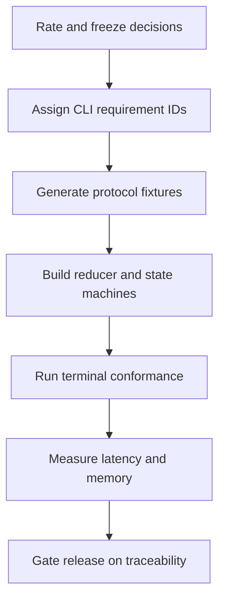

# CLI Improvement Program

> An implementation-readiness review and prioritized improvement contract for
> the React Ink client. This folder does not replace the existing architecture;
> it turns its remaining gaps into measurable work.

[Docs start page](../README.md) | [CLI architecture](../cli-architecture/README.md) | [Diagram standard](../diagram-standard.md)

## Verdict

The architecture is strong enough to implement. Do not redesign its central
ownership model. Improve the path from specification to executable proof.

| Area | Rating | Assessment |
| --- | ---: | --- |
| Overall target architecture | **8.9/10** | Excellent boundaries, safety, durability, and model-loop control; deployment choices remain intentionally open. |
| Runtime and agent SRS | **8.7/10** | Broad, precise, source-linked, and unusually detailed; test traceability and generated contracts are not yet executable. |
| React Ink CLI specification | **8.2/10** | Strong interaction direction and reducer boundary; terminal edge cases and normative acceptance IDs need expansion. |
| Documentation usability | **9.1/10** | Indexed, status-labelled, and readable without oversized diagrams. |
| Implementation readiness | **7.0/10** | The design is ready, but this snapshot has no target applications, manifests, generated schemas, or checked-in tests. |

These are architecture/document ratings, not ratings of a working FastAPI/Ink
product. The target implementation is not present in this repository snapshot.

## Rating scale

| Score | Meaning |
| ---: | --- |
| 9.0-10.0 | Implementation-ready with only local decisions or polish remaining. |
| 8.0-8.9 | Strong design; a few cross-cutting contracts must be closed before release. |
| 7.0-7.9 | Viable but important behavior remains ambiguous or untested. |
| 5.0-6.9 | Major design/test gaps make implementation risky. |
| Below 5.0 | Redesign is required before implementation. |

## Why the rating is high

The existing documents make several difficult decisions correctly:

1. FastAPI owns runtime truth; React Ink and VS Code are protocol clients.
2. Model output reaches effects only through strict validation, central policy,
   durable tool records, and bounded execution.
3. The LangGraph loop completes from model/tool facts, with explicit budgets and
   no-progress guards instead of one unexplained fixed loop count.
4. Commands, permissions, events, artifacts, checkpoints, and child runs have
   restart-aware identities.
5. Current TypeScript behavior is separated from target Python design.
6. Memory, skills, sandboxing, multi-agent control, and artifact history have
   dedicated safety contracts rather than being hidden utility features.

## Why it is not a 10

The main remaining gaps are implementation proof:

- The runtime/agent documents contain 302 unique requirement IDs, but the CLI
  layer previously had no equivalent `CLI-*` requirement family.
- Normative requirements are not yet linked to concrete test IDs and CI jobs.
- Pydantic/OpenAPI/event schemas are documented but not generated as build
  artifacts in this snapshot.
- CLI focus, overlay, paste, signal, reconnect, and terminal-capability behavior
  needs one explicit state contract.
- Latency and render objectives need a benchmark harness and hardware profiles.
- Snapshot/replay size, transcript memory, and long-session limits are
  configurable but do not yet have measured default values.
- Windows/ConPTY, tmux/screen, grapheme width, bracketed paste, and non-TTY
  conformance need explicit fixtures.
- Architecture decisions need short ADRs so later implementation changes do not
  silently contradict the SRS.

## Improvement path

**Question:** how do we move from strong prose to a release-proven CLI?

How to read it:

1. Keep the current ownership/safety architecture and record remaining decisions.
2. Give every release-blocking CLI behavior a stable requirement identity.
3. Generate client contracts and replay fixtures before building presentation.
4. Implement deterministic reducers and explicit interaction/reconnect states.
5. Test terminal capabilities, input, accessibility, and degraded modes.
6. Replace guessed performance limits with measured profiles.
7. Ship only when every P0 requirement has passing evidence.

## Documents

| Document | Purpose |
| --- | --- |
| [01 - Architecture and SRS Assessment](01-architecture-and-srs-assessment.md) | Detailed scores, strengths, findings, and what should not be redesigned. |
| [02 - CLI UX and Terminal Contract](02-cli-ux-and-terminal-contract.md) | Focus, input, terminal profiles, rendering, accessibility, permissions, and agent-control UX. |
| [03 - Resilience and Performance](03-cli-resilience-and-performance.md) | Startup, reconnect, replay, backpressure, memory limits, SLOs, diagnostics, and benchmarks. |
| [04 - Traceability and Delivery](04-traceability-and-delivery.md) | Prioritized backlog, requirement-to-test matrix, implementation order, and release gates. |

## Priority summary

| Priority | Improvement | Release consequence |
| --- | --- | --- |
| P0 | Generated protocol package and replay fixtures | Do not build stateful views without it. |
| P0 | Pure reducer plus reconnect equivalence tests | Do not claim recovery without it. |
| P0 | Explicit focus/input/cancel state machine | Do not ship approvals or live steering without it. |
| P0 | CLI requirement-to-test traceability | Do not call the CLI SRS complete without it. |
| P0 | Terminal conformance and output sanitization | Do not run untrusted tool output in interactive views without it. |
| P1 | Performance, memory, and long-session benchmark suite | Required before broad beta. |
| P1 | Multi-client lease and multi-agent control usability tests | Required before exposing teams/agent batches. |
| P1 | Redacted diagnostics/support bundle | Required before production support. |
| P2 | Theme packs, optional mouse support, and advanced personalization | Add only after core keyboard and line modes are reliable. |

## Ownership

This folder is a backlog and acceptance layer:

- `runtime-srs/` remains authoritative for backend protocol and policy.
- `agent-architecture/` remains authoritative for graph behavior.
- `cli-architecture/` remains authoritative for client architecture.
- `cli-improvements/` identifies gaps, adds CLI-specific requirements, and
  defines the evidence needed to close them.

If an improvement changes backend semantics, update the owning SRS first. The
CLI must not create a local workaround that forks runtime behavior.

