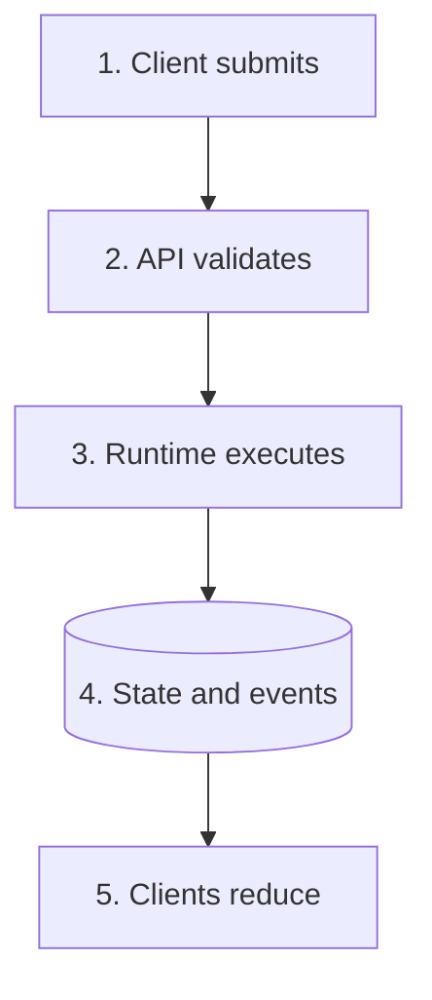
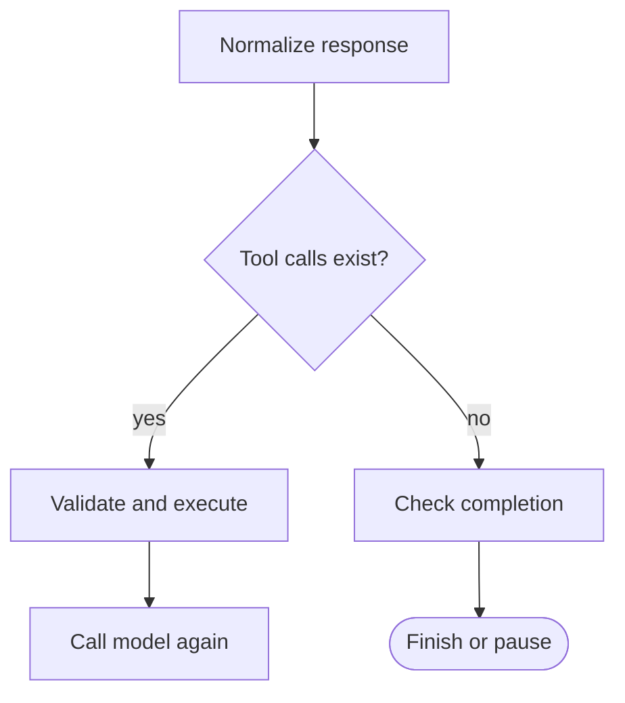
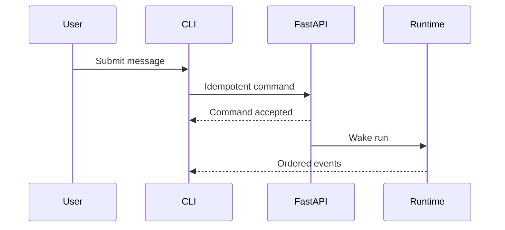
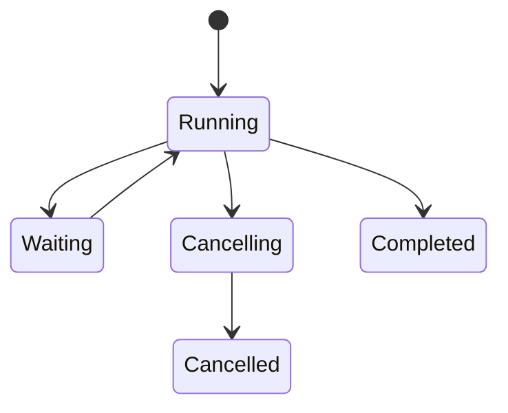

# Readable Diagram Standard

> A small visual language for architecture documents that remain usable in VS
> Code preview, GitHub, narrow terminals, and exported Markdown.

## Why graphs became difficult

A single architecture graph often tries to show ownership, runtime order,
failure recovery, persistence, clients, and security at once. Mermaid then
creates a very wide or tall canvas, and readers must zoom before they know what
the graph is trying to answer.

The fix is not a better zoom control. The fix is progressive disclosure:

1. one overview for ownership;
2. one flow for the happy path;
3. separate flows for pause, retry, cancel, and recovery;
4. a table for contracts and edge cases;
5. source links for evidence.

## Diagram contract

Every new or rewritten graph MUST satisfy these rules:

| Rule | Standard |
| --- | --- |
| Question | State the one question immediately before the graph. |
| Size | Prefer 4-8 visible nodes; split a graph before 10 nodes. |
| Direction | Use `flowchart TD` by default; use `LR` only for a short pipeline. |
| Labels | Use action phrases under 32 characters; move details into prose. |
| Decisions | Prefer one decision per graph and label every outgoing edge. |
| Identity | Number sequential nodes when order is the point. |
| Status | Put `CURRENT`, `TARGET`, or `GAP` in the caption/prose, not color alone. |
| Explanation | Follow with numbered steps matching the nodes. |
| Failure | Put failure/recovery in its own graph unless it is the graph's question. |
| Canonical truth | Schemas, invariants, and prose remain authoritative. |

## Shape language

Use shape consistently so the graph still works without color:

| Shape | Mermaid form | Meaning |
| --- | --- | --- |
| Rounded terminal | `([Start or stop])` | Entry or terminal state |
| Rectangle | `[Action]` | Deterministic work or service call |
| Diamond | `{Decision?}` | Deterministic route with labeled edges |
| Cylinder | `[(Durable store)]` | SQL, object store, or checkpoint store |
| Subgraph | `subgraph Name` | Ownership boundary, not decoration |

Do not encode critical meaning only with red/green, line thickness, animation,
or icons. Renderers and accessibility settings vary.

## Good overview pattern

Question: who owns a command from submission to display?



How to read it:

1. A client sends a command with an idempotency key.
2. The API authenticates and validates but does not run the agent itself.
3. The runtime owns graph and tool execution.
4. State and events commit durably.
5. clients render replay and live events through the same reducer.

## Good decision pattern

Question: what should happen after a model response?



The graph intentionally omits permission details, retries, and persistence.
Those deserve separate diagrams because they answer different questions.

## Sequence diagrams

Sequence diagrams are useful only when ownership and message order matter.
Keep them to at most five participants and one primary outcome. Split normal,
reconnect, and cancellation paths.



## State diagrams

Do not put every backend enum into one state diagram. Show the product states in
the graph and provide the full transition table below it.



## Graph explanation template

Use this structure around every important graph:

```markdown
### Flow name

**Question:** What decision does this graph explain?

<!-- Small Mermaid graph -->

**How to read it**

1. Explain node 1 and its owner.
2. Explain the decision and evidence.
3. Explain durable data written before the next step.

**Build contract**

| Input | Output | Failure | Idempotency |
| --- | --- | --- | --- |
| ... | ... | ... | ... |

**Repository evidence**

| Status | Source | Reused behavior |
| --- | --- | --- |
| CURRENT | `path/to/source.ts` | ... |
| TARGET | `backend/package.py` | ... |
```

## Reader-friendly page structure

Long SRS pages should use this order:

1. Outcome: what the reader can implement after reading.
2. Status and evidence: current, target, and gaps.
3. Small overview graph and explanation.
4. Contracts and invariants.
5. Normal flow.
6. Failure and recovery flows.
7. Data model or protocol examples.
8. Scenarios and tests.
9. Build checklist.
10. Source index.

Use tables for comparisons and contracts. Use code blocks for exact schemas or
directory trees. Use prose for rationale. A graph is not a substitute for any
of them.

## Review checklist

Before merging a documentation change, verify:

- the graph is readable at default preview size;
- labels do not contain paragraphs, paths, or JSON;
- every edge leaving a decision is labeled;
- the prose explains ownership and durable writes;
- current behavior has a source link;
- target behavior is not presented as already implemented;
- failure, cancellation, and replay are covered outside the happy path;
- relative links resolve from the document location;
- Mermaid fences close and use supported syntax.

