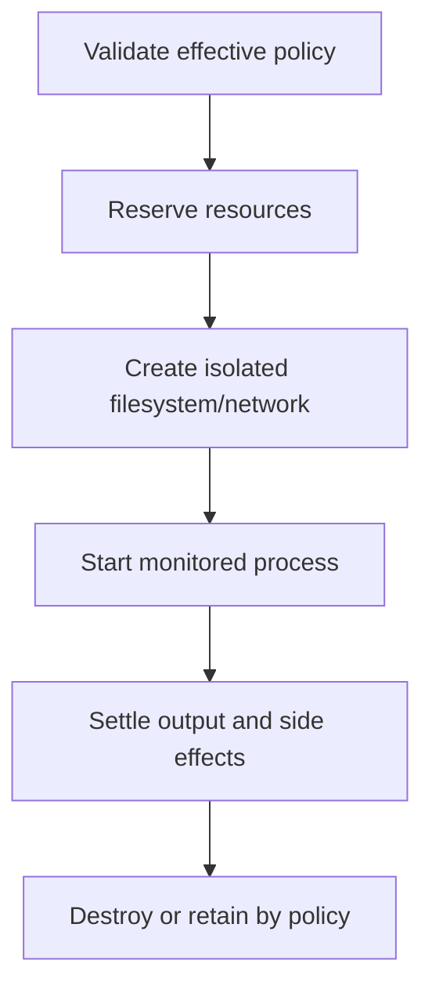
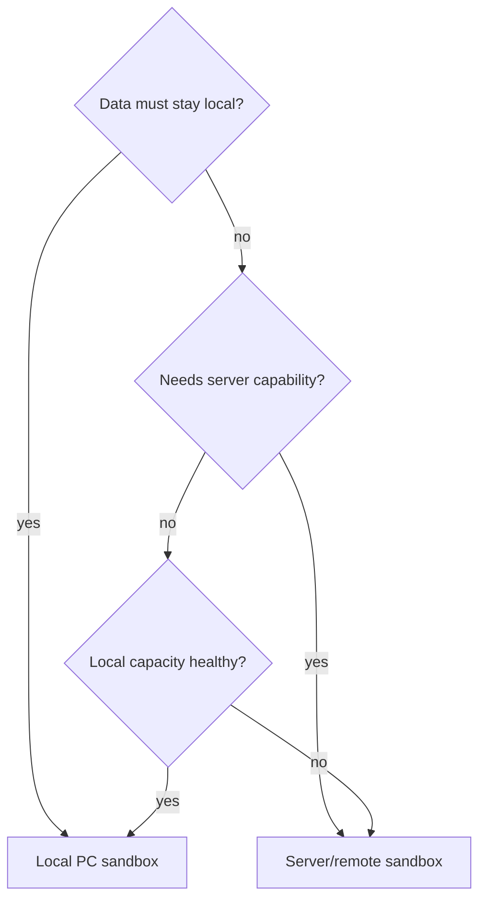

# Sandbox and Resource Architecture

> A provider-neutral Python design for running tools on the user's PC or server
> resources while preserving the repository's current sandbox policy behavior.

[Execution architecture index](README.md) | [Docs start page](../README.md) | [Diagram standard](../diagram-standard.md)

## Current sandbox evidence

[`sandbox-adapter.ts`](../../utils/sandbox/sandbox-adapter.ts) wraps an external
sandbox runtime and converts application settings into enforceable policy.

Current behavior includes:

- macOS, Linux, and WSL2 platform support checks through the runtime;
- dependency checks and a human-readable unavailable reason;
- optional `failIfUnavailable` startup refusal;
- filesystem allow-read/deny-read/allow-write/deny-write lists;
- network allowed/denied domains, Unix socket, local bind, and proxy settings;
- managed-domain-only and managed-read-path-only policy;
- dynamic config refresh when settings change;
- write denial for settings and auto-discovered skill directories;
- git worktree handling and cleanup of planted bare-repository control files;
- network access questions through local UI or worker-to-leader mailbox;
- post-command sandbox cleanup.

[`shouldUseSandbox.ts`](../../tools/BashTool/shouldUseSandbox.ts) also makes clear
that excluded commands are a convenience, not the security boundary. The real
boundary remains permission plus sandbox policy.

## Python provider contract

The target can use any ready Python sandbox or remote sandbox service that can
meet this contract. Keep vendor/library details inside adapters.

```python
class SandboxProvider(Protocol):
    provider_id: str

    async def check(self) -> "SandboxHealth": ...

    async def create(
        self,
        spec: "SandboxSpec",
        lease: "ResourceLease",
    ) -> "SandboxHandle": ...

    async def execute(
        self,
        handle: "SandboxHandle",
        request: "ExecutionRequest",
        sink: "OutputSink",
    ) -> "ExecutionOutcome": ...

    async def cancel(self, operation_id: UUID, grace_ms: int) -> None: ...

    async def destroy(self, handle: "SandboxHandle") -> None: ...
```

Do not let tool adapters call a provider library directly. The central
execution service adds policy, leases, artifact sinks, cancellation, audit, and
side-effect classification around every provider.

## Sandbox specification

```python
class SandboxSpec(BaseModel):
    model_config = ConfigDict(extra="forbid")

    sandbox_id: UUID
    workspace_id: UUID
    run_id: UUID
    provider_profile: str
    root_mode: Literal["read_only", "workspace_write", "isolated_copy"]
    working_directory: str
    read_paths: list[str]
    write_paths: list[str]
    deny_read_paths: list[str]
    deny_write_paths: list[str]
    network_mode: Literal["none", "allowlist", "proxy", "full"]
    allowed_hosts: list[str]
    denied_hosts: list[str]
    allow_local_bind: bool = False
    allow_unix_sockets: list[str] = Field(default_factory=list)
    environment_keys: list[str] = Field(default_factory=list)
    secret_handles: list[UUID] = Field(default_factory=list)
    image_or_runtime: str
```

Paths are normalized server-side against registered workspace roots. API users
cannot submit arbitrary host mount paths. Secret handles resolve inside the
provider and never become event/log values. `provider_profile` and
`image_or_runtime` resolve through deployment-owned allowlists; model/client
input cannot select an arbitrary host image. `full` network remains unavailable
unless effective managed policy and an explicit approval both permit it.

## Lifecycle

**Question:** how does an execution become safe before process start?



How to read it:

1. Merge deployment, workspace, parent, tool, user approval, and sandbox policy.
2. Scheduler creates a lease before CPU/memory/process capacity is consumed.
3. Provider mounts only approved paths and applies network/process boundaries.
4. Worker monitors wall time, heartbeat, process tree, output bytes, and cancellation.
5. Artifacts and exact outcome commit before the graph receives completion.
6. Ephemeral sandbox is removed; retained worktree/artifacts follow explicit policy.

## Resource request

```python
class ResourceRequest(BaseModel):
    model_config = ConfigDict(extra="forbid")

    cpu_millis: int = Field(default=1000, ge=100, le=64_000)
    memory_mb: int = Field(default=1024, ge=64, le=262_144)
    disk_mb: int = Field(default=2048, ge=16)
    max_processes: int = Field(default=64, ge=1, le=4096)
    wall_time_seconds: int = Field(default=600, ge=1, le=86_400)
    idle_time_seconds: int = Field(default=120, ge=1)
    max_output_bytes: int = Field(default=50_000_000, ge=1)
    gpu_count: int = Field(default=0, ge=0)
    placement: Literal["auto", "local", "server", "remote_isolated"] = "auto"
    data_classification: Literal["local_only", "workspace", "remote_allowed"]
```

Profiles provide safe defaults and hard maxima. The model can request a named
profile or bounded values; policy and scheduler decide the actual lease.

## Resource lease

```python
@dataclass(frozen=True, slots=True)
class ResourceLease:
    lease_id: UUID
    placement_id: str
    cpu_millis: int
    memory_mb: int
    disk_mb: int
    max_processes: int
    expires_at_monotonic: float
    fencing_token: int
```

The persisted lease row also contains status, owner operation, heartbeat,
timestamps, and release reason. The fencing token prevents a recovered worker
from accepting output from an expired predecessor.

## Local PC versus server placement

**Question:** where should an admitted tool run?



Hard placement filters come before scoring:

| Filter | Effect |
| --- | --- |
| `local_only` data or unsynced workspace | Local worker only. |
| Required GPU/image/toolchain absent locally | Compatible server only if data policy allows. |
| Untrusted high-risk command | Isolated provider required; shared host process denied. |
| Secrets bound to one environment | Placement with that secret broker only. |
| Workspace write without isolated copy | Placement that owns authoritative workspace lock. |

After filters, score candidates by queue wait, estimated runtime, data transfer,
capacity headroom, cost, sandbox strength, warm image/cache, and failure rate.

The reason is stored as deterministic placement facts. Do not ask the model to
invent why a worker was selected.

## Admission and fairness

Apply hierarchical quotas:

```text
deployment
  -> tenant/user
    -> workspace/session
      -> root run
        -> child run
          -> tool operation
```

Admission checks:

- active model/tool/child counts;
- CPU, memory, disk, process, GPU, and output reservations;
- token and monetary budgets;
- workspace mutation locks;
- provider queue saturation and health;
- parent-child depth and fan-out;
- per-tool rate limits and external API quotas.

Use weighted fair queues so one agent tree cannot starve interactive commands.
Reserve a small control-plane pool for cancel, permission, heartbeat, and cleanup
operations even when execution capacity is saturated.

## Filesystem policy

Minimum controls:

- workspace root is a normalized immutable identifier, not arbitrary user path;
- read-only base image/runtime;
- explicit read/write mounts and deny-overrides-allow precedence;
- deny settings, hooks, skills, agent definitions, credentials, SSH/cloud config;
- prevent symlink/hardlink traversal and time-of-check/time-of-use mount swaps;
- use isolated copy/worktree for parallel writers;
- use precondition hashes and atomic replacement for file tools;
- no host Docker socket or unrestricted Unix socket by default;
- post-command scan/cleanup for policy-control files.

The current adapter's explicit denial of `.claude/skills` and settings files is
important: sandboxed commands must not rewrite future runtime policy.

## Network policy

Default to `none` or allowlist. When a new host is requested:

1. normalize host/port/protocol and reject credentials/ambiguous forms;
2. evaluate managed deny/allow policy;
3. pause with a durable permission request if user decision is allowed;
4. bind approval to sandbox/run/host pattern/expiry;
5. refresh provider policy before retrying the connection;
6. log safe host pattern and decision, never auth material;
7. expire/revoke on sandbox destruction or policy change.

Worker requests route to the parent/leader approval service as current
[`permissionSync.ts`](../../utils/swarm/permissionSync.ts) and mailbox messages
demonstrate. A disconnected client does not imply approval.

## Cancellation and process control

- Launch every local operation in a controllable process group/job object.
- Send cooperative signal first, then terminate/kill after grace policy.
- Continue draining bounded output during shutdown.
- Kill descendants, not only the shell parent.
- Remote providers use idempotent operation cancellation and status polling/events.
- On unconfirmed termination, mark `side_effect_unknown` and quarantine the sandbox.
- Release resource lease only after provider cleanup or lease expiry fencing.

## Fail closed

Production/high-risk profiles should set the equivalent of current
`failIfUnavailable`: if sandbox health/dependencies cannot enforce requested
policy, reject execution. Development may allow an explicit, visible,
permission-gated unsandboxed profile; it must not be an invisible fallback.

## Tests

1. Missing sandbox dependency produces startup/operation failure under required profile.
2. Child process cannot read/write every denied path and cannot change skill/settings files.
3. Symlink and race attempts cannot escape mounts.
4. Network DNS/IP/redirect/rebinding paths cannot bypass host policy.
5. Process fork bomb, memory allocation, disk fill, output flood, idle hang, and timeout hit limits.
6. Cancellation kills descendants and settles one outcome.
7. Expired worker output is rejected by fencing token.
8. Local-only data never receives server placement.
9. Saturated child tree cannot starve cancel/permission control capacity.
10. Sandbox creation/cleanup failure leaves an auditable quarantined state.

## Build checklist

- [ ] Fake provider and provider conformance suite.
- [ ] Chosen Python/local provider adapter and health diagnostics.
- [ ] Effective policy compiler.
- [ ] Resource profiles, leases, heartbeat, and fencing.
- [ ] Local/server placement filters and reason events.
- [ ] Process tree, timeout, output, and cancellation enforcement.
- [ ] Durable network permission lifecycle.
- [ ] Workspace lock and isolated writer modes.
- [ ] Sandbox escape/resource exhaustion adversarial suite.
