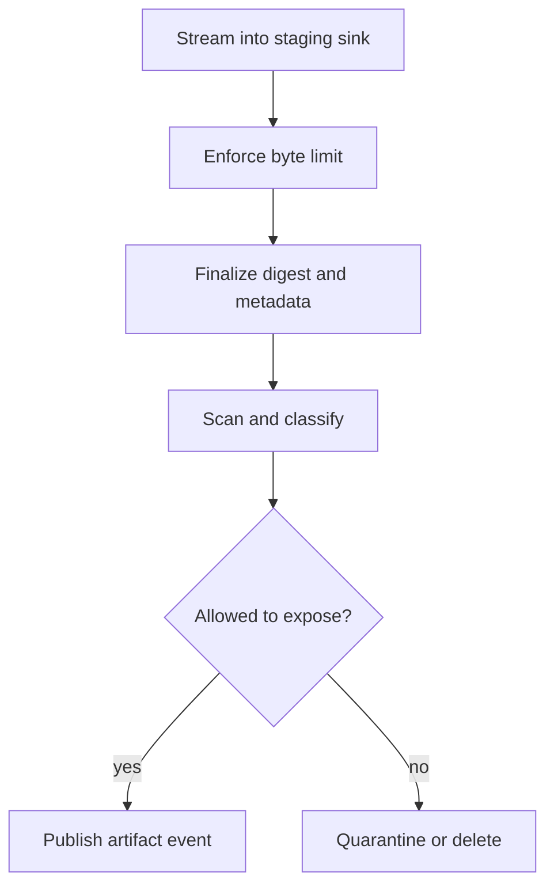
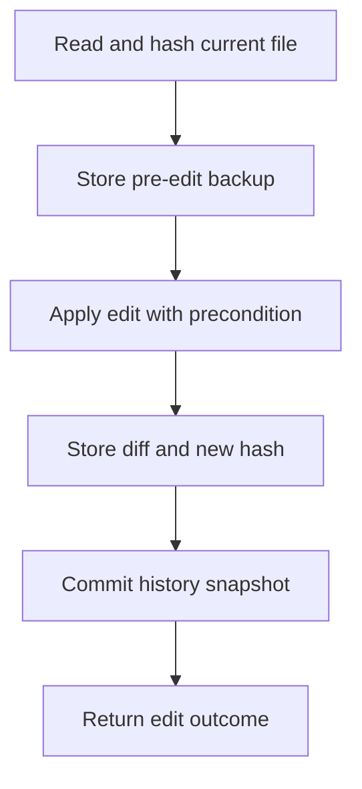

# Artifacts and Project History

> Preserve full tool output, binary data, diffs, checkpoints, child results, and
> test evidence without flooding model context or losing recovery history.

[Execution architecture index](README.md) | [Docs start page](../README.md) | [Diagram standard](../diagram-standard.md)

## Current repository evidence

### Large tool output

[`toolResultStorage.ts`](../../utils/toolResultStorage.ts):

- persists oversized tool results under the session's `tool-results/` directory;
- writes once by tool-use ID using exclusive creation;
- returns a bounded preview and explicit full-output path;
- leaves image content in the provider-compatible message path;
- injects a non-empty completion marker for otherwise empty tool results.

[`mcpOutputStorage.ts`](../../utils/mcpOutputStorage.ts):

- maps known MIME types to safe extensions;
- writes binary bytes without stringification;
- distinguishes text-like from binary content types;
- reports type/size/path without embedding the binary in context.

### File history

[`fileHistory.ts`](../../utils/fileHistory.ts):

- captures a pre-edit backup before mutation;
- versions backups and tracks missing/deleted files;
- creates per-message snapshots and caps in-memory snapshots at 100;
- avoids overwriting a first backup during repeated tracking;
- computes diff stats and rewinds to a prior snapshot;
- records snapshots into session storage for resume;
- notifies VS Code when snapshot files change.

### Session history

[`sessionStorage.ts`](../../utils/sessionStorage.ts) writes append-oriented JSONL
entries for messages, queue operations, file-history snapshots, metadata, and
content replacement. Ephemeral progress is deliberately excluded from the
durable parent chain because it previously created broken resume forks.

These behaviors become first-class backend records in the target.

## Artifact model

```python
class ArtifactManifest(BaseModel):
    model_config = ConfigDict(extra="forbid")

    artifact_id: UUID
    workspace_id: UUID
    session_id: UUID
    owner_run_id: UUID
    producer_operation_id: UUID
    kind: Literal[
        "tool_output", "stdout", "stderr", "binary", "diff", "file_backup",
        "test_report", "child_result", "checkpoint_export", "support_bundle"
    ]
    media_type: str
    byte_size: int = Field(ge=0)
    digest_sha256: str
    storage_class: Literal["inline", "local", "object", "restricted"]
    sensitivity: Literal["normal", "restricted", "secret"]
    status: Literal["staging", "available", "quarantined", "deleted"]
    retention_policy_id: str
    created_at: datetime
    expires_at: datetime | None
    schema_name: str | None = None
    schema_version: str | None = None
```

Internal storage locators are not sent as public capabilities. Clients receive
artifact IDs and authorized actions; content endpoints reauthorize every read.

## Artifact lifecycle

**Question:** when does output become a trustworthy artifact?



How to read it:

1. Tool output streams to a bounded sink while a small tail feeds progress.
2. On limit, stop/trim according to tool policy and record truncation.
3. Close bytes, compute digest, media type, size, and producer lineage.
4. Run secret/malware/schema checks appropriate to kind.
5. Policy decides model, user, client, export, and retention visibility separately.
6. Canonical events reference immutable manifest revision/digest.

## Suggested storage layout

For local development:

```text
.agent-runtime/
  sessions/<session-id>/
    events.jsonl                  # optional local export, DB remains canonical target
    artifacts/
      sha256/ab/cd/<digest>
    manifests/<artifact-id>.json
    file-history/
      <path-hash>@v1
      <path-hash>@v2
    sandboxes/<sandbox-id>/
```

For server deployment, SQL owns manifests/relationships and object storage owns
bytes by digest. Staging uses a separate prefix with lifecycle cleanup.

## What the model receives

Never put the full artifact into model context by default. Return:

```json
{
  "content": "pytest produced 18.4 MB. Preview: 2 failures in auth refresh tests.",
  "is_error": true,
  "artifacts": [
    {
      "artifact_id": "018f...",
      "kind": "test_report",
      "media_type": "text/plain",
      "byte_size": 19293721,
      "digest_sha256": "8bb0...",
      "truncated_in_context": true
    }
  ],
  "side_effect": "none"
}
```

The model can request bounded ranges/search/query through permission-checked
artifact tools. Structured artifacts should support schema-aware queries rather
than requiring a complete reread.

## CLI artifact presentation

```text
Test run failed
  2 failed, 418 passed, 3 skipped
  Output shown: 8 KB of 18.4 MB
  Artifact: test-report.txt  sha256:8bb0...  expires: 30 days
  [open] [search] [save as] [show command] [retry after fix]
```

The UI always discloses truncation, total size, sensitivity, expiry, and whether
the artifact is complete, partial, or quarantined.

## File mutation history

**Question:** how does an edit become recoverable?



How to read it:

1. The pre-edit digest is both an optimistic concurrency check and lineage evidence.
2. Store the exact old bytes before mutation, not after a failure is discovered.
3. Apply with the expected digest/version and record `unknown` rather than guessing after ambiguity.
4. Commit diff, resulting digest, snapshot, and tool outcome before reporting recoverable success.

Required edit record:

| Field | Purpose |
| --- | --- |
| normalized workspace path | Resource identity, not arbitrary host path. |
| precondition digest/version | Detects user/other-agent modification. |
| backup artifact ID | Exact pre-edit bytes or "did not exist." |
| diff artifact ID | Review and history. |
| resulting digest | Verifies committed bytes. |
| tool call/operation/run/message IDs | Provenance. |
| side-effect status | `committed`, `partial`, or `unknown`. |
| workspace/worktree identity | Prevents rewind into wrong tree. |

Call file-history tracking before every create/edit/delete. For multiple files,
record an operation snapshot and per-file outcomes; do not claim atomicity if
the filesystem/provider cannot guarantee it.

## Rewind

Rewind is a new authorized mutation, not deletion of history:

1. select snapshot and calculate a dry-run diff;
2. reauthorize every current path;
3. compare current digest with expected snapshot lineage;
4. warn/block on user changes or unrelated agent writes;
5. create backups of current state;
6. apply target versions atomically per file;
7. record a new rewind operation/snapshot and diff;
8. retain the original forward history.

Git commits/branches remain the long-term project history. Runtime file history
is a fast session safety net and should not pretend to replace version control.
Worktree-isolated child changes should be reviewed/merged through explicit
artifacts and git operations.

## Session/event history

Target canonical history is relational event/outbox data, with optional JSONL
export for debugging and portability.

Rules learned from current session storage:

- transcript messages and canonical state changes participate in replay;
- progress ticks are provisional and must not enter causal parent chains;
- every entry has stable IDs and parent/causation relationships;
- content replacement/compaction remains explicit metadata;
- queue operations and file snapshots survive resume;
- large logs must be streamed/paged, not fully rewritten in memory.

## Artifact lineage

Model relationships explicitly:

```text
command -> run -> model call -> tool call -> operation
                                      -> output artifact
                                      -> file backup
                                      -> diff
                                      -> verification report
child run -> child result artifact -> parent consumption record
```

An artifact used to justify completion records a consumption/verification link.
This lets the UI and audits explain which test/diff/result supported a claim.

## Retention and cleanup

| Class | Example | Typical policy decision |
| --- | --- | --- |
| Session output | stdout/test logs | Short/medium retention, user pin/export. |
| File backup | pre-edit bytes | Retain with session/history policy. |
| Restricted output | secret-bearing logs | Quarantine/redact/delete quickly. |
| Audit manifest | digest/size/producer/outcome | Longer safe metadata retention. |
| Staging orphan | worker crash before finalize | Short automatic cleanup after lease. |

Cleanup uses idempotent jobs and records bytes/items removed. A manifest becomes
`deleted` before/reliably with content purge so clients cannot retrieve stale
bytes during cleanup.

## APIs

- `GET /artifacts/{id}` manifest
- `GET /artifacts/{id}/content` with range and content negotiation
- `POST /artifacts/{id}:search`
- `POST /artifacts/{id}:export`
- `DELETE /artifacts/{id}`
- `GET /sessions/{id}/history`
- `POST /sessions/{id}/rewind:preview`
- `POST /sessions/{id}/rewind`

Every endpoint reauthorizes actor/workspace/sensitivity. Signed object-store
URLs, if used, are short-lived, scoped, audited, and never placed in model logs.

## Tests

1. Oversized text preserves exact bytes and returns bounded preview/truncation metadata.
2. Binary output round-trips with digest/media type and never stringifies.
3. Empty tool output receives a deterministic non-empty result marker.
4. Duplicate finalize by operation ID produces one artifact.
5. Secret artifact is quarantined and excluded from model/client/telemetry.
6. Edit backup exists before mutation and rewind restores exact bytes.
7. Concurrent user edit causes precondition failure, not overwrite.
8. Multi-file partial failure reports every committed/failed/unknown file.
9. Ephemeral progress cannot fork or corrupt replay history.
10. Artifact deletion removes content/cache/index while retaining allowed safe audit metadata.

## Build checklist

- [ ] Manifest table, lineage table, and content-addressed local adapter.
- [ ] Streaming bounded output sink and tail previews.
- [ ] Binary/media handling and artifact authorization.
- [ ] Pre-edit backup and preconditioned atomic edit.
- [ ] Snapshot/diff/rewind operations.
- [ ] JSONL export and replay fixture, not primary server state.
- [ ] Retention/quarantine/deletion jobs.
- [ ] CLI/VS Code open/search/export/rewind surfaces.
