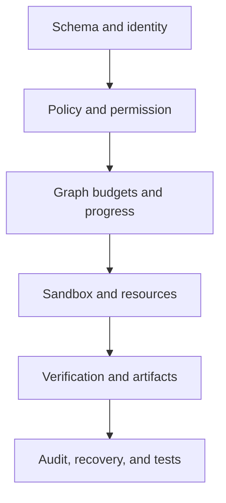
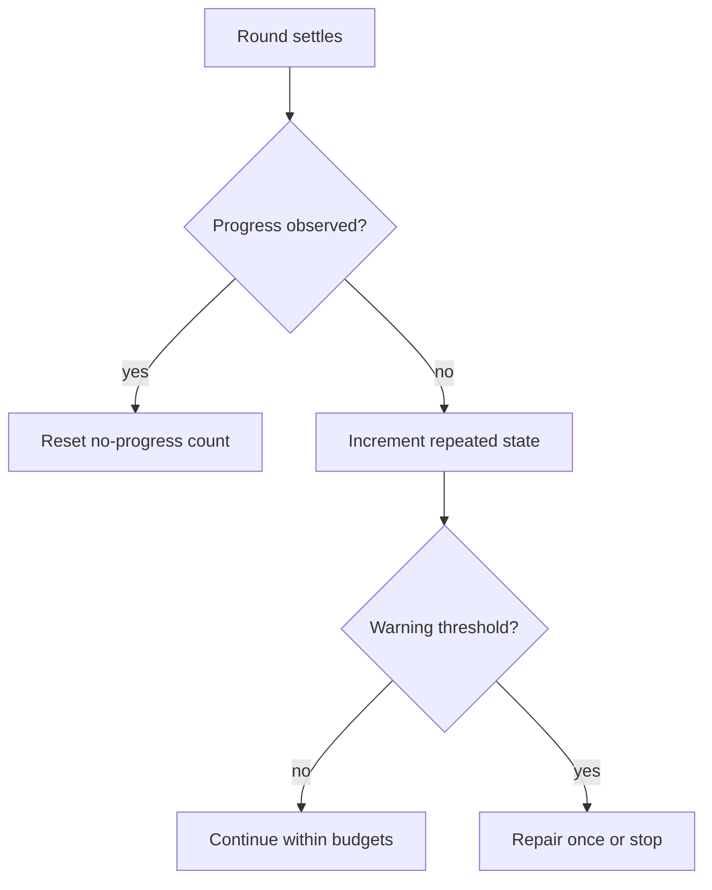

# Risk and Adversarial Test Matrix

> Concrete controls for data leakage, infinite loops, hallucinations, broken
> protocol/data, sandbox escape, resource exhaustion, and multi-agent storms.

[Execution architecture index](README.md) | [Docs start page](../README.md) | [Diagram standard](../diagram-standard.md)

## Safety layers

**Question:** where should a failure be stopped?



How to read it: controls are cumulative. Each layer assumes the previous layer
can still fail, and no later layer is allowed to reinterpret an earlier deny or
invent missing evidence.

No single layer is sufficient. Schema cannot contain a valid-but-dangerous
command; sandbox cannot determine user intent; model self-report cannot prove a
side effect; tests cannot recover a missing audit trail.

## Top-level risk register

| Risk | Primary prevention | Detection | Recovery |
| --- | --- | --- | --- |
| Data leakage | Scope filtering, least context, secret handles, sandbox egress policy | DLP canaries, audit, outbound scan | Revoke, quarantine, rotate secret, purge derivatives |
| Infinite agent loop | Model-driven completion plus budgets/no-progress/cycle guards | Route/tool fingerprints, usage and elapsed metrics | Typed stop, checkpoint, user repair/resume |
| Hallucinated success | Artifact contracts and deterministic verification | Missing/failed verification records | Continue repair, mark blocked/failed, never claim complete |
| Broken tool trajectory | ID/schema/FK/ordering constraints | Invariant checker before model call | Synthesize typed rejection only when valid; quarantine run otherwise |
| Duplicate side effect | Operation idempotency and preconditions | Duplicate key/fencing/outcome mismatch | Return prior outcome or mark unknown, no blind retry |
| Sandbox escape | Deny policy, mount isolation, network controls, provider conformance | Escape probes, violation events, post-command scan | Kill/quarantine sandbox, revoke worker, incident path |
| Resource exhaustion | Hierarchical leases/quotas and process/output limits | Saturation/lease/heartbeat metrics | Cancel, evict by policy, clean staging, retain control capacity |
| Agent fan-out storm | Depth/child/concurrency/cost budgets and batch admission | Active tree and spawn-rate metrics | Reject spawn, cancel subtree, preserve parent |
| Memory/skill poisoning | Provenance, source trust, confirmation, strict loader | Relevance/security evals and content scans | Quarantine/supersede/delete/revoke digest |
| Event/replay corruption | Transactional outbox, monotonic sequence, deterministic reducer | Gap/hash/replay equivalence checks | Snapshot/resync; stop applying invalid stream |

## Infinite loop architecture

Do not use a small hard-coded iteration count as the normal completion model.
The current [`query.ts`](../../query.ts) continues when tool-use blocks exist and
supports an optional `maxTurns`. The target LangGraph should finish naturally
when no tools are requested and completion policy accepts, while enforcing a
configurable safety envelope.

### Budget envelope

| Budget | Scope | Stop reason |
| --- | --- | --- |
| Model calls | run and child | `model_call_budget` |
| Tool calls | run, tool family, child | `tool_call_budget` |
| Input/output tokens | run/root tree | `token_budget` |
| Cost | run/root/tenant | `cost_budget` |
| Wall/deadline/idle time | operation/run | `deadline` / `idle_timeout` |
| Children/depth/spawn rate | root run | `child_budget` |
| Retries | operation/category | `retry_budget` |
| Permission/completion feedback | run | `interaction_budget` |
| LangGraph recursion | graph invocation | `recursion_limit` backstop |

### No-progress fingerprint

After every model/tool round, compute safe normalized facts:

```text
fingerprint = hash(
  graph_node,
  normalized_tool_names_and_resource_keys,
  normalized_result_categories,
  changed_artifact_digests,
  open_requirement_ids,
  repeated_error_codes,
  child_status_summary
)
```

Do not hash raw secrets/content into telemetry. Keep a restricted local digest
where necessary.

Progress is real when at least one occurs:

- required artifact is created/changed and verifies;
- an open requirement/task settles;
- repository/resource digest changes as expected;
- permission/user response changes the route;
- a new non-repeated error yields an actionable repair path;
- a child settles and parent consumes its result;
- completion checks advance.

Repeated equivalent model calls, identical tool inputs/results, same denied
permission, or same failing command without state change are no progress.

### Guard response



At a warning threshold, the runtime may inject one concise deterministic repair
message with repeated facts. At the stop threshold, checkpoint and terminate or
pause with a typed reason. Do not keep asking the model indefinitely to "try
again."

## Hallucination controls

| Hallucination | Runtime rule |
| --- | --- |
| Unknown tool/name | Registry lookup fails with typed result; never approximate another tool. |
| Invalid arguments | Pydantic rejects before permission/execution. |
| "File changed" without edit outcome | Completion requirement remains open until digest/diff record exists. |
| "Tests passed" without test artifact | Verification fails; prose cannot settle it. |
| Fabricated child progress | UI uses worker/events, not model-generated status text. |
| Fabricated memory provenance | Evidence IDs must exist in extractor input. |
| Stale source claim | Read/verify current repository before acting; current observation wins. |
| Fake URL/reference | Fetch/validate under network policy and store source artifact. |
| Hidden-reason explanation | Show deterministic route facts, not invented chain-of-thought. |

Completion policy should be requirement-based:

```python
class CompletionRequirement(BaseModel):
    requirement_id: str
    kind: Literal["artifact", "verification", "permission", "task", "user_ack"]
    status: Literal["open", "satisfied", "failed", "waived"]
    evidence_ids: list[UUID]
```

The model can propose completion. The runtime decides whether objective
requirements are satisfied.

## Broken data and protocol controls

### Tool trajectory

Before every model continuation, assert:

1. every committed tool-use ID is unique in its provider trajectory;
2. every tool-use has exactly one ordered result/rejection;
3. result references the same assistant/model call lineage;
4. no regular user message is inserted inside a provider-invalid result block;
5. arguments and result schema versions are known;
6. persisted artifact IDs exist and actor/run may reference them.

### Database constraints

Use unique/FK/check/version constraints for:

- command idempotency key per actor/session;
- event sequence per session/stream;
- tool call provider ID per model call;
- one canonical terminal state transition version;
- operation attempt and fencing token;
- one active permission resolution;
- child client key per parent;
- artifact digest/manifest linkage;
- message delivery receipt;
- checkpoint graph/schema compatibility.

### Event reducer

- validate every envelope before applying;
- reject duplicate event ID while accepting exact replay idempotently;
- detect sequence gaps before advancing cursor;
- ignore/provisionally replace only event kinds declared replaceable;
- fetch snapshot/replay after a gap;
- prove snapshot plus suffix events equals full-log reduction.

### Graph state updates

- keep checkpointed `TypedDict` state shallow and limited to normalized values/IDs;
- give each node an explicit output type and validate security-critical output at its boundary;
- run invariant guards before checkpoint-sensitive transitions and provider calls;
- inject malformed node updates in tests and prove they cannot become unrecoverable checkpoints;
- version graph/checkpoint schemas and route incompatible state to migration or typed failure.

## Data-leak matrix

| Boundary | Leak path | Control |
| --- | --- | --- |
| Model context | Excess files/memory/secrets | Context allowlist, token budget, redaction, secret handles never expanded. |
| Tool logs/results | Credentials in stdout | Restricted sink, secret scan, artifact sensitivity, bounded preview. |
| Sandbox network | Command exfiltrates workspace | Deny/allowlist proxy, approval, DNS/IP controls, egress audit. |
| Child agent | Parent sends unnecessary context | Explicit delegation package and child capability/data scope. |
| Memory | Durable secret/cross-project fact | Pre-write DLP, provenance, scope-first retrieval, deletion workflow. |
| Skill | Remote workflow requests exfiltration | Source trust, capability diff, sandbox/network policy, no auto-install. |
| LangGraph stream | Private/internal state channel reaches a client | Never expose raw graph streams; project allowlisted domain events/output keys only. |
| Events/logs/traces | Raw prompts, paths, commands, URLs | Safe schemas, central redaction, no raw high-cardinality labels. |
| VS Code webview | Token/absolute path/content injection | Extension-host boundary, minimal projection, CSP, sanitized Markdown/actions. |
| Artifact URLs | Long-lived bearer links | ID plus reauthorization; short-lived scoped URL only when needed. |

## Sandbox adversarial suite

Run each provider against the same conformance cases:

| Category | Probes |
| --- | --- |
| Filesystem | `..`, symlink swap, hardlink, procfs, device files, denied settings/skills, mount escape. |
| Network | DNS rebinding, direct IP, IPv6, redirect, proxy bypass, Unix socket, localhost bind, metadata endpoints. |
| Process | fork bomb, daemon escape, child after parent exit, signal ignore, process-group kill. |
| Resources | CPU spin, memory pressure, disk fill, inode fill, stdout flood, deep tree, timeout, idle hang. |
| Environment | secret enumeration, inherited descriptors, shell startup files, binary/path hijack. |
| Repository | malicious `.git`/hooks/config, worktree metadata, policy file rewrite. |
| Output | binary, invalid UTF-8, terminal escapes, huge lines, secret canaries, archive bombs. |

Every test produces an artifact bundle with provider/profile/version, sandbox
spec digest, commands as restricted test fixture data, expected/actual policy
outcomes, resource metrics, violation events, and cleanup verification.

## Keep sandbox tests in project history

Use a versioned test structure:

```text
tests/sandbox-conformance/
  fixtures/
  cases/
  expected/
  providers/
  regression/

docs/security-decisions/
  sandbox-threat-model.md
  provider-acceptance.md

.agent-runtime/test-artifacts/       # ignored/generated local results
```

Commit fixture definitions, expected policy, regression seeds, and safe summary
reports. Do not commit raw artifacts containing local paths, secrets, or host
data. CI/server artifact storage retains full restricted evidence by policy.

When a production escape/bug is fixed:

1. create a minimized safe regression fixture;
2. add it to every provider conformance suite;
3. record the threat/control decision;
4. pin the provider/runtime version that fixes it;
5. verify cleanup and fail-closed behavior;
6. preserve safe test report artifact/digest in release evidence.

## Scenario tests

1. **Live steering during Bash:** queued message waits because Bash blocks
   interruption; tool result settles; message injects once before next model call.
2. **All-cancelable interrupt:** read/search operations receive cancellation,
   synthetic results close trajectory, steering applies once.
3. **Duplicate edit after crash:** operation key returns committed prior outcome;
   no second write.
4. **Unknown remote side effect:** timeout yields `unknown`; automatic retry is denied.
5. **Child storm:** model requests 100 children; schema/profile/admission cap creates
   only allowed batch and records rejection reasons.
6. **No-progress loop:** same tool/error fingerprint repeats; one repair attempt,
   then typed stop with checkpoint.
7. **Hallucinated tests:** assistant says passed but no artifact; completion policy rejects.
8. **Memory leak attempt:** secret canary in output never reaches durable memory/model
   retry/log/export.
9. **Event gap:** CLI stops applying sequence, snapshots, replays suffix, no duplicate rows.
10. **Stop-all race:** completed child remains completed; running snapshot is cancelled;
    every target receives one outcome.
11. **Sandbox unavailable:** required profile refuses execution; UI never displays sandboxed.
12. **User edit conflict:** precondition fails and produces diff/review, not overwrite.

## Release gates

Release is blocked unless:

- all tool/command/event schemas reject unknown dangerous fields;
- graph route/terminal/no-progress tests cover every edge;
- permission and scope matrix passes for main/child/memory/skill/artifact;
- sandbox provider conformance and cleanup pass on every supported platform;
- duplicate/replay/crash tests prove idempotency for mutations;
- secret canaries remain absent from all unauthorized sinks;
- reducer replay equivalence and event-gap recovery pass;
- resource saturation retains cancellation/permission capacity;
- artifact/file-history restore tests pass;
- operational runbooks cover unknown side effect, sandbox violation, and data leak.

## Repository evidence

| Source | Existing safeguard or lesson |
| --- | --- |
| [`query.ts`](../../query.ts) | Tool-driven continuation, optional max turns, queue injection after tool results. |
| [`StreamingToolExecutor.ts`](../../services/tools/StreamingToolExecutor.ts) | Concurrency, synthetic cancellation results, streaming fallback discard. |
| [`sandbox-adapter.ts`](../../utils/sandbox/sandbox-adapter.ts) | Filesystem/network policy, unavailable warning/fail, settings/skills denial, git hardening. |
| [`fileHistory.ts`](../../utils/fileHistory.ts) | Pre-edit backups and restore history. |
| [`sessionStorage.ts`](../../utils/sessionStorage.ts) | Durable chain excludes ephemeral progress to avoid replay corruption. |
| [`memoryTypes.ts`](../../memdir/memoryTypes.ts) | Drift and non-memory guidance. |
| [`SkillTool.ts`](../../tools/SkillTool/SkillTool.ts) | Invocation/source checks and remote skill gap. |
| [`useCancelRequest.ts`](../../hooks/useCancelRequest.ts) | Explicit separation of foreground cancellation and stop-all. |
