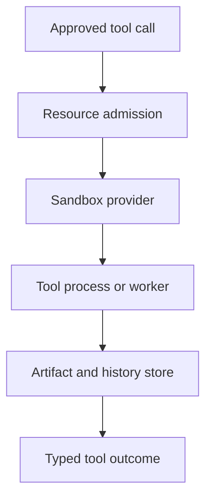

# Execution Architecture

> Contain untrusted tool work, allocate PC/server resources, preserve artifacts
> and file history, and prove safety with adversarial tests.

[Docs start page](../README.md) | [Runtime SRS](../runtime-srs/README.md) | [Diagram standard](../diagram-standard.md)

## Boundary

The execution layer begins after tool input validation and permission approval.
It does not decide whether the model wants a tool, and it does not render UI.

It owns:

- sandbox provider selection and lifecycle;
- filesystem, network, process, time, and output enforcement;
- local-PC versus server/remote placement;
- resource admission, leases, quotas, and cancellation;
- stdout/stderr/result artifacts;
- pre-edit file checkpoints and rewind;
- uncertain side-effect classification;
- execution-level test evidence.

## Source status

| Status | Capability |
| --- | --- |
| **CURRENT** | An adapter wraps `@anthropic-ai/sandbox-runtime` and maps repository permissions/settings to filesystem/network restrictions. |
| **CURRENT** | Sandbox dependency/platform checks, dynamic config refresh, network approval, and fail-if-unavailable behavior exist. |
| **CURRENT** | Background agents can use local process, worktree, and internal remote isolation paths. |
| **CURRENT** | Large text/binary tool results persist to session-scoped files with previews. |
| **CURRENT** | File edits are checkpointed with versioned backups, snapshots, diff stats, and rewind. |
| **CURRENT** | Session history is append-oriented JSONL and excludes ephemeral progress from the durable message chain. |
| **TARGET** | A Python `SandboxProvider` interface wraps the chosen ready-made local/container/remote sandbox. |
| **TARGET** | A resource scheduler admits local-PC/server work through explicit leases and quotas. |
| **TARGET** | Artifact metadata, content, lineage, retention, and authorization become first-class backend records. |

## Architecture

**Question:** what stands between an approved tool call and the operating system?



How to read it:

1. The central executor supplies normalized input and effective permission evidence.
2. Scheduler reserves bounded resources and placement.
3. Provider constructs an enforceable sandbox before process start.
4. Adapter executes with cancellation and output controls.
5. Full output/checkpoints are preserved outside model context.
6. The graph receives a bounded result plus artifact IDs and side-effect state.

## Documents

| Document | Build question |
| --- | --- |
| [01 - Sandbox and Resources](01-sandbox-and-resources.md) | How do tools run safely on a PC or server with bounded resources? |
| [02 - Artifacts and History](02-artifacts-and-history.md) | How are large outputs, edits, checkpoints, and replay preserved? |
| [03 - Risk and Test Matrix](03-risk-and-test-matrix.md) | How do we prevent leakage, loops, hallucinations, broken data, and sandbox escapes? |

## Recommended target package

```text
backend/execution/
  contracts.py            # Pydantic requests, leases, outcomes, events
  scheduler.py            # placement, fairness, dependency, admission
  quotas.py               # actor/workspace/run/child resource accounting
  sandbox.py              # provider protocol and effective policy
  providers/
    local.py               # selected Python/local OS sandbox adapter
    container.py           # container runtime adapter
    remote.py              # server/remote sandbox API adapter
  worker.py                # execution lease and heartbeat
  process.py               # cancellation, process tree, timeout, output
  artifacts.py             # metadata and content lifecycle
  file_history.py          # pre-edit backup, snapshots, rewind
  side_effects.py          # none/committed/partial/unknown classification
  cleanup.py               # lease expiry, sandbox/artifact cleanup
```

## Non-negotiable invariants

1. No command process starts before effective policy and resource lease exist.
2. "Sandbox enabled" is not reported when dependencies/enforcement are unavailable.
3. A sandbox cannot write its own policy, skill, agent, hook, or settings files.
4. Network default and exceptions are explicit and auditable.
5. Cancellation targets the full process tree or remote operation ID.
6. Full output is bounded on disk and bounded again before model/UI delivery.
7. A mutating tool records a precondition/checkpoint before the side effect.
8. Unknown side effects block automatic retry.
9. Artifact IDs are identifiers, not bearer capabilities.

## Build order

1. Provider protocol and fake provider for deterministic tests.
2. Local read-only sandbox with fail-closed dependency check.
3. Resource request/lease and wall-time/process/output limits.
4. Artifact manifest plus content-addressed local store.
5. Shell execution and network deny-by-default.
6. Pre-edit backup, atomic edit, diff artifact, and rewind.
7. Server/remote provider and placement scheduler.
8. Adversarial sandbox, leakage, retry, and resource-exhaustion suite.

## Repository evidence

| Source | Current behavior |
| --- | --- |
| [`sandbox-adapter.ts`](../../utils/sandbox/sandbox-adapter.ts) | Sandbox runtime bridge, policy mapping, dependency/platform checks, dynamic refresh, fail-if-unavailable. |
| [`shouldUseSandbox.ts`](../../tools/BashTool/shouldUseSandbox.ts) | Command-level sandbox selection and explicit unsafe override policy. |
| [`teammateMailbox.ts`](../../utils/teammateMailbox.ts) | Typed worker-to-leader sandbox network permission messages. |
| [`toolResultStorage.ts`](../../utils/toolResultStorage.ts) | Large result persistence and bounded previews. |
| [`mcpOutputStorage.ts`](../../utils/mcpOutputStorage.ts) | Binary MIME handling and raw-byte persistence. |
| [`fileHistory.ts`](../../utils/fileHistory.ts) | Versioned backups, snapshots, diff, and rewind. |
| [`sessionStorage.ts`](../../utils/sessionStorage.ts) | Append-oriented transcript/history and queue/file-history records. |
