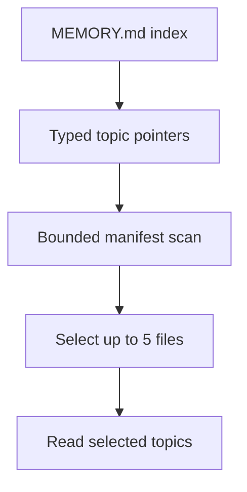
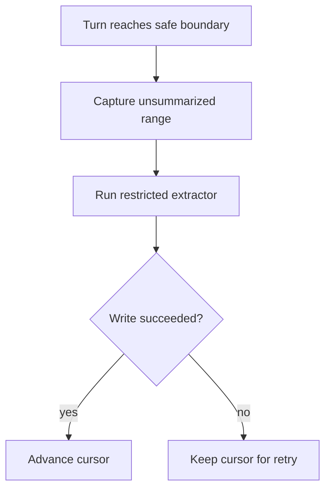

# Current Repository Memory Layers

> An implementation map of the memory behaviors already visible in this source
> tree. This page describes current evidence, not the Python target.

[Memory architecture index](README.md) | [Docs start page](../README.md) | [Diagram standard](../diagram-standard.md)

## Layer map

| Layer | Canonical source | Lifetime | Main purpose |
| --- | --- | --- | --- |
| Active messages/context | `query.ts`, compact services | One active trajectory | Preserve provider-valid tool/model history. |
| Session memory | `services/SessionMemory/` | Session | Carry a bounded summary across long-context compaction. |
| Auto memory | `memdir/`, `extractMemories/`, `autoDream/` | User/project over sessions | Retain stable learnings and preferences. |
| Agent memory | `tools/AgentTool/agentMemory*` | Agent profile plus scope | Give a specialized agent persistent scoped knowledge. |
| Session transcript | `utils/sessionStorage.ts` | Session history | Resume/replay; last-resort context search, not curated memory. |

## Durable auto-memory layout

**Question:** how does current memory stay small enough to load?

How to read it:

1. `MEMORY.md` is an entrypoint/index, not a dump of every fact.
2. Durable details live in topic Markdown files with frontmatter.
3. The scanner reads bounded metadata rather than every full file.
4. A side model selects only high-confidence relevant candidates.
5. The model/tool layer reads selected files lazily.

### Entrypoint bounds

[`memdir.ts`](../../memdir/memdir.ts) defines:

- maximum `MEMORY.md` lines: 200;
- maximum `MEMORY.md` bytes: 25,000;
- one-line pointers from the entrypoint to topic files;
- a warning when loaded entrypoint content is truncated;
- a last-resort search path from memory Markdown to JSONL transcripts.

### Memory taxonomy

[`memoryTypes.ts`](../../memdir/memoryTypes.ts) defines four durable types:

| Type | Save | Avoid |
| --- | --- | --- |
| `user` | Stable role, preferences, constraints, communication style | One-task requests or guesses about identity. |
| `feedback` | A correction that should change future behavior | Unconfirmed inference from one outcome. |
| `project` | Stable non-obvious conventions or constraints | Architecture, paths, structure, and facts derivable from current code. |
| `reference` | Durable external resources and when/why to use them | Temporary URLs or content already in project docs. |

The prompt also establishes drift behavior: verify mutable file/function/flag
details against current repository state; current observation wins; update or
remove stale memory.

## Path security

[`paths.ts`](../../memdir/paths.ts) protects where memory can live:

- auto memory is gated by mode/settings/environment;
- a canonical git root is used for project namespacing;
- worktrees can share the same project memory;
- dangerous root/near-root, drive-root, UNC, and null-containing paths are rejected;
- project settings cannot redirect auto memory to arbitrary sensitive directories;
- user/local/policy/flag precedence is explicit;
- remote/bare modes have separate enablement behavior.

Path normalization is part of the security boundary, not a UI convenience.

## Manifest and relevant-memory selection

[`memoryScan.ts`](../../memdir/memoryScan.ts):

- recursively scans Markdown topic files but excludes `MEMORY.md`;
- reads only the first 30 lines to parse frontmatter;
- caps the scan at 200 files;
- sorts by newest modification time;
- emits type, filename, mtime, and description.

[`findRelevantMemories.ts`](../../memdir/findRelevantMemories.ts):

- asks a side model for at most five high-confidence files;
- removes already surfaced paths and recent tool-reference noise;
- validates returned filenames against the actual scan set;
- returns an empty list safely on no match/failure.

The model cannot fabricate a path and make the runtime read it.

## Session memory

Session memory is not durable user/project memory. It is a bounded, updateable
summary of a long-running conversation.

Current defaults in
[`sessionMemoryUtils.ts`](../../services/SessionMemory/sessionMemoryUtils.ts):

| Setting | Default behavior |
| --- | --- |
| Initial extraction threshold | 10,000 context tokens |
| Token growth before update | 5,000 additional tokens |
| Tool activity signal | 3 tool calls, while token threshold remains required |
| Wait for in-flight extraction | Up to 15 seconds |
| Extraction considered stale | 60 seconds |

[`sessionMemory.ts`](../../services/SessionMemory/sessionMemory.ts) further:

- runs only for the main REPL thread under its feature/compact gates;
- avoids extraction when the last assistant turn still has tool calls;
- creates the directory/file with restrictive permissions;
- reads memory through an isolated subagent context;
- gives the extraction agent `Edit` only on the exact session-memory path;
- updates the summarized-message cursor only at a successful safe boundary;
- supports an explicit manual summary operation.

## Background durable-memory extraction

**Question:** how are successful turns converted into durable candidates?

[`extractMemories.ts`](../../services/extractMemories/extractMemories.ts)
implements this as best-effort background work:

- main agent only and not remote mode;
- skips a range when the main conversation directly wrote memory;
- permits Read/Grep/Glob, read-only Bash, and Edit/Write only in the memory directory;
- uses a forked agent with `skipTranscript: true` and `maxTurns: 5`;
- advances its cursor only on successful completion;
- coalesces overlap and runs one trailing extraction using latest context;
- exposes a drain operation for graceful shutdown.

## Consolidation (`autoDream`)

Consolidation reviews multiple sessions and improves existing memory rather than
blindly appending forever.

Current defaults in [`autoDream.ts`](../../services/autoDream/autoDream.ts):

| Gate | Default |
| --- | --- |
| Minimum time since consolidation | 24 hours |
| Minimum completed/touched sessions | 5, excluding current session |
| Re-scan throttle after an unmet session gate | 10 minutes |

The job uses a consolidation lock, a registered background task, a restricted
memory tool policy, and lock rollback on failure. It can report touched files
back to the main session without injecting the full child transcript.

## Agent-scoped memory

[`agentMemory.ts`](../../tools/AgentTool/agentMemory.ts) supports:

| Scope | Location idea | Intended use |
| --- | --- | --- |
| `user` | Config-level `agent-memory/<agent>/` | Cross-project learning for an agent profile. |
| `project` | `.claude/agent-memory/<agent>/` | Versioned project/team knowledge. |
| `local` | `.claude/agent-memory-local/<agent>/` or remote mount | Machine/project knowledge not checked into VCS. |

Agent type names are sanitized for paths. Memory path checks normalize input to
prevent traversal bypass. The prompt tells agents how the selected scope should
change what they save.

[`agentMemorySnapshot.ts`](../../tools/AgentTool/agentMemorySnapshot.ts) adds a
project snapshot flow:

- initialize local memory when no local Markdown exists;
- detect a newer snapshot and request update handling;
- replace local Markdown while removing orphan topic files;
- mark a snapshot timestamp as synced without overwriting local content.

## Explicit non-memory

The current prompt requires that if the user asks to ignore memory, the runtime
treats memory as empty and does not mention or use it. The target must implement
this as an enforceable context-builder flag, not rely only on model obedience.

## What is not present

- No canonical vector database implementation is visible.
- No general embedding pipeline is required by the current design.
- No evidence says memory may be treated as authoritative over current source.
- No complete cross-store retention/deletion workflow is visible; the target
  SRS adds one in [Safety, Retention, and Deletion](03-safety-retention-and-deletion.md).
