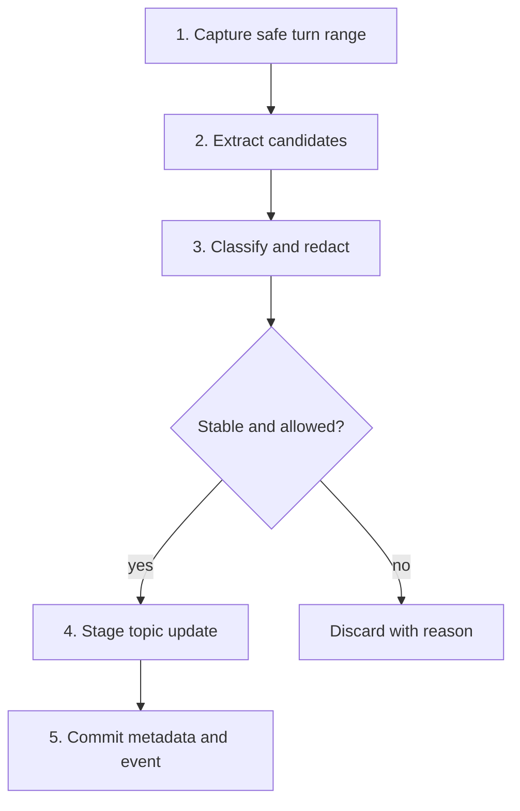
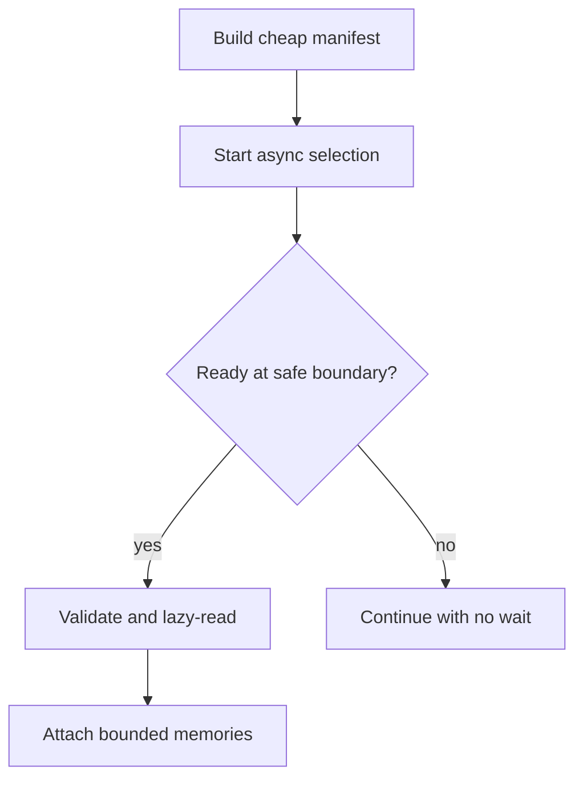
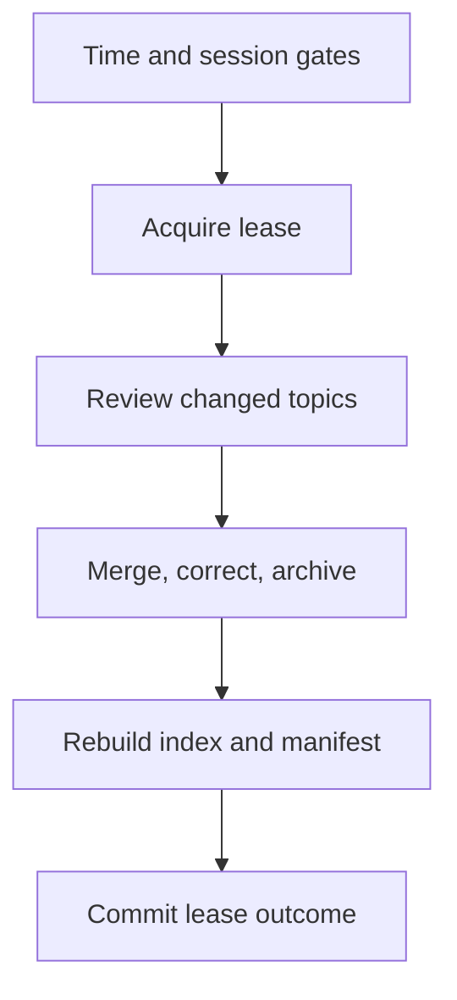

# Memory Write, Recall, and Consolidation

> Target FastAPI/LangGraph contracts that preserve the repository's file-first,
> bounded, asynchronous memory behavior.

[Memory architecture index](README.md) | [Docs start page](../README.md) | [Diagram standard](../diagram-standard.md)

## Canonical storage decision

Use a hybrid for v1:

| Store | Owns |
| --- | --- |
| Markdown memory directory | Human-reviewable canonical `MEMORY.md` and topic content. |
| PostgreSQL/SQLite metadata | IDs, scope, digests, provenance, status, retention, jobs, cursors, and audit. |
| Optional search index | Derived lexical/semantic index; rebuildable and never canonical. |
| Artifact store | Large extraction evidence or restricted source snapshots when explicitly allowed. |

Writing content and metadata needs one logical operation record. Since SQL and
filesystem/object storage are not one transaction, use a staged write plus
digest and recovery state rather than pretending they commit atomically.

## Core records

```python
class MemoryScope(StrEnum):
    USER = "user"
    PROJECT = "project"
    LOCAL = "local"
    AGENT_USER = "agent_user"
    AGENT_PROJECT = "agent_project"
    AGENT_LOCAL = "agent_local"


class MemoryKind(StrEnum):
    USER = "user"
    FEEDBACK = "feedback"
    PROJECT = "project"
    REFERENCE = "reference"


class MemoryRecord(BaseModel):
    model_config = ConfigDict(extra="forbid")

    memory_id: UUID
    scope: MemoryScope
    kind: MemoryKind
    owner_id: UUID
    project_id: UUID | None
    agent_profile: str | None
    topic_path: str
    content_digest: str
    description: str
    provenance_ids: list[UUID]
    confidence: float = Field(ge=0, le=1)
    sensitivity: Literal["normal", "restricted", "secret_denied"]
    status: Literal["active", "stale", "superseded", "deleted"]
    last_verified_at: datetime | None
    stale_after: datetime | None
    created_at: datetime
    updated_at: datetime
    version: int = Field(ge=1)
```

Persisted/API records use Pydantic. A trusted hot-path manifest entry can be a
frozen slotted dataclass after validation:

```python
@dataclass(frozen=True, slots=True)
class ManifestEntry:
    memory_id: UUID
    path: Path
    kind: MemoryKind
    mtime_ns: int
    description: str
    digest: str
```

LangGraph state uses a `TypedDict` carrying IDs and revisions:

```python
class AgentState(TypedDict, total=False):
    memory_manifest_revision: str
    memory_prefetch_id: UUID
    surfaced_memory_ids: list[UUID]
    ignored_memory: bool
```

Do not repeatedly Pydantic-validate the same manifest on every graph edge.

## Write pipeline

**Question:** when is a memory candidate allowed to become durable?



How to read it:

1. Capture only a completed, provider-valid range and stable provenance IDs.
2. A restricted extractor proposes typed candidates; it does not directly gain arbitrary writes.
3. Deterministic policy removes secrets, ephemeral facts, and wrong scopes.
4. Dedupe/correction decides create, update, supersede, or discard.
5. Write a temporary file, fsync where appropriate, atomically replace, verify digest, then commit metadata/outbox state.

### Candidate contract

```python
class MemoryCandidate(BaseModel):
    model_config = ConfigDict(extra="forbid")

    kind: MemoryKind
    proposed_scope: MemoryScope
    description: str = Field(max_length=300)
    content: str = Field(max_length=20_000)
    evidence_message_ids: list[UUID] = Field(min_length=1, max_length=50)
    confidence: float = Field(ge=0, le=1)
    stable_reason: str
    correction_of: UUID | None = None
```

The policy, not the extractor, chooses final scope and storage permission.

## Cursor and idempotency

Each extraction source has:

- `source_session_id`;
- `from_message_id` exclusive;
- `through_message_id` inclusive;
- normalized range digest;
- extraction operation ID;
- status and attempt;
- committed memory IDs.

A unique range digest prevents duplicate extraction. Advance the durable cursor
only after every accepted topic operation settles. On failure, keep the cursor
and retry safely. Coalesce overlapping requested ranges into one active job plus
one trailing latest-range job, matching current repository behavior.

## Recall pipeline

**Question:** how does recall avoid delaying a LangGraph model call?



Recall steps:

1. Build/cached-load a manifest from allowed scopes only.
2. Generate candidates with filename, kind, description, age, and digest.
3. Select a small count using deterministic lexical score first; optional side
   model reranks high-confidence candidates.
4. Validate selected IDs/paths against the manifest.
5. Remove already surfaced/currently read candidates.
6. Reauthorize and read full topic content lazily.
7. Enforce per-item and total token budgets.
8. Attach provenance, age, and "verify mutable facts" instruction.

If prefetch is not ready, continue. It may be consumed at the next model/tool
round. Never block a first response solely for speculative memory.

## Retrieval scoring

Use explainable scoring before embeddings:

```text
score = lexical_match
      + kind_prior
      + explicit_reference_bonus
      + recent_feedback_bonus
      + project_scope_bonus
      - stale_penalty
      - already_surfaced_penalty
```

Then apply hard filters for actor, project, agent profile, ignore-memory mode,
sensitivity, status, retention, and current authorization.

Add a vector index only if an evaluation set shows lexical/metadata retrieval
misses important paraphrases often enough to justify embedding cost and privacy
risk. The index remains derived and deletable.

## Context budget

Recommended target budget order:

1. system/developer and safety instructions;
2. current user command;
3. open provider tool trajectory;
4. recent conversation and exact tool results;
5. session summary;
6. explicit project instructions;
7. selected durable memories;
8. optional historical/reference context.

Drop lower priorities first. Record which memory IDs were surfaced and their
token contribution so relevance and leakage can be audited.

## Consolidation

**Question:** how does memory improve without growing forever?



How to read it:

1. Time/session gates avoid constant background rewriting.
2. One lease owner consolidates a scope at a time and heartbeats while active.
3. The worker reviews changed topics, retaining provenance through merge/correction.
4. Index/manifest publication occurs only after topic files are valid.
5. A failed pass releases/records the lease without advancing the success watermark.

Consolidation operations:

| Operation | Rule |
| --- | --- |
| Merge | Combine duplicate facts while retaining all provenance IDs. |
| Correct | Supersede stale content; never silently rewrite history without a version. |
| Split | Keep topic files coherent and entrypoint pointers short. |
| Archive | Remove low-value/expired content from active recall while retaining policy-required audit metadata. |
| Delete | Execute an authorized deletion workflow across canonical and derived stores. |
| Verify | Re-check mutable project claims against current source before refreshing confidence. |

Use a lease with owner, acquisition time, heartbeat, and prior successful
watermark. On job failure, do not advance the consolidation watermark.

## Graph integration

Recommended named nodes/sidecars:

| Component | Blocking? | Responsibility |
| --- | --- | --- |
| `prepare_context` | Yes, bounded | Load session summary and cached entrypoint. |
| `memory_prefetch_start` | No | Start candidate selection with current user/tool signals. |
| `memory_prefetch_consume` | No-wait | Attach only settled, authorized results. |
| `post_turn_memory_signal` | No | Enqueue extraction operation after safe boundary. |
| `memory_question` | Durable interrupt | Ask user only for genuinely ambiguous scope/consent. |
| `memory_correction` | Yes when explicit | Apply user-requested correction/deletion command. |

Background extraction/consolidation should not be graph recursion edges for the
interactive run. They are separate jobs/runs with their own budgets.

## API commands

- `memory.list`
- `memory.inspect`
- `memory.create`
- `memory.correct`
- `memory.delete`
- `memory.ignore_for_run`
- `memory.enable_for_run`
- `memory.export`
- `memory.consolidate`
- `memory.extraction.retry`

Every command is scoped and audited. Do not expose direct arbitrary filesystem
paths through the API.

## Build checklist

- [ ] File adapter with strict root containment and atomic replace.
- [ ] SQL memory metadata, operation, cursor, and outbox records.
- [ ] Pydantic candidate/frontmatter schemas.
- [ ] Cached bounded manifest and lexical retrieval.
- [ ] Async zero-wait prefetch sidecar.
- [ ] Context token accounting and surfaced-memory events.
- [ ] Restricted extraction worker with cursor/idempotency.
- [ ] Consolidation lease and correction/version behavior.
- [ ] Recall evaluation set before considering embeddings.
