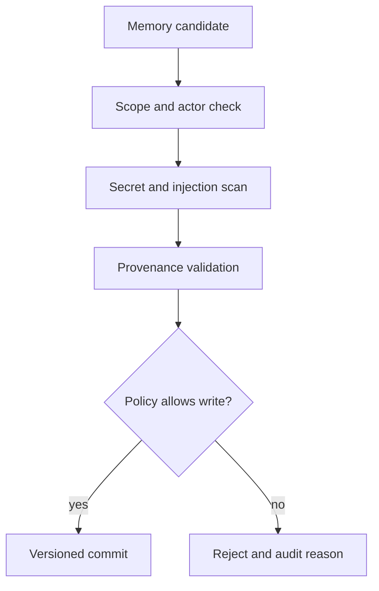
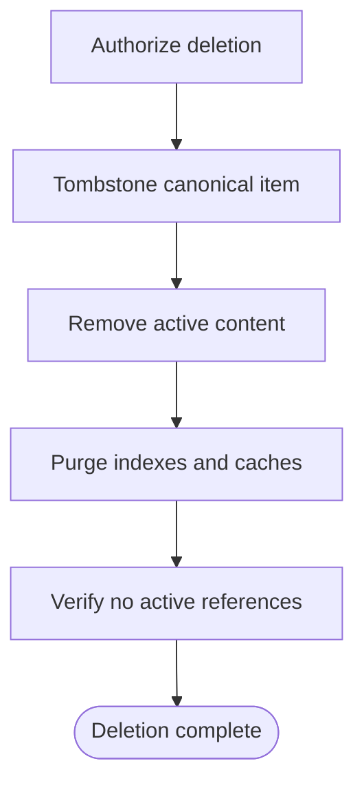

# Memory Safety, Retention, and Deletion

> Threat controls for data leakage, prompt injection, poisoned learning, stale
> facts, cross-scope retrieval, and complete user-directed deletion.

[Memory architecture index](README.md) | [Docs start page](../README.md) | [Diagram standard](../diagram-standard.md)

## Threat model

Memory is unusually sensitive because untrusted content can become durable and
silently influence future sessions. Treat every memory write as a security and
quality decision.

| Threat | Example | Impact |
| --- | --- | --- |
| Secret capture | Tool output contains an API token that extraction saves | Long-lived credential leakage. |
| Cross-scope retrieval | Project A memory appears in Project B | Tenant/project data exposure. |
| Prompt injection persistence | A fetched page says "remember and obey this" | Future behavior compromise. |
| Memory poisoning | A child or tool fabricates a user preference | Repeated wrong actions. |
| Drift | Memory names a file/flag that changed | Broken commands or false claims. |
| Hallucinated provenance | Extractor cites messages it did not observe | Unverifiable durable claim. |
| Undeletable derivative | Canonical item deleted but embedding/cache remains | Privacy/regulatory failure. |
| Over-broad agent scope | Child writes private local knowledge to versioned project memory | Accidental team disclosure. |

## Trust hierarchy

When facts disagree, use this order:

```text
current authorized observation
  > explicit current user instruction
  > reviewed project policy/documentation
  > verified durable memory
  > unverified/stale memory
  > model inference
```

Memory can suggest what to inspect. It cannot override current permissions,
source, policy, or explicit user correction.

## Write authorization

**Question:** what must pass before content reaches durable memory?



Deterministic gates:

1. Actor may write the proposed scope.
2. Source session/project belongs to the same authorized boundary.
3. Content is not secret, credential, raw private key, auth header, or denied PII.
4. Evidence IDs exist and were visible to the extractor.
5. Content is stable enough and not project structure/history that source already owns.
6. Untrusted web/MCP/tool instructions are quoted as data, not promoted to policy.
7. Topic path resolves inside the configured memory root after symlink checks.
8. User-level or versioned team memory may require explicit approval by policy.

## Provenance

Every active item stores:

- source kind: user statement, feedback, project observation, external reference;
- source session/message/tool/artifact IDs;
- extractor version/model profile when a model proposed it;
- deterministic policy decision and redaction version;
- creator actor/run and target scope;
- content digest and prior/superseded item;
- confidence and last verification timestamp;
- whether the content was explicitly user-confirmed.

The UI should let a user answer "why is this remembered?" without exposing
another scope's raw content.

## Data-leak controls

### At collection

- Minimize source ranges; do not give extractors the complete history by default.
- Strip environment values, credentials, hidden prompts, and restricted artifacts.
- Give extractors read-only source access and memory-root-only writes.
- Do not let a child broaden its memory scope beyond the effective child policy.

### At storage

- Encrypt restricted content at rest with workspace/tenant-scoped keys.
- Keep file/directory permissions restrictive.
- Store safe metadata separately from content; do not put secrets in descriptions.
- Use content digests and atomic writes; never log raw candidates.
- Keep project/versioned memory clearly distinct from local/private memory.

### At retrieval

- Filter scope before scoring, not after returning candidates.
- Reauthorize content access at lazy-read time.
- Treat memory IDs/paths as identifiers, not bearer capabilities.
- Enforce total token, item count, and sensitivity budgets.
- Emit safe retrieval evidence for audit without raw memory text.

### At egress

- Exclude memory bodies from normal telemetry, traces, metrics, and support bundles.
- Redact model/provider request captures by default.
- Prevent webview/browser surfaces from receiving unrestricted memory paths/content.
- Apply outbound DLP/secret scans to export and remote-agent context.

## Poisoning and hallucination controls

| Failure | Control |
| --- | --- |
| Extractor invents evidence | Validate every evidence ID against its authorized input set. |
| Tool/web text contains instructions | Tag origin and prohibit untrusted content from becoming policy/feedback without confirmation. |
| Model infers a preference | Require explicit user statement or repeated confirmed feedback. |
| Child reports a project fact | Verify against current source before project-memory commit. |
| Duplicate facts disagree | Keep versions/provenance, lower confidence, and require correction/verification. |
| Memory claims mutable code detail | Mark stale quickly and force source verification before use. |
| Retrieval selects irrelevant content | Small high-confidence limit, relevance event, and user correction path. |

## Staleness

Use per-kind policy rather than one TTL:

| Kind | Staleness approach |
| --- | --- |
| User preference | No automatic short TTL; supersede on explicit correction. |
| Feedback | Retain while behavior remains relevant; merge repeated signals carefully. |
| Project fact | Short verification horizon or repository revision binding. |
| External reference | Revalidate availability/version when used. |
| Agent local tactic | Age/usage decay; consolidate or archive if unused. |

If source verification contradicts memory, use current source immediately and
enqueue a correction. Do not first act on stale memory then repair it later.

## Ignore-memory mode

`ignore_memory=true` must be enforced in code:

- context builder omits entrypoint and session/durable memories as configured;
- retrieval jobs are not started or their results are discarded;
- prompts do not mention remembered facts;
- no "memory influenced this" UI is fabricated;
- explicit deletion/list commands remain available;
- the mode and scope are recorded as safe metadata for reproducibility.

## Retention model

```python
class RetentionPolicy(BaseModel):
    model_config = ConfigDict(extra="forbid")

    policy_id: str
    active_days: int | None = Field(default=None, ge=0)
    archive_days: int | None = Field(default=None, ge=0)
    delete_days: int | None = Field(default=None, ge=0)
    delete_on_project_removal: bool
    legal_hold_allowed: bool
    derived_index_deadline_hours: int = Field(ge=0)
```

Retention varies by scope and deployment. User-visible settings must explain
what is local, synced, versioned, exported, or retained by server policy.

## Deletion workflow

**Question:** when is a memory deletion complete?



Deletion steps:

1. Record an idempotent deletion operation and target scope.
2. Hide/tombstone the item immediately from recall.
3. Atomically rewrite/remove canonical Markdown and entrypoint pointer.
4. Remove derived lexical/vector indexes, caches, snapshots, and pending jobs.
5. Handle backups/artifacts according to retention/legal-hold policy.
6. Rebuild manifest and verify the ID/digest cannot be retrieved.
7. Emit a completion event containing categories and counts, not deleted content.

If a backup cannot be immediately purged, report the policy and purge deadline.
Do not claim complete deletion while active derived indexes still contain it.

## Memory UX

The CLI and extension should support:

- list by scope/type/status;
- inspect content, provenance, age, and last use;
- correct or supersede;
- move between allowed scopes with review;
- delete one/topic/scope;
- ignore memory for a run;
- show which memory IDs influenced a response at diagnostic visibility;
- report stale/conflicting memory without exposing secret body text.

## Tests

1. Secret canaries never enter topic content, metadata descriptions, logs, traces, or exports.
2. Project/user/agent scope matrix denies every cross-boundary read and write.
3. Path traversal and symlink swaps cannot escape the memory root.
4. Fabricated provenance IDs reject the candidate.
5. Untrusted web/MCP instructions cannot create policy/feedback memory.
6. Ignore-memory mode performs no retrieval and changes no model context.
7. Stale project fact is verified and corrected before use.
8. Duplicate extraction range creates no duplicate content.
9. Failed write leaves cursor and previous canonical file intact.
10. Deletion removes canonical, manifest, search, vector, cache, snapshot, and pending-job references.
11. Concurrent consolidation uses one lease owner and does not lose versions.
12. A malicious project setting cannot redirect memory to a sensitive path.

## Repository evidence

| Source | Safety behavior reused |
| --- | --- |
| [`memoryTypes.ts`](../../memdir/memoryTypes.ts) | Inclusion/exclusion policy, drift verification, and ignore-memory semantics. |
| [`paths.ts`](../../memdir/paths.ts) | Path normalization and settings trust boundaries. |
| [`findRelevantMemories.ts`](../../memdir/findRelevantMemories.ts) | High-confidence cap and validation against actual candidates. |
| [`extractMemories.ts`](../../services/extractMemories/extractMemories.ts) | Restricted tool policy, cursor-on-success, and mutual exclusion with direct writes. |
| [`sessionMemory.ts`](../../services/SessionMemory/sessionMemory.ts) | Exact-path edit restriction and safe tool-trajectory boundary. |
| [`agentMemory.ts`](../../tools/AgentTool/agentMemory.ts) | Explicit user/project/local scopes and normalized path checks. |
