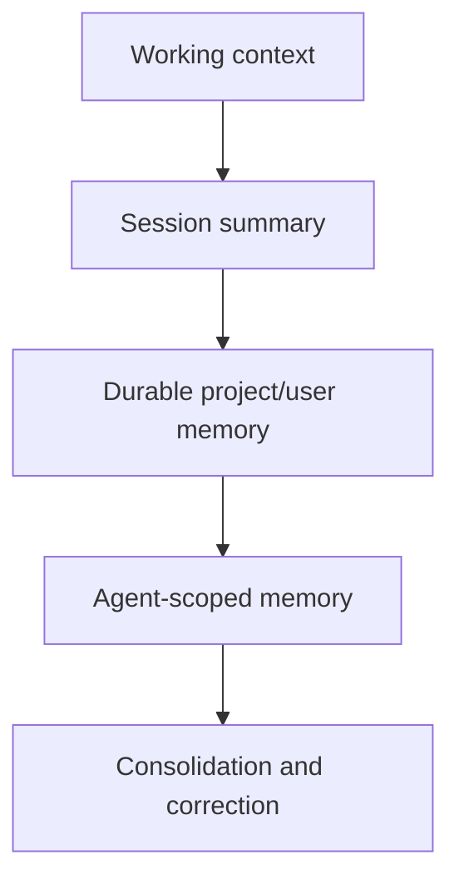

# Memory Architecture

> A detailed, source-backed design for bounded context, session summaries,
> durable memory, agent-scoped memory, retrieval, consolidation, and deletion.

[Docs start page](../README.md) | [Agent architecture](../agent-architecture/README.md) | [Diagram standard](../diagram-standard.md)

## Key decision

Start file-first, as this repository does. Do not add a vector database until
measured scale or semantic-recall failures justify it.

The current design uses a small `MEMORY.md` index, typed topic Markdown files,
metadata scanning, and a side model that selects a few high-confidence files.
That is fast, inspectable, editable, portable, and easy to sandbox.

The Python target should preserve this behavior behind interfaces so a lexical,
SQL, or vector retrieval adapter can be added later without changing the graph.

## The four memory layers

**Question:** which information belongs in which lifetime?



How to read it:

1. Working context contains the active tool trajectory and recent messages.
2. Session memory summarizes an ongoing conversation when context grows.
3. Durable memory stores only stable user, feedback, project, or reference facts.
4. Specialized agents may have user, project, or local memory scopes.
5. Background extraction and consolidation deduplicate, correct, or remove stale entries.

These are related stores with different write rules, not one giant prompt.

## Documents

| Document | Question answered |
| --- | --- |
| [01 - Current Memory Layers](01-current-memory-layers.md) | What exactly exists in this repository today? |
| [02 - Write, Recall, and Consolidation](02-write-recall-and-consolidation.md) | How should memory enter and leave a FastAPI/LangGraph run efficiently? |
| [03 - Safety, Retention, and Deletion](03-safety-retention-and-deletion.md) | How do we prevent leakage, poisoning, drift, and undeletable memory? |

## Current and target status

| Status | Memory capability |
| --- | --- |
| **CURRENT** | File-based auto memory with a bounded `MEMORY.md` entrypoint and topic files. |
| **CURRENT** | Four durable types: `user`, `feedback`, `project`, and `reference`. |
| **CURRENT** | Bounded manifest scan and high-confidence selection of up to five relevant files. |
| **CURRENT** | Background memory extraction with a restricted tool policy and coalesced runs. |
| **CURRENT** | Session memory extraction at token/tool boundaries and context compaction integration. |
| **CURRENT** | Agent memory scopes `user`, `project`, and `local`, plus project snapshots. |
| **CURRENT** | Periodic consolidation guarded by time/session gates and a lock. |
| **TARGET** | Explicit memory records, provenance, sensitivity, verification, retention, and deletion commands. |
| **TARGET** | Async prefetch as a graph sidecar so retrieval does not delay the model hot path. |
| **GAP** | A complete semantic/vector retrieval service is not present in the visible repository and is not required for v1. |

## Memory is not project documentation

The current [`memoryTypes.ts`](../../memdir/memoryTypes.ts) deliberately says
not to save information that can be re-derived from the repository, including
general architecture, file paths, project structure, git history, and one-off
fix recipes.

That distinction matters:

| Put in docs/source | Put in memory |
| --- | --- |
| Architecture and build instructions | A stable user preference |
| Current file/module layout | Feedback that changes future behavior |
| API contract | A non-obvious project convention not reliably derivable |
| Commit history | A durable external reference and why it matters |
| One task's temporary state | A long-lived fact with provenance and scope |

Documentation is reviewed source of truth. Memory is a bounded aid that must be
verified when it refers to mutable code or configuration.

## Recommended target package

```text
backend/memory/
  contracts.py            # Pydantic command/result/event schemas
  context_builder.py       # bounded active model context
  session_summary.py       # extract/update session summary
  durable_store.py         # MEMORY.md/topic canonical adapter
  manifest.py              # cheap metadata scan/index
  retrieval.py             # candidate generation and selection
  extraction.py            # post-turn best-effort write pipeline
  consolidation.py         # dedupe/correct/archive with lock/lease
  agent_memory.py          # per-profile user/project/local scopes
  policy.py                # scope, sensitivity, consent, retention
  redaction.py             # secret/PII classification before writes
  repository.py            # SQL metadata and operation state
  workers.py               # background jobs and drain-on-shutdown
```

## Fast LangGraph integration

Keep memory off the critical path:

1. Load the bounded `MEMORY.md` entrypoint once when preparing a session/profile.
2. Cache parsed frontmatter/manifest by directory revision.
3. Start relevant-memory selection asynchronously while the model or tools work.
4. Never wait for prefetch solely to make the next call; consume it only if settled.
5. Load full topic content lazily for selected candidates.
6. Put memory IDs/digests in graph state, not entire directory contents.
7. Schedule extraction after a successful turn boundary and coalesce overlap.
8. Run consolidation separately from the interactive worker.

This mirrors the current `query.ts` memory-prefetch behavior: settled results
are consumed at a later loop iteration, while an unfinished prefetch adds zero
wait.

## Non-negotiable invariants

1. A user can disable/ignore memory for a run; ignored memory is not loaded,
   mentioned, or used.
2. Scope is enforced on writes, retrieval, events, artifacts, and deletion.
3. Secrets and raw credentials are denied before durable storage.
4. Every durable memory has provenance, owner/scope, timestamps, and a correction path.
5. Current observed source/configuration outranks stale memory.
6. Memory extraction cannot gain broader tools than the parent/deployment permits.
7. A failed background extraction does not advance its source cursor.
8. Deletion removes canonical content, indexes, caches, and derived summaries under a tracked job.

## Build order

1. Bounded context builder and explicit no-memory mode.
2. Session summary stored per session.
3. Canonical `MEMORY.md` plus topic files and strict path containment.
4. Typed manifest and deterministic lexical/file selection.
5. Background extraction with restricted tools and cursor/idempotency.
6. Async relevant-memory prefetch and lazy topic reads.
7. Agent scopes and project snapshots.
8. Consolidation lease, correction, retention, and deletion.
9. Add embeddings only after an evaluation proves meaningful recall gain.

## Repository evidence

| Source | Current behavior |
| --- | --- |
| [`memdir.ts`](../../memdir/memdir.ts) | Bounded `MEMORY.md`, topic files, prompt, and search guidance. |
| [`memoryTypes.ts`](../../memdir/memoryTypes.ts) | Four memory types, inclusion/exclusion policy, drift correction. |
| [`memoryScan.ts`](../../memdir/memoryScan.ts) | Bounded metadata manifest. |
| [`findRelevantMemories.ts`](../../memdir/findRelevantMemories.ts) | High-confidence side-model selection and filename validation. |
| [`paths.ts`](../../memdir/paths.ts) | Scope gates, canonical project path, and malicious-path prevention. |
| [`sessionMemory.ts`](../../services/SessionMemory/sessionMemory.ts) | Isolated session-summary extraction and safe-boundary updates. |
| [`extractMemories.ts`](../../services/extractMemories/extractMemories.ts) | Restricted background extraction, cursor, coalescing, and shutdown drain. |
| [`autoDream.ts`](../../services/autoDream/autoDream.ts) | Periodic consolidation gates, lock, background task, and progress. |
| [`agentMemory.ts`](../../tools/AgentTool/agentMemory.ts) | User/project/local agent memory scopes. |
| [`agentMemorySnapshot.ts`](../../tools/AgentTool/agentMemorySnapshot.ts) | Snapshot initialize/replace/mark-synced behavior. |
