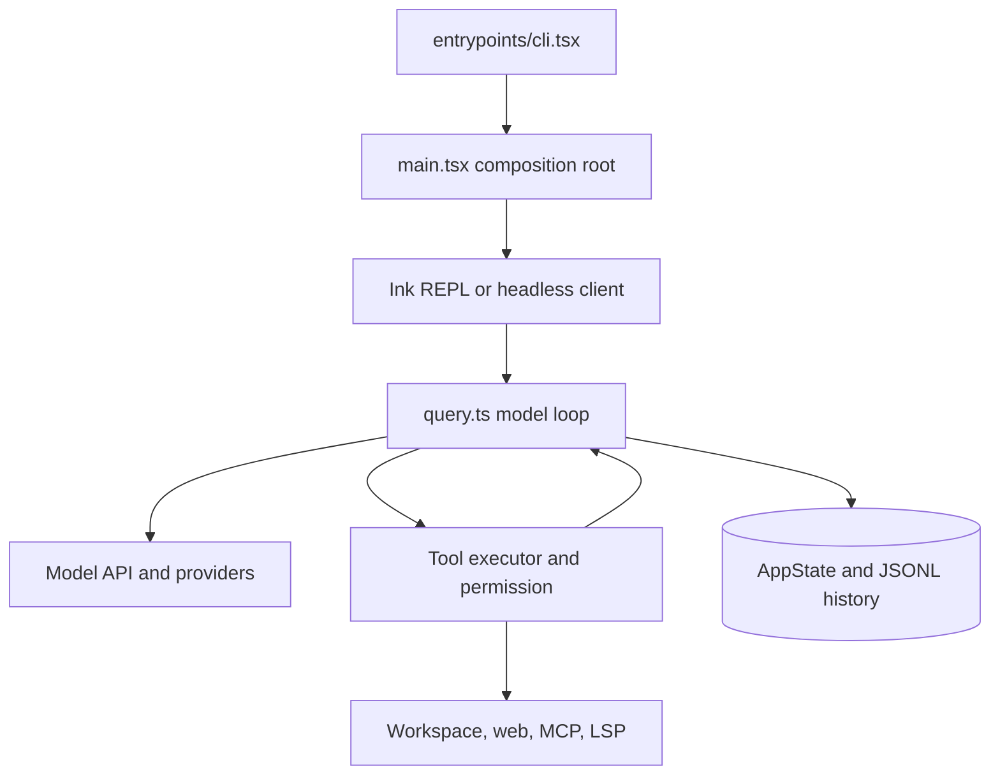
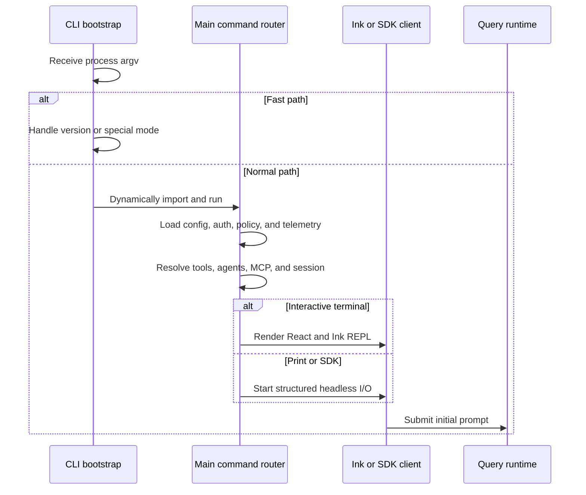
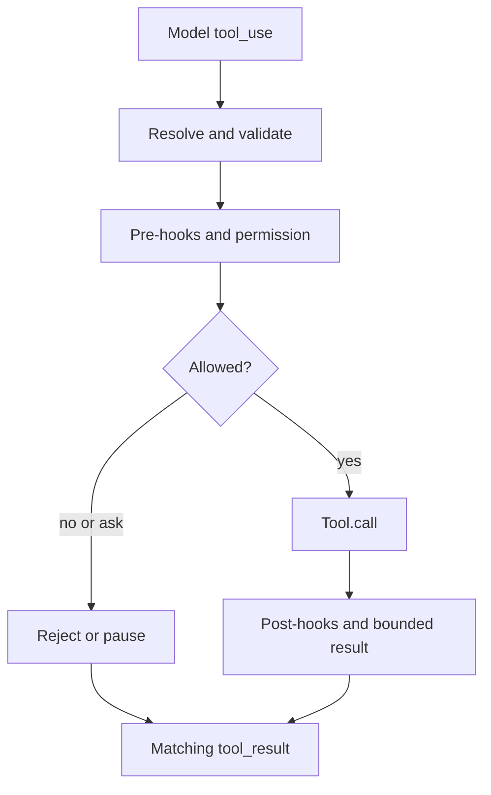

# 01 - Current Repository

> Status: verified from the files in this workspace.

[Project architecture index](README.md) | [Docs start page](../README.md) | [Diagram standard](../diagram-standard.md)

## Executive summary

This repository is a source snapshot of a mature agentic coding CLI. It is not
a FastAPI project. Its primary implementation is TypeScript running with Bun
features, React, and Ink. The core product is an interactive or headless model
loop that can inspect and modify a workspace through permission-controlled
tools.

The source combines several products in one tree:

- An optimized command-line bootstrap and Commander-based command surface.
- A React/Ink terminal application and an SDK/headless output mode.
- A streaming model client and recursive tool-use loop.
- Built-in tools, MCP tools, plugins, skills, agents, and background tasks.
- Workspace trust, rule-based permissions, classifiers, and sandbox support.
- Local JSONL session storage, history, context compaction, and memory.
- IDE discovery and RPC integration for VS Code-like and JetBrains editors.
- Remote-control, direct-connect, and multi-agent infrastructure.

**Question:** what is the shortest accurate map of the current runtime?

How to read it:

1. A small bootstrap handles fast paths before loading the full app.
2. `main.tsx` composes config, auth, tools, agents, MCP, sessions, and mode.
3. Interactive and headless surfaces converge on the same query runtime.
4. `query.ts` streams the model and repeats when tool calls exist.
5. Provider construction/normalization lives under `services/api`.
6. All tools pass through validation, hooks, permissions, scheduling, and result mapping.
7. Concrete adapters touch the operating system or integrations.
8. UI/runtime state and JSONL transcripts preserve active/history views.

## Startup path

The first entry point is `entrypoints/cli.tsx`. It performs cheap argument
inspection before importing the full application. Fast paths include version
printing, remote control, background session commands, special MCP hosts, and
other feature-gated modes. The normal path dynamically imports `main.tsx`.

`main.tsx` then performs four broad jobs:

1. Applies early process and security configuration.
2. Determines interactive, print, SDK, remote, resume, and worktree modes.
3. Builds Commander options and subcommands, settings, tools, agents, MCP
   connections, and initial state.
4. Launches either the headless runner or the React/Ink REPL.

## Core files

| File | Responsibility | Architectural importance |
| --- | --- | --- |
| `entrypoints/cli.tsx` | Minimal bootstrap and fast-path routing. | Keeps common operations from loading the whole program. |
| `main.tsx` | CLI options, initialization, mode selection, and launch. | Composition root, but currently very large. |
| `screens/REPL.tsx` | Interactive session screen and most UI orchestration. | Main React/Ink experience, also very large. |
| `QueryEngine.ts` | Stateful SDK/headless conversation lifecycle. | Wraps the shared query loop and emits SDK events. |
| `query.ts` | Streaming model/tool loop, retries, compaction, and turn state. | The central agent runtime. |
| `services/api/claude.ts` | Request construction, tool schemas, streaming, caching, and providers. | Model API boundary. |
| `Tool.ts` | Tool contract, context, results, rendering hooks, and defaults. | Shared extension point for tool implementations. |
| `tools.ts` | Built-in tool registry and runtime filtering. | Controls which capabilities the model can see. |
| `services/tools/toolExecution.ts` | Validation, hooks, permission checks, execution, and result mapping. | Main security and execution choke point. |
| `commands.ts` | Slash-command registry and environment filtering. | Interactive command extension point. |
| `state/AppStateStore.ts` | Full application state shape and defaults. | Shared state contract across UI and runtime. |
| `utils/sessionStorage.ts` | JSONL persistence, chain reconstruction, resume, and metadata. | Durable session history. |

## Query and model layer

`query.ts` is an async generator. A single user request can cause multiple API
iterations:

1. Prepare system, user, tool, and memory context.
2. Compact or repair context when needed.
3. Stream a model response.
4. Collect assistant text, thinking, and tool-use blocks.
5. Execute tools and append matching tool-result messages.
6. Refresh dynamic tools and call the model again.
7. Stop on a final response, abort, limit, or unrecoverable error.

The API layer supports direct Anthropic access and provider-specific clients
for Bedrock, Vertex, and Foundry. It constructs tool schemas, handles deferred
tool discovery, applies prompt caching, manages streaming fallbacks, and
normalizes message history before each request.

`QueryEngine.ts` is not a second agent algorithm. It owns SDK-facing session
state, translates internal messages into external events, tracks usage and
budgets, records transcripts, and delegates the actual loop to `query.ts`.

## Tool subsystem

The `Tool` type in `Tool.ts` is broader than a typical function-call contract.
A tool can define:

- A Zod input schema and optional output schema.
- Runtime validation and tool-specific permission checks.
- Read-only, destructive, concurrency, and interrupt behavior.
- Model-facing description and prompt text.
- Progress callbacks and context modifiers.
- Mapping from internal output to an API `tool_result` block.
- React renderers for use, progress, rejection, errors, and results.
- Search metadata, aliases, MCP metadata, and deferred loading.

`buildTool` supplies conservative defaults. In particular, tools are treated as
not read-only and not concurrency-safe unless they say otherwise.

`tools.ts` assembles built-ins, applies feature flags, filters blanket deny
rules, hides primitive tools in REPL mode, merges MCP tools, sorts for prompt
cache stability, and de-duplicates names with built-ins taking precedence.

Tool calls pass through this pipeline:

How to read it:

1. Alias lookup and Zod/value validation happen before policy.
2. Hooks and layered deny/ask/allow/mode checks operate on validated input.
3. Ask may pause; denial still settles the provider tool trajectory.
4. Only an allowed call reaches the implementation.
5. Post-hooks and result mapping enforce output bounds.
6. Every path returns one matching tool-result message to `query.ts`.

Read-only or explicitly concurrency-safe calls can run in parallel. Mutating
or uncertain calls are serialized. A streaming executor can begin safe tools
as soon as complete tool-use blocks arrive, while still emitting final results
in model order.

## Permissions and trust

Permission handling is layered rather than a single prompt:

1. Workspace trust controls whether project configuration can be used.
2. Tool schemas and value validation reject malformed requests.
3. Blanket and content-specific deny rules take priority.
4. Ask rules can force explicit approval.
5. Each tool performs its own path or command checks.
6. Permission mode may allow, classify, prompt, or deny.
7. Hooks can participate before and after the decision.
8. Background contexts fail closed when no prompt can be displayed.

Shell tools add command parsing, dangerous-pattern checks, path validation,
sandbox selection, and destructive-operation warnings. File tools normalize
paths and protect sensitive configuration directories.

## React and Ink UI

The UI is not a browser app. Ink provides terminal primitives such as `Box`
and `Text`, while React coordinates state and rendering.

Important layers are:

| Area | Current implementation |
| --- | --- |
| Root providers | `components/App.tsx`, `state/AppState.tsx`, context providers. |
| Main screen | `screens/REPL.tsx`. |
| Prompt | `components/PromptInput/`. |
| Transcript | `components/Messages.tsx`, `components/messages/`, virtual list support. |
| Tool rendering | Tool-specific `UI.tsx` files and shared message components. |
| Permissions | `components/permissions/`. |
| Design system | `components/design-system/`. |
| Dialogs | Settings, MCP, tasks, agents, trust, resume, diff, and onboarding components. |
| Input system | `keybindings/`, `vim/`, global and command hooks. |

App state uses a small external store with `getState`, immutable `setState`, and
subscriptions. React reads slices through `useSyncExternalStore`, avoiding a
full-tree render for unrelated state updates.

## Commands, skills, plugins, and MCP

These are related but distinct extension mechanisms:

| Mechanism | Purpose | Where it enters |
| --- | --- | --- |
| Slash command | User-invoked local UI action or prompt expansion. | `commands.ts`, `commands/`. |
| Skill | Reusable model instructions, usually from `SKILL.md`. | `skills/`, `tools/SkillTool/`. |
| Plugin | Package that may provide commands, agents, skills, hooks, MCP, LSP, and settings. | `utils/plugins/`, `services/plugins/`. |
| MCP server | External process or service exposing tools, resources, and prompts. | `services/mcp/`, `tools/MCPTool/`. |
| Agent definition | Specialized prompt, model, tools, permissions, and optional isolation. | `tools/AgentTool/`. |

Plugins support built-in, session, and marketplace sources. The loader validates
manifests and resolves optional component paths. Enabled plugin components are
merged into app state and can be refreshed without recreating the process.

MCP connections support stdio and network transports, OAuth, server approval,
resources, prompts, elicitations, and dynamic tool loading. MCP tools join the
same registry and permission path as built-in tools.

## Agents and tasks

`AgentTool` is a meta-tool. It does not perform the requested coding action
itself. It selects an agent definition, builds a worker-specific tool pool and
context, then starts another query loop.

Supported paths include synchronous subagents, background agents, in-process
teammates, tmux-based teammates, worktree isolation, resume, and feature-gated
remote execution. Worker permissions are derived deliberately; they are not
an unrestricted copy of the parent's capabilities.

Tasks are represented in application state and rendered in dedicated Ink
components. Implementations cover shell tasks, local agents, in-process
teammates, remote agents, and longer-lived background work.

## Sessions, memory, and context

Sessions are persisted as append-only JSONL records under a project-specific
configuration directory. Records carry UUID and parent UUID relationships, so
resume logic reconstructs a conversation chain rather than trusting file order
alone. The storage layer also records snapshots, compaction boundaries,
attribution, titles, tags, task summaries, and worktree state.

The runtime contains several context controls:

- Automatic and manual compaction.
- Micro-compaction and feature-gated history collapse.
- Tool-result persistence when output is too large.
- Project instructions and nested memory attachments.
- Session memory and cross-session memory discovery.
- File history snapshots used for recovery and rewind behavior.

## IDE and remote boundaries

The repository contains IDE integration client code, not the VS Code extension
itself. `utils/ide.ts` discovers extension lockfiles under the user config
directory, verifies process and workspace matches, and connects by WebSocket or
SSE with an optional token. IDE RPC then flows through the MCP client layer.

The current IDE seam supports selection, open-file notifications, diff-related
capabilities, diagnostics/LSP collaboration, and a small internal VS Code MCP
notification channel.

The `bridge/`, `remote/`, `server/`, and `cli/transports/` areas cover different
remote-control and session transport scenarios. They should not be treated as
one protocol. The target architecture should consolidate client-facing behavior
behind one versioned FastAPI contract.

## Directory map

| Directory | Files | Main concern |
| --- | ---: | --- |
| `utils/` | 564 | Configuration, persistence, paths, auth, sandboxing, plugins, prompts, and platform adapters. |
| `components/` | 389 | React/Ink presentation and interaction. |
| `commands/` | 207 | Slash commands and command-specific screens. |
| `tools/` | 184 | Built-in tool definitions and rendering. |
| `services/` | 130 | API, MCP, LSP, analytics, plugins, compacting, policy, and external integration. |
| `hooks/` | 104 | UI behavior, query controls, integrations, and permissions. |
| `ink/` | 96 | Ink renderer and terminal internals. |
| `bridge/` | 31 | Remote-control environment and session bridge. |
| `skills/` | 20 | Bundled skills and skill loading. |
| `cli/` | 19 | Headless I/O, handlers, and transports. |
| `state/` | 6 | External app store, React provider, selectors, and persistence side effects. |

## What is missing from this snapshot

- No `package.json`, lockfile, TypeScript config, or build script.
- No Python package, FastAPI app, or Pydantic runtime implementation.
- No source for the VS Code extension that creates the IDE lockfile/server.
- No checked-in unit, integration, or end-to-end tests.
- The `.git` directory in this workspace is empty, so history and status are
  unavailable.
- Several feature-gated imports point to modules not present in the snapshot.

These gaps mean the source is valuable as an architecture reference, but it is
not currently a reproducible application checkout.

## Repository anomaly

`utils/permissions/filesystem.ts` contains an unrelated RepurposeAI SRS inside
a JSDoc comment from approximately lines 294 through 1650. It does not execute,
but it adds more than one thousand unrelated lines to a security-sensitive file
and can hide review mistakes. Treat removal as a separate cleanup change after
confirming provenance; this documentation does not modify it.

## Practical navigation

Use this order when tracing a behavior:

1. Start at `entrypoints/cli.tsx` and `main.tsx` for launch and mode selection.
2. Follow interactive behavior into `screens/REPL.tsx`; follow SDK behavior
   into `QueryEngine.ts` and `cli/print.ts`.
3. Follow model turns into `query.ts` and `services/api/claude.ts`.
4. Follow tool calls into `services/tools/toolExecution.ts`, the permission
   modules, and the matching directory under `tools/`.
5. Follow durable state into `utils/sessionStorage.ts` and settings modules.
6. Follow extension behavior into `utils/ide.ts`, `services/mcp/`, and the
   relevant plugin or bridge module.
