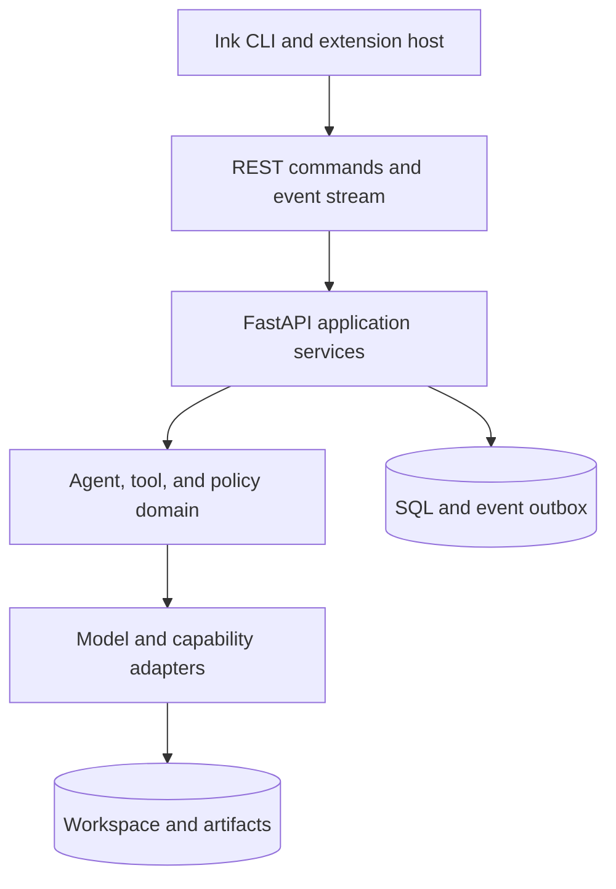
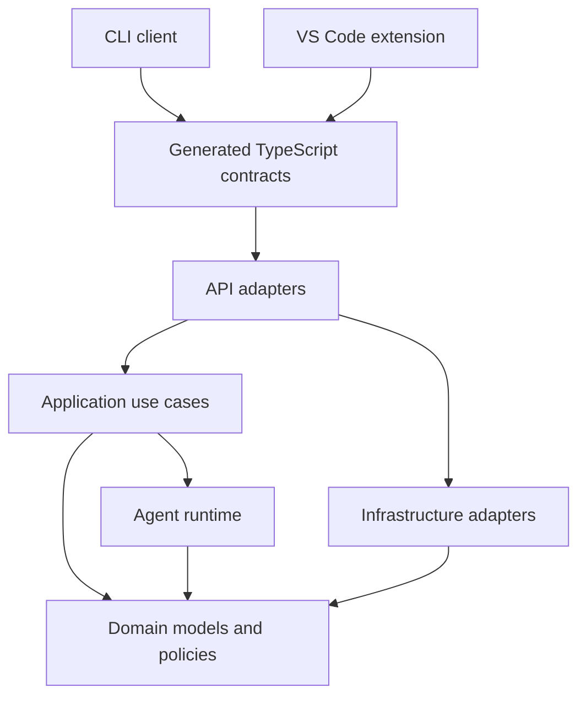
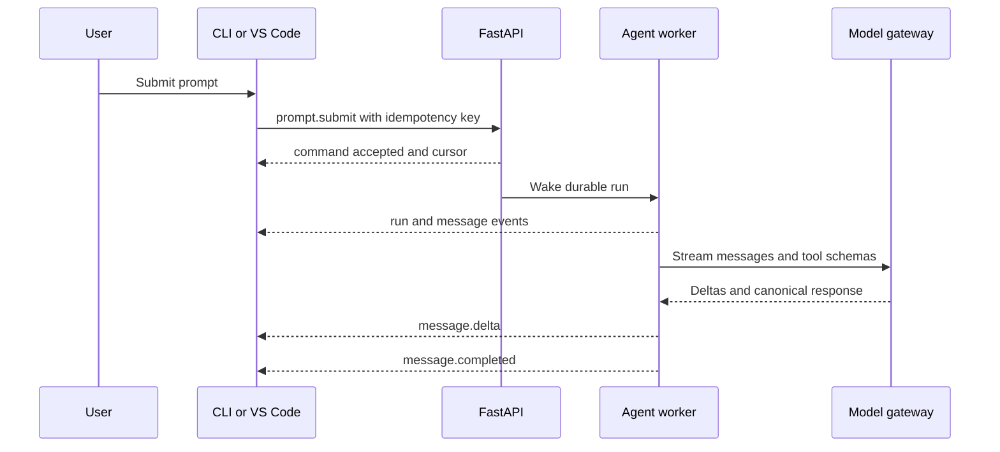
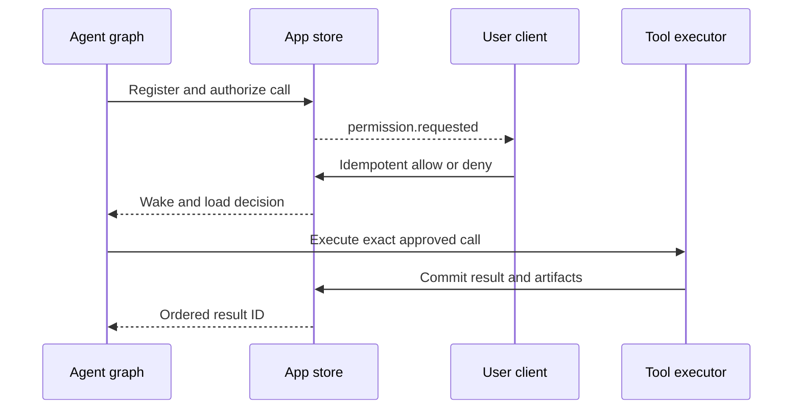

# 02 - Target System

> Status: proposed architecture for the new implementation.

[Project architecture index](README.md) | [Docs start page](../README.md) | [Diagram standard](../diagram-standard.md)

## Goal

Create one agent runtime that behaves consistently in the terminal and VS Code.
The runtime will be Python and FastAPI; the terminal interface will remain
TypeScript with React/Ink; the editor integration will be a TypeScript VS Code
extension.

The first release should be local-first:

- FastAPI binds only to loopback.
- The backend process runs with access to one approved workspace.
- The CLI and extension are clients of the same runtime.
- The model key and tool permissions remain in the backend.
- A random local token authenticates every client connection.

This avoids duplicating the agent loop in two clients and avoids sending local
filesystem operations through a hosted control plane.

## System boundaries

**Question:** what are the target ownership boundaries?



How to read it:

1. Presentation surfaces own input/rendering; extension webview stays behind its host.
2. Versioned commands/events are the only client-runtime contract.
3. Application services own auth, transactions, idempotency, and use cases.
4. Domain runtime owns graph/tool/policy decisions without UI/provider imports.
5. Infrastructure adapters own concrete SDK/OS/MCP behavior.
6. SQL/outbox is canonical product/event state; large bytes live in artifacts/workspace.

## Ownership model

| Concern | FastAPI backend | React/Ink CLI | VS Code extension |
| --- | --- | --- | --- |
| Conversation and turn state | Owns | Renders | Renders |
| Model API credentials and calls | Owns | Never sees | Never sees |
| Tool registry and execution | Owns | Displays progress | Displays progress and editor context |
| Permission decision policy | Owns | Collects human choice | Collects human choice |
| Session persistence | Owns | Requests lists/resume | Requests lists/resume |
| Terminal keybindings | No | Owns | No |
| Editor selection and diagnostics | Requests only | No | Owns |
| Diff presentation | Produces artifact | Terminal renderer | Native editor diff |
| Connection recovery | Supports replay | Owns client retry | Owns client retry |
| Protocol types | Publishes schema | Generated client | Generated client |

## Key decisions

### One backend per user session group

Run one local daemon that can host multiple sessions. A CLI command can discover
or start it. The VS Code extension connects to the same daemon. Session-level
locks prevent two clients from submitting conflicting prompts unless the user
explicitly enables shared control.

### Backend owns orchestration

Do not place tool scheduling, model retries, or permission rules in React hooks.
Those rules must behave the same in a terminal, VS Code, automated test, or
future web client.

### Clients own presentation capabilities

The backend emits semantic events such as `tool.progress` and
`permission.requested`; it does not emit Ink JSX or webview HTML. Each client
chooses the best renderer for its environment.

### Append-only events plus queryable state

Persist normalized state for fast reads and append domain events for replay,
debugging, and client reconnect. A client receives a snapshot and then events
with monotonically increasing sequence numbers.

### Local profile before hosted profile

The local profile uses one process and simple persistence. A future hosted
profile can split the control plane from local runners without changing the
client protocol.

## Current-to-target mapping

| Current TypeScript source | Target Python or client module |
| --- | --- |
| `entrypoints/cli.tsx`, `main.tsx` | CLI launcher plus FastAPI app lifespan. |
| `screens/REPL.tsx` | Smaller feature-oriented React/Ink screens. |
| `QueryEngine.ts`, `query.ts` | `backend/runtime/agent_loop.py` and session service. |
| `services/api/claude.ts` | `backend/infrastructure/models/` provider adapters. |
| `Tool.ts` | Python `Tool` protocol, Pydantic input models, and result types. |
| `tools.ts` | Python tool registry and capability filtering. |
| `services/tools/` | Python executor, scheduler, hooks, and result mapper. |
| `hooks/toolPermission/`, `utils/permissions/` | Python policy service and permission request workflow. |
| `utils/sessionStorage.ts` | Repository interface plus SQLite/PostgreSQL and JSONL adapters. |
| `services/mcp/` | Python MCP connection manager and tool adapters. |
| `utils/plugins/` | Python plugin manifest loader with explicit interfaces. |
| `utils/ide.ts` | Extension registration and capability protocol. |
| `bridge/`, `server/`, `cli/transports/` | One versioned REST/WebSocket transport layer. |

## Proposed repository layout

```text
project-root/
|-- apps/
|   |-- backend/
|   |   |-- pyproject.toml
|   |   |-- src/agent_backend/
|   |   |   |-- api/
|   |   |   |-- application/
|   |   |   |-- domain/
|   |   |   |-- infrastructure/
|   |   |   |-- runtime/
|   |   |   `-- main.py
|   |   `-- tests/
|   |-- cli/
|   |   |-- package.json
|   |   |-- src/
|   |   |   |-- app/
|   |   |   |-- components/
|   |   |   |-- features/
|   |   |   |-- state/
|   |   |   `-- transport/
|   |   `-- tests/
|   `-- vscode-extension/
|       |-- package.json
|       |-- src/
|       |   |-- backend/
|       |   |-- commands/
|       |   |-- context/
|       |   |-- views/
|       |   `-- extension.ts
|       `-- tests/
|-- packages/
|   |-- protocol-ts/
|   |-- ink-design-system/
|   `-- test-fixtures/
|-- schemas/
|   |-- openapi.json
|   `-- events/
|-- docs/
|-- scripts/
|-- Makefile
`-- README.md
```

The existing TypeScript snapshot can remain under a clearly named
`reference/` area during migration, or stay in place temporarily. It should not
be mixed into the new package roots because its imports and missing manifests
cannot form the new build graph.

## Dependency rules

**Question:** which direction may source-code dependencies point?



How to read it:

1. API and application depend inward on domain contracts.
2. Runtime and infrastructure implement/use domain interfaces without reversing control.
3. Clients depend on generated protocol, never Python internals.
4. Generated types describe API data; they do not grant webview/clients authority.

- Domain code imports no FastAPI, SQLAlchemy, Anthropic SDK, or UI package.
- Application services depend on domain interfaces, not concrete adapters.
- Infrastructure implements model, storage, process, filesystem, MCP, and
  clock interfaces.
- API routes translate transport payloads into application commands.
- TypeScript clients depend only on generated protocol types and their own UI.
- Webview code cannot import Node, VS Code, filesystem, or secret APIs.

## End-to-end prompt lifecycle

The lifecycle is split into a command/model flow and a tool/approval flow.

**Question:** how does a prompt reach a canonical model response?



**Question:** how does a requested tool pause and resume safely?



The graph calls the model again only after every call in the assistant batch
has one terminal result.

## Local and hosted profiles

| Capability | Local first | Future hosted |
| --- | --- | --- |
| API location | Loopback daemon | Cloud control plane plus local runner. |
| Workspace tools | Same Python process or isolated child | Local runner only. |
| Database | SQLite plus JSONL/artifacts | PostgreSQL plus object storage. |
| Event delivery | In-process broker and WebSocket | Durable broker and gateway. |
| Authentication | Random local bearer token | User OAuth plus runner credentials. |
| Scale | One user, several sessions | Many users and distributed runners. |

Do not add Kafka, Redis, or a distributed worker system to the local MVP. The
interfaces should allow those adapters later, but the first architecture should
optimize for correctness, inspectability, and safe local execution.

## Non-goals for the first release

- Browser or mobile clients.
- Multi-tenant hosted execution.
- Remote shell execution.
- Agent swarms and worktree automation.
- Marketplace installation from arbitrary remote sources.
- General-purpose shell access before permission rules and sandboxing work.
- Full compatibility with every feature flag in the reference snapshot.

The first complete slice is one local session, streamed text, safe read/search
tools, explicit edit approval, persistence, reconnect, and both clients using
the same protocol.
