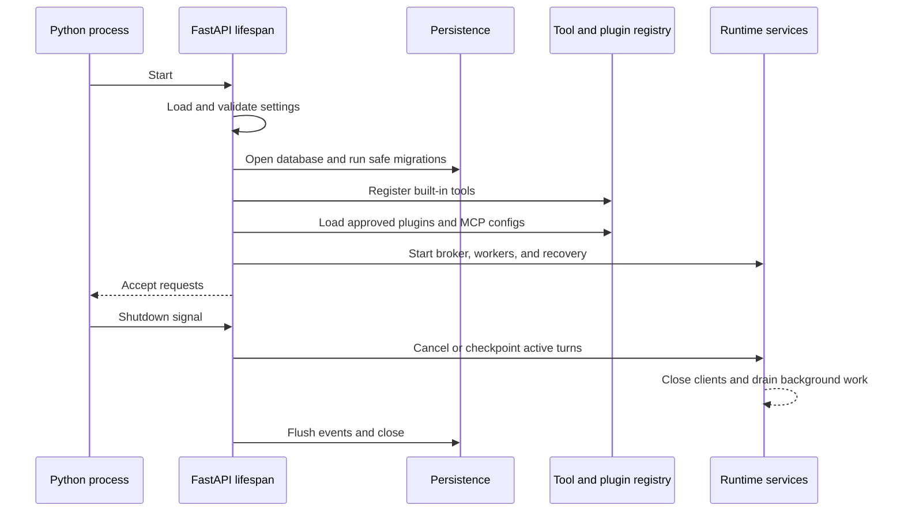
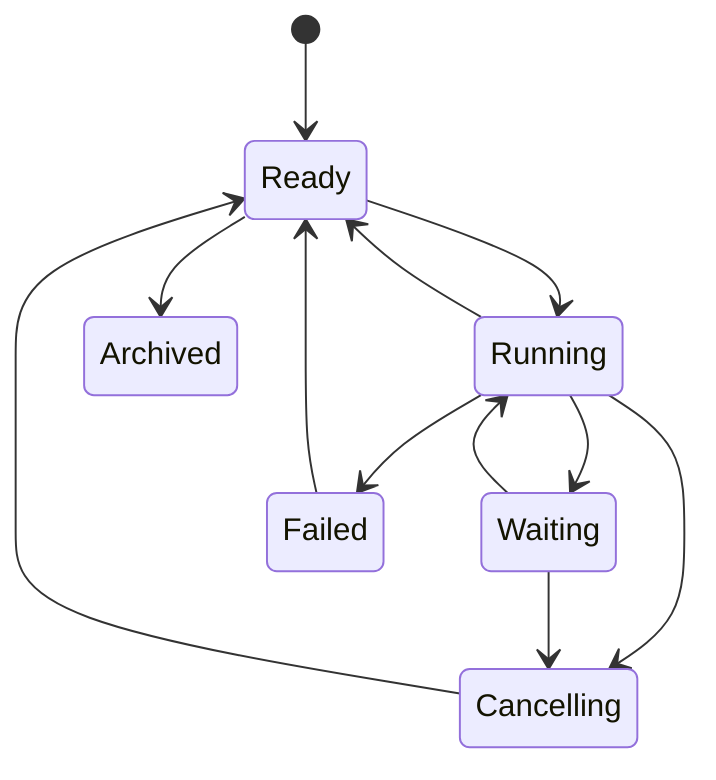
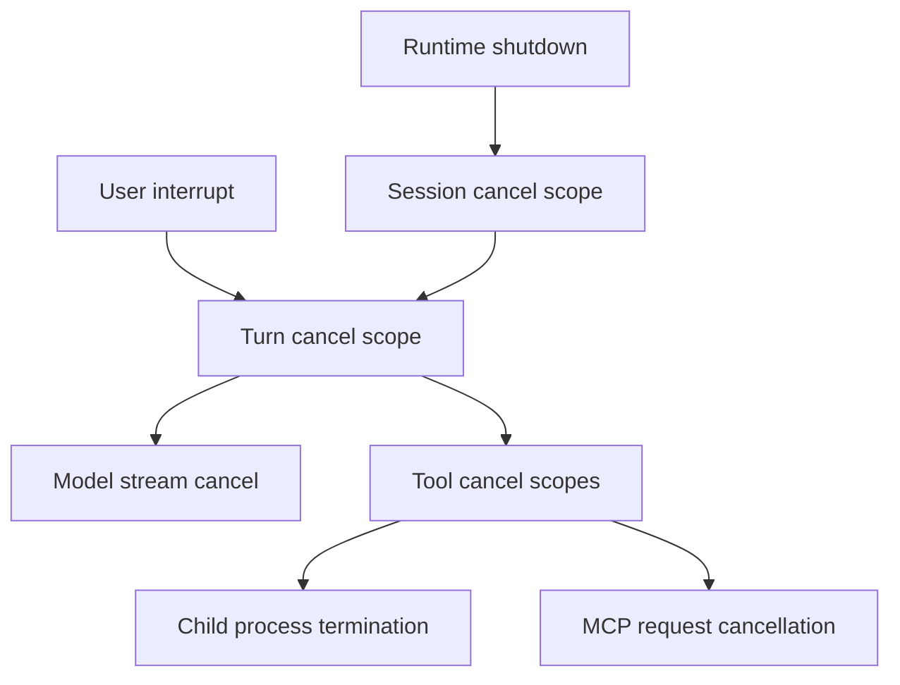

# 03 - FastAPI Backend

> Status: implementation specification for the Python service.

[Project architecture index](README.md) | [Docs start page](../README.md) | [Diagram standard](../diagram-standard.md)

> Normative details: [Runtime SRS](../runtime-srs/README.md),
> [API and Event Protocol](../runtime-srs/04-api-and-event-protocol.md),
> [Data Model](../runtime-srs/05-data-model.md), and
> [Python Types and Performance](../runtime-srs/06-python-types-and-performance.md).

## Responsibility

The FastAPI backend is the local agent daemon and the single source of truth for
all behavior shared by the CLI and VS Code extension. It owns:

- Runtime discovery and client authentication.
- Session creation, resume, cancellation, and state.
- Conversation history and context-window preparation.
- Model provider calls and streaming.
- Tool discovery, validation, permissions, scheduling, and execution.
- MCP connections, plugins, skills, and agent definitions.
- Persistence, replay, artifacts, audit events, and diagnostics.

It does not own terminal layout, webview HTML, editor decorations, keybindings,
or client-specific navigation.

## Package structure

```text
apps/backend/src/agent_backend/
|-- main.py
|-- api/
|   |-- dependencies.py
|   |-- errors.py
|   |-- middleware.py
|   |-- routes/
|   |   |-- health.py
|   |   |-- runtime.py
|   |   |-- sessions.py
|   |   |-- permissions.py
|   |   |-- tools.py
|   |   `-- extensions.py
|   `-- websocket/
|       |-- endpoint.py
|       |-- connection_manager.py
|       `-- protocol.py
|-- application/
|   |-- commands/
|   |-- queries/
|   |-- dto/
|   `-- services/
|       |-- session_service.py
|       |-- prompt_service.py
|       |-- permission_service.py
|       `-- extension_service.py
|-- domain/
|   |-- agents/
|   |-- events/
|   |-- messages/
|   |-- permissions/
|   |-- sessions/
|   |-- tools/
|   `-- errors.py
|-- runtime/
|   |-- agent_loop.py
|   |-- context_manager.py
|   |-- event_bus.py
|   |-- scheduler.py
|   `-- turn_controller.py
|-- infrastructure/
|   |-- filesystem/
|   |-- models/
|   |-- mcp/
|   |-- persistence/
|   |-- plugins/
|   |-- process/
|   `-- security/
`-- settings.py
```

## Layer roles

| Layer | May know about | Must not know about |
| --- | --- | --- |
| `domain` | Domain types and pure policies. | FastAPI, SQLAlchemy, provider SDKs, React, VS Code. |
| `runtime` | Domain types and runtime interfaces. | HTTP request objects and UI rendering. |
| `application` | Use cases, transactions, ports, and DTOs. | Concrete database or provider details. |
| `infrastructure` | SDKs, filesystem, subprocesses, databases, MCP. | Client presentation decisions. |
| `api` | FastAPI, auth, transport schemas, application services. | Tool implementation details. |

## Application lifecycle

Use a FastAPI lifespan context, not import-time side effects. Startup order is
important because a tool call must never run before policy and persistence are
ready.



How to read it:

1. Settings validate before database, registry, or network readiness.
2. Migrations/storage become available before dynamic capabilities load.
3. Registry loads built-ins, then approved plugin/MCP definitions.
4. Runtime starts event transport, workers, and reconciliation before readiness.
5. Shutdown drains/checkpoints work and closes clients before storage.

### Lifespan resources

Store long-lived resources in a typed application container attached to
`app.state`:

- Settings snapshot.
- Database engine and repositories.
- Tool and agent registries.
- Model provider registry.
- MCP connection manager.
- Session runtime manager.
- Event broker and WebSocket connection manager.
- Process-level task group and shutdown signal.

Route dependencies retrieve interfaces from this container. Tests can replace
the container with in-memory adapters.

## Core services

### Session service

Creates sessions, validates workspace roots, restores state, lists history, and
coordinates session ownership. It does not call the model directly.

### Prompt service

Accepts an idempotent prompt command, checks that the session can start a turn,
records the user message, and hands control to a `TurnController`.

### Turn controller

Owns one active turn. It coordinates durable cancellation IDs, pending wait
IDs, running operation IDs, budget counters, and the terminal result. A live
future/callback never owns permission state. A session may have at most one
foreground turn in the MVP.

### Agent loop

Builds model context, streams responses, detects tool requests, dispatches tool
calls, appends results, and repeats until a terminal response. It exposes domain
events rather than transport-specific payloads.

### Permission service

Combines workspace trust, rules, tool-specific checks, runtime mode, and human
decisions. Pending requests are durable enough to survive a client reconnect.

### Event broker

Assigns a strictly increasing sequence number per session, persists important
events, and fans them out to connected clients. Slow clients must not block the
agent loop; each connection gets a bounded queue and an explicit overflow
resync response.

## Session state machine

**Question:** what small set of session states should clients navigate?



How to read it:

1. Session is a container; precise foreground run status carries detailed activity.
2. `Waiting` projects permission, user, child, retry, or capacity reasons.
3. Cancellation settles/checkpoints the active run before session returns ready.
4. A failed run can be repaired/resumed without deleting its history.
5. Archive is allowed only after active control operations settle.

Persisted state and live process state should be distinct. After a backend
restart, reconciliation compares run rows, operation leases, and graph
checkpoints. A minimal first slice may terminalize unsupported in-flight work as
interrupted, but it must preserve the run and never silently reset it to Ready.

## REST API

Use `/api/v1` from the beginning. The route names below are the stable resource
surface; exact payloads are defined in the protocol guide.

| Method | Route | Purpose |
| --- | --- | --- |
| `GET` | `/health/live` | Process liveness only. |
| `GET` | `/health/ready` | Database, registry, and runtime readiness. |
| `GET` | `/runtime` | Runtime version, capabilities, and protocol versions. |
| `POST` | `/sessions` | Create a session for an approved workspace. |
| `GET` | `/sessions` | List resumable sessions. |
| `GET` | `/sessions/{session_id}` | Return the current session snapshot. |
| `POST` | `/sessions/{session_id}/prompts` | Submit an idempotent user prompt. |
| `POST` | `/sessions/{session_id}/interrupt` | Request cooperative cancellation. |
| `POST` | `/sessions/{session_id}/archive` | Archive a ready or failed session. |
| `GET` | `/sessions/{session_id}/events` | Replay events after a sequence number. |
| `POST` | `/permissions/{request_id}/decision` | Resolve a pending permission request. |
| `GET` | `/tools` | List model-visible tools and JSON Schemas. |
| `GET` | `/agents` | List enabled agent definitions. |
| `POST` | `/extensions/register` | Register an editor client and capabilities. |

Commands return quickly. Long-running progress is delivered on the WebSocket,
not held open as one HTTP response.

## WebSocket endpoint

Use one bidirectional endpoint per session:

```text
GET /api/v1/sessions/{session_id}/stream?after={sequence}
Authorization: Bearer {local_runtime_token}
```

The server first sends a session snapshot or a replay gap response, then all
events after `after`. The same connection accepts control messages such as
prompt submission, permission resolution, and interrupt. REST alternatives
remain available for scripts and easier testing.

Connection rules:

- Authenticate before accepting the socket.
- Validate Origin when an Origin header is present.
- Send heartbeat frames and close stale connections.
- Bound outgoing queues by count and bytes.
- Never let one client consume another client's pending permission request.
- Include session, client, event, and correlation IDs in logs.
- Require a new snapshot if requested history has been compacted.

## Concurrency model

FastAPI runs on ASGI and AnyIO. Use structured task groups for long-lived work.
Do not create untracked fire-and-forget tasks.

| Work | Concurrency rule |
| --- | --- |
| Different sessions | May run concurrently within configured limits. |
| One session's foreground turns | Serialize in the MVP. |
| Safe read tools in one model response | Run concurrently with a semaphore. |
| Mutating or uncertain tools | Run serially. |
| MCP calls | Respect each server's declared safety and connection limits. |
| Database writes | Short transactions; never hold one over a model call. |
| Client broadcasting | Per-connection bounded queues. |

Use a process-wide capacity limiter for model calls, one for subprocesses, and
one per MCP server. Limits belong in settings and appear in diagnostics.

## Cancellation

Cancellation is cooperative and hierarchical:

**Question:** how does one stop request reach only the work it owns?



How to read it:

1. Runtime shutdown selects sessions according to drain/cancel policy.
2. User interrupt targets the foreground turn, not unrelated background agents.
3. Turn signal reaches model and tool operations through owned cancellation IDs.
4. Tool cancellation includes complete subprocess trees and remote/MCP operation IDs.
5. Stop-one/stop-all child behavior is specified separately in
   [Multi-Agent Control](../cli-architecture/03-multi-agent-control.md).

A tool declares whether a new prompt may cancel it or must wait. Destructive
operations default to blocking interruption during the critical write section.
Subprocess termination should first request graceful exit, then escalate after
a bounded timeout.

## Persistence

Define repository interfaces before choosing storage details:

- `SessionRepository`
- `MessageRepository`
- `EventRepository`
- `ToolRunRepository`
- `PermissionRepository`
- `ArtifactRepository`
- `RuntimeLeaseRepository`

Recommended local profile:

- SQLite in WAL mode for normalized state and indexes.
- Append-only JSONL export per session for inspection and portability.
- Filesystem artifact directory for diffs, images, and large tool results.
- Atomic writes, `0600` files, and `0700` directories on POSIX.

Recommended hosted profile later:

- PostgreSQL for normalized state and events.
- Object storage for large artifacts.
- A durable broker only when multiple backend instances require it.

Do not make the model conversation depend on reconstructing state from UI
messages. Persist explicit domain fields and retain the raw provider message as
an optional audit payload.

## Model provider boundary

The runtime should depend on a small streaming interface:

```python
class ModelProvider(Protocol):
    async def stream(
        self,
        request: ModelRequest,
        *,
        cancellation: CancellationToken,
    ) -> AsyncIterator[ModelEvent]: ...
```

Provider adapters translate normalized messages, tool schemas, thinking
configuration, cache hints, and usage into provider SDK types. Retry policy,
rate-limit normalization, and request IDs live in the adapter. Context
compaction decisions stay in the runtime because they affect session state.

## Configuration

Use `pydantic-settings` with explicit sources and precedence:

1. Safe built-in defaults.
2. User config file.
3. Workspace config after trust.
4. Environment variables.
5. CLI overrides for the current process.

Separate settings into typed groups: server, auth, model, storage, tools,
permissions, MCP, plugins, logging, and limits. Redact secret fields in all
representations. Settings that affect advertised schemas should be frozen for
the runtime or session to prevent validation drift.

## Error contract

Domain exceptions map to one API envelope:

```json
{
  "error": {
    "code": "permission_request_not_found",
    "message": "The permission request is no longer pending.",
    "request_id": "req_01...",
    "retryable": false,
    "details": {}
  }
}
```

Expected failures are typed and safe to show. Unexpected exceptions receive an
opaque request ID; stack traces remain in local logs. Tool exceptions are
converted into tool results so the model can recover, unless they indicate
runtime corruption or cancellation.

## Health and observability

Readiness should check only local dependencies required to accept work. A model
provider outage does not make the process unready; it produces a provider
status and a retryable turn error.

Minimum metrics:

- Active sessions and turns.
- Model request latency, first-token latency, retries, and tokens.
- Tool queue delay, execution duration, result size, and failures.
- Permission wait duration and decision source.
- WebSocket connections, replay counts, queue overflows, and reconnects.
- Database transaction latency and event sequence gaps.

Logs are structured JSON in daemon mode and readable text in foreground debug
mode. Never log prompts, file contents, commands, or model keys by default.

## Test strategy

| Test layer | What to verify |
| --- | --- |
| Domain unit | State transitions, permission precedence, schema rules, and budgets. |
| Runtime unit | Tool scheduling, cancellation, retries, compaction, and terminal conditions. |
| API contract | Status codes, error envelopes, OpenAPI stability, auth, and idempotency. |
| WebSocket integration | Snapshot, replay, ordering, reconnect, overflow, and heartbeat. |
| Infrastructure integration | SQLite/PostgreSQL, filesystem safety, subprocess cleanup, and MCP adapters. |
| End-to-end | Prompt to streamed result, approval, edit, persistence, restart, and resume. |

Use fake model and tool adapters for deterministic tests. Keep a small set of
provider smoke tests behind explicit credentials; never make normal CI depend
on a live model.

## Backend definition of done

The backend MVP is complete when it can create a trusted local session, accept
a prompt, stream a deterministic fake-model response, execute read/search
tools, request and resolve edit permission, persist the result, recover after a
restart, and replay ordered events to two independently reconnecting clients.
