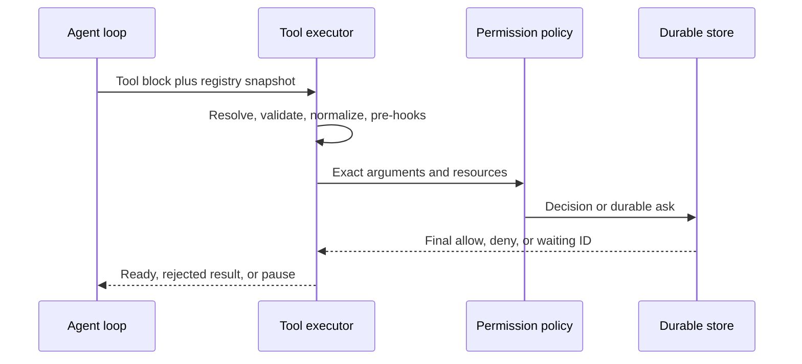
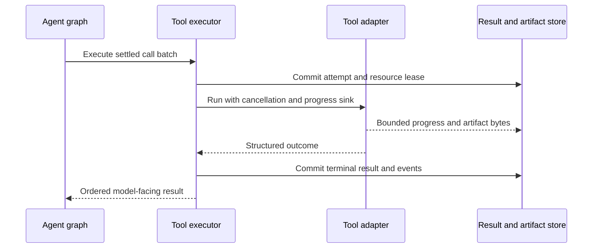
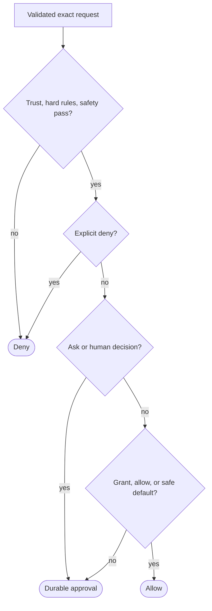
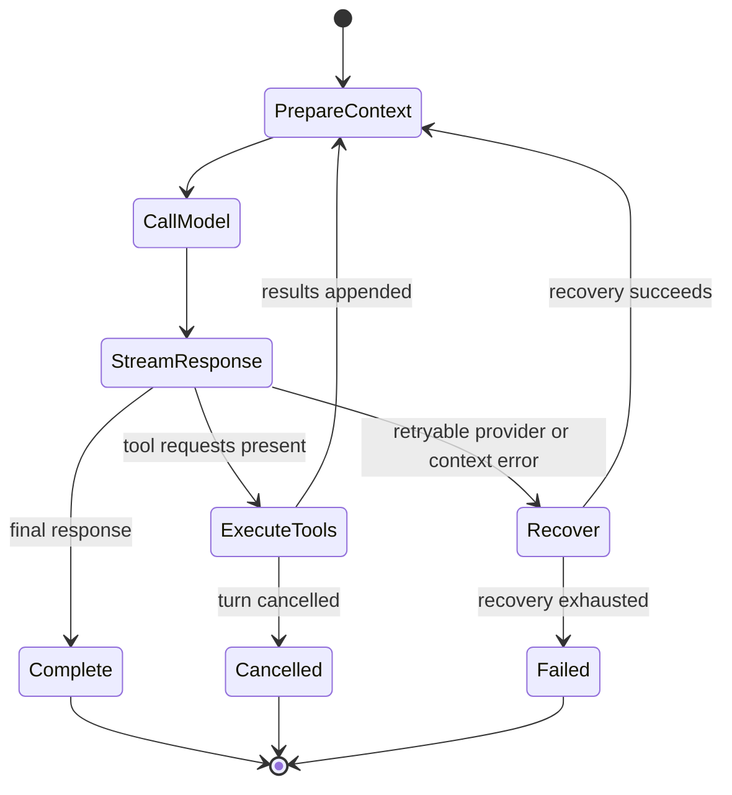

# 04 - Tool and Agent Runtime

> Status: detailed Python design based on the verified TypeScript behavior and
> the Pydantic foundation in `PYTHON_TOOL_IMPLEMENTATION.md`.

[Project architecture index](README.md) | [Docs start page](../README.md) | [Diagram standard](../diagram-standard.md)

> Normative details: [Tool Contract](../runtime-srs/01-tool-contract.md),
> [Complete Tool Catalog](../runtime-srs/02-tool-catalog.md), and the separate
> [Agent Architecture](../agent-architecture/README.md).

## Core invariant

A model request is data, never authority. Every requested action must pass the
same pipeline regardless of whether the prompt came from the CLI, VS Code, a
resumed session, or a subagent.

```text
tool definition -> schema validation -> value validation -> policy decision
       -> scheduled execution -> bounded result -> model tool-result message
```

## Python contract

Keep the first contract small. The existing Python design already establishes
the right primitives:

- Pydantic input model for JSON Schema and runtime validation.
- `Tool` protocol for behavior.
- `ToolContext` for dependencies and session state.
- `ToolResult` for model-facing content and metadata.
- Registry, permission policy, and executor as separate services.

Extend it only when a real tool needs the capability. The target interface can
grow toward this shape:

```python
class Tool(Protocol[InputT, OutputT]):
    name: str
    description: str
    input_model: type[InputT]

    async def call(
        self,
        args: InputT,
        context: ToolContext,
        progress: ToolProgressReporter,
    ) -> ToolResult[OutputT]: ...

    async def validate(
        self,
        args: InputT,
        context: ToolContext,
    ) -> ValidationDecision: ...

    async def permission(
        self,
        args: InputT,
        context: ToolContext,
    ) -> PermissionDecision: ...

    def concurrency(self, args: InputT) -> ConcurrencyClass: ...
    def interrupt_behavior(self, args: InputT) -> InterruptBehavior: ...
```

Do not place React render methods in the Python contract. The backend emits
semantic tool events; each client renders them.

## Registry

The registry owns the model-visible namespace. It should:

- Reject duplicate primary names at startup.
- Support explicit migration aliases without advertising aliases as new tools.
- Produce stable, sorted API definitions.
- Filter tools by permission context, feature set, client capability, and
  agent restrictions.
- Merge MCP tools without allowing them to shadow built-ins.
- Support deferred tools through an explicit discovery state.
- Freeze the advertised schema set for one model request.

Registry snapshots need an ID or hash. Record that value on every model request
and tool run so schema drift is diagnosable.

## Execution sequence

The complete execution is split into authorization and execution so each
sequence remains readable.

**Question:** how does a tool request reach a final policy decision?



**Question:** what happens after a call is ready?



How to read the two sequences:

1. Resolve against the exact registry snapshot and validate before asking policy.
2. A durable waiting ID pauses the graph; a deny becomes a paired tool result.
3. On allow, commit the attempt/resource lease before invoking the adapter.
4. Progress is bounded and non-authoritative; the terminal outcome/event is canonical.
5. Return model-facing results in original tool-call order even when safe calls overlap.

## Validation stages

### Schema validation

Use `model_validate` and catch `pydantic.ValidationError`. Reject unknown
fields by default. Return a concise path-aware error to the model and keep full
diagnostics in local logs.

### Value validation

Schema-valid input can still be unsafe or impossible. Examples include a path
outside the workspace, an invalid edit range, an unknown agent type, or a shell
timeout above policy. This stage returns a typed validation decision and does
not ask for permission.

### Observable normalization

Normalize paths, aliases, and derived fields once. Preserve the original model
input for audit and prompt-cache stability, but ensure hooks, policy, and tool
execution agree on one normalized input object.

## Permission order

The order is part of the security contract:



The full authority/matcher ordering is normative in
[Permission System](../runtime-srs/03-permission-system.md). This overview keeps
only the invariant that trust/hard/safety and explicit denies precede asks,
grants, allows, and mode defaults.

Deny rules always win. A broad bypass mode may skip normal prompts, but it must
not bypass hard safety checks, workspace boundaries, or explicit policy denies.

## Permission request lifecycle

A permission request is a durable domain object with:

- Request ID, session ID, turn ID, and tool-run ID.
- Tool name and a safe summary of normalized input.
- Risk category and reason.
- Suggested scoped rules, if any.
- Created and expiry timestamps.
- State: pending, allowed, denied, expired, or cancelled.
- Deciding client/user and decision scope.

Only one final transition is accepted. Duplicate client submissions return the
stored decision. On disconnect, the request stays pending until expiry or turn
cancellation, so another authorized client can resolve it.

## Scheduler

Replace a boolean concurrency flag with a small explicit classification:

| Class | Meaning | Examples |
| --- | --- | --- |
| `parallel_read` | Can share a session batch with other reads. | Read file, glob, grep. |
| `exclusive_workspace` | Must be the only workspace mutation in the batch. | Edit, write, notebook edit. |
| `exclusive_process` | Starts a process that should not overlap conflicting work. | Shell command, package install. |
| `external_limited` | Uses a separately limited integration. | MCP or web request. |

The initial implementation may map these to safe parallel versus serial, but
the richer type avoids another contract change when resource locks are added.

Scheduling rules:

1. Preserve model order for emitted final results.
2. Start consecutive safe reads concurrently under a capacity limiter.
3. Flush all reads before an exclusive call.
4. Apply context modifiers only in deterministic tool order.
5. Cancel queued siblings when the turn is cancelled.
6. If one parallel tool fails, cancel siblings only when policy says their
   output is no longer useful or continuing could mutate state.

## Result handling

Separate four forms of output:

| Output | Consumer |
| --- | --- |
| Structured internal result | Backend logic and tests. |
| Model-facing result | Next model request. |
| Client event payload | CLI and extension rendering. |
| Audit metadata | Persistence and diagnostics. |

Large results are stored as artifacts. The model receives a bounded preview,
artifact ID, size, media type, and instructions for a follow-up read. Secrets
are redacted before persistence and event publication.

Always create a matching result for every accepted tool-use ID, including
unknown tools, validation failures, denials, cancellation, and executor errors.
This preserves provider message invariants.

## Progress and interruption

Progress is typed rather than arbitrary text:

```text
tool.queued
tool.started
tool.progress {phase, completed, total, summary}
tool.output_chunk {stream, text}
tool.completed {result_summary, artifact_ids}
tool.failed {error_code, retryable}
tool.cancelled {reason}
```

Tools receive a cancellation token and a progress reporter. File reads usually
finish too quickly to report progress. Shell, MCP, web, and agent tools should
report meaningful phase changes at a bounded rate.

## Agent loop

The model loop has explicit terminal and continuation transitions:

**Question:** what causes continuation, natural completion, recovery, or a hard stop?



How to read it:

1. Context preparation creates a bounded provider-valid request.
2. A canonical response routes to tools when actual tool blocks exist.
3. Results return through context/guards before the next model call.
4. No-tool output proposes completion.
5. Provider/context recovery is bounded and separate from normal continuation.
6. Cancellation/failure preserve partial work and typed reasons.

State carried between iterations includes messages, tool registry snapshot,
context attachments, turn count, usage, budget, recovery counters, pending
summaries, and cancellation state. Put transition reasons in the state so tests
can assert behavior without parsing messages.

## Context management

Context preparation should be a deterministic pipeline:

1. Load the active conversation branch.
2. Repair unmatched tool-use/result pairs from interrupted sessions.
3. Add system and workspace instructions.
4. Add approved memory and editor context.
5. Replace large historical tool outputs with artifact references.
6. Estimate tokens using the selected provider/model adapter.
7. Compact if above the configured threshold.
8. Produce an immutable `ModelRequest` and context fingerprint.

Compaction creates an explicit boundary event with summary, preserved tail,
source range, token estimates, and algorithm version. Never overwrite the raw
event history in place.

## Subagents

An agent definition contains prompt, model preference, tool filter, permission
mode, skills, MCP requirements, memory policy, background preference, and
optional isolation.

A subagent gets:

- A new agent and task ID.
- A child cancellation scope.
- Its own message history and context budget.
- A filtered registry built from its own permission context.
- An explicit parent link and result channel.
- A transcript namespace separate from the foreground turn.

It does not automatically inherit every parent tool or permission. Parent
explicit denies continue to apply. Background agents that cannot display a
permission prompt deny unresolved actions by default.

Start with synchronous subagents only after the foreground loop is stable. Add
background execution, worktrees, and teammate messaging in later milestones.

## MCP and plugins

MCP tools are adapters into the same tool contract. Preserve server and
original tool names in metadata, normalize only the model-visible name, and
apply the regular permission pipeline.

Plugin loading is code execution and must be opt-in. A plugin manifest may
declare skills, agents, hooks, tools, and MCP servers, but each capability is
validated separately. Load only from trusted roots, pin marketplace versions,
record provenance, and never import plugin Python merely to inspect metadata.

Use subprocess or isolated environments for third-party executable plugins in
the first public plugin release. In-process Python plugins should be reserved
for trusted built-ins until a stronger trust model exists.

## Hooks

Keep hooks typed and bounded:

- `session_start`
- `before_model`
- `after_model`
- `before_tool`
- `permission_requested`
- `after_tool`
- `turn_complete`
- `session_stop`

Each hook has a timeout, cancellation token, provenance, and a documented set
of allowed outputs. A failed security hook cannot silently allow an action.

## Minimum tool build order

1. Read file with workspace path containment.
2. Glob and text search.
3. Proposed edit plus explicit approval and atomic apply.
4. File write with the same approval path.
5. Shell with command parsing, limits, sandboxing, and explicit approval.
6. MCP tool adapter.
7. Skill loader.
8. Synchronous subagent.
9. Background tasks and richer integrations.

## Runtime test matrix

| Case | Required assertion |
| --- | --- |
| Unknown tool | Safe error result with matching tool-use ID. |
| Invalid schema | Tool is never authorized or called. |
| Escaping path | Denied before filesystem access. |
| Explicit deny and allow both match | Deny wins. |
| Approval client disconnects | Request remains pending or expires safely. |
| Parallel reads | Execute concurrently and emit ordered final results. |
| Edit after reads | Waits for read batch and runs exclusively. |
| Turn cancellation | Model, queued tools, running tools, and permissions settle. |
| Tool exception | Safe error reaches model; stack remains local. |
| Large result | Artifact stored and bounded preview returned. |
| Restart after tool use | Resume repairs or records interrupted result. |
| Subagent restrictions | Worker cannot see or call disallowed tools. |
