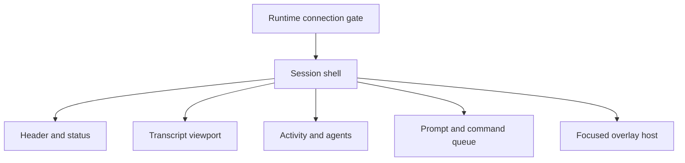
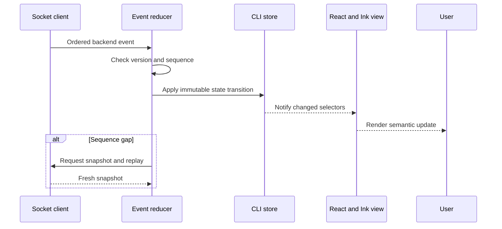

# 05 - React/Ink CLI

> Status: client specification informed by the current React/Ink source.

[Project architecture index](README.md) | [Docs start page](../README.md) | [CLI deep specification](../cli-architecture/README.md) | [CLI improvements](../cli-improvements/README.md) | [Diagram standard](../diagram-standard.md)

> Shared runtime contracts: [API and Event Protocol](../runtime-srs/04-api-and-event-protocol.md)
> and [Interaction Visibility](../agent-architecture/04-observability-and-interactions.md).

## Responsibility

The CLI is a terminal client for the FastAPI runtime. It owns interaction and
presentation, not the agent algorithm.

It should:

- Discover or start the local backend.
- Create, attach to, resume, and archive sessions.
- Render streamed messages, tools, permissions, tasks, and errors.
- Collect prompts and user decisions.
- Provide slash commands, keybindings, history, and accessibility behavior.
- Survive backend reconnects without duplicating prompts or losing state.

It should not contain provider SDK calls, filesystem tool implementations,
permission precedence, model retries, or transcript persistence.

## UI direction

The terminal interface should feel like an operator console rather than a chat
box. Use stable regions, clear hierarchy, restrained color, and progressive
detail. Avoid redrawing large transcript areas when only a spinner changes.

```text
+------------------------------------------------------------------------------+
| AGENT WORKSPACE     session: api-refactor     model: sonnet     connected    |
| /work/project       branch: feature/runtime   mode: approve edits            |
+------------------------------------------------------------------------------+
| YOU                                                                          |
| Explain the failing auth test and fix it.                                    |
|                                                                              |
| AGENT                                                                        |
| I found a mismatch between the refresh-token schema and handler.             |
|                                                                              |
| READ  apps/backend/auth/routes.py                              completed      |
| READ  apps/backend/auth/schemas.py                             completed      |
| EDIT  apps/backend/auth/schemas.py                             approval       |
|                                                                              |
| + Review edit -------------------------------------------------------------+ |
| |  - expires_at: int                                                       | |
| |  + expires_at: datetime                                                  | |
| |                                                                          | |
| |  [a] allow once  [A] always for file edits  [d] deny  [v] view full diff | |
| +--------------------------------------------------------------------------+ |
+------------------------------------------------------------------------------+
| > Add a regression test too                                                  |
+------------------------------------------------------------------------------+
| shift+tab mode   ctrl+r history   ctrl+o details   esc interrupt   / help     |
+------------------------------------------------------------------------------+
```

## Component architecture

**Question:** which stable screen regions should rerender independently?



How to read it:

1. Connection/onboarding failures are resolved before session rendering.
2. Session shell coordinates layout but subscribes to minimal shared state.
3. Header/status updates do not force transcript parsing.
4. Transcript is windowed and keyed by stable interaction/message IDs.
5. Tool/agent activity updates rows in place.
6. Composer stays usable while work runs and shows queue/interrupt behavior.
7. One overlay host owns focus for permissions, diffs, palette, and session picker.

The proposed source tree below expands each region into feature components.

## Proposed source layout

```text
apps/cli/src/
|-- index.tsx
|-- app/
|   |-- CliRoot.tsx
|   |-- SessionApp.tsx
|   |-- providers.tsx
|   `-- routes.ts
|-- backend/
|   |-- launcher.ts
|   |-- discovery.ts
|   |-- httpClient.ts
|   |-- socketClient.ts
|   `-- reconnect.ts
|-- components/
|   |-- layout/
|   |-- messages/
|   |-- tools/
|   |-- permissions/
|   |-- dialogs/
|   `-- primitives/
|-- features/
|   |-- commands/
|   |-- composer/
|   |-- history/
|   |-- sessions/
|   |-- tasks/
|   `-- diagnostics/
|-- input/
|   |-- keybindings.ts
|   |-- dispatcher.ts
|   `-- vim.ts
|-- state/
|   |-- store.ts
|   |-- reducer.ts
|   |-- selectors.ts
|   `-- projections.ts
|-- theme/
|   |-- tokens.ts
|   `-- ThemeProvider.tsx
`-- test/
```

## State model

Use one external store with immutable updates and selector subscriptions, as the
current repository does successfully. Keep server truth and transient UI state
separate.

### Server-derived state

- Runtime connection and capabilities.
- Session snapshot, sequence cursor, and status.
- Messages and tool runs.
- Pending permissions.
- Tasks and subagent summaries.
- Usage, budget, model, and permission mode.

### Local UI state

- Focused region and active overlay.
- Scroll position and transcript pinning.
- Composer draft and local history cursor.
- Expanded tool rows and diff viewport.
- Terminal dimensions and reduced-motion preference.

Apply backend events through one reducer. A reconnect snapshot replaces
server-derived state but preserves safe local UI state such as an unsent draft.

## Event processing

**Question:** how does one backend event become one focused UI update?



How to read it:

1. Transport delivers replay/live events through one path.
2. Reducer validates protocol version and exact next sequence.
3. Immutable server projection changes only after successful reduction.
4. Narrow selectors notify affected Ink components.
5. A gap fetches snapshot/replay before normal application resumes.

Never mutate the transcript from scattered hooks. Transport events enter one
reducer, and UI actions enter one command dispatcher.

## Backend launch and discovery

CLI startup should follow this sequence:

1. Read the runtime discovery file from a platform-specific user runtime
   directory.
2. Validate its owner, mode, PID, loopback address, protocol version, and token.
3. Call readiness with a short timeout.
4. If unavailable, spawn `python -m agent_backend` as a child or detached local
   daemon according to configuration.
5. Wait for a new valid discovery file and readiness.
6. Negotiate capabilities, then create or attach to a session.
7. Connect the WebSocket with the last processed sequence number.

Never accept a discovery file that points to a non-loopback address in local
mode. Do not print the token in debug output.

## Main layout

### Header

Show product name, session title, model, connection, permission mode, and a
short workspace path. Keep it at one or two terminal rows. Use text labels in
addition to color.

### Transcript

Render semantic rows rather than raw event JSON. Group concurrent read/search
tools, collapse successful low-value details, and keep errors and approvals
expanded. Long content should be virtualized or windowed so a spinner update
does not render the whole history.

### Activity rail

Show running shell commands, subagents, and background tasks in a stable region.
This avoids inserting and deleting progress rows throughout the transcript.
On small terminals, collapse it into one status line and an overlay.

### Composer

Support multiline text, paste detection, file mentions, command completion,
history, and queued follow-up prompts. The draft remains local until submission
is acknowledged by prompt ID.

### Footer

Display only actionable state: connection, current mode, token/budget warning,
background task count, and context-sensitive shortcuts. Hide secondary metrics
behind a details view.

## Responsive terminal behavior

| Width | Behavior |
| --- | --- |
| `< 60` columns | Single-column transcript, abbreviated header, overlays replace panels. |
| `60-99` columns | Standard transcript, compact activity summaries. |
| `>= 100` columns | Full metadata, side-by-side diff when practical, expanded activity rail. |

Height matters too. Reserve at least three rows for the composer and footer;
reduce decorative chrome before shrinking message content.

## Theme tokens

Use semantic tokens rather than hardcoded component colors:

```typescript
type Theme = {
  text: string
  muted: string
  accent: string
  success: string
  warning: string
  danger: string
  border: string
  selection: string
  userLabel: string
  agentLabel: string
  toolLabel: string
}
```

Recommended visual rules:

- One accent color, with warning and danger reserved for decisions.
- Dim metadata instead of surrounding every row with boxes.
- Never use color as the only indicator of status.
- Respect `NO_COLOR` and a reduced-motion setting.
- Use meaningful animation only for active streaming and progress.
- Keep glyph fallbacks for terminals without broad Unicode support.

## Input and keybindings

All keystrokes pass through a priority dispatcher:

1. Modal overlay.
2. Permission prompt.
3. Composer completion or history.
4. Transcript navigation.
5. Global commands.

Keybindings are data with context, sequence, description, and handler ID. This
supports a help screen, user overrides, chord detection, and conflict checks.
Avoid component-local `useInput` handlers that can all consume the same key.

Baseline actions:

| Action | Default |
| --- | --- |
| Submit | `Enter` |
| New line | `Shift+Enter` or configured terminal sequence |
| Interrupt | `Esc` |
| Command palette | `/` at empty prompt |
| History search | `Ctrl+R` |
| Toggle details | `Ctrl+O` |
| Cycle permission mode | `Shift+Tab` |
| Close overlay | `Esc` |
| Exit empty session | `Ctrl+C` twice |

## Commands

Split commands into two types:

- **Client commands** such as `/help`, `/theme`, `/keys`, and local view
  controls execute entirely in the CLI.
- **Runtime commands** such as `/model`, `/permissions`, `/compact`, `/resume`,
  and `/mcp` call explicit backend endpoints or submit typed commands.

Do not encode runtime behavior in prompt text when a typed command exists.

## Permissions UX

A permission dialog must answer four questions immediately:

1. What will happen?
2. Why does it need approval?
3. What exact resource or command is affected?
4. What scope will each decision grant?

Always offer allow once and deny. Offer persistent scope only when the backend
provides a safe, specific rule suggestion. Show the normalized action and make
the full diff or command available before approval.

## Error and reconnect UX

Connection loss is a state, not a fatal render exception. Keep the transcript
and draft visible, change the header to reconnecting, pause new submissions,
and retry with capped exponential backoff. On recovery, request events after the
last sequence and replace state from a snapshot if a gap exists.

Distinguish:

- User-correctable input errors.
- Permission denials.
- Tool failures the model may recover from.
- Provider outages and rate limits.
- Backend protocol or integrity failures.

Only the last category should force a diagnostics screen.

## Performance rules

- Subscribe components to narrow store slices.
- Batch high-frequency text deltas to a frame interval.
- Rate-limit spinner ticks and progress repainting.
- Window old transcript rows.
- Keep message parsing outside render.
- Avoid synchronous filesystem and process calls in the UI process.
- Record startup checkpoints around backend discovery, first render, session
  snapshot, and first streamed token.

## CLI tests

| Layer | Examples |
| --- | --- |
| Reducer | Event ordering, duplicate suppression, snapshots, and sequence gaps. |
| Components | Messages, permissions, diffs, errors, and narrow-terminal layouts. |
| Input | Focus precedence, chords, conflicts, paste, and multiline submit. |
| Transport | Reconnect, heartbeat, auth failure, and idempotent prompt retry. |
| Golden output | Stable terminal frames with color disabled. |
| End-to-end | Spawn fake backend, stream a turn, approve an edit, reconnect, resume. |

## CLI MVP exit criteria

The CLI is ready when a user can start the backend automatically, create or
resume a session, stream a full turn, inspect tool progress, approve or deny an
edit, interrupt a turn, survive a backend reconnect, and view a useful error
without losing an unsent draft.
