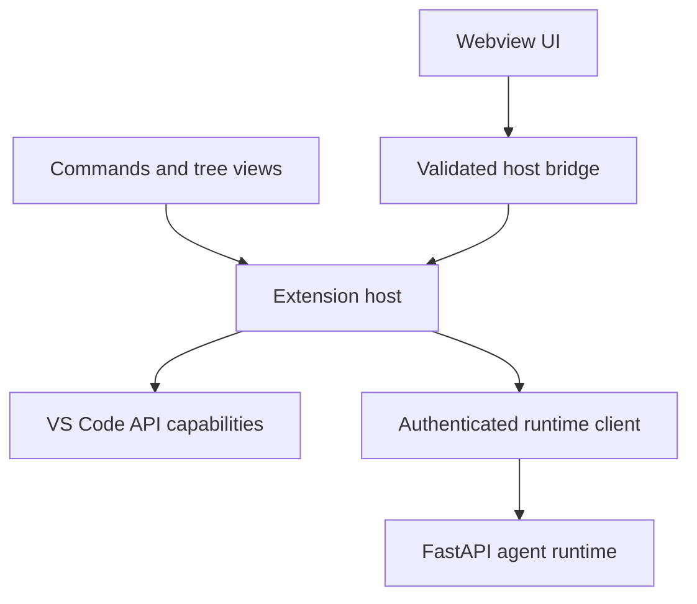
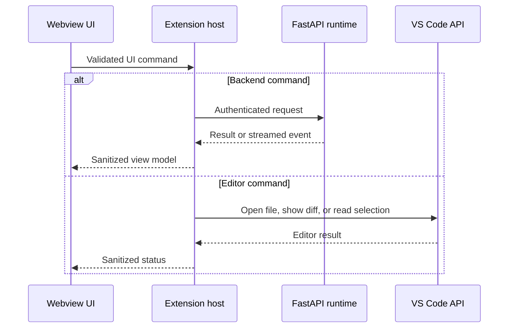
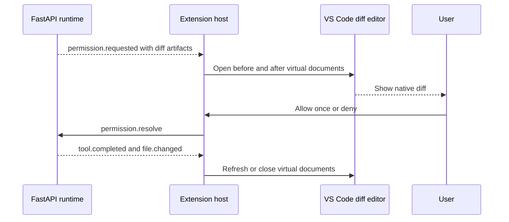

# 06 - VS Code Extension

> Status: extension specification. The current repository contains IDE client
> integration, but not the extension source itself.

[Project architecture index](README.md) | [Docs start page](../README.md) | [Diagram standard](../diagram-standard.md)

> Shared runtime contracts: [API and Event Protocol](../runtime-srs/04-api-and-event-protocol.md)
> and [Interaction Visibility](../agent-architecture/04-observability-and-interactions.md).

## Responsibility

The VS Code extension is a trusted editor client of the local FastAPI runtime.
It adds editor context and native review surfaces while sharing sessions, tools,
permissions, and persistence with the CLI.

The extension host owns privileged VS Code APIs. The webview owns only browser
presentation. The FastAPI backend owns agent behavior.

**Question:** which boundary prevents the webview from gaining editor/backend authority?



How to read it:

1. Webview sends only schema-validated UI commands through a minimal bridge.
2. Native commands/trees already execute in the privileged extension host.
3. Host is the only component allowed to call VS Code APIs.
4. Host is also the only component that sees runtime discovery/auth material.
5. FastAPI owns agent/tool/policy state; it requests bounded editor capabilities.

## Extension surfaces

| Surface | Purpose | MVP |
| --- | --- | --- |
| Activity Bar container | Entry point for all agent views. | Yes |
| Chat webview view | Transcript, prompt, tool progress, and approvals. | Yes |
| Sessions tree | Create, attach, resume, rename, and archive. | Yes |
| Tasks tree | Background tasks and subagents. | Later |
| Status bar item | Connection, active session, and permission mode. | Yes |
| Native diff editor | Review proposed edits before approval. | Yes |
| Problems integration | Add selected diagnostics to context. | Yes |
| Code actions and CodeLens | Explain, fix, test, or review selection. | Later |
| SCM integration | Summarize changes and prepare commits. | Later |

## Proposed source layout

```text
apps/vscode-extension/
|-- package.json
|-- tsconfig.json
|-- esbuild.config.mjs
|-- src/
|   |-- extension.ts
|   |-- backend/
|   |   |-- RuntimeClient.ts
|   |   |-- RuntimeDiscovery.ts
|   |   |-- SessionSocket.ts
|   |   `-- generated/
|   |-- commands/
|   |   |-- registerCommands.ts
|   |   |-- askAboutSelection.ts
|   |   |-- createSession.ts
|   |   `-- reviewChanges.ts
|   |-- context/
|   |   |-- EditorContextProvider.ts
|   |   |-- DiagnosticContextProvider.ts
|   |   `-- WorkspaceTrust.ts
|   |-- editor/
|   |   |-- DiffManager.ts
|   |   |-- FileNavigator.ts
|   |   `-- CapabilityRouter.ts
|   |-- views/
|   |   |-- ChatViewProvider.ts
|   |   |-- SessionsTreeProvider.ts
|   |   `-- StatusBarController.ts
|   |-- webview/
|   |   |-- bridge.ts
|   |   |-- messages.ts
|   |   `-- state.ts
|   `-- logging/
|       `-- OutputChannelLogger.ts
|-- webview-ui/
|   |-- src/
|   `-- vite.config.ts
`-- test/
```

## Activation

Keep activation cheap. Use command and view activation events rather than
starting the backend during every VS Code launch.

On activation:

1. Register commands, tree views, URI handlers, and the chat provider.
2. Create an output channel and redacting logger.
3. Read extension settings and workspace trust.
4. Lazily create `RuntimeClient` when the user opens a view or invokes a command.
5. Discover or start the backend, negotiate protocol versions, and register
   editor capabilities.
6. Restore the last session association for the workspace if it still exists.

On deactivation, stop reconnect loops, close sockets, dispose virtual documents,
and unregister the editor client. Do not kill a shared backend that the CLI or
another window is using.

## Webview security boundary

The webview is untrusted browser content even though it ships with the
extension. Apply these rules:

- Set a strict Content Security Policy with a random script nonce.
- Disable inline scripts, remote scripts, `eval`, and arbitrary network access.
- Use `localResourceRoots` for bundled assets.
- Sanitize rendered Markdown and command links.
- Validate every webview message with a schema in the extension host.
- Never send the runtime token, model key, filesystem API, or VS Code API into
  the webview.
- Proxy all backend calls through the extension host.
- Use opaque IDs instead of raw local paths when the webview does not need the
  full path.



How to read it:

1. Every webview message validates in the extension host.
2. Backend actions use the authenticated runtime client; editor actions use VS Code APIs.
3. Host returns a sanitized view model/status, never raw credentials or unrestricted objects.
4. The webview cannot choose a hidden third route to filesystem/network authority.

## Runtime connection

The extension host uses the same local discovery and bearer-token mechanism as
the CLI. It must validate loopback binding, PID, file owner/mode, runtime and
protocol versions, and workspace capability before connecting.

One extension window registers one client ID with:

- Window ID and VS Code version.
- Workspace folder URIs.
- Whether the workspace is trusted.
- Supported editor capability methods and versions.
- Whether the chat view is visible.
- The active session ID, if any.

The backend returns allowed capabilities; registration is not permission to
read arbitrary editor state.

## Editor capability protocol

The backend can request a bounded set of editor operations through the
registered extension connection:

| Method | Input | Result |
| --- | --- | --- |
| `editor.openFile` | Workspace-relative path and optional range. | Opened or rejected. |
| `editor.showDiff` | Artifact IDs, title, and target path. | Diff view ID. |
| `editor.getSelection` | No raw path supplied by backend. | Active URI, range, language, text. |
| `editor.getDiagnostics` | Scope and severity filter. | Bounded diagnostic list. |
| `editor.listOpenFiles` | Optional workspace scope. | Bounded URI list. |
| `editor.revealToolRun` | Tool-run ID. | View opened or unavailable. |

Every request includes a request ID, timeout, and session ID. The extension
rejects paths outside registered workspace folders and rejects capability calls
when workspace trust is false.

For the MVP, the backend applies approved file changes atomically and emits
file-change events. The extension displays the proposed artifact with the
native diff editor before approval, then refreshes the affected document after
the backend reports completion. A later version may route edits through
`WorkspaceEdit` for native undo, but that requires a two-phase edit protocol.

## Context collection

Editor context is user-controlled and bounded. The extension may offer:

- Current selection.
- Active file with a visible-range or size limit.
- Explicitly mentioned files.
- Selected diagnostics.
- Open tabs as metadata only.
- Git diff after explicit command or setting.

Do not continuously upload editor contents. Show attached context as removable
chips before submission. Normalize line endings and include language ID, URI,
range, version, and content hash so the backend can detect stale context.

## Session behavior

Sessions are backend resources associated with a workspace root. The extension
can attach to a session already created by the CLI. If both clients are open:

- Both may observe events.
- Only the client holding the interaction lease may submit prompts and resolve
  permissions by default.
- A visible takeover action transfers the lease.
- Draft text stays client-local and is never synchronized implicitly.
- Session state changes appear through the same ordered event stream.

This prevents a terminal and editor from racing to answer the same approval.

## Native diff review

Store proposed before/after content as backend artifacts. The extension maps
them to read-only virtual document URIs and opens `vscode.diff`.



How to read it:

1. Backend event references immutable before/after artifact IDs.
2. Extension host reauthorizes/fetches and exposes read-only virtual documents.
3. User resolves the exact request revision shown in the native diff.
4. Backend applies/settles the edit and emits canonical completion/change events.
5. Host refreshes/disposes virtual content when the request settles.

Virtual content providers must release cached content when the request settles
or the session is archived.

## Commands

Recommended MVP command IDs:

| Command | Purpose |
| --- | --- |
| `agent.openChat` | Focus the chat view. |
| `agent.newSession` | Create a session for the selected workspace. |
| `agent.attachSession` | Choose and attach to an existing session. |
| `agent.askSelection` | Attach selection and focus the prompt. |
| `agent.explainSelection` | Submit a predefined explain intent. |
| `agent.fixDiagnostics` | Attach selected diagnostics and request a fix. |
| `agent.reviewChanges` | Ask for a review of the current source-control diff. |
| `agent.interrupt` | Cancel the active turn. |
| `agent.showLogs` | Open the redacted output channel. |
| `agent.restartRuntime` | Restart only a runtime started by this extension. |

Contribute matching editor-title, editor-context, command-palette, and view-title
menus sparingly. Do not fill every context menu in the first release.

## Configuration

Keep settings small and explicit:

- Python executable or backend command override.
- Auto-start local runtime.
- Default model and permission mode, if not managed by backend policy.
- Context attachment limits.
- Diff auto-open behavior.
- Notification behavior.
- Log level.

Secrets belong in `ExtensionContext.secrets` only when the extension owns them.
The normal local runtime token is read by the extension host from the protected
discovery file and kept only in memory.

## Packaging

- Bundle extension-host and webview code separately.
- Exclude source maps containing local paths from production packages unless
  intentionally published.
- Pin dependencies and generate a software bill of materials.
- Package no model credentials and no writable executable downloaded at runtime.
- Sign releases and publish a clear minimum VS Code version.
- Verify `.vscodeignore` against the final VSIX contents in CI.

## Testing

| Layer | Examples |
| --- | --- |
| Unit | Message validation, context bounds, URI checks, reducers, and command routing. |
| Extension host integration | Mock runtime, reconnect, workspace trust, virtual docs, and command registration. |
| Webview | Rendering, accessibility, permission actions, and state restoration. |
| VS Code end-to-end | Launch Extension Development Host and exercise chat, selection, diff, and resume. |
| Contract | Generated types compile against the checked-in OpenAPI and event schemas. |
| Security | CSP, path escape attempts, malformed webview messages, and token redaction. |

## Reusable ideas from the current source

The existing repository provides useful patterns even though the extension is
missing:

- Workspace-aware IDE discovery from `utils/ide.ts`.
- Token-bearing lockfile metadata.
- WebSocket and SSE transport support.
- IDE RPC through the MCP client.
- File-updated notifications in `services/mcp/vscodeSdkMcp.ts`.
- UI flows for selecting and diagnosing IDE connections.

Reuse the concepts, not the current protocol fragmentation. The new extension
should speak the shared FastAPI contract and register editor-specific methods
as capabilities.

## Extension MVP exit criteria

The extension is ready when it connects securely to the local runtime, creates
or attaches to a workspace session, streams a turn, adds an explicit selection
to context, opens a native proposed diff, resolves its permission request,
recovers after reconnect, and never exposes the runtime token to webview code.
