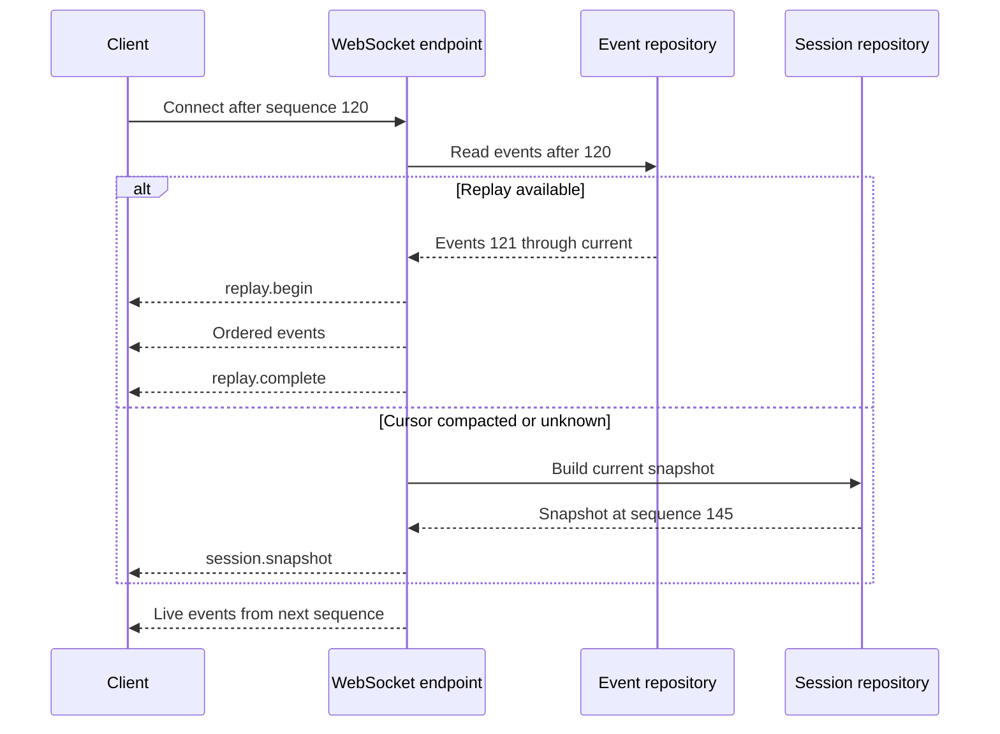
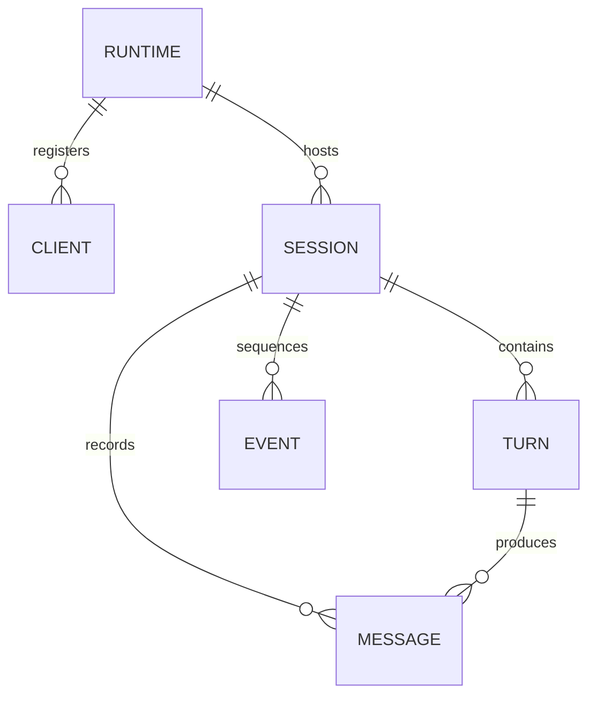
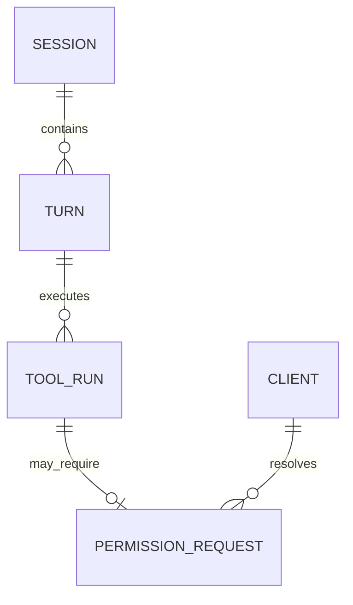
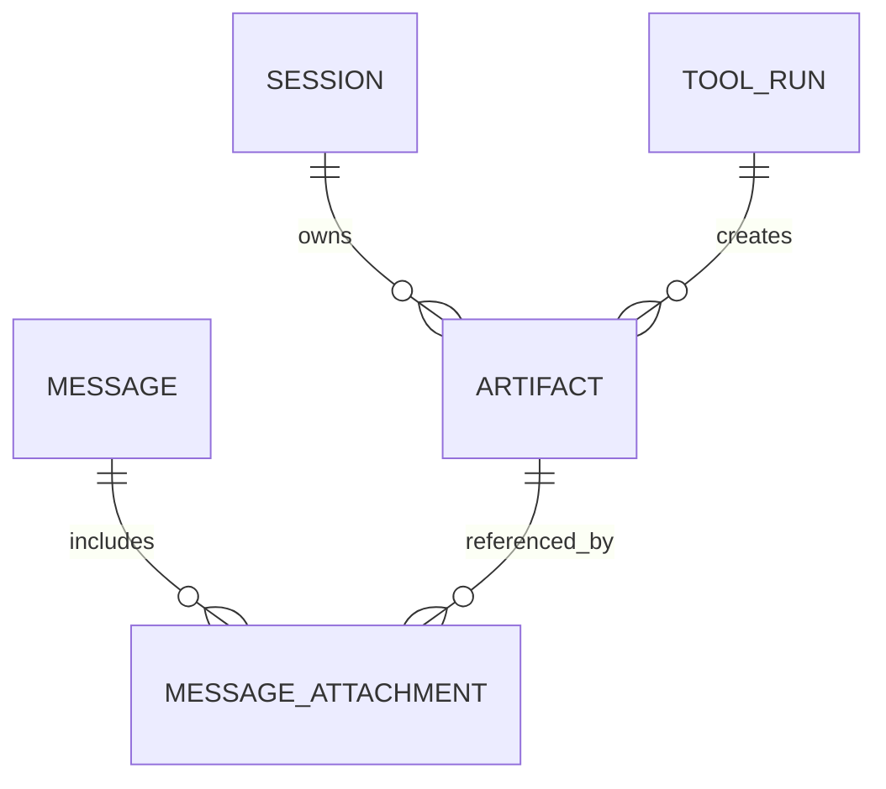

# 07 - Protocol and Data

> Status: shared contract specification for the backend, CLI, and VS Code
> extension.

[Project architecture index](README.md) | [Docs start page](../README.md) | [Diagram standard](../diagram-standard.md)

> Normative details: [API and Event Protocol](../runtime-srs/04-api-and-event-protocol.md)
> and [Data Model](../runtime-srs/05-data-model.md).

## Source status

| Status | What this chapter uses |
| --- | --- |
| **CURRENT** | Streaming/tool-loop behavior in [`query.ts`](../../query.ts) and [`QueryEngine.ts`](../../QueryEngine.ts), JSONL session behavior in [`utils/sessionStorage.ts`](../../utils/sessionStorage.ts), and current IDE transport lessons in [`utils/ide.ts`](../../utils/ide.ts). |
| **TARGET** | One versioned FastAPI REST/WebSocket contract, normalized database records, durable event replay, and generated React Ink/VS Code client types. |
| **GAP** | This snapshot does not contain the proposed FastAPI service, database schema, generated protocol package, or VS Code extension source. |

## Protocol goals

The protocol must support streaming, reconnect, two clients observing one
session, human approvals, cancellation, and backward-compatible evolution.

It follows five rules:

1. REST manages resources and idempotent commands.
2. WebSocket carries ordered events and low-latency control commands.
3. Every payload has a schema and explicit version.
4. Every session event has a monotonic sequence number.
5. Clients rebuild state from a snapshot plus ordered events.

## Version negotiation

`GET /api/v1/runtime` returns:

```json
{
  "runtime_version": "0.1.0",
  "api_versions": ["v1"],
  "event_versions": ["1.0"],
  "minimum_client_versions": {
    "cli": "0.1.0",
    "vscode": "0.1.0"
  },
  "capabilities": {
    "event_replay": true,
    "editor_rpc": true,
    "background_agents": false
  }
}
```

The client chooses the highest event version it supports and sends it in the
WebSocket subprotocol, for example `agent-events.v1.0`. Reject unsupported
versions with a clear upgrade error before session activity begins.

## Identifiers

Use opaque sortable IDs, such as UUIDv7 or ULID, with type-specific prefixes in
logs and UI. IDs are immutable and never encode local paths or user data.

| Entity | Example |
| --- | --- |
| Runtime | `rt_01...` |
| Client | `cl_01...` |
| Session | `ses_01...` |
| Turn | `turn_01...` |
| Message | `msg_01...` |
| Tool run | `tool_01...` |
| Permission request | `perm_01...` |
| Artifact | `art_01...` |
| Event | `evt_01...` |

## REST command pattern

Commands that can be retried accept an `Idempotency-Key` header. The backend
stores the key, canonical request hash, status, and response for a bounded
period. Reusing a key with a different payload returns `409 Conflict`.

Example prompt submission:

```http
POST /api/v1/sessions/ses_01/prompts HTTP/1.1
Authorization: Bearer local-token
Idempotency-Key: 0195...
Content-Type: application/json

{
  "text": "Explain the failing test and fix it.",
  "attachments": [
    {
      "kind": "editor_selection",
      "uri": "workspace://src/auth.py",
      "start_line": 41,
      "end_line": 57,
      "content_hash": "sha256:..."
    }
  ]
}
```

Accepted response:

```json
{
  "turn_id": "turn_01...",
  "user_message_id": "msg_01...",
  "accepted_sequence": 128
}
```

`202 Accepted` means the command was recorded, not that the turn finished.

## Event envelope

All server-to-client WebSocket events use one envelope:

```json
{
  "protocol": "1.0",
  "event_id": "evt_01...",
  "session_id": "ses_01...",
  "sequence": 129,
  "timestamp": "2026-08-22T18:30:00.123Z",
  "type": "tool.started",
  "correlation_id": "turn_01...",
  "payload": {
    "tool_run_id": "tool_01...",
    "tool_name": "read_file",
    "summary": "Read src/auth.py"
  }
}
```

Envelope fields are stable within event major version 1. Event-specific payload
schemas may add optional fields in minor releases.

## Server event catalog

| Event | Important payload fields | Purpose |
| --- | --- | --- |
| `session.snapshot` | Session, messages, tools, permissions, tasks, last sequence. | Initial state or resync. |
| `session.status` | Previous state, new state, reason. | State transition. |
| `session.metadata` | Title, model, mode, workspace label. | Header and session list update. |
| `turn.started` | Turn ID, user message ID. | Acknowledges foreground work. |
| `turn.completed` | Turn ID, result, usage, stop reason. | Terminal success. |
| `turn.failed` | Turn ID, safe error, retryable. | Terminal failure. |
| `turn.cancelled` | Turn ID and reason. | Terminal cancellation. |
| `message.started` | Message ID, role, parent ID. | Starts a streamed message. |
| `message.delta` | Message ID, channel, text delta. | Streams assistant text or thinking. |
| `message.completed` | Final normalized message and usage. | Finalizes a message. |
| `tool.queued` | Tool run, name, order, safe summary. | Displays scheduling. |
| `tool.started` | Tool run and start time. | Displays execution. |
| `tool.progress` | Phase, summary, completed, total. | Bounded progress. |
| `tool.output_chunk` | Stream and bounded text. | Optional shell-like live output. |
| `tool.completed` | Summary, result preview, artifacts. | Final tool success. |
| `tool.failed` | Error code, message, retryable. | Final tool failure. |
| `tool.cancelled` | Reason. | Final tool cancellation. |
| `permission.requested` | Request, action summary, reason, suggestions, artifacts. | Human decision needed. |
| `permission.resolved` | Request, decision, scope, client. | Settles all clients. |
| `task.updated` | Task snapshot. | Background work state. |
| `artifact.created` | Artifact metadata. | Makes a diff or large result available. |
| `context.compacted` | Boundary, summary metadata, token counts. | Explains history transition. |
| `client.lease_changed` | Old and new controller IDs. | Multi-client coordination. |
| `runtime.warning` | Code, message, action. | Recoverable runtime notice. |
| `runtime.shutdown` | Reason and reconnect guidance. | Graceful process stop. |

Do not stream secrets or unrestricted command/file output. Event schemas define
size limits and redaction behavior.

## Client command envelope

WebSocket control commands use a request/response pattern:

```json
{
  "protocol": "1.0",
  "request_id": "req_01...",
  "session_id": "ses_01...",
  "type": "permission.resolve",
  "payload": {
    "permission_request_id": "perm_01...",
    "decision": "allow",
    "scope": "once"
  }
}
```

The backend responds on the same socket:

```json
{
  "protocol": "1.0",
  "request_id": "req_01...",
  "type": "command.result",
  "payload": {
    "accepted": true,
    "resulting_sequence": 144
  }
}
```

Client command types in the MVP:

- `prompt.submit`
- `turn.interrupt`
- `permission.resolve`
- `session.rename`
- `session.set_mode`
- `session.set_model`
- `client.acquire_lease`
- `client.release_lease`
- `client.heartbeat`
- `editor.response`

REST and WebSocket commands execute the same application use cases and have the
same authorization and idempotency semantics.

## Snapshot and replay

**Question:** how does a client recover without duplicating or losing state?



How to read it:

1. The client reconnects with only the last sequence it applied successfully.
2. The server replays persisted events when that cursor is still retained.
3. If replay is impossible, one authoritative snapshot replaces server-derived client state.
4. Live delivery starts only after replay or snapshot reaches a known sequence boundary.
5. Local drafts are client state and survive either recovery path.

Client rules:

- Ignore an exact duplicate `event_id`.
- Reject or resync on a sequence gap.
- Never apply an older snapshot over newer local server-derived state.
- Persist the last applied sequence only after the reducer succeeds.
- Preserve unsent local drafts across snapshot replacement.

Server rules:

- Assign sequence and persist before broadcasting important state changes.
- Events for one session are totally ordered.
- Replay returns exactly the persisted payload originally broadcast.
- A bounded retention policy may require a snapshot after compaction.

## Backpressure

Each socket connection has a bounded outgoing queue. Events have priorities:

| Priority | Events | Overflow behavior |
| --- | --- | --- |
| Critical | Status, completed messages, tool terminal states, permissions. | Never drop; disconnect slow client and require resync. |
| Normal | Message deltas and meaningful progress. | Coalesce adjacent compatible events. |
| Ephemeral | Spinner ticks, repeated counters, heartbeat diagnostics. | Drop safely. |

Coalescing is transport-only. Persisted semantic state must remain complete.

## Error envelope

REST errors and WebSocket command errors share these fields:

| Field | Meaning |
| --- | --- |
| `code` | Stable machine-readable identifier. |
| `message` | Safe user-facing explanation. |
| `request_id` | Correlates client and server logs. |
| `retryable` | Whether the same intent may be retried. |
| `details` | Schema-defined safe context. |

Baseline error codes:

- `authentication_failed`
- `protocol_version_unsupported`
- `workspace_not_trusted`
- `session_not_found`
- `session_busy`
- `interaction_lease_required`
- `sequence_gap`
- `permission_request_not_found`
- `permission_request_settled`
- `invalid_tool_arguments`
- `provider_unavailable`
- `budget_exceeded`
- `turn_cancelled`
- `rate_limited`
- `internal_error`

## Data model

The complete field-level specification is in
[Runtime SRS: Data Model](../runtime-srs/05-data-model.md). These smaller views
show ownership without forcing one oversized ER diagram.

### Conversation and replay

**Question:** which records reconstruct a session after reconnect or restart?



1. `SESSION` is the aggregate root and sequence owner.
2. `TURN` groups one accepted user intent and its terminal outcome.
3. `MESSAGE` preserves the provider-facing conversation chain.
4. `EVENT` preserves the client-facing projection and replay order.
5. `CLIENT` registration and the interaction lease prevent two UIs from resolving one decision.

### Tool execution and approval

**Question:** where does an authorized side effect become durable?



1. A `TOOL_RUN` exists before permission or execution starts.
2. A risky run may have one current `PERMISSION_REQUEST`; attempts/revisions stay auditable.
3. The resolving client is recorded, but backend policy remains authoritative.
4. Tool terminal state and its canonical event commit together before broadcast.

### Artifacts and attachments

**Question:** how do large or binary values stay out of event payloads?



1. Events and messages carry bounded previews plus immutable artifact IDs.
2. Artifact metadata stays in the database; bytes live in content-addressed/protected storage.
3. Attachments join an artifact to a message without duplicating bytes.
4. Reads verify owner, hash, media type, size, and retention state.

### Canonical record fields

| Record | Required fields |
| --- | --- |
| `RUNTIME` | `id`, `version`, `started_at` |
| `CLIENT` | `id`, `kind`, `capabilities`, `last_seen_at` |
| `SESSION` | `id`, protected workspace identity, `status`, `model`, permission mode, lease holder, `last_sequence`, timestamps |
| `TURN` | `id`, `session_id`, `status`, stop reason, usage/budgets, start/end timestamps |
| `MESSAGE` | `id`, `session_id`, optional `turn_id`, `parent_id`, `role`, normalized content, timestamp |
| `TOOL_RUN` | `id`, `turn_id`, tool/schema/registry hashes, status, normalized input, policy decision, result preview, timings |
| `PERMISSION_REQUEST` | `id`, `tool_run_id`, state/revision, reason, decision/scope, deciding client, expiry |
| `EVENT` | `id`, `session_id`, unique sequence, type/version, correlation ID, payload, timestamp |
| `ARTIFACT` | `id`, `session_id`, kind, media type, storage key, byte size, SHA-256, retention/expiry metadata |
| `MESSAGE_ATTACHMENT` | `message_id`, `artifact_id`, kind, bounded metadata |

## Entity notes

### Session

Stores workspace identity, title, model, permission mode, status, active
interaction lease, current branch head, and last event sequence. Store a
normalized or hashed workspace identity for indexes, but retain the usable local
path in encrypted/protected local storage only.

### Message

Stores normalized content blocks and explicit parent relationships. A message
can represent user, assistant, tool-result, system, or context-boundary content.
Provider-specific raw data is optional and separate.

### Tool run

Stores original input, normalized input, registry snapshot ID, decision source,
timings, terminal state, safe result summary, and artifact references. Sensitive
fields are redacted or omitted according to the tool's audit policy.

### Event

Stores exactly the event envelope needed for replay. Use a unique constraint on
`(session_id, sequence)` and on `event_id`. Sequence allocation and event insert
must be atomic.

### Artifact

Stores metadata in the database and bytes outside it. Verify hash and size when
reading. Apply retention by kind and session status; permission diff artifacts
may have a shorter lifetime than exported transcripts.

## Storage transactions

Important state changes use this pattern:

1. Validate current aggregate version or session lock.
2. Update normalized state.
3. Allocate the next session sequence.
4. Insert the event in the same transaction.
5. Commit.
6. Broadcast the committed event.

If broadcast fails, replay still works. If commit fails, no client sees a state
change that cannot be recovered.

## Schema source of truth

Pydantic transport models generate OpenAPI for REST. Event payload models
generate JSON Schema under `schemas/events/`. Generate a TypeScript package for
both clients and check generated output in CI.

Recommended workflow:

```text
Pydantic models
    -> OpenAPI and event JSON Schema
    -> generated TypeScript types and validators
    -> CLI and extension compile-time checks
    -> contract fixtures shared by all applications
```

Do not hand-maintain matching Python and TypeScript interfaces.

## Compatibility policy

Within event protocol major version 1:

- New optional fields are allowed.
- New event types require clients to ignore unknown non-critical types.
- Removing or renaming fields requires a major version.
- Changing field meaning requires a major version.
- New enum values require clients to retain an unknown fallback.
- Critical unknown events force resync or upgrade and declare that in the
  envelope metadata.

Keep golden JSON fixtures for every event and command. Run them through Python,
CLI, and extension validators in CI.
