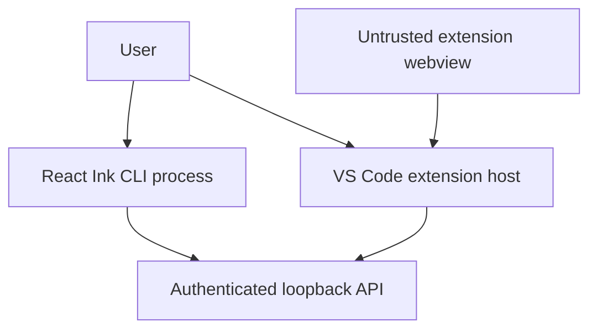
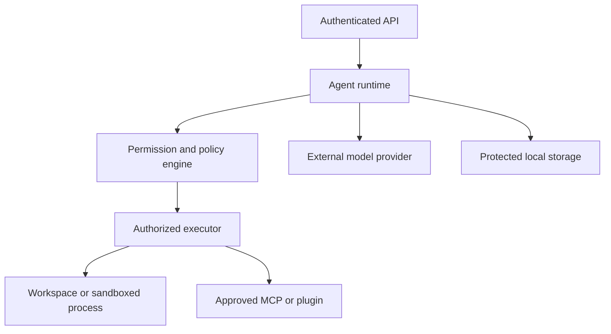
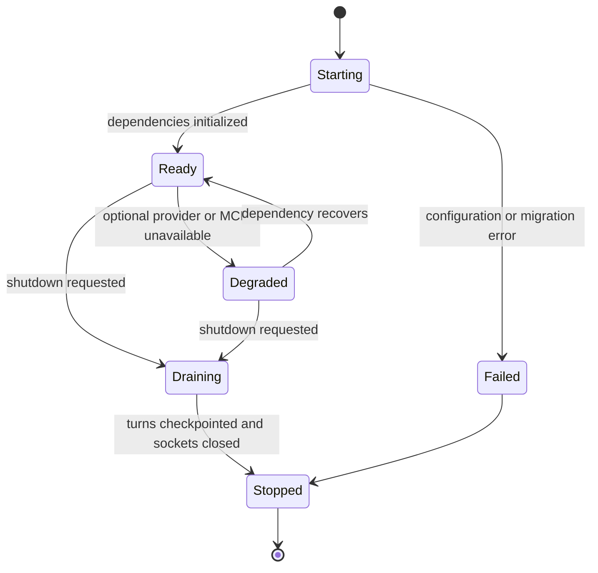

# 08 - Security and Operations

> Status: required controls for local execution and future production use.

[Project architecture index](README.md) | [Docs start page](../README.md) | [Diagram standard](../diagram-standard.md)

> Normative details: [Permission System](../runtime-srs/03-permission-system.md)
> and [State, Checkpointing, and Recovery](../agent-architecture/03-state-checkpointing-and-recovery.md).

> Implementation guides: [Sandbox and Resources](../execution-architecture/01-sandbox-and-resources.md)
> and [Risk and Test Matrix](../execution-architecture/03-risk-and-test-matrix.md).

## Source status

| Status | Repository evidence or target decision |
| --- | --- |
| **CURRENT** | Tool checks and execution in [`Tool.ts`](../../Tool.ts) and [`services/tools/toolExecution.ts`](../../services/tools/toolExecution.ts); path/shell policy under [`utils/permissions/`](../../utils/permissions); sandbox integration in [`utils/sandbox/sandbox-adapter.ts`](../../utils/sandbox/sandbox-adapter.ts). |
| **TARGET** | FastAPI owns authentication, durable permission records, resource leases, artifact retention, recovery, and every execution decision shared by CLI and VS Code. |
| **GAP** | The target service/database do not exist in this snapshot, and sandbox effectiveness still depends on installed platform support. |

## Security objective

The system turns untrusted model output into local actions. Its primary job is
not merely to call tools; it is to preserve the boundary between a suggestion
and authorized execution.

Assume the following inputs are untrusted:

- User prompts and pasted content.
- Repository files, instructions, hooks, and configuration.
- Model output and tool arguments.
- MCP servers, plugin manifests, and plugin code.
- Web content and downloaded artifacts.
- Webview messages and editor document content.
- Discovery files not proven to belong to the current user.

## Trust boundaries

Do not try to read every trust boundary in one graph. First follow client
ingress, then follow runtime egress.

### Client ingress

**Question:** which process is allowed to authenticate to the backend?



1. The CLI and extension host are authenticated clients, not policy engines.
2. The webview receives no backend token and reaches FastAPI only through validated host messages.
3. User presence in either UI does not itself authorize a tool or editor capability.

### Runtime egress

**Question:** which gate stands between model output and an external effect?



1. Model output is data until the central policy engine approves a validated request.
2. Only the executor can cross into filesystem, process, MCP, or plugin authority.
3. Model-provider and storage calls have separate privacy/redaction rules even when no tool runs.
4. Every process, network, workspace, plugin, or provider crossing needs validation, authentication, bounded data, timeouts, and safe logging.

## Workspace trust

Workspace trust is separate from tool permission mode. Before trust:

- Do not load workspace settings, hooks, agents, skills, or plugins.
- Do not execute MCP server commands declared by the workspace.
- Do not apply environment variables from project files.
- Do not run tools against the workspace.
- Allow only enough metadata to show the path and trust prompt.

Trust is keyed to a canonical workspace identity, not an unchecked input string.
Resolve symlinks where safe, compare filesystem identity where available, and
invalidate trust if the path now resolves to a different owner or device.

## Local API authentication

The runtime discovery file contains PID, loopback port, runtime version,
protocol versions, start time, and a cryptographically random bearer token.

Controls:

- Store it under a per-user runtime directory.
- Use `0700` for the directory and `0600` for the file on POSIX.
- Create atomically and reject symlinks.
- Bind to `127.0.0.1` and `::1` only in local mode.
- Require the token for REST and WebSocket requests.
- Validate process ownership and readiness before trusting a stale file.
- Rotate the token whenever the runtime restarts.
- Redact authorization headers and discovery contents from logs.
- Use strict CORS and Origin checks; local bearer auth does not make a broad
  browser CORS policy safe.

For Unix systems, a Unix domain socket is a useful later option, but it does not
remove the need for peer and file-permission checks.

## Permission policy

Permission decisions have a deterministic precedence:

```text
hard safety deny
    > organization or managed deny
    > user or workspace deny
    > explicit ask
    > tool-specific check
    > scoped allow
    > safe read policy
    > interactive approval
    > deny when no authorized decision path exists
```

The backend records the decision source. A UI may collect a decision but cannot
turn a backend deny into allow. Persistent rules are generated by the backend,
shown exactly to the user, and written atomically to the intended scope.

## Filesystem controls

Every file tool follows one canonical path algorithm:

1. Reject NUL bytes and invalid platform paths.
2. Interpret relative paths against the approved workspace root.
3. Normalize path segments.
4. Resolve existing ancestors and detect symlink escapes.
5. Compare using platform-appropriate case semantics.
6. Reject paths outside approved roots.
7. Apply sensitive-file and sensitive-directory policy.
8. Open with flags that reduce race and symlink risk where supported.
9. Recheck relevant identity before a destructive commit.

Protect at least VCS internals, editor settings, agent configuration, shell
startup files, credential files, environment files, and runtime discovery
files. A user can still approve a narrowly described operation where policy
allows; safe auto-approval should not cover these targets.

Writes use temporary files in the same directory, explicit modes, flush where
needed, and atomic replace. Edits verify the expected content hash or version to
avoid applying a stale diff.

## Shell controls

Do not start with a generic unrestricted shell tool. When introduced, require:

- A structured command request and explicit working directory.
- A real parser for the active shell, not prefix string matching alone.
- Segment-level permission checks for pipes, logical operators, and command
  separators.
- Detection of substitutions, redirections, encoded commands, shell changes,
  and dangerous expansion forms.
- Path checks for file-affecting arguments where practical.
- Timeout, output, process, CPU, and memory limits.
- A clean environment allowlist with secret stripping.
- Process-group isolation and reliable descendant termination.
- Network disabled by default in the sandbox when supported.
- Explicit approval for destructive, networked, elevated, or package-install
  operations.

Never offer a persistent allow suggestion broader than the parser can enforce.

## Sandbox model

The sandbox is defense in depth, not the permission decision itself.

Local MVP tiers:

| Tier | Use | Controls |
| --- | --- | --- |
| In-process read | Small trusted Python file/search code. | Root containment, limits, cancellation. |
| Restricted child | Shell and converters. | Clean env, workspace mount, resource limits, no network by default. |
| External integration | MCP and web. | Server allowlist, timeout, auth scope, result limits. |

Platform capability differs. Report effective sandbox protections in runtime
diagnostics and require stronger approval when a requested protection is
unavailable.

## MCP and plugin security

MCP server configuration is executable authority. Require approval before
starting workspace-declared stdio servers. Normalize environment expansion and
never forward all backend secrets by default.

For each MCP connection, record:

- Source and scope.
- Command or origin, with secrets redacted.
- Authentication method.
- Advertised capabilities.
- Tool names and schema hashes.
- Approval and last connection state.

Plugin controls:

- Validate manifest without importing plugin code.
- Resolve all component paths under the plugin root.
- Pin marketplace source and version or commit.
- Verify package integrity before activation.
- Show requested capabilities before enablement.
- Isolate third-party executable code.
- Apply time, output, and cancellation limits to hooks.
- Remove disabled plugin hooks and tools immediately from new registry snapshots.

## Model-provider privacy

Before a provider request:

- Include only approved workspace context.
- Apply configured ignore and secret-scanning rules.
- Bound file and diagnostic attachments.
- Identify binary and generated files before reading.
- Redact known credentials from accidental context where feasible.
- Make provider, model, retention mode, and organization policy visible to the
  client.

Never claim perfect secret detection. Permission boundaries and explicit
context selection remain the primary control.

## VS Code controls

- Webview cannot access backend or editor credentials.
- Extension host validates every webview payload.
- Editor capability calls are allowlisted and versioned.
- Workspace trust gates context collection and file actions.
- Paths are checked against registered workspace folders.
- Markdown and links are sanitized.
- Command URIs are disabled or narrowly allowlisted.
- Virtual diff documents are read-only and expire.
- Telemetry excludes code, prompts, paths, selections, and diagnostics by
  default.

## Secrets

Classify secrets by owner:

| Secret | Owner | Storage |
| --- | --- | --- |
| Model API credential | Backend | OS keychain or protected environment injection. |
| Local runtime token | Backend process | Protected discovery file and client memory. |
| MCP OAuth token | Backend | OS keychain or encrypted credential store. |
| Extension-owned service token | Extension host | VS Code SecretStorage. |
| Session artifact encryption key | Backend | OS keychain or runtime key hierarchy. |

Use typed secret wrappers whose string representation is redacted. Scrub child
process environments. Never put credentials in command-line arguments when a
file descriptor, environment injection, or SDK credential provider is
available.

## Audit trail

Record security-relevant metadata without recording sensitive content by
default:

- Workspace trust changes.
- Runtime and client registration.
- Tool name, schema hash, timing, and terminal state.
- Permission request, risk reason, decision, scope, and decision source.
- Rule changes and configuration source.
- Plugin/MCP activation and capability changes.
- Sandbox tier and effective protections.
- Session archive, export, and deletion.

Command text, file contents, prompt text, and model output require an explicit
diagnostic opt-in and short retention. The default audit log uses summaries or
hashes.

## Operational lifecycle

**Question:** how does the runtime stop without losing durable state or leaving child work behind?



How to read it:

1. `Starting` reaches `Ready` only after required configuration, migrations, and stores initialize.
2. Optional dependency failures enter `Degraded`; they do not silently weaken required policy.
3. Both serving states enter `Draining` before process exit.
4. `Draining` rejects new work, settles/checkpoints existing work, closes children, and flushes committed state.
5. A startup failure may stop directly because no serving contract was established.

During drain:

1. Stop accepting new sessions and prompts.
2. Emit `runtime.shutdown` with a retry hint.
3. Cancel or checkpoint active turns according to shutdown deadline.
4. Settle pending permissions as cancelled.
5. Terminate child processes and close MCP connections.
6. Flush events and database transactions.
7. Remove the discovery file only if it still belongs to this runtime ID.

## Recovery

On startup, inspect sessions left in non-terminal states:

- Mark active turns interrupted by runtime restart.
- Add synthetic results for unmatched tool-use messages when needed.
- Mark pending permissions cancelled or expired.
- Verify artifact existence and hashes.
- Rebuild session heads and last sequence values.
- Never automatically repeat a mutating tool whose completion is uncertain.

For an uncertain write or shell operation, tell the user what is known and ask
them to inspect state before retrying.

## Backups and retention

Local sessions should be exportable as a portable bundle containing a manifest,
normalized events/messages, and selected artifacts. Exports exclude secrets and
absolute paths unless the user opts in.

Retention is explicit by category:

- Active and pinned sessions remain.
- Archived sessions expire according to user policy.
- Large tool outputs and temporary diff artifacts expire sooner.
- Audit metadata may outlive transcript content if policy requires.
- Deletion removes database rows, artifacts, exports, and search indexes, then
  records only a non-identifying deletion audit marker if needed.

## Observability

Use OpenTelemetry-compatible traces, metrics, and logs, but keep local operation
useful without a collector.

Trace one user turn across:

```text
client command -> API use case -> context build -> provider request
    -> tool validation -> permission wait -> tool execution -> persistence
    -> event broadcast -> client render acknowledgment
```

Attach IDs and durations, not raw content. Sampling decisions must not disable
security audit records.

## Current repository risks

The source audit found these concrete risks or limitations:

| Finding | Impact | Required action |
| --- | --- | --- |
| No dependency or build manifests in the snapshot. | Build and dependency provenance cannot be verified. | Create clean manifests for the new apps; do not infer a reproducible build from imports. |
| No checked-in tests. | Security behavior cannot be regression-tested here. | Build tests with the first Python slice. |
| Empty `.git` directory. | History and original provenance are unavailable. | Preserve this snapshot as reference and develop new code in a real repository. |
| Inline source maps in source files. | Files are large and may expose source metadata. | Exclude production source maps unless intentionally published. |
| Missing VS Code extension source. | Current IDE protocol has only one side visible. | Define and own the new shared contract. |
| Unrelated RepurposeAI SRS embedded in `utils/permissions/filesystem.ts`. | Hides review surface inside a security-sensitive file. | Confirm provenance and remove in an isolated cleanup change. |
| Feature-gated references to missing modules. | Not every mode can compile from this snapshot. | Scope the reference behavior and implement only planned capabilities. |

## Security test gates

Before enabling write or shell tools, CI must cover:

- Relative, absolute, symlink, case, UNC, and traversal path attacks.
- Stale edit detection and atomic-write failure.
- Permission precedence and rule-scope generation.
- Approval replay, double decision, expiry, disconnect, and takeover.
- Shell substitution, redirection, chaining, encoding, timeout, output flood,
  and descendant process cleanup.
- Discovery-file ownership, symlink, stale PID, token, Origin, and CORS attacks.
- Webview CSP and malformed message handling.
- MCP/plugin path escapes, environment leakage, schema changes, and hook timeout.
- Redaction of HTTP headers, secrets, prompts, paths, commands, and artifacts.
- Restart recovery after each durable state transition.

No high-risk tool ships on the strength of UI confirmation alone. The backend
policy and negative security tests are the release gate.
