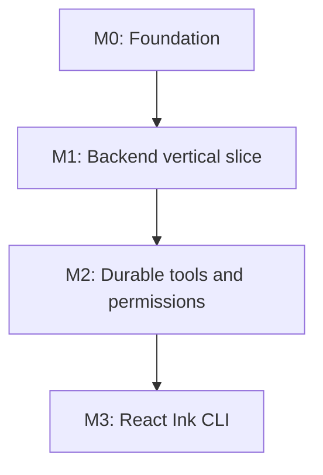
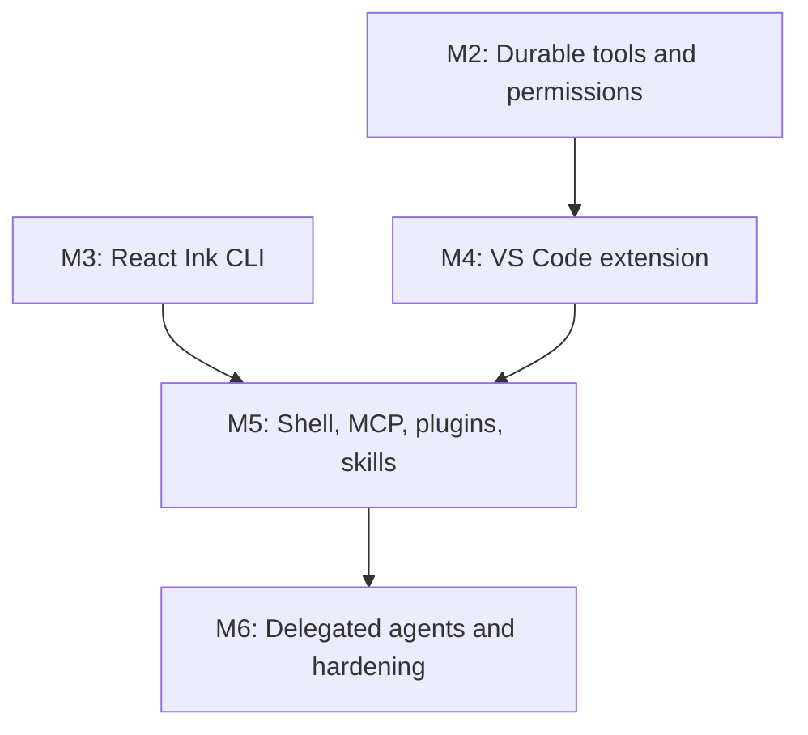

# 09 - Delivery Roadmap

> Status: target build order derived from the audited current repository.

[Project architecture index](README.md) | [Docs start page](../README.md) | [Diagram standard](../diagram-standard.md)

> Implementation gates and acceptance tests are normative in the
> [Runtime SRS](../runtime-srs/README.md) and
> [Agent Architecture](../agent-architecture/README.md).

> Deep implementation paths: [Fast CLI](../cli-architecture/README.md),
> [Memory](../memory-architecture/README.md),
> [Skills](../skills-architecture/README.md), and
> [Execution/Sandbox](../execution-architecture/README.md).

The sequence preserves current behavior from [`query.ts`](../../query.ts),
[`QueryEngine.ts`](../../QueryEngine.ts), [`Tool.ts`](../../Tool.ts),
[`screens/REPL.tsx`](../../screens/REPL.tsx), and the current services/utilities.
FastAPI, React Ink client separation, the database, and the VS Code extension
are **TARGET** architecture, not source already present in this snapshot.

This roadmap turns the architecture into a sequence of independently useful
increments. The goal is not to rewrite every feature at once. The goal is to
establish one safe, observable path from a user prompt to a tool result, then
expand that path without creating separate runtimes for the CLI and VS Code.

## Delivery principles

| Principle | Practical consequence |
| --- | --- |
| One backend | FastAPI owns model calls, tools, permissions, sessions, and persistence. |
| Thin clients | React Ink and the VS Code extension render the same protocol. |
| Vertical slices | Every milestone ends with a user-visible, testable workflow. |
| Safe before powerful | Read-only tools ship before edits; edits ship before a shell. |
| Durable state | Session and permission transitions are committed before they are emitted. |
| Contract first | Python models generate the JSON Schema and TypeScript client types. |
| Local first | The first supported deployment is one authenticated loopback daemon. |

## Dependency path

### Reliable CLI core

**Question:** what must be built before the CLI can be trusted for real edits?



1. Freeze ownership and protocol contracts in M0.
2. Prove one read-only prompt-to-tool-to-answer path in M1.
3. Add restart safety and authorization in M2 before exposing real edits.
4. Build the polished CLI in M3 on the same replayable protocol, not on direct Python imports.

### Capability expansion

**Question:** when should editor, shell, skills, MCP, and delegated agents arrive?



The extension starts after durable tool/permission semantics exist. Powerful
execution and integration capabilities wait for both policy and at least one
real client. Delegated agents come last because they multiply every unresolved
loop, leakage, cancellation, and recovery failure.

The CLI shell can begin against M1 fixtures as soon as the protocol is usable,
but M3 is not complete until M2 behavior is visible and controllable. It must
never duplicate backend logic while later milestones are being built.

## M0: Repository foundation

### Deliverables

- Establish a real monorepo root with manifests, lockfiles, formatting, linting,
  tests, and CI.
- Keep the current TypeScript snapshot under a clearly labeled reference area
  until migration decisions are complete.
- Create `apps/backend`, `apps/cli`, `apps/vscode`, `packages/protocol`, and
  `packages/ui` boundaries described in
  [02-target-system.md](02-target-system.md).
- Define Python Pydantic models for protocol envelopes, events, commands,
  sessions, messages, tool calls, tool results, and errors.
- Generate JSON Schema and TypeScript types from the same versioned contract.
- Add repository-wide checks for secrets, formatting, type errors, and tests.
- Investigate the unrelated SRS text embedded in
  `utils/permissions/filesystem.ts`; remove or relocate it only after confirming
  provenance so an unrelated user change is not lost.

### Exit criteria

- A clean checkout installs reproducibly with documented commands.
- CI can validate Python and TypeScript independently.
- A compatibility test proves that a sample Python event validates against the
  generated TypeScript schema.
- The current snapshot remains available for behavior comparison.

## M1: Backend vertical slice

### User-visible outcome

A client can start the FastAPI daemon, create a session, send a prompt, observe
streamed events, approve no permissions, execute `read_file`, and receive a
final answer.

### Deliverables

- FastAPI application factory and lifespan-managed dependencies.
- Loopback-only listener, generated bearer token, and atomic discovery file.
- Health, capabilities, session creation, session read, and prompt endpoints.
- Versioned WebSocket connection with sequence numbers and reconnect replay.
- In-memory session coordinator behind repository interfaces.
- Model provider interface with a deterministic fake provider for tests.
- Minimal custom LangGraph `StateGraph` with `TypedDict` state, natural
  no-tool completion, one tool-result continuation edge, and configurable hard
  model/tool/deadline guards.
- Tool registry, Pydantic argument validation, executor, and `ReadFileTool`.
- Workspace containment including symlink-aware resolved-path checks.
- Structured logs containing session, turn, request, and tool-call IDs.

### Exit criteria

- The full prompt-to-result path passes without importing terminal or VS Code
  code into the backend.
- Invalid arguments and out-of-workspace paths produce stable protocol errors.
- Disconnecting and reconnecting does not duplicate a completed event.
- Tests run without a real model API key.

## M2: Durable tools and permissions

### User-visible outcome

Sessions survive process restarts, and tools that can modify state stop at a
clear approval boundary before execution.

### Deliverables

- SQLite repositories for sessions, turns, messages, tool calls, permission
  requests, approvals, and event sequence metadata.
- JSONL export/import for portable transcripts and debugging.
- Glob/search tools followed by a bounded edit tool.
- Permission policy with allow-once, allow-for-session, deny-once, and persistent
  deny behavior.
- Durable `permission.requested` state before the event reaches a client.
- Production checkpointer integration, one `run_id` thread per graph, durable
  permission interrupts, and idempotent resume/reconciliation commands.
- Artifact storage for large tool output, diffs, and attachments.
- Idempotency keys for prompt submission and permission decisions.
- Cancellation and timeout propagation from transport to tool execution.
- Event replay from a client-provided last sequence number.

### Exit criteria

- Restarting the daemon preserves transcript order and unresolved approvals.
- Replaying a request cannot apply the same edit twice.
- Permission tests cover every decision and restart boundary.
- Large tool results do not block or overflow the WebSocket event stream.

## M3: React Ink CLI

### User-visible outcome

The terminal client provides a polished, responsive chat interface backed only
by the versioned FastAPI API.

### Deliverables

- Backend discovery and startup manager with clear failure diagnostics.
- React Ink shell, transcript viewport, composer, status line, and command menu.
- External client store reduced from REST snapshots and WebSocket events.
- Streaming assistant text and live tool progress.
- Keyboard-accessible permission panel with explicit decision labels.
- Session create, list, resume, rename, and archive flows.
- Compact and wide terminal layouts using the visual system in
  [05-react-ink-cli.md](05-react-ink-cli.md).
- Reconnect state, event replay, and offline/error banners.
- Golden rendering tests for important terminal sizes.

### Exit criteria

- The CLI contains no provider SDK, filesystem tool, or permission policy code.
- A user can complete the M1 and M2 workflows using only the terminal.
- Resizing, reconnecting, and long output preserve input and session state.
- All core actions have keyboard paths and readable focus states.

## M4: VS Code extension

### User-visible outcome

The same session can be opened in VS Code, use editor-aware context, present a
native diff, and continue in the CLI without transcript divergence.

### Deliverables

- Extension host activation, daemon discovery, authenticated protocol client,
  and output channel diagnostics.
- Sidebar webview for transcript and composition.
- Webview message allowlist, CSP, nonce, and strict payload validation.
- Commands for new session, attach file, explain selection, fix selection,
  resume session, and open logs.
- Extension-host adapters for active editor, selection, diagnostics, workspace
  folders, and document symbols.
- Native diff preview and explicit apply/reject flow for edits.
- Single active writer lease with additional read-only viewers.
- Workspace Trust integration and secret storage through VS Code APIs.

### Exit criteria

- The webview cannot access the daemon token or call the backend directly.
- An untrusted workspace cannot run write-capable or shell-capable tools.
- CLI and VS Code render the same ordered events for one session.
- Extension tests cover activation, reconnect, context capture, and diff apply.

## M5: Shell, skills, memory, MCP, and plugins

### User-visible outcome

Users can opt into more powerful tools while seeing exactly which boundary is
being crossed and retaining control over every persistent permission.

### Deliverables

- Shell tool with parsed command policy, timeout, output limits, working-directory
  containment, cancellation, and process-tree cleanup.
- Tool scheduler that runs only declared concurrency-safe calls in parallel.
- Layered skill registry preserving the current managed/user/project/plugin/
  bundled/MCP/dynamic precedence, realpath deduplication, path conditions, and
  lazy full-body loading.
- Skill builder that validates frontmatter, capability declarations, bundled
  resources, test fixtures, and version/hash metadata before installation.
- Explicit discover/search/fetch provider contract; unavailable source modules
  remain a visible `GAP` rather than a fabricated implementation.
- Scoped file-first memory with provenance, user deletion, background
  extraction, bounded recall, and consolidation outside the model hot loop.
- MCP client manager with server lifecycle, capability discovery, namespaced
  tools, health state, and explicit trust configuration.
- Signed or locally trusted plugin manifests with declared capabilities.
- Hook runner with bounded execution time and immutable audit records.
- Client surfaces for connected services, unavailable capabilities, and policy
  provenance.

### Exit criteria

- The shell is disabled by default until its policy is configured.
- Skills cannot gain tools, secrets, network, or filesystem authority beyond
  the run's effective policy.
- Memory tests prove scope isolation, deletion, provenance, and prompt-injection
  resistance before automatic recall is enabled.
- MCP and plugin failures cannot crash or corrupt the core session loop.
- Every external action is attributable to a user, session, tool, and policy.
- Concurrency tests prove unsafe tools never overlap.

## M6: Delegated agents and production hardening

### User-visible outcome

Long-running and delegated work remains understandable, interruptible, and
recoverable rather than becoming an opaque collection of background jobs.

### Deliverables

- Parent-child agent records, bounded budgets, cancellation trees, and status
  events.
- Context compaction with traceable summaries and retained source references.
- Background task persistence and recovery rules.
- Metrics for latency, queue depth, tool failures, permission wait time, token
  usage, reconnects, and event lag.
- Database migration, backup, repair, retention, and export procedures.
- Load, soak, fault-injection, and security regression suites.
- Packaging and updates for the daemon, CLI, and VS Code extension.
- Hosted deployment profile only after the local protocol and ownership model
  are stable.

### Exit criteria

- Parent cancellation reliably stops descendants and child processes.
- A crash during any durable state transition has a tested recovery outcome.
- Operational dashboards identify the session and stage behind a failure.
- Release artifacts are reproducible, signed where applicable, and rollbackable.

## First vertical slice

Build this exact path before broadening the feature set:

### Accept and request one tool

```mermaid
sequenceDiagram
    actor User
    participant CLI as Minimal CLI client
    participant API as FastAPI
    participant Loop as Session coordinator
    participant Model as Fake model provider

    User->>CLI: Enter prompt
    CLI->>API: POST session prompt
    API->>Loop: Enqueue turn
    Loop-->>CLI: turn.started
    Loop->>Model: Stream request
    Model-->>Loop: Tool request: read_file
```

### Execute and continue the model

```mermaid
sequenceDiagram
    participant Loop as Session coordinator
    participant Tool as ReadFileTool
    participant Model as Fake model provider
    participant CLI as Minimal CLI client

    Loop-->>CLI: tool.started
    Loop->>Tool: Validate and execute
    Tool-->>Loop: ToolResult
    Loop-->>CLI: tool.completed
    Loop->>Model: Continue with tool result
    Model-->>Loop: Final text
    Loop-->>CLI: message.delta and turn.completed
```

How to read the two halves:

1. FastAPI durably accepts the user intent before background execution begins.
2. The fake provider deterministically asks for one fixture file.
3. The same central executor validates and runs `ReadFileTool`.
4. The result returns to the model; natural final text ends the loop.
5. The CLI only reduces ordered events and renders progress/final state.

The fake provider should request a known fixture file deterministically. This
makes the entire loop testable before provider credentials, terminal styling,
or editor integration can hide architectural defects.

## Workstreams

| Workstream | Owns | Must not own |
| --- | --- | --- |
| Protocol | Schemas, generators, fixtures, compatibility | Business logic or UI state |
| Backend runtime | Sessions, model loop, tools, permissions, persistence | Ink or webview components |
| CLI | Terminal rendering, input, client cache | Model SDKs or direct tools |
| VS Code | Editor APIs, webview, native diff, trust integration | Independent session semantics |
| Quality | CI, fixtures, integration, security, load tests | Product-specific forks |
| Operations | Packaging, updates, telemetry, recovery | Hidden bypasses around policy |

These workstreams can proceed in parallel once protocol fixtures and ownership
rules are stable.

## Migration from the current source

Treat the current TypeScript repository as a behavioral reference, not as a
module-by-module migration checklist.

| Current area | Migration approach |
| --- | --- |
| `query.ts` and `QueryEngine.ts` | Extract state transitions and event behavior into Python tests first. |
| `Tool.ts` and `services/tools` | Recreate the contract with Pydantic and explicit service boundaries. |
| `screens/REPL.tsx` | Preserve proven interactions while splitting presentation from runtime state. |
| `utils/sessionStorage.ts` | Preserve useful transcript semantics but normalize them into durable entities. |
| `utils/ide.ts` and `services/mcp/vscodeSdkMcp.ts` | Reuse discovery lessons; implement the extension host as the trusted editor adapter. |
| `bridge`, `server`, and `remote` | Consolidate overlapping transports behind one versioned API. |
| Commands, skills, plugins, and MCP | Add only after the core registry and policy model are stable. |

For each migrated behavior, write a characterization fixture before deleting or
replacing the old implementation. Avoid running two authoritative session loops
for an extended period.

## Risk register

| Risk | Early signal | Mitigation |
| --- | --- | --- |
| Protocol drift | Handwritten client fields diverge | Generate types and run fixture compatibility tests in CI. |
| Duplicate execution | Reconnect repeats a write | Persist idempotency keys and terminal tool states transactionally. |
| Permission bypass | New tool executes directly | Make the executor the only callable tool boundary and test registry invariants. |
| UI logic leaks | CLI behavior differs from VS Code | Keep policy and state machines in FastAPI; clients render events. |
| Event overload | Deltas lag behind tool output | Bound buffers, coalesce deltas, and store large payloads as artifacts. |
| SQLite contention | Turns stall under concurrent writes | Use short transactions, WAL mode, one writer strategy, and measured limits. |
| Extension trust leak | Tools run in untrusted workspace | Gate capabilities in both extension host and backend policy. |
| Rewrite scope | Many features exist but no usable path | Enforce milestone exit criteria and prioritize the vertical slice. |
| Hidden source defects | Snapshot behavior is copied blindly | Characterize critical behavior and review security-sensitive code independently. |

## What not to build first

- A general-purpose unrestricted `run_command` tool.
- Distributed workers, Kafka, Redis, or Kubernetes for the local MVP.
- A second model loop inside either client.
- A custom database abstraction before repository needs are known.
- A plugin marketplace before capability declarations and isolation exist.
- Autonomous subagents before cancellation, budgets, and audit state are durable.
- Cloud synchronization before local identity and conflict semantics are defined.

## Release gates

Every milestone should satisfy the same gates:

1. **Contract:** public messages validate against versioned schemas.
2. **Behavior:** happy path, rejection path, cancellation, and restart are tested.
3. **Security:** new capabilities have a threat review and explicit permission path.
4. **Observability:** failures include correlation IDs and actionable diagnostics.
5. **Accessibility:** client actions have keyboard paths and non-color status cues.
6. **Documentation:** user behavior, operator recovery, and migration notes are current.
7. **Rollback:** state changes are backward compatible or have a tested migration plan.

## Project completion definition

The first complete product release is reached when a user can install one
versioned bundle, start either the CLI or VS Code, create and resume the same
session, safely read and edit a workspace, approve sensitive actions, reconnect
without duplicate work, inspect useful logs, and recover their transcript after
a process restart. Advanced agents, remote deployment, and plugin distribution
remain optional capabilities rather than prerequisites for a reliable core.

## Related guides

- [Architecture dashboard](README.md)
- [Target system](02-target-system.md)
- [FastAPI backend](03-fastapi-backend.md)
- [Tool and agent runtime](04-tool-agent-runtime.md)
- [React Ink CLI](05-react-ink-cli.md)
- [VS Code extension](06-vscode-extension.md)
- [Protocol and data](07-protocol-and-data.md)
- [Security and operations](08-security-and-operations.md)
