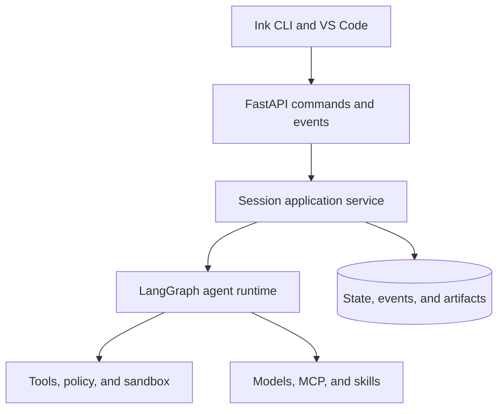

# Agent Workspace Architecture

> A verified guide to the current TypeScript source and a build specification
> for a FastAPI backend, React/Ink CLI, and VS Code extension.

[Docs start page](../README.md) | [Diagram standard](../diagram-standard.md)

## Project at a glance

| Area | Status | What this documentation means |
| --- | --- | --- |
| TypeScript agent CLI | Existing | The repository contains the reference behavior described in this guide. |
| React/Ink terminal UI | Existing | The current UI is implemented in TypeScript and can inform the new CLI. |
| Python tool contract | Drafted | `PYTHON_TOOL_IMPLEMENTATION.md` defines the first Pydantic v2 translation. |
| FastAPI backend | Proposed | No Python application or dependency manifest exists in this snapshot yet. |
| VS Code extension | Proposed | IDE connection code exists, but the extension implementation is not present. |
| Build and tests | Blocked by snapshot | There is no `package.json`, `pyproject.toml`, or checked-in test suite here. |

## Product definition

Build a local-first coding agent platform with one shared Python runtime:

- **FastAPI backend:** owns sessions, model calls, tools, permissions,
  persistence, plugins, MCP connections, and event streaming.
- **React/Ink CLI:** provides the terminal conversation, approvals, progress,
  command palette, session controls, and diagnostics.
- **VS Code extension:** provides chat, code context, diff review, approvals,
  session navigation, and editor-aware actions.
- **Shared contracts:** OpenAPI and versioned event schemas keep both clients in
  sync with the backend.

The backend should run on the developer machine for the first release. That is
the simplest safe way to let tools operate on the local workspace while both
clients share one source of truth.

**Question:** which major layer owns each part of the product?

How to read it:

1. Both clients send intent and render projections; neither owns agent state.
2. FastAPI validates versioned commands and streams ordered events.
3. The application service owns transactions, sessions, and worker wake-up.
4. LangGraph owns continuation, pause, delegation, and termination.
5. Every operating-system action passes through tools, permission, and sandbox.
6. Models and integrations are adapters behind runtime contracts.
7. Durable state/events/artifacts make reconnect and recovery possible.

Detailed tool flow, permission flow, client event reduction, and storage are
split into their own small graphs in the linked implementation specifications.

## Documentation map

| Guide | Use it to understand |
| --- | --- |
| [01 - Current repository](01-current-repository.md) | What is actually present, how it starts, and how each source area participates. |
| [02 - Target system](02-target-system.md) | The recommended end-state architecture and repository layout. |
| [03 - FastAPI backend](03-fastapi-backend.md) | Python modules, API routes, lifecycle, state, concurrency, and persistence. |
| [04 - Tool and agent runtime](04-tool-agent-runtime.md) | Validation, permissions, execution, model turns, subagents, MCP, and plugins. |
| [05 - React/Ink CLI](05-react-ink-cli.md) | Terminal UI structure, state, transport, interactions, and visual behavior. |
| [06 - VS Code extension](06-vscode-extension.md) | Extension host, webview, editor integration, security, and packaging. |
| [07 - Protocol and data](07-protocol-and-data.md) | REST endpoints, WebSocket events, reconnect rules, and storage entities. |
| [08 - Security and operations](08-security-and-operations.md) | Trust boundaries, permission policy, secrets, audit, telemetry, and recovery. |
| [09 - Delivery roadmap](09-delivery-roadmap.md) | Build order, milestones, risks, exit criteria, and the first vertical slice. |

## Implementation specifications

The guides above explain the system. These normative folders define what the
backend must implement and test:

| Specification | Contents |
| --- | --- |
| [Runtime SRS](../runtime-srs/README.md) | Full tool contract/catalog, permission precedence, FastAPI REST/events, database schema, and Python type/performance decisions. |
| [Agent Architecture](../agent-architecture/README.md) | Separate LangGraph runtime, model/tool loop, hard safety envelope, checkpoints/recovery, subagents, and interaction visibility. |
| [CLI Architecture](../cli-architecture/README.md) | Fast response, durable live steering, child-agent messaging, and precise stop scopes. |
| [CLI Improvements](../cli-improvements/README.md) | Architecture/SRS ratings, terminal UX closure, resilience/performance requirements, and test traceability. |
| [Memory Architecture](../memory-architecture/README.md) | Current memory layers, target write/recall/consolidation, leakage, retention, and deletion. |
| [Skills Architecture](../skills-architecture/README.md) | `SKILL.md`, skill builder, local discovery, remote search/fetch gap, security, and evaluation. |
| [Execution Architecture](../execution-architecture/README.md) | Sandbox providers, PC/server resources, artifacts, project history, risks, and adversarial tests. |

When an overview and an implementation SRS differ, the SRS controls the Python
implementation. Repository behavior remains labeled as migration evidence.

## Verified repository facts

The following measurements were taken from this workspace, not inferred from
the parent README:

| Measure | Value |
| --- | ---: |
| Visible files, including architecture docs | 1,949 |
| TypeScript and TSX files | 1,884 |
| TypeScript and TSX lines | 514,020 |
| Top-level source directories | 38 |
| Tool implementation files | 184 |
| Command implementation files | 207 |
| Component files | 389 |
| Utility files | 564 |
| Checked-in test files | 0 |

Many `.ts` and `.tsx` files include inline source-map payloads. Some source is
React Compiler output rather than clean authoring source, so file size alone is
not a reliable measure of architectural importance.

## Architecture rules

1. The FastAPI runtime is the source of truth; clients render state and send
   explicit user intent.
2. Model output never calls the operating system directly; every action goes
   through validation, policy, and a registered tool.
3. Read-only tools may run concurrently; mutating tools are serialized unless
   they declare a stronger safety contract.
4. Every streamed event is versioned, sequenced, replayable, and tied to a
   session.
5. The VS Code webview never receives backend credentials and never talks to
   the backend directly.
6. Local access binds to loopback, uses a random per-runtime token, and applies
   strict file permissions to discovery files.
7. Current behavior and proposed behavior remain labeled separately until the
   Python implementation exists.

## Recommended reading order

Use the dependency-first sequence in the [documentation start page](../README.md).
It explains what each folder builds, why it comes next, and which scenario page
to open when implementing steering, agents, memory, skills, or sandboxing.
