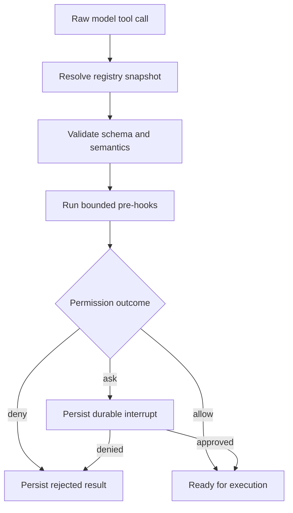
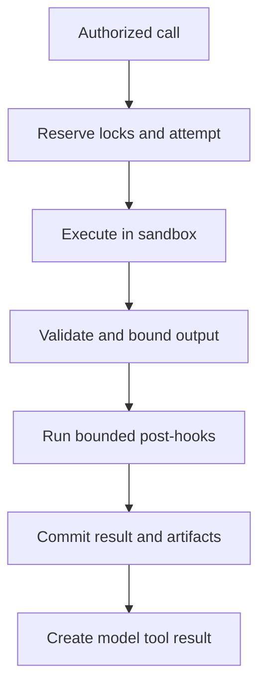
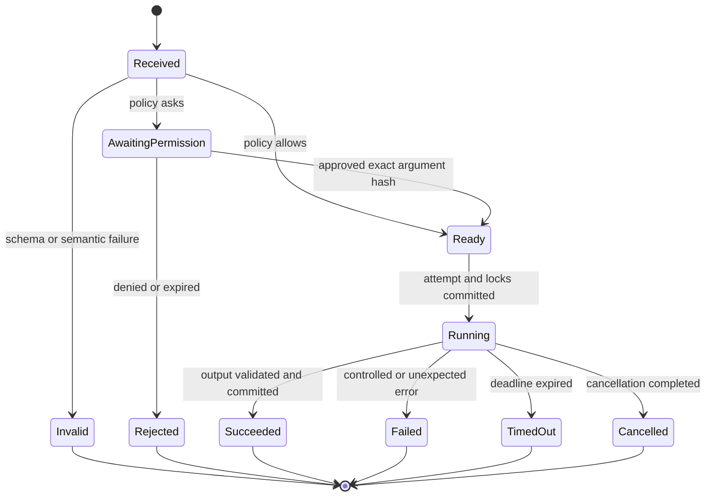

# 01 - Tool Contract

[Runtime SRS index](README.md) | [Docs start page](../README.md) | [Diagram standard](../diagram-standard.md)

## Purpose

This document defines the complete contract between a model-produced tool call
and the FastAPI runtime. A tool is not merely an async Python function. It is a
versioned capability with schemas, risk metadata, permission behavior,
concurrency rules, cancellation, progress, output limits, and audit evidence.

## Current source mapping

The current TypeScript contract is spread across:

- [`Tool.ts`](../../Tool.ts): definition, context, schemas, results, rendering,
  permission callback, read-only and concurrency metadata;
- [`tools.ts`](../../tools.ts): built-in registry, feature gates, MCP merge,
  deny filtering, aliases, and deferred discovery;
- [`services/tools/toolExecution.ts`](../../services/tools/toolExecution.ts):
  validation, hooks, permission resolution, execution, telemetry, result mapping;
- [`services/tools/toolOrchestration.ts`](../../services/tools/toolOrchestration.ts)
  and [`StreamingToolExecutor.ts`](../../services/tools/StreamingToolExecutor.ts):
  serial and parallel scheduling.

The Python contract keeps those behaviors but separates backend concerns from
React rendering. Client rendering belongs to protocol projections, not tools.

## Normative requirements

| ID | Requirement |
| --- | --- |
| `TOOL-001` | Every tool MUST have a globally unique canonical name and semantic contract version. |
| `TOOL-002` | Every model-visible input MUST be represented by a strict Pydantic model or trusted JSON Schema adapter. |
| `TOOL-003` | Every successful output MUST be validated against a declared output type before persistence or model delivery. |
| `TOOL-004` | Unknown input fields MUST be rejected unless the tool is a dynamic protocol adapter whose upstream schema explicitly permits them. |
| `TOOL-005` | Validation, permission, execution, and result serialization MUST be distinct stages. |
| `TOOL-006` | A model, hook, plugin, MCP server, or client MUST NOT invoke a tool implementation outside `ToolExecutor`. |
| `TOOL-007` | Tools MUST declare side-effect, risk, concurrency, timeout, cancellation, and output policies. Defaults MUST fail closed. |
| `TOOL-008` | A durable `tool_call` record MUST exist before a side-effecting tool begins. |
| `TOOL-009` | A terminal `tool_attempt` and event MUST be committed for success, rejection, cancellation, timeout, or failure. |
| `TOOL-010` | Tool result text sent to the model MUST be bounded; full output MUST move to an artifact when over the inline limit. |
| `TOOL-011` | Permission-approved arguments MUST be the exact arguments executed, identified by a canonical argument hash. |
| `TOOL-012` | Tool aliases MAY resolve old transcripts, but newly generated schemas MUST expose only canonical names. |
| `TOOL-013` | Dynamic tools MUST be snapshotted per agent run so replay does not silently use a changed schema. |
| `TOOL-014` | Progress events MUST be advisory and droppable; terminal results MUST be durable and replayable. |
| `TOOL-015` | Tool code MUST receive dependencies through a runtime context and MUST NOT import mutable application singletons. |

## Contract layers

The contract is shown as two small flows: decision before execution, then
execution after authorization.

**Question:** how does a raw model request become allowed, denied, or paused?



How to read it:

1. Lookup uses the immutable registry snapshot sent to that model call.
2. Strict schema validation precedes semantic/path/safety validation.
3. Hooks are bounded and cannot invoke the adapter around the executor.
4. Policy sees canonical validated facts and exact argument hash.
5. Denial still creates a provider-valid terminal tool result.
6. Ask persists request/wait state before releasing the graph worker.

**Question:** what happens after an exact request is authorized?



The attempt/intent commit occurs before process or network execution. The final
result event and model message are produced from the same settled outcome.

## Canonical metadata

Every `ToolSpec` MUST contain the following fields.

| Field | Type | Required behavior |
| --- | --- | --- |
| `name` | constrained string | Stable canonical API name; `[A-Za-z][A-Za-z0-9_.-]{0,127}`. |
| `version` | semantic version string | Increment when model-visible input, output, or behavior changes incompatibly. |
| `description` | string | Concise model-facing capability statement. |
| `input_model` | `type[BaseModel]` | Strict boundary validator and JSON Schema source. |
| `output_adapter` | reusable `TypeAdapter` | Validates successful output without forcing all internal values into models. |
| `aliases` | tuple of strings | Resume-only compatibility names. |
| `category` | enum | Filesystem, search, shell, web, agent, task, interaction, IDE, MCP, settings, automation, internal. |
| `side_effect` | enum | `none`, `local_state`, `workspace_write`, `process`, `network_read`, `external_write`, `destructive`. |
| `risk_level` | enum | `low`, `medium`, `high`, or `critical`. |
| `capabilities` | frozen set | Fine-grained policy labels such as `fs.read`, `fs.write`, `process.spawn`, `network.http`. |
| `default_permission` | enum | `allow`, `ask`, or `deny`; deny is required when metadata is incomplete. |
| `concurrency` | enum | `parallel`, `read_parallel`, `serial_session`, `serial_workspace`, or `exclusive_runtime`. |
| `resource_keys` | callable | Returns deterministic lock keys from validated arguments. |
| `timeout` | policy | Default, maximum, idle timeout, and whether the model may request a lower value. |
| `interrupt_behavior` | enum | `cancel`, `finish`, or `non_interruptible`. |
| `idempotency` | enum | `pure`, `idempotent`, `deduplicated`, or `non_idempotent`. |
| `max_inline_result_bytes` | positive integer | Maximum model/event inline payload before artifact spill. |
| `deferred` | boolean | Whether discovery is required before the schema is sent to a model. |
| `always_load` | boolean | Whether the schema is always present despite deferred-tool mode. |
| `availability` | callable | Evaluates runtime capabilities without mutating state. |

`is_read_only` alone is not sufficient. A web GET is read-only but crosses a
network boundary; a message to another agent may not mutate a file but can
trigger external behavior. Policy uses capabilities and side-effect classes.

## Python reference contract

```python
from __future__ import annotations

from collections.abc import AsyncIterator, Callable
from dataclasses import dataclass
from enum import StrEnum
from typing import Any, Generic, Protocol, TypeVar

from pydantic import BaseModel, ConfigDict, TypeAdapter


class SideEffect(StrEnum):
    NONE = "none"
    LOCAL_STATE = "local_state"
    WORKSPACE_WRITE = "workspace_write"
    PROCESS = "process"
    NETWORK_READ = "network_read"
    EXTERNAL_WRITE = "external_write"
    DESTRUCTIVE = "destructive"


class ConcurrencyClass(StrEnum):
    PARALLEL = "parallel"
    READ_PARALLEL = "read_parallel"
    SERIAL_SESSION = "serial_session"
    SERIAL_WORKSPACE = "serial_workspace"
    EXCLUSIVE_RUNTIME = "exclusive_runtime"


class ToolError(BaseModel):
    model_config = ConfigDict(extra="forbid", frozen=True)

    code: str
    message: str
    retryable: bool = False
    details: dict[str, Any] | None = None


class ArtifactRef(BaseModel):
    model_config = ConfigDict(extra="forbid", frozen=True)

    artifact_id: str
    media_type: str
    size_bytes: int
    sha256: str
    preview: str | None = None


OutputT = TypeVar("OutputT")


class ToolResult(BaseModel, Generic[OutputT]):
    model_config = ConfigDict(extra="forbid")

    status: str
    output: OutputT | None = None
    model_content: str
    artifacts: list[ArtifactRef] = []
    error: ToolError | None = None
    metadata: dict[str, Any] = {}


@dataclass(slots=True, frozen=True)
class ToolRuntimeContext:
    session_id: str
    run_id: str
    turn_id: str
    tool_call_id: str
    workspace_id: str
    workspace_root: str
    actor_id: str
    permission_mode: str
    cancellation: "CancellationToken"
    services: "RuntimeServices"
    emit_progress: Callable[["ToolProgress"], None]


InputT = TypeVar("InputT", bound=BaseModel)


class Tool(Protocol[InputT, OutputT]):
    spec: "ToolSpec[InputT, OutputT]"

    async def validate_semantics(
        self,
        args: InputT,
        context: ToolRuntimeContext,
    ) -> None: ...

    async def execute(
        self,
        args: InputT,
        context: ToolRuntimeContext,
    ) -> OutputT: ...
```

The mutable list/dict defaults above are safe in Pydantic v2 because Pydantic
deep-copies non-hashable defaults, but `Field(default_factory=...)` SHOULD be
used in production for explicitness.

## Why the context is a dataclass

`ToolRuntimeContext` is trusted process-local dependency wiring. It contains
database units of work, filesystem adapters, provider clients, cancellation
objects, and callbacks that cannot be represented meaningfully in JSON. A
slotted frozen standard dataclass provides low overhead and prevents accidental
attribute mutation. Public requests and persisted records remain Pydantic
models. See [06 - Python Types and Performance](06-python-types-and-performance.md).

## Input contract

### Structural validation

The executor MUST perform structural validation exactly once at the untrusted
model boundary:

```python
arguments = tool.spec.input_model.model_validate(raw_arguments)
```

Input models MUST normally use:

```python
model_config = ConfigDict(extra="forbid", strict=True)
```

Specific string-to-boolean or string-to-number coercion MAY be defined for a
provider compatibility case, but it MUST be field-local, documented, and tested.
Global permissive coercion makes permission matching unsafe.

### Canonicalization

After structural validation, the executor produces canonical JSON with stable
key ordering and computes:

```text
argument_hash = SHA-256(tool_name || tool_version || canonical_json)
```

The canonicalized object is the only object passed to policy, approval UI,
execution, persistence, and audit. Hooks may propose a replacement object, but
the replacement MUST be revalidated and receive a new hash before approval.

### Semantic validation

`validate_semantics` checks facts that a JSON Schema cannot express, including:

- a path exists and has the required file type;
- a file was read completely and has not changed since that read;
- a search offset and limit are mutually valid;
- an edit target occurs exactly once unless `replace_all` is true;
- an operation is supported by the connected LSP or MCP server;
- a referenced task, agent, team, or cron job exists and is owned by the caller;
- mutually exclusive options are not both present;
- requested timeout is within server policy;
- the operation is legal in the current agent or permission mode.

Semantic validation MUST NOT perform the requested side effect. Expensive
validation SHOULD have a bounded timeout and cancellation.

## Output contract

Successful output has two representations:

| Representation | Consumer | Rule |
| --- | --- | --- |
| Structured output | database, SDK, tests | Validate with the declared adapter. |
| Model content | next model request | Compact, bounded, and free of untrusted control markup. |

The UI consumes structured protocol events, not model-formatted result strings.
This avoids coupling React components to backend tool code.

Every result status is one of:

| Status | Meaning |
| --- | --- |
| `succeeded` | Execution completed and output validated. |
| `rejected` | Policy or user denied execution. |
| `cancelled` | Cancellation was observed before a committed success. |
| `timed_out` | Runtime deadline expired. |
| `failed` | Tool ran but produced a controlled or unexpected failure. |
| `skipped` | Scheduler did not run the call because an earlier batch condition failed. |

An error is data, not an uncaught exception crossing into the model loop. The
executor catches implementation exceptions, records the full exception in
restricted logs, and emits a safe `ToolError`.

## Error taxonomy

| Code family | Examples | Retry guidance |
| --- | --- | --- |
| `tool.not_found` | unknown or no longer available name | Do not retry without refreshing tools. |
| `tool.schema_invalid` | missing field, extra field, wrong type | Model may correct arguments. |
| `tool.semantic_invalid` | missing file, stale read, ambiguous edit | Model may gather context and retry. |
| `tool.permission_denied` | rule or explicit rejection | Do not repeat unchanged call. |
| `tool.permission_expired` | approved arguments changed or lease expired | Request approval again. |
| `tool.cancelled` | user or parent run cancelled | Stop unless a new user turn requests work. |
| `tool.timeout` | wall or idle deadline exceeded | Retry only if policy permits a changed timeout. |
| `tool.conflict` | resource lock or optimistic concurrency failure | Refresh state, then retry. |
| `tool.dependency_unavailable` | MCP, LSP, network, provider disconnected | Retry with bounded backoff or use fallback. |
| `tool.output_invalid` | implementation violated output schema | Runtime defect; do not ask the model to repair. |
| `tool.internal` | unexpected exception | Runtime defect; include correlation ID only. |

## Permission handshake

The tool does not directly prompt a terminal. It provides facts to the central
policy engine:

```python
@dataclass(slots=True, frozen=True)
class PermissionFacts:
    capabilities: frozenset[str]
    side_effect: SideEffect
    risk_level: str
    resource_keys: tuple[str, ...]
    human_summary: str
    proposed_diff_artifact_id: str | None = None
```

The policy engine returns `allow`, `deny`, or a durable `ask`. The executor
pauses the graph when approval is required. Detailed precedence and storage are
defined in [03 - Permission System](03-permission-system.md).

## Execution state machine

**Question:** what user-visible lifecycle does one logical tool call follow?



How to read it:

1. `Received` is validated before policy.
2. Invalid and rejected calls terminate with matching model results.
3. Approval binds the exact argument/schema/request revision before `Ready`.
4. Attempt plus resource locks commit before `Running`.
5. Every running path settles as success, failure, timeout, cancellation, or an
   additional `outcome_unknown` database classification described by recovery SRS.

State transitions MUST use compare-and-set semantics. A late worker MUST NOT
turn a cancelled call into succeeded without an explicit reconciliation rule.

## Concurrency and resource locks

Concurrency is based on both a declared class and argument-derived resource
keys.

| Class | Scheduler behavior |
| --- | --- |
| `parallel` | May overlap with any non-exclusive call. |
| `read_parallel` | May overlap with reads of the same resource, not writes. |
| `serial_session` | One call at a time per session. |
| `serial_workspace` | One call at a time per workspace unless resource locks prove independence. |
| `exclusive_runtime` | No other tool call in the daemon may overlap. Use rarely. |

Examples of resource keys:

```text
Read(/repo/a.py)       -> fs:/repo/a.py:read
Edit(/repo/a.py)       -> fs:/repo/a.py:write
Bash(git commit ...)   -> repo:/repo:git-write
TaskUpdate(17)         -> task:list-id:17:write
MCP(calendar.create)   -> mcp:calendar:external-write
```

`TOOL-016`: Calls in one model response MAY run concurrently only when every
pair is concurrency-compatible and their lock modes do not conflict.

`TOOL-017`: Tool results MUST be appended to model history in original tool-call
order, even when execution completes out of order.

## Idempotency and side effects

The executor derives an execution key from run, call, and argument identity:

```text
execution_key = run_id + model_tool_call_id + argument_hash
```

| Idempotency class | Required behavior |
| --- | --- |
| `pure` | Safe to recompute; result caching is allowed. |
| `idempotent` | Repeating produces the same external state; reuse terminal receipt when possible. |
| `deduplicated` | Tool MUST pass a stable idempotency key to the downstream system. |
| `non_idempotent` | Crash recovery MUST stop for reconciliation rather than automatically retry. |

File writes use optimistic concurrency (read fingerprint or expected hash).
External sends and creates require downstream idempotency keys when supported.
Shell calls are non-idempotent unless a narrower command classifier proves
otherwise; they are never automatically repeated after an ambiguous crash.

## Timeouts and cancellation

Each call has:

- queue deadline;
- wall-clock execution deadline;
- optional idle-output deadline for shell and streaming integrations;
- parent-run cancellation token;
- process or remote-request cancellation adapter;
- bounded cleanup period.

Cancellation flow:

1. Persist `tool.cancel_requested`.
2. Signal the implementation.
3. Stop child processes or remote requests using the adapter.
4. Wait only for the bounded cleanup period.
5. Persist `cancelled` or `failed_cleanup`.
6. Release locks in a `finally` path.

Python coroutine cancellation alone is not enough for subprocesses. Shell tools
MUST terminate the process group and collect remaining output.

## Progress contract

Progress is a discriminated event, not arbitrary terminal text:

```python
class ToolProgress(BaseModel):
    model_config = ConfigDict(extra="forbid")

    kind: str
    message: str | None = None
    completed_units: int | None = None
    total_units: int | None = None
    preview: str | None = None
```

Tool-specific payloads MAY extend the schema with tagged variants such as
`shell_output`, `search_matches`, `download_progress`, `agent_status`, and
`mcp_progress`.

Progress requirements:

- throttle high-frequency output per call;
- coalesce adjacent text deltas;
- never include bearer tokens or unredacted secrets;
- include call ID and monotonic progress sequence;
- tolerate dropped intermediate events;
- always finish with one durable terminal event.

## Large result and artifact policy

When serialized model content exceeds `max_inline_result_bytes`, the executor:

1. writes the complete bytes to the artifact store;
2. computes media type, byte count, and SHA-256;
3. stores an immutable `ArtifactRef` on the tool attempt;
4. sends the model a head/tail preview and artifact identifier;
5. emits an event containing metadata, not the entire payload.

Sensitive artifacts inherit the session access policy. File paths in model
content are not authorization tokens; artifact reads still require authenticated
REST access.

## Registry and discovery

The registry has three layers:

1. Built-in definitions shipped with the daemon.
2. Trusted plugin definitions accepted after manifest validation.
3. Dynamic MCP definitions accepted after server capability negotiation.

Registration MUST reject duplicate canonical names. Built-ins take precedence
over dynamic tools unless an explicit namespace policy allows replacement.

At run start, the registry stores a snapshot containing:

- canonical name and aliases;
- version and implementation source;
- input/output schema hashes;
- permission and capability metadata;
- availability result and reason;
- deferred/always-load state;
- MCP server identity and advertised annotations when applicable.

Tool search returns names from that snapshot. Discovering a deferred tool adds
its schema to the next model request but does not grant permission to call it.

## Dynamic MCP tools

MCP schemas are untrusted network input. The adapter MUST:

- namespace names as `mcp__<normalized-server>__<normalized-tool>`;
- preserve original server and tool names separately;
- sanitize descriptions and limit their length;
- validate JSON Schema before registration;
- reject unsupported schema features with an availability reason;
- treat missing `readOnlyHint`, `destructiveHint`, or `openWorldHint` as unsafe;
- require central policy even when an MCP annotation says read-only;
- bound progress, result size, retries, and elicitation;
- record server identity, transport, schema hash, and request ID;
- disable automatic replay of ambiguous external writes.

MCP authentication is a separate interactive capability. It MUST NOT be
silently auto-approved merely because the authentication tool has no arguments.

## Hooks

Pre-tool hooks MAY:

- observe a redacted canonical input;
- add context messages;
- propose a replacement input;
- return allow, ask, or deny subject to immutable safety policy;
- stop continuation.

Post-tool hooks MAY observe terminal status and bounded output. They MUST NOT
rewrite the committed tool result. Hook requirements:

- explicit source and version;
- timeout and cancellation;
- deterministic ordering or documented parallel aggregation;
- input replacement revalidation;
- no override of hard deny or workspace trust;
- durable decision reason;
- failure policy configured per hook, normally fail closed for security hooks
  and fail open with warning for advisory hooks.

## Executor pseudocode

```python
async def execute_tool_call(raw: RawToolCall, runtime: Runtime) -> ToolResult:
    tool = runtime.registry_snapshot.resolve(raw.name)
    if tool is None:
        return await runtime.results.unknown_tool(raw)

    args = tool.spec.input_model.model_validate(raw.arguments)
    canonical = runtime.canonicalizer.arguments(tool.spec, args)
    await tool.validate_semantics(args, runtime.tool_context(raw))

    hooked = await runtime.hooks.before(tool, canonical)
    if hooked.arguments_changed:
        args = tool.spec.input_model.model_validate(hooked.arguments)
        canonical = runtime.canonicalizer.arguments(tool.spec, args)

    decision = await runtime.permissions.evaluate(tool, canonical, hooked)
    if decision.is_denied:
        return await runtime.results.rejected(raw, decision)
    if decision.requires_user:
        decision = await runtime.permissions.interrupt_and_resume(
            tool,
            canonical,
            decision,
        )
        if decision.is_denied:
            return await runtime.results.rejected(raw, decision)

    attempt = await runtime.attempts.reserve(tool, raw, canonical, decision)
    async with runtime.locks.acquire(tool.spec, args):
        try:
            output = await runtime.timeouts.run(
                tool.execute(args, runtime.tool_context(raw)),
                tool.spec.timeout,
            )
            validated = tool.spec.output_adapter.validate_python(output)
            result = await runtime.results.succeeded(attempt, validated)
        except runtime.cancelled_errors as error:
            result = await runtime.results.cancelled(attempt, error)
        except runtime.timeout_errors as error:
            result = await runtime.results.timed_out(attempt, error)
        except Exception as error:
            result = await runtime.results.failed(attempt, error)

    await runtime.hooks.after(tool, canonical, result)
    return result
```

Production code MUST use typed domain exceptions rather than broad exception
classes for expected validation, permission, timeout, and cancellation paths.

## Required test suite

Every built-in tool MUST provide:

- valid input fixture and JSON Schema snapshot;
- one fixture for every validation rule and error code;
- permission matrix across applicable modes;
- output validation and model-content snapshot;
- cancellation and timeout behavior;
- maximum-result artifact spill behavior;
- idempotency or ambiguous-crash behavior;
- concurrency/resource-key tests;
- path or identifier ownership tests;
- secret-redaction tests;
- resume fixture for any alias or backward-compatible output field.

Executor-wide property tests MUST prove:

- no execution occurs before an allow decision;
- changed arguments invalidate prior approval;
- every started attempt reaches exactly one terminal state;
- terminal event order is stable under parallel completion;
- duplicate delivery does not duplicate a deduplicated side effect;
- a deny rule cannot be overridden by a lower-priority allow rule or hook;
- dynamic tools cannot escape the namespace or executor boundary.
