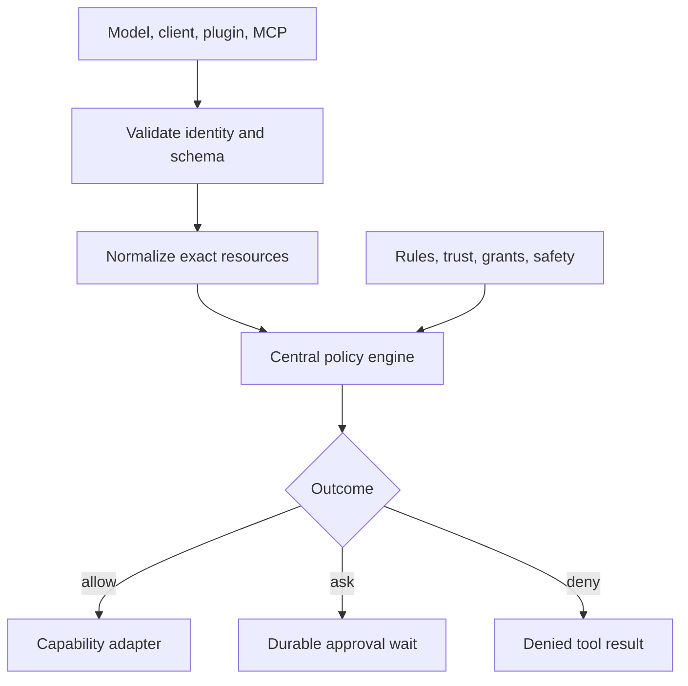
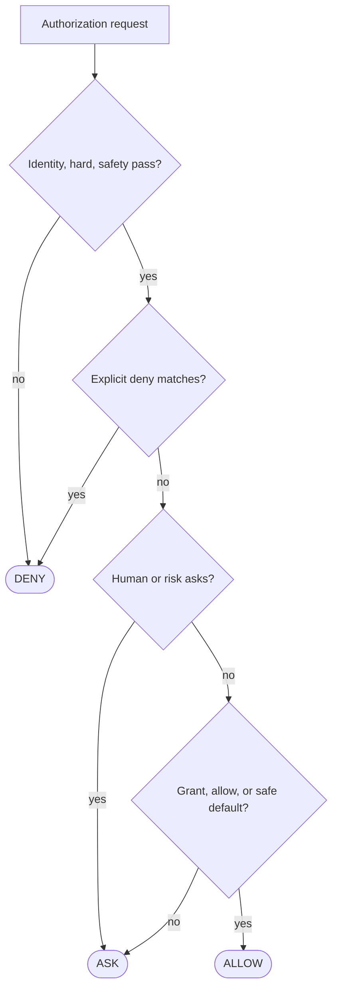
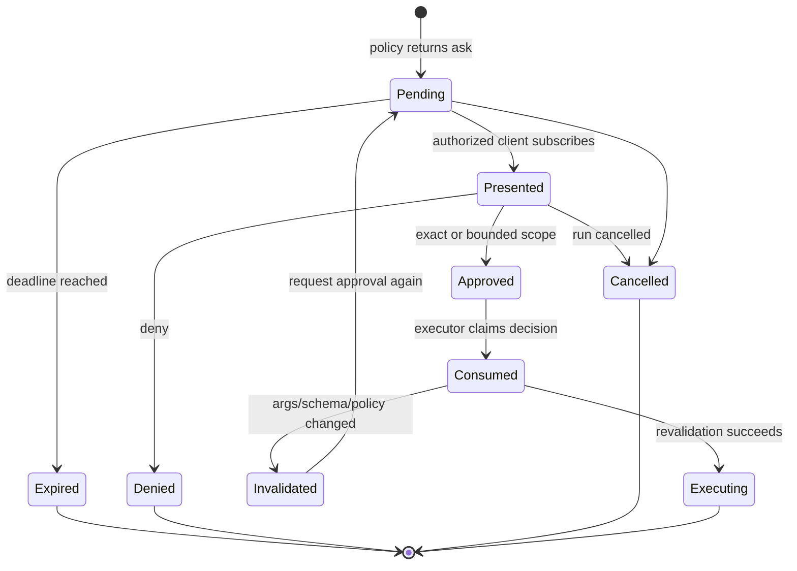

# Permission System SRS

> Normative authorization, approval, and audit requirements for every built-in,
> plugin, MCP, subagent, scheduled, and remote tool invocation.

[Runtime SRS index](README.md) | [Docs start page](../README.md) | [Diagram standard](../diagram-standard.md)

## Purpose

The permission system answers one question: **may this exact actor perform this
exact operation against this exact resource now?** It is not a UI prompt helper.
It is a backend security boundary that continues to work when the CLI or VS Code
window disconnects.

The current TypeScript implementation supplies useful precedence and matcher
behavior in [`utils/permissions/permissions.ts`](../../utils/permissions/permissions.ts)
and [`types/permissions.ts`](../../types/permissions.ts). This document preserves
compatible concepts while making durable decisions, workspace trust, immutable
denies, and time-of-check/time-of-use controls explicit.

## Security outcomes

`PERM-001`: No tool adapter may execute until the central policy engine returns
an `allow` decision for the validated, normalized argument object.

`PERM-002`: A model, plugin, MCP server, hook, subagent, client, or tool
implementation MUST NOT be able to grant itself a capability.

`PERM-003`: Approval applies to the operation displayed to the user. Any change
to security-relevant arguments invalidates the decision.

`PERM-004`: System hard-deny rules and administrator policy MUST NOT be
overridden by session, workspace, user, mode, hook, or model output.

`PERM-005`: A missing rule, unavailable policy dependency, malformed matcher,
unknown tool, stale schema, or interrupted approval MUST fail closed.

`PERM-006`: Every `ask`, `allow`, and `deny` outcome MUST be explainable from a
stored ordered list of evaluated rules and safety checks.

## Trust boundaries

**Question:** where do untrusted requests become one authoritative outcome?



How to read it:

1. Authenticated clients are callers, not authorization authorities.
2. Tool/plugin/MCP/model data validates before policy.
3. Resources are canonicalized so display and execution bind to the same target.
4. One engine applies immutable and scoped evidence in required order.
5. Allow reaches the adapter only after execution-edge revalidation.
6. Ask survives client/worker disconnect; deny remains a normal model result.

### Trusted components

- The FastAPI authentication layer establishes actor identity.
- The registry loader establishes a versioned `ToolSpec` after validating its
  manifest and schemas.
- The policy engine owns precedence and creates immutable decision evidence.
- Capability adapters enforce the approved scope again at the execution edge.
- The database and artifact store persist evidence and large review payloads.

### Untrusted inputs

- model-produced arguments and text;
- plugin and MCP schemas, descriptions, annotations, and results;
- filesystem names, symlinks, repository content, and shell output;
- URLs, redirects, DNS answers, and remote response bodies;
- hook rewrites and client-submitted edited arguments;
- data from a resumed checkpoint created under an older registry or policy.

## Decision vocabulary

| Term | Meaning |
| --- | --- |
| Capability | Stable operation class such as `filesystem.read` or `process.spawn`. |
| Resource | Normalized target such as workspace-relative path, URL origin, command executable, or MCP server/tool pair. |
| Actor | User, main agent run, child agent run, scheduler, remote trigger, plugin, or service principal. |
| Rule | Stored policy statement that matches actor, capability, resource, context, and optional constraints. |
| Safety check | Non-overridable runtime check such as protected-path, sandbox availability, or SSRF validation. |
| Grant | User-created allow with bounded scope, duration, and optional use count. |
| Decision | Final `allow`, `ask`, or `deny` plus evidence. |
| Approval request | Durable paused operation requiring an authenticated human decision. |

The model-facing vocabulary may use `allow`, `ask`, and `deny`. Internally,
`passthrough` is permitted only as an intermediate tool-specific check result;
it MUST resolve to a final outcome before execution.

## Permission modes

Modes provide defaults. They are not capabilities and do not bypass hard rules.

| Mode | Read-only | Workspace edit | Shell / process | External network | User interaction |
| --- | --- | --- | --- | --- | --- |
| `default` | Allow when safe | Ask unless a rule allows | Ask by parsed operation | Ask by origin/action | Ask |
| `accept_edits` | Allow when safe | Allow ordinary workspace edits | Ask | Ask | Ask |
| `plan` | Allow safe inspection | Deny mutation except the approved plan document | Deny side-effecting commands | Allow only explicitly safe research policy | Ask |
| `dont_ask` | Allow only when rules allow | Deny instead of prompting | Deny instead of prompting | Deny instead of prompting | Deny instead of prompting |
| `bypass_permissions` | Allow unless hard-denied | Allow unless hard-denied | Allow unless hard-denied | Allow unless hard-denied | Ask for inherently human decisions |
| `auto` | Product-defined policy profile | Product-defined policy profile | Product-defined policy profile | Product-defined policy profile | Ask when required |

`PERM-010`: `bypass_permissions` MUST require an explicit startup flag, a
trusted local workspace, a visible persistent warning, and an audit event. It
MUST be disabled for remote triggers, scheduled runs, and untrusted workspaces.

`PERM-011`: `dont_ask` means fail closed when approval would be required. It
does not convert `ask` into `allow`.

`PERM-012`: `accept_edits` applies only to ordinary edits inside approved
workspace roots. It does not auto-allow protected files, deletion, executable
permission changes, generated credential files, shell commands, or external
effects.

`PERM-013`: A child agent inherits a mode no more permissive than its parent and
receives an intersection of parent capability scope and child-run policy.

## Capability taxonomy

Every `ToolSpec` MUST declare one or more capabilities. A free-form tool name is
not sufficient for policy matching.

| Capability | Representative tools | Default risk |
| --- | --- | --- |
| `filesystem.read` | `Read` | Low inside trusted roots; high for protected paths |
| `filesystem.search` | `Glob`, `Grep` | Low inside trusted roots |
| `filesystem.write` | `Edit`, `Write`, `NotebookEdit` | Medium |
| `filesystem.delete` | Worktree cleanup, future delete | High |
| `process.spawn` | `Bash`, `PowerShell` | High, operation-dependent |
| `network.fetch` | `WebFetch` | Medium, SSRF-sensitive |
| `network.search` | `WebSearch` | Medium |
| `editor.inspect` | `LSP`, diagnostics | Low |
| `vcs.worktree` | `EnterWorktree`, `ExitWorktree` | Medium/high |
| `agent.spawn` | `Agent` | Medium; child capabilities are separately checked |
| `agent.control` | `TaskStop`, team shutdown | Medium |
| `user.interact` | `AskUserQuestion`, `ExitPlanMode` | Requires a human response |
| `task.manage` | Task CRUD, todos | Low/medium depending on shared scope |
| `message.send` | `SendMessage`, `SendUserMessage` | Medium; high across trust boundary |
| `schedule.manage` | Cron and remote triggers | High |
| `mcp.invoke` | Dynamic MCP tools | Derived from server/tool metadata, never lower than unknown |
| `resource.read` | MCP resources | Medium until server trust is established |
| `config.read` | `Config` get | Low after secret filtering |
| `config.write` | `Config` set | High |
| `artifact.deliver` | User-file and push channels | High |

Risk levels are `low`, `medium`, `high`, and `critical`. A tool may raise risk
after argument inspection, for example a shell command containing a redirect or
an edit to a CI workflow.

## Policy inputs and output

The policy engine receives an immutable `AuthorizationRequest` constructed by
the executor, not by the tool:

```python
from datetime import datetime
from typing import Any, Literal

from pydantic import BaseModel, ConfigDict, Field


class ResourceRef(BaseModel):
    model_config = ConfigDict(extra="forbid", frozen=True)

    kind: Literal["path", "command", "url", "mcp", "task", "channel", "config"]
    canonical: str
    display: str
    attributes: dict[str, Any] = Field(default_factory=dict)


class AuthorizationRequest(BaseModel):
    model_config = ConfigDict(extra="forbid", frozen=True)

    request_id: str
    session_id: str
    run_id: str
    actor_id: str
    tool_call_id: str
    tool_name: str
    tool_schema_hash: str
    arguments_hash: str
    capabilities: tuple[str, ...]
    resources: tuple[ResourceRef, ...]
    risk: Literal["low", "medium", "high", "critical"]
    mode: str
    workspace_id: str
    workspace_trust: Literal["trusted", "restricted", "untrusted"]
    requested_at: datetime


class AuthorizationDecision(BaseModel):
    model_config = ConfigDict(extra="forbid", frozen=True)

    decision_id: str
    request_id: str
    outcome: Literal["allow", "ask", "deny"]
    reason_code: str
    explanation: str
    matched_rule_ids: tuple[str, ...] = ()
    safety_check_ids: tuple[str, ...] = ()
    grant_id: str | None = None
```

`PERM-020`: The canonical argument hash MUST use the post-hook, post-default,
validated argument object and deterministic JSON serialization. Internal fields
that tools cannot observe are excluded; every field that changes effects or
display is included.

`PERM-021`: Resources MUST be extracted and normalized before matching. If the
engine cannot confidently identify the target resources, the minimum outcome is
`ask`; in `dont_ask` it is `deny`.

`PERM-022`: The final decision and argument hash MUST be stored in the same
transaction that moves a tool call to `authorized` or `blocked`.

## Required precedence

The first terminal outcome wins. Nonterminal matches contribute evidence.

1. Reject invalid identity, session, run, registry snapshot, schema hash, or
   argument hash.
2. Apply immutable platform hard denies.
3. Apply administrator and deployment denies.
4. Apply workspace trust restrictions and protected-resource checks.
5. Run tool-specific semantic and safety checks; a tool may lower access to
   `deny` or `ask`, never self-authorize.
6. Apply explicit deny rules from workspace, user, session, and parent run.
7. Require human interaction for tools whose result is a human decision.
8. Apply explicit ask rules and content/risk-based ask checks.
9. Apply mode restrictions such as `plan` and `dont_ask`.
10. Apply a valid exact or scoped grant.
11. Apply explicit allow rules in authority order.
12. Apply mode defaults such as safe read-only or `accept_edits`.
13. Use the tool's conservative default decision.
14. Convert unresolved `ask` according to invocation context: pause for an
    interactive run, deny for a non-interactive run, or route to an approved
    remote approval channel.



How to read it:

1. Invalid identity/snapshot, platform/admin deny, protected resource, or failed
   runtime safety check terminates as deny.
2. Explicit denies outrank every grant, allow, and mode default.
3. Intrinsic human decisions, ask rules, risk checks, and restrictive modes pause/deny by context.
4. Only then can an exact/scoped grant, explicit allow, or safe mode default allow.
5. An unresolved interactive request asks; non-interactive policy converts it to deny.

The numbered precedence list above is canonical and records the finer authority
ordering collapsed in this readable view.

This ordering intentionally differs from a simplistic "allow list wins"
system. A broad allow can never defeat a narrower deny or a runtime safety
failure.

## Rule model

Rules are data, not executable Python expressions.

| Field | Requirement |
| --- | --- |
| `rule_id` | Stable ULID/UUID; immutable after creation. |
| `effect` | `allow`, `ask`, or `deny`. |
| `authority` | `system`, `admin`, `workspace`, `user`, `session`, or `parent_run`. |
| `actor_selector` | Exact actor/run class or wildcard constrained by authority. |
| `capabilities` | Nonempty set of capability identifiers. |
| `tool_selector` | Optional exact tool/alias-free canonical name. |
| `resource_selector` | Typed matcher; never a raw regular expression from the model. |
| `constraints` | Structured bounds such as command executable, URL methods, max bytes, or working root. |
| `valid_from`, `expires_at` | Optional bounded validity interval. |
| `max_uses` | Optional positive use count. |
| `created_by` | Authenticated actor. |
| `reason` | Required for deny, persistent allow, or bypass-related rule. |
| `revision` | Optimistic concurrency version. |

Supported resource matchers:

| Resource | Matcher examples |
| --- | --- |
| Path | Exact canonical path, directory subtree, workspace-relative glob over normalized path |
| Command | Parsed executable plus argument-prefix constraints; shell text only as display/evidence |
| URL | Scheme, exact host or domain suffix, port, method, path prefix |
| MCP | Exact server identity, schema hash, and tool/resource name |
| Task | Session/team ownership and exact task ID |
| Channel | Exact delivery channel and recipient class |
| Config | Exact setting key or approved namespace |

`PERM-030`: Rule creation MUST validate that the creator's authority may grant
the selected scope. A session actor cannot create an administrator rule.

`PERM-031`: Persistent `allow` rules MUST be no broader than the reviewed
request unless the client shows the expanded scope separately and the user
explicitly chooses it.

`PERM-032`: Aliases are resolved before policy evaluation. Rules store canonical
tool names to prevent alias-based bypass.

`PERM-033`: Rule changes are append-only revisions. Existing decision records
continue to reference the exact revision evaluated at decision time.

## Approval lifecycle

**Question:** how does a durable ask become executable or terminal?



How to read it:

1. Pending exists durably before presentation.
2. Presentation is a client lease/view fact, not approval.
3. Approved stores `once` versus bounded grant as decision scope data.
4. Executor consumes one winning decision and revalidates current policy/resource identity.
5. Change invalidates the decision and creates/reuses a revised pending request.
6. Denied, expired, and cancelled are terminal permission outcomes with tool results.

`PERM-040`: An `ask` outcome MUST persist the tool call, approval request,
argument artifact, display summary, risk explanation, and graph checkpoint
before emitting `permission.requested`.

`PERM-041`: The graph MUST pause through a durable LangGraph interrupt or an
equivalent persisted wait state. An in-memory `Future`, terminal prompt, or
WebSocket connection MUST NOT own the pause.

`PERM-042`: Approval commands require the request ID, request revision, exact
argument hash, decision, and an idempotency key.

`PERM-043`: The backend authenticates that the deciding user owns or may approve
the workspace. A client-provided `user_id` is not trusted.

`PERM-044`: Only one terminal decision may win. Replayed identical decisions
return the original result; conflicting decisions return `409 Conflict`.

`PERM-045`: Before execution, the executor rechecks cancellation, expiry,
registry/schema hash, policy revision, workspace trust, resource identity, and
argument hash. A changed safety outcome invalidates approval.

`PERM-046`: Approval expiration is configurable by risk. Critical operations
SHOULD expire sooner than ordinary writes. Expiry produces a denied tool result
with code `permission_expired`.

### Available user decisions

| Decision | Effect |
| --- | --- |
| Allow once | Authorizes only this exact request and one execution attempt. |
| Always allow in session | Creates a session grant bounded to displayed capability/resource constraints. |
| Always allow in workspace | Creates a workspace rule only after explicit expanded-scope review. |
| Edit request | Produces candidate arguments; does not approve them. |
| Deny once | Denies this request. |
| Deny and remember | Creates a bounded deny rule, then denies this request. |

### Edited arguments

`PERM-050`: Client-edited arguments MUST return to schema validation, semantic
validation, resource extraction, risk classification, and the entire policy
pipeline as a new request revision.

`PERM-051`: The model and tool adapter receive only the accepted validated
arguments. Original and edited forms are retained as audit artifacts with
secret redaction.

`PERM-052`: A client cannot edit hidden executor fields, identity, working root,
schema hash, capabilities, timeout maximum, or sandbox policy.

## Protected resources

The platform hard-deny or mandatory-ask baseline includes:

- paths outside configured roots unless an administrator capability explicitly
  exposes them;
- runtime credentials, model provider keys, SSH keys, browser credential stores,
  OS keychains, and the service's database/checkpoint encryption keys;
- `.git` internals except through an approved version-control adapter;
- extension secrets and VS Code authentication stores;
- device files, procfs/sysfs, sockets, named pipes, and mount points;
- writes through symlinks or junctions that resolve outside the approved root;
- commands that disable the sandbox, alter policy storage, or signal unrelated
  processes;
- loopback, link-local, metadata-service, private-network, and file-scheme web
  targets unless an explicit deployment policy permits them;
- MCP tools whose server identity or schema changed after approval;
- plugin installation or code execution not signed/approved by deployment policy.

`PERM-060`: Protected path detection uses canonical filesystem identity, not
string prefix comparison. The adapter MUST defend against symlink swaps between
authorization and open/write, using descriptor-relative operations or an
equivalent platform-safe mechanism where available.

`PERM-061`: Secret files may be readable only through a dedicated secret
capability that returns handles or redacted values. General `Read` MUST NOT expose
them merely because they are inside the workspace.

## Tool-specific policy

### File read and search

- Normalize the requested root and every discovered result.
- Enforce workspace containment on each file, not just the initial glob root.
- Bound bytes, files, lines, traversal depth, and execution time.
- Treat binary data and images as artifacts with media-type and size checks.
- Re-evaluate protected-path rules for explicit hidden-file requests.
- Search content is data; it MUST NOT become executable policy syntax.

Safe reads inside a trusted workspace MAY be auto-allowed. Reads in an
untrusted workspace remain sandboxed and MAY require approval by deployment
policy.

### File write and edit

- Require a prior observed content hash for overwrite/edit unless the operation
  is a newly created path.
- Show normalized path, operation type, bounded diff, and truncation notice.
- Recheck the parent directory and target identity immediately before commit.
- Use atomic temporary-file replacement when preserving permissions is safe.
- Deny or ask for executable-bit changes, symlinks, device files, generated
  credentials, policy files, and paths outside ordinary source roots.
- Never auto-retry an ambiguous write after a transport or process failure.

`accept_edits` MAY auto-authorize a normal workspace edit only after all checks
above pass.

### Shell and PowerShell

Shell permission is based on a parser-backed operation plan, not substring
matching.

The plan MUST identify, where possible:

- executable and resolved binary;
- arguments and environment assignments;
- working directory;
- pipelines, lists, substitutions, redirects, heredocs, and background jobs;
- paths read, written, created, or deleted;
- network-capable commands and destinations;
- privilege changes, process signals, interpreters, package managers, and VCS
  operations;
- uncertainty introduced by aliases, `eval`, dynamic expansion, scripts, or
  shell-specific syntax.

`PERM-070`: Every independent command segment is authorized. An allow for `git
status` does not cover `git status | sh` or output redirection.

`PERM-071`: Parse uncertainty raises the decision to at least `ask`; in a
non-interactive `dont_ask` run it is denied.

`PERM-072`: Approval display includes the exact command, cwd, environment key
names, parser summary, sandbox profile, timeout, and affected resources. Secret
environment values are redacted.

`PERM-073`: An approved process executes in a process group with enforced
timeout, output limits, cancellation, workspace boundary, and resource limits.

`PERM-074`: `dangerouslyDisableSandbox` or an equivalent flag is never model
settable. It requires deployment policy plus explicit human approval for each
request.

### Web fetch and search

- Permit only configured schemes, normally HTTPS.
- Normalize internationalized hostnames and ports.
- Resolve DNS and validate every address before connect; validate again after
  redirects and DNS rebinding-sensitive retries.
- Apply domain rules to the final destination as well as the initial URL.
- Strip credentials from URLs and approval displays; reject user-info by default.
- Limit redirects, response bytes, decompression ratio, content types, and time.
- Keep provider search queries and direct origin fetches as distinct capabilities.

### MCP tools and resources

`PERM-080`: MCP annotations such as `readOnlyHint` and `destructiveHint` are
untrusted hints. Local policy may raise risk but MUST NOT lower risk solely from
server metadata.

`PERM-081`: An MCP permission target includes server installation identity,
transport, authenticated principal, server manifest hash, tool name, tool schema
hash, and normalized arguments.

`PERM-082`: Reconnection, server upgrade, authentication change, or schema
change invalidates grants that depend on the old identity/hash.

`PERM-083`: MCP calls pass through the same durable tool-call, approval,
timeout, cancellation, output validation, and audit path as built-ins.

### Agents, teams, and skills

`PERM-090`: Approving `Agent` authorizes creation of the child run, not all
future child side effects. Every child tool call is authorized normally.

`PERM-091`: Child capability scope is the intersection of parent scope,
subagent profile, workspace policy, and deployment policy. A child cannot use
the parent's `allow once` for a different call.

`PERM-092`: Skills are content/configuration, not permission principals. Skill
instructions cannot add tools or override policy. Forked skills create normal
child runs.

`PERM-093`: Cross-agent messages are scoped to the owning session/team. Bridge,
remote, or external delivery is separately authorized.

### Schedules, remote triggers, and notifications

- Creation and mutation always require a durable actor and explicit approval.
- A scheduled execution uses the capabilities stored in its approved execution
  profile; it does not inherit future broad session grants.
- If an operation would ask and no approved remote channel exists, it pauses or
  denies according to schedule policy; it never silently allows.
- External notifications and artifact delivery require recipient/channel scope,
  secret scanning, size limits, and delivery receipts.

## Workspace trust

| State | Meaning | Baseline behavior |
| --- | --- | --- |
| `trusted` | User explicitly trusts the root and repository identity. | Safe reads and ordinary approved-mode edits may use mode defaults. |
| `restricted` | User opened the workspace but has not granted full trust. | Reads sandboxed; writes/shell/network ask or deny by policy. |
| `untrusted` | Remote, downloaded, unknown-owner, or policy-marked content. | No local execution; minimal reads; plugins/hooks disabled unless separately trusted. |

`PERM-100`: Trust binds to canonical root and, when available, filesystem/repo
identity. Moving or replacing the directory triggers reevaluation.

`PERM-101`: Repository content cannot declare itself trusted. Workspace files
may request capabilities in a manifest, but the user/admin decides.

`PERM-102`: Hooks and project-local plugins run only with separately approved
code-execution capability; merely opening a workspace does not activate them.

## Concurrency and TOCTOU

`PERM-110`: Permission checks do not replace execution locks. The executor uses
resource locks described in [01 - Tool Contract](01-tool-contract.md) for
conflicting operations.

`PERM-111`: Authorization requests record observed resource versions where
available: file identity/hash, task revision, config revision, MCP schema hash,
or worktree HEAD. Mismatch before side effect causes revalidation or conflict.

`PERM-112`: A scoped grant use is claimed atomically with authorization. Two
concurrent calls cannot both consume a one-use grant.

`PERM-113`: Revocation increments a policy epoch. Calls not yet executing must
re-evaluate; running calls receive cancellation where the adapter can safely
interrupt them.

## Audit evidence

Each decision record MUST contain:

- request, session, run, actor, tool-call, workspace, and parent-run IDs;
- canonical tool name, registry snapshot, schema hash, and argument hash;
- capability, resources, computed risk, mode, and workspace trust;
- ordered rule matches with rule revisions and why each matched or did not
  terminate evaluation;
- safety checks and normalized facts used by those checks;
- final outcome, stable reason code, safe explanation, and policy engine version;
- deciding user and client for human decisions;
- created, presented, decided, claimed, expired, and invalidated timestamps;
- resulting grant/rule revision when one was created;
- redaction map or artifact references rather than raw secrets.

Recommended stable reason codes include:

| Code | Meaning |
| --- | --- |
| `hard_deny` | Immutable platform rule blocked the request. |
| `workspace_untrusted` | Trust policy disallows the capability. |
| `protected_resource` | Target is protected. |
| `explicit_deny` | Stored deny rule matched. |
| `approval_required` | User decision is needed. |
| `mode_denied` | Current mode converts ask to deny or forbids mutation. |
| `grant_matched` | A valid bounded grant allowed the request. |
| `rule_allowed` | Explicit allow rule matched. |
| `safe_mode_default` | Conservative mode default allowed the request. |
| `approval_denied` | User denied it. |
| `permission_expired` | Request or grant expired. |
| `request_changed` | Arguments, resource, schema, or policy changed. |
| `policy_unavailable` | Required policy dependency failed; request closed. |

## Client presentation contract

The backend sends structured facts; clients own layout but may not omit critical
facts.

An approval view MUST show:

- tool and plain-language action;
- exact affected resources and workspace;
- bounded argument preview with a link to full artifact content;
- side effects, risk level, and why approval is required;
- cwd, timeout, sandbox, external destination, and child scope when relevant;
- whether output or data may leave the machine;
- choices with their exact scope and expiration;
- changed-request warning when a previous approval was invalidated.

CLI and VS Code clients MUST render the same decision semantics. A client may
offer fewer choices, but cannot invent a broader grant.

## Failure behavior

| Failure | Required outcome |
| --- | --- |
| Policy database unavailable | Deny new side effects; safe cached reads only if deployment policy explicitly permits. |
| Approval client disconnects | Keep durable request pending until expiry/cancel. |
| Duplicate decision command | Return original decision when idempotency key/payload match. |
| Tool schema changed | Invalidate pending approval and create a new request after revalidation. |
| Policy changed while pending | Reevaluate before accepting/consuming decision. |
| Adapter crashes before side effect | Retry only if operation is classified retry-safe. |
| Adapter crashes after uncertain side effect | Mark `outcome_unknown`; reconcile, never blind retry. |
| Audit persistence fails | Do not execute. |

## Verification matrix

| Test family | Required cases |
| --- | --- |
| Precedence property tests | Every deny outranks every lower-authority allow; hard deny is immutable; ask never becomes allow in `dont_ask`. |
| Hash tests | Key order is irrelevant; every security-relevant value changes hash; internal nonobservable values do not. |
| Path security | `..`, prefix collisions, symlinks, junctions, case folding, Unicode normalization, mount changes, race swaps. |
| Shell security | Pipes, lists, redirects, command substitution, heredocs, aliases, interpreters, encoded PowerShell, dynamic expansion. |
| Web security | Redirects, DNS rebinding, IPv4/IPv6 private ranges, metadata endpoints, decompression bombs, user-info. |
| Approval races | Two users decide, duplicate command, expiry race, cancellation race, schema/policy change. |
| Grants | Scope containment, atomic use count, expiration, revocation, child-run noninheritance. |
| MCP | Server impersonation, schema mutation, misleading annotations, reconnect, oversized result. |
| Recovery | Backend restart in pending/presented/claimed/executing states. |
| Audit | Every execution links to exactly one final allow decision and complete evidence. |

## Release acceptance

The first write-capable release is blocked until:

1. all model and client arguments are validated and canonically hashed;
2. file containment and protected-path tests pass on supported platforms;
3. approval survives backend and client restart;
4. exact-request decisions are idempotent and race-safe;
5. an executor adapter cannot be called without an `allow` decision token;
6. decisions and rule revisions are queryable from the interaction timeline;
7. `bypass_permissions` cannot activate in remote/untrusted contexts;
8. shell execution remains disabled until parser, sandbox, timeout, and process
   cancellation tests pass.
