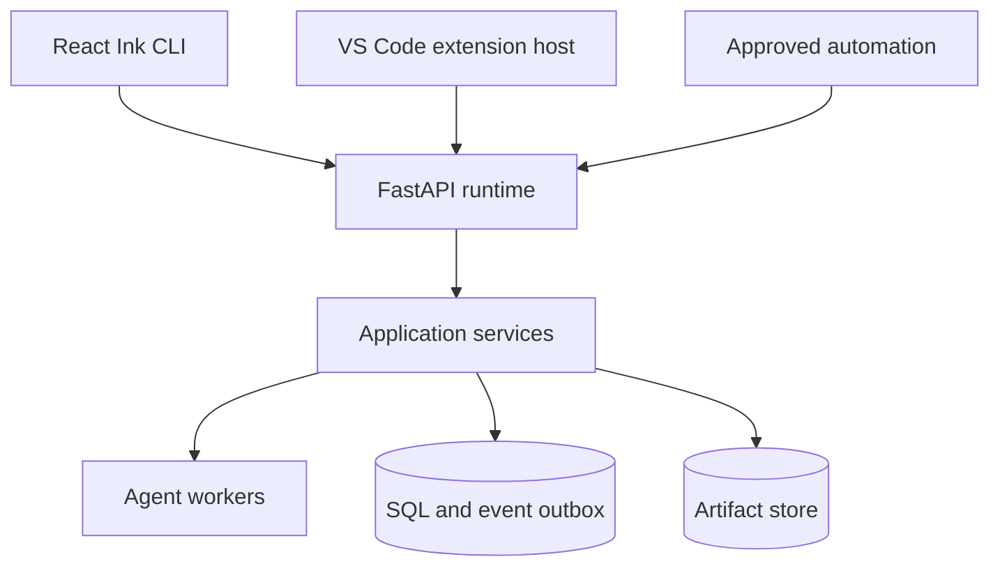
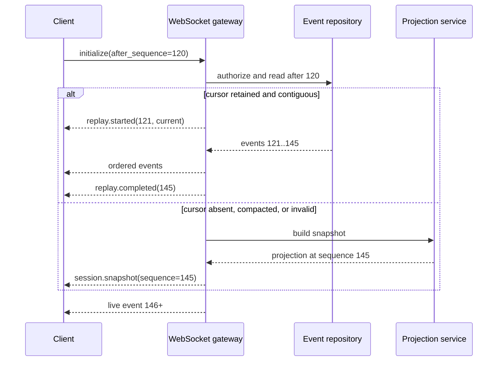
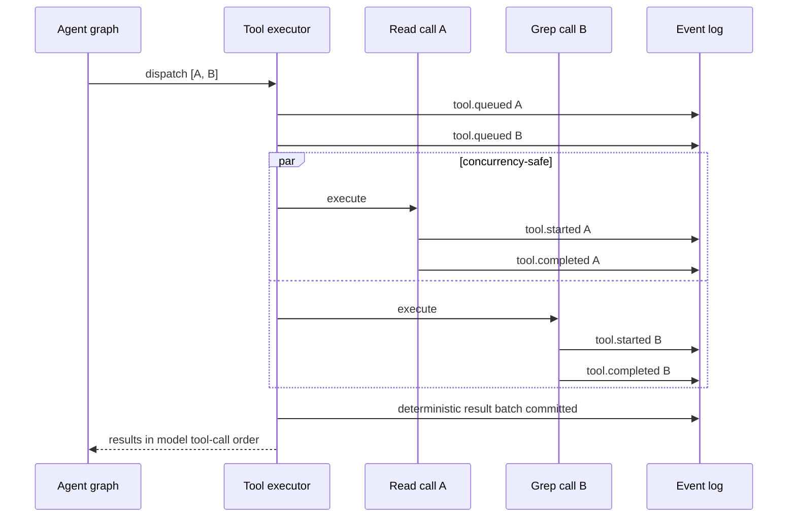

# API and Event Protocol SRS

> Normative FastAPI contract shared by the React Ink CLI, VS Code extension,
> automation clients, and future web surfaces.

[Runtime SRS index](README.md) | [Docs start page](../README.md) | [Diagram standard](../diagram-standard.md)

## Repository evidence and target boundary

| Status | Source | Behavior reused |
| --- | --- | --- |
| **CURRENT** | [`messageQueueManager.ts`](../../utils/messageQueueManager.ts) | Command identity/queue operations and shared subscriptions. |
| **CURRENT** | [`sessionStorage.ts`](../../utils/sessionStorage.ts) | Durable session records and append-oriented replay evidence. |
| **CURRENT** | [`HybridTransport.ts`](../../cli/transports/HybridTransport.ts) | Ordered serialized writes, short stream batching, retry, and backpressure lessons. |
| **CURRENT** | [`entrypoints/sdk/controlSchemas.ts`](../../entrypoints/sdk/controlSchemas.ts) | Typed Zod schemas for SDK control/input-output messages. |
| **TARGET** | This SRS | FastAPI REST plus per-session sequenced event log, replay/snapshot, and generated clients. |

## Protocol responsibilities

The backend owns session state, graph execution, permissions, persistence, and
ordering. Clients render projections and submit authenticated commands. A CLI
and VS Code extension connected to the same session MUST observe the same facts
and terminal outcomes.

LangGraph runtime streams are internal implementation data. They MUST NOT be
forwarded directly to clients because internal/private state channels are not a
confidentiality boundary. Only versioned, allowlisted domain events defined by
this protocol may cross the FastAPI client boundary.

`API-001`: REST is used for resource reads, artifact transfer, and retryable
commands. WebSocket is used for ordered event delivery and MAY carry the same
commands for lower latency.

`API-002`: REST and WebSocket commands call the same application service. They
MUST have identical authorization, validation, idempotency, conflict, and audit
semantics.

`API-003`: Clients rebuild state from a versioned snapshot followed by a
strictly ordered per-session event stream. The socket is not the source of
truth.

`API-004`: Protocol payloads contain visible actions and outcomes, not private
chain-of-thought. See
[Interaction Visibility](../agent-architecture/04-observability-and-interactions.md).

## Deployment and transport

The recommended local architecture is one Python daemon per signed-in OS user:

**Question:** which clients can reach which backend ownership layer?



How to read it:

1. CLI uses UDS/named pipe when available, otherwise authenticated loopback.
2. The extension host, not its webview, owns the backend connection.
3. Automation uses a separately scoped token/client identity.
4. FastAPI authenticates and validates transport contracts.
5. Application services own commands, transactions, queries, and authorization.
6. Workers execute long-running graph work outside request transactions.
7. SQL/outbox is canonical for state/events; artifacts hold large bytes.

For a local-only release:

- prefer a Unix domain socket on Linux/macOS and a named pipe on Windows;
- if loopback TCP is used, bind only to loopback, use a random port, and require
  a short-lived bearer token stored with owner-only permissions;
- validate WebSocket `Origin` when browser-capable clients are possible;
- never place access tokens in URLs, query strings, logs, events, or artifact
  names;
- use TLS and normal service identity for any non-loopback deployment.

`API-010`: Every request is authenticated before workspace/session lookup to
avoid identifier enumeration.

`API-011`: The authenticated principal, client instance, request ID, and command
ID are derived or verified server-side and written to audit records.

`API-012`: A remote deployment MUST add tenant scoping to every key and query.
Client-provided tenant or user identifiers are selectors only, never authority.

## Versions and media types

The first contract uses:

- REST base path: `/api/v1`;
- JSON media type: `application/json`;
- JSON Schema dialect: 2020-12;
- event protocol: major `1`, negotiated as WebSocket subprotocol
  `agent-events.v1`;
- timestamps: UTC RFC 3339 with fractional seconds;
- durations: integer milliseconds;
- hashes: algorithm-prefixed lowercase text, for example `sha256:...`.

`GET /api/v1/runtime` returns version and capability negotiation data:

```json
{
  "runtime_id": "rt_01J...",
  "runtime_version": "0.1.0",
  "api_versions": ["v1"],
  "event_protocols": ["agent-events.v1"],
  "minimum_clients": {"cli": "0.1.0", "vscode": "0.1.0"},
  "capabilities": {
    "event_replay": true,
    "durable_interrupts": true,
    "editor_rpc": true,
    "background_agents": true,
    "mcp": false
  },
  "limits": {
    "max_prompt_bytes": 262144,
    "max_attachment_count": 32,
    "max_event_bytes": 262144
  }
}
```

`API-020`: Breaking field removal, meaning change, or enum narrowing requires a
new API/event major version. A minor server release MAY add optional fields or
new event types after capability negotiation.

`API-021`: Unknown optional fields and event types are ignored and recorded by
clients. Unknown required protocol major versions terminate connection with a
clear upgrade error.

## Identifiers

Use opaque sortable UUIDv7 or ULID values. A display prefix is recommended but
not parsed for authorization.

| Prefix | Entity |
| --- | --- |
| `rt_` | Runtime instance |
| `wk_` | Workspace |
| `cl_` | Client instance |
| `ses_` | Session/thread |
| `run_` | Agent run, including child runs |
| `turn_` | User turn |
| `msg_` | Message |
| `mc_` | Model call |
| `tc_` | Tool call |
| `ta_` | Tool attempt |
| `perm_` | Permission request |
| `dec_` | Permission decision |
| `grant_` | Permission grant |
| `task_` | Durable task |
| `art_` | Artifact |
| `evt_` | Domain event |
| `cmd_` | Accepted command |

`API-030`: IDs are immutable, globally unique within the deployment, and never
encode paths, prompts, usernames, hosts, or other private data.

## Common request headers

| Header | Required | Meaning |
| --- | --- | --- |
| `Authorization: Bearer ...` | Yes except process health | Authenticates principal/token. |
| `X-Client-Id` | Yes for interactive clients | Registered CLI/extension instance. |
| `X-Request-Id` | Recommended | Client-generated tracing ID; server replaces invalid values. |
| `Idempotency-Key` | Required for commands marked idempotent | Unique key for one user intent. |
| `If-Match` | Required for revisioned updates | Expected ETag/entity revision. |
| `Accept` | Recommended | JSON or artifact media type. |

Responses include `X-Request-Id`. Revisioned resources include a strong `ETag`.

## REST resource catalog

### Runtime and health

| Method | Path | Result |
| --- | --- | --- |
| `GET` | `/health/live` | Process liveness only; no dependency or private details. |
| `GET` | `/health/ready` | Authenticated readiness and dependency status. |
| `GET` | `/api/v1/runtime` | Versions, features, and limits. |
| `GET` | `/api/v1/runtime/models` | Allowed model/provider profiles without secret values. |
| `GET` | `/api/v1/runtime/tool-catalog` | Operator-visible catalog, including disabled/unresolved reasons. |

### Workspaces

| Method | Path | Semantics |
| --- | --- | --- |
| `POST` | `/api/v1/workspaces` | Register canonical local root; idempotent. |
| `GET` | `/api/v1/workspaces` | List workspaces visible to actor. |
| `GET` | `/api/v1/workspaces/{workspace_id}` | Metadata, trust, roots, policy revision. |
| `PATCH` | `/api/v1/workspaces/{workspace_id}` | Rename or update nonsecurity metadata with `If-Match`. |
| `POST` | `/api/v1/workspaces/{workspace_id}/trust-decisions` | Explicitly change trust; audited high-risk command. |
| `GET` | `/api/v1/workspaces/{workspace_id}/tools` | Current filtered registry and schema hashes. |
| `GET` | `/api/v1/workspaces/{workspace_id}/permission-rules` | Paginated rules actor may inspect. |
| `POST` | `/api/v1/workspaces/{workspace_id}/permission-rules` | Create authorized bounded rule. |

The API exchanges workspace-relative URIs such as
`workspace://wk_01J/src/app.py`; it does not disclose an absolute host path
unless the authenticated local client explicitly has that capability.

### Sessions and runs

| Method | Path | Semantics |
| --- | --- | --- |
| `POST` | `/api/v1/sessions` | Create a session bound to workspace, model profile, and mode. |
| `GET` | `/api/v1/sessions` | Cursor-paginated filtered list. |
| `GET` | `/api/v1/sessions/{session_id}` | Current session metadata/status. |
| `PATCH` | `/api/v1/sessions/{session_id}` | Rename, archive, or update allowed defaults with `If-Match`. |
| `GET` | `/api/v1/sessions/{session_id}/snapshot` | Materialized client projection at an exact sequence. |
| `POST` | `/api/v1/sessions/{session_id}/prompts` | Append user message and start/queue a foreground run. |
| `GET` | `/api/v1/sessions/{session_id}/runs` | Paginated main and child run summaries. |
| `GET` | `/api/v1/sessions/{session_id}/runs/{run_id}` | Run state, budgets, stop reason, and parent edge. |
| `POST` | `/api/v1/sessions/{session_id}/runs/{run_id}/cancel` | Idempotent cancellation request. |
| `POST` | `/api/v1/sessions/{session_id}/runs/{run_id}/resume` | Resume only an explicitly resumable terminal/wait state. |
| `GET` | `/api/v1/sessions/{session_id}/events` | Replay events after a sequence/cursor. |
| `GET` | `/api/v1/sessions/{session_id}/interactions` | Filtered model/tool/permission timeline. |

Prompt body:

```json
{
  "text": "Explain the failing test and fix it.",
  "attachments": [
    {
      "kind": "editor_selection",
      "uri": "workspace://wk_01J/src/auth.py",
      "range": {
        "start": {"line": 40, "character": 0},
        "end": {"line": 56, "character": 18}
      },
      "content_hash": "sha256:...",
      "artifact_id": "art_01J..."
    }
  ],
  "client_context": {
    "active_editor_uri": "workspace://wk_01J/src/auth.py",
    "terminal_id": null
  },
  "expected_session_sequence": 128
}
```

Accepted `202` response:

```json
{
  "command_id": "cmd_01J...",
  "turn_id": "turn_01J...",
  "run_id": "run_01J...",
  "user_message_id": "msg_01J...",
  "accepted_sequence": 129,
  "status": "queued"
}
```

`API-040`: `202 Accepted` means the command and initial events are durable. It
does not mean model work started or completed.

`API-041`: A session has at most one foreground main run unless its concurrency
policy explicitly supports branches. Background child runs are represented as
separate runs, never hidden threads.

`API-042`: Prompt submission with a stale `expected_session_sequence` returns a
conflict when accepting it could violate client intent. Draft-only metadata MAY
be accepted independently.

### Messages and content

| Method | Path | Semantics |
| --- | --- | --- |
| `GET` | `/api/v1/sessions/{session_id}/messages` | Cursor-paginated normalized messages. |
| `GET` | `/api/v1/sessions/{session_id}/messages/{message_id}` | Message and ordered content blocks. |
| `GET` | `/api/v1/sessions/{session_id}/model-calls/{model_call_id}` | Safe request metadata, usage, timing, and response block summary. |

Messages are append-only. A correction, compaction summary, user edit, or retry
creates a new record linked by `supersedes_id` or provenance; it does not mutate
the original transcript.

### Permissions

| Method | Path | Semantics |
| --- | --- | --- |
| `GET` | `/api/v1/sessions/{session_id}/permission-requests` | Pending/history list filtered by state. |
| `GET` | `/api/v1/sessions/{session_id}/permission-requests/{request_id}` | Full safe review model and revision. |
| `POST` | `/api/v1/sessions/{session_id}/permission-requests/{request_id}/decisions` | Allow/deny/edit with exact revision/hash. |
| `GET` | `/api/v1/permission-grants` | Grants visible to actor. |
| `DELETE` | `/api/v1/permission-grants/{grant_id}` | Revoke grant idempotently. |
| `GET` | `/api/v1/permission-rules/{rule_id}` | Rule and append-only revisions. |
| `POST` | `/api/v1/permission-rules/{rule_id}/revoke` | Revoke rule; never destructive delete. |

Decision request:

```json
{
  "request_revision": 3,
  "arguments_hash": "sha256:...",
  "decision": "allow",
  "scope": "once",
  "edited_arguments": null,
  "reason": null
}
```

Allowed `scope` values are `once`, `session`, and `workspace`. The backend may
reject a broader scope or require a second explicit confirmation model.

`API-050`: An edit decision does not authorize execution. It creates a new
request revision after complete validation and policy evaluation.

### Tools, tasks, and artifacts

| Method | Path | Semantics |
| --- | --- | --- |
| `GET` | `/api/v1/sessions/{session_id}/tool-calls` | Filtered/paginated tool timeline. |
| `GET` | `/api/v1/sessions/{session_id}/tool-calls/{tool_call_id}` | Validated input summary, attempts, decision, result, and artifacts. |
| `POST` | `/api/v1/sessions/{session_id}/tool-calls/{tool_call_id}/cancel` | Cancel queued/running interruptible call. |
| `GET` | `/api/v1/sessions/{session_id}/tasks` | Current durable task projection. |
| `GET` | `/api/v1/sessions/{session_id}/tasks/{task_id}` | Task, dependencies, owner, revision. |
| `PATCH` | `/api/v1/sessions/{session_id}/tasks/{task_id}` | User-authorized task update with `If-Match`. |
| `GET` | `/api/v1/artifacts/{artifact_id}` | Artifact metadata only. |
| `GET` | `/api/v1/artifacts/{artifact_id}/content` | Authorized content with range/stream support. |
| `POST` | `/api/v1/artifacts` | Upload bounded client attachment and return immutable ID. |

Artifact content supports standard `Range`, `ETag`, `If-None-Match`,
`Content-Type`, and `Content-Disposition`. The metadata endpoint returns hash,
size, media type, sensitivity, retention, redaction, and producing entity.

`API-060`: Large file content, command output, diffs, images, PDFs, and model
provider payloads MUST use artifact references. They are not embedded without
bound in events or session snapshots.

`API-061`: Artifact authorization is checked on every metadata/content request.
Knowing an opaque ID is not sufficient.

### MCP, plugins, schedules, and remote triggers

These endpoints are disabled until their corresponding capabilities are built.

| Method | Path | Semantics |
| --- | --- | --- |
| `GET` | `/api/v1/mcp/servers` | Installed server states and identities. |
| `POST` | `/api/v1/mcp/servers` | Install/configure after explicit authorization. |
| `POST` | `/api/v1/mcp/servers/{server_id}/connect` | Idempotent connect/auth command. |
| `GET` | `/api/v1/mcp/servers/{server_id}/tools` | Validated current schema snapshot. |
| `GET` | `/api/v1/plugins` | Plugin state, provenance, capabilities. |
| `POST` | `/api/v1/plugins/{plugin_id}/enable` | Audited permission-gated activation. |
| `GET` | `/api/v1/schedules` | Actor-visible schedules. |
| `POST` | `/api/v1/schedules` | Create with approved execution profile. |
| `POST` | `/api/v1/schedules/{schedule_id}/pause` | Idempotent pause. |
| `POST` | `/api/v1/remote-triggers/{trigger_id}/run` | Authenticated idempotent invocation. |

### Client registration and editor bridge

| Method | Path | Semantics |
| --- | --- | --- |
| `POST` | `/api/v1/clients` | Register instance type/version/capabilities; returns client ID and lease metadata. |
| `GET` | `/api/v1/clients/{client_id}` | Own registration/lease state. |
| `POST` | `/api/v1/sessions/{session_id}/interaction-lease` | Acquire or renew lease for modal user interactions. |
| `DELETE` | `/api/v1/sessions/{session_id}/interaction-lease` | Release own lease. |
| `POST` | `/api/v1/editor-requests/{request_id}/responses` | Return a requested editor operation result. |

The interaction lease selects which connected UI presents one modal question;
it does not grant permission. All clients continue to receive status events.

## Pagination, filtering, and sorting

List endpoints use opaque cursor pagination:

```text
?limit=100&after=opaque_cursor&sort=created_at&order=desc
```

Responses contain `items`, `next_cursor`, and `has_more`. Maximum limits are
server-controlled. Filters are endpoint-specific enumerated fields; raw SQL,
regular expressions, and arbitrary field paths are forbidden.

`API-070`: Cursors bind to actor/tenant, endpoint, filter, order, and a bounded
validity period. A cursor cannot be replayed against another workspace.

## Idempotency and optimistic concurrency

Every state-changing endpoint is classified:

| Class | Examples | Contract |
| --- | --- | --- |
| Idempotent command | Prompt submit, cancel, approve, create session, upload artifact | Requires `Idempotency-Key`; same key/hash returns stored response. |
| Revisioned mutation | Rename, mode change, task update, rule update | Requires `If-Match`; stale revision returns `409`. |
| Naturally idempotent | Revoke already-revoked grant, pause paused schedule | Repeated call returns current state. |
| Non-retryable external effect | Rare delivery/provider operation | API accepts intent idempotently; worker uses provider idempotency/reconciliation. |

Canonical request hashing includes authenticated command type, route identity,
normalized body, relevant headers, and principal scope.

`API-080`: Reusing an idempotency key with a different canonical hash returns
`409 idempotency_conflict`. A concurrent identical request waits for or returns
the existing command status; it MUST NOT execute twice.

`API-081`: The idempotency record, domain mutation, and initial domain event are
committed atomically.

`API-082`: Idempotency retention MUST exceed the maximum client retry window and
any downstream effect reconciliation window.

## Event envelope

Every persisted server event uses this envelope:

```json
{
  "protocol": "1",
  "event_id": "evt_01J...",
  "runtime_id": "rt_01J...",
  "workspace_id": "wk_01J...",
  "session_id": "ses_01J...",
  "sequence": 130,
  "global_sequence": null,
  "occurred_at": "2026-08-22T18:30:00.123Z",
  "type": "tool.started",
  "schema_version": 1,
  "correlation_id": "turn_01J...",
  "causation_id": "evt_01J...",
  "actor": {"kind": "agent_run", "id": "run_01J..."},
  "payload": {
    "tool_call_id": "tc_01J...",
    "tool_name": "Read",
    "summary": "Read src/auth.py",
    "attempt": 1
  }
}
```

`EVT-001`: `sequence` is contiguous and monotonically increasing within one
session. Events not owned by a session use a separately documented workspace or
runtime stream; they do not overload session ordering.

`EVT-002`: `correlation_id` groups an intent such as a turn; `causation_id`
points to the command/event that directly caused this event. Neither determines
authorization.

`EVT-003`: The event and its domain mutation are committed in one transaction,
then an outbox dispatcher broadcasts it. Broadcast-before-commit is forbidden.

`EVT-004`: Persisted event payloads are immutable. Redaction corrections create
a tombstone/replacement projection under administrator procedure while retaining
restricted audit evidence as policy permits.

## Complete event catalog

### Runtime, client, workspace, and session

| Event | Required payload |
| --- | --- |
| `runtime.warning` | `code`, `message`, `action`, optional `expires_at` |
| `runtime.draining` | `deadline`, `reason`, reconnect guidance |
| `runtime.shutdown` | `reason`, `restart_expected` |
| `client.registered` | client ID/type/version and safe capabilities |
| `client.connected` | client ID, connection ID, replay cursor |
| `client.disconnected` | client ID, connection ID, reason |
| `client.lease_changed` | previous/current controller, expiry, reason |
| `workspace.trust_changed` | prior/new trust, policy revision, deciding actor |
| `workspace.tools_changed` | registry snapshot ID/hash and added/removed/changed names |
| `session.created` | session summary and initial status |
| `session.metadata_changed` | revision and changed safe fields |
| `session.status_changed` | previous/current state and reason code |
| `session.archived` | actor and timestamp |
| `session.snapshot` | complete bounded projection and `snapshot_sequence` |

### Turn, run, and model

| Event | Required payload |
| --- | --- |
| `turn.accepted` | turn/run/user-message IDs and queue position |
| `turn.started` | turn ID and started timestamp |
| `turn.completed` | turn/run IDs, stop reason, usage/cost summary |
| `turn.failed` | stable error, retryable, recovery action |
| `turn.cancelled` | requested-by, reason, partial-output flag |
| `run.created` | run kind, parent, model profile, budgets |
| `run.status_changed` | previous/current state, node, reason |
| `run.budget_updated` | model/tool/token/cost/time counters and limits |
| `run.waiting` | wait kind and related permission/question/task ID |
| `run.resumed` | checkpoint ID and resume cause |
| `run.completed` | terminal result summary and stop reason |
| `run.failed` | error code, node, retryable, checkpoint availability |
| `run.cancelled` | cancellation source and descendant count |
| `model.requested` | model-call ID, provider/model, safe input counts, tool snapshot hash |
| `model.stream_delta` | model-call/message ID, channel, bounded text delta |
| `model.completed` | response block summary, stop category, usage, latency |
| `model.failed` | provider-safe error, retryable, attempt, backoff |
| `context.compacted` | source boundary, summary message/artifact, before/after tokens |

`model.stream_delta.channel` is limited to `assistant_text` and explicitly
supported visible status channels. Hidden reasoning or provider-encrypted
reasoning is not emitted.

### Messages

| Event | Required payload |
| --- | --- |
| `message.created` | message ID, role, parent/provenance, ordered block headers |
| `message.delta` | message ID, block ID, offset, text delta |
| `message.completed` | normalized final block headers and content hash |
| `message.superseded` | old/new IDs and reason |

Clients MUST treat deltas as provisional. `message.completed` is the canonical
version; reconnect may skip deltas and receive the completed message in a
snapshot.

### Tool registry and execution

| Event | Required payload |
| --- | --- |
| `tool.queued` | call ID, canonical name, safe input summary, queue/parallel group |
| `tool.validated` | call ID, schema hash, argument hash, capabilities, risk |
| `tool.blocked` | call ID, reason code, permission request if applicable |
| `tool.started` | call/attempt IDs, timestamp, timeout, execution location |
| `tool.progress` | call ID, phase, summary, optional completed/total/unit |
| `tool.output_chunk` | call ID, stream, chunk sequence, bounded text/artifact append ref |
| `tool.completed` | call ID, result summary, structured result ref, artifact IDs, duration |
| `tool.failed` | call ID, error code/message, retryable, side-effect certainty |
| `tool.cancelled` | call ID, reason, side-effect certainty |
| `tool.outcome_unknown` | call ID, reconciliation status and operator action |

`EVT-010`: `tool.output_chunk` is optional transport-level visibility, not the
durable tool result. Terminal events link the normalized result or artifact.

`EVT-011`: Inputs and outputs are represented by safe summaries plus authorized
artifact IDs. Event payloads never contain unrestricted environment variables,
file bodies, provider requests, or secrets.

### Permissions and interaction

| Event | Required payload |
| --- | --- |
| `permission.requested` | request ID/revision/hash, tool, risk, explanation, review artifact, allowed choices |
| `permission.presented` | request ID, client ID, lease ID, timestamp |
| `permission.edited` | old/new revision and safe change summary |
| `permission.resolved` | request/decision IDs, outcome, scope, actor, resulting rule/grant |
| `permission.expired` | request ID and expiry |
| `permission.invalidated` | request ID/revision, reason, replacement request ID |
| `question.requested` | question ID, structured questions/options, lease requirements |
| `question.resolved` | question ID, deciding actor, answer summary |
| `plan.approval_requested` | plan artifact/hash and allowed prompts |
| `plan.approval_resolved` | outcome, actor, approved plan hash |

### Tasks, agents, schedules, and messages

| Event | Required payload |
| --- | --- |
| `task.created` | task snapshot and revision |
| `task.updated` | task ID, prior/new revision, changed fields |
| `task.deleted` | task ID, tombstone reason if supported |
| `agent.spawned` | parent/child run IDs, profile, capability/budget summary |
| `agent.message_sent` | sender/recipient IDs, type, safe summary |
| `agent.shutdown_requested` | sender/target and deadline |
| `agent.joined` | child terminal state and usage summary |
| `schedule.created` | schedule ID, trigger summary, execution profile |
| `schedule.updated` | revision and changes |
| `schedule.fired` | scheduled/fire IDs and resulting run ID |
| `schedule.missed` | reason and catch-up policy |
| `remote_trigger.received` | trigger/invocation IDs, authenticated source |

### Artifacts, MCP, plugins, and audit signals

| Event | Required payload |
| --- | --- |
| `artifact.created` | ID, kind, media type, size, hash, sensitivity, retention |
| `artifact.redacted` | original/replacement IDs and policy reason |
| `artifact.expired` | ID and retention rule |
| `mcp.server_status_changed` | server ID, previous/current status, identity/hash |
| `mcp.registry_changed` | server ID, registry snapshot/hash |
| `plugin.status_changed` | plugin/version/provenance and previous/current status |
| `security.alert` | severity, code, related entity IDs, safe operator action |

Security events are visible only to authorized actors and MUST themselves avoid
secret leakage.

## WebSocket connection

Endpoint:

```text
GET /api/v1/sessions/{session_id}/events/ws
Sec-WebSocket-Protocol: agent-events.v1
Authorization: Bearer ...
X-Client-Id: cl_01J...
```

Browser environments that cannot set `Authorization` obtain a single-use,
short-lived socket ticket from an authenticated REST endpoint and send it as a
subprotocol token or secure cookie according to deployment policy. Long-lived
tokens MUST NOT appear in the URL.

After upgrade, the client sends:

```json
{
  "protocol": "1",
  "request_id": "req_01J...",
  "type": "connection.initialize",
  "payload": {
    "after_sequence": 128,
    "client_version": "0.1.0",
    "supported_event_types": null,
    "compression": ["permessage-deflate"]
  }
}
```

The server sends `connection.ready`, then replay or a snapshot, then live
events. Event delivery starts only after authorization and cursor validation.

### Client command envelope

```json
{
  "protocol": "1",
  "request_id": "req_01J...",
  "idempotency_key": "0191d4d0-...",
  "session_id": "ses_01J...",
  "type": "permission.resolve",
  "payload": {
    "permission_request_id": "perm_01J...",
    "request_revision": 3,
    "arguments_hash": "sha256:...",
    "decision": "allow",
    "scope": "once"
  }
}
```

Response:

```json
{
  "protocol": "1",
  "request_id": "req_01J...",
  "type": "command.result",
  "payload": {
    "accepted": true,
    "command_id": "cmd_01J...",
    "resulting_sequence": 144,
    "resource": {"permission_decision_id": "dec_01J..."}
  }
}
```

Supported command types:

- `prompt.submit`
- `run.cancel`
- `run.resume`
- `permission.resolve`
- `question.resolve`
- `plan.resolve`
- `session.rename`
- `session.set_mode`
- `session.set_model`
- `client.acquire_lease`
- `client.renew_lease`
- `client.release_lease`
- `client.heartbeat`
- `editor.response`

`EVT-020`: Every command receives exactly one `command.result` or
`command.error` on that connection. Domain completion arrives separately as
events.

`EVT-021`: A lost command response is recovered using the idempotency key over
REST or a reconnected socket; the client MUST NOT infer failure from disconnect.

## Replay and resynchronization

**Question:** how does a reconnect choose replay versus snapshot?



How to read it:

1. Client sends only its last reducer-committed sequence.
2. Gateway authorizes the session before reading history.
3. A retained contiguous cursor replays every event before live attachment.
4. An expired/invalid cursor receives one projection snapshot at a known sequence.
5. Live delivery begins after the replay/snapshot high-water mark with no gap.

Client reducer rules:

1. Apply only an event whose sequence is exactly `last_sequence + 1`.
2. Ignore an exact duplicate event ID/sequence/payload hash.
3. Stop projection and request resync on a gap, conflicting duplicate, unknown
   required schema, or reducer failure.
4. Apply a snapshot only when its sequence is at least the client's committed
   server-derived sequence.
5. Persist the new sequence only after reducer success.
6. Preserve local drafts and UI preferences outside the server projection.

Server rules:

- replay is read from persisted events, never reconstructed from current rows;
- live subscription is attached without a gap between replay high-water mark and
  future events;
- an event is broadcast at least once, so clients must deduplicate;
- compacted history returns `410 replay_cursor_expired` with a snapshot URL;
- connection replacement closes the old socket only according to client policy,
  not merely because the same user connected twice.

## Ordering and parallel tools

Per-session sequence is the observation order, not proof that effects happened
serially. Parallel tool calls carry `parallel_group_id`, their own timestamps,
and attempt IDs.

**Question:** how can tools finish in parallel while model results remain ordered?



How to read it:

1. Graph dispatches one ordered batch.
2. Executor emits queue/start/completion facts as they occur.
3. Concurrency-safe calls may overlap and their completion events may interleave.
4. Executor commits a deterministic result batch after every call settles.
5. Graph receives results in original provider tool-call order.

`EVT-030`: The model receives tool results in the original model tool-call
order even when completion events interleave.

`EVT-031`: Event timestamps are informational. Sequence determines reducer
order; tool result association uses IDs and model call order.

## Backpressure and stream limits

Each connection has bounded memory and three event delivery classes:

| Class | Examples | Overflow handling |
| --- | --- | --- |
| Durable critical | terminal state, permission, question, completed message | Never drop; disconnect slow client and require replay. |
| Durable coalescible | progress counters, adjacent safe text deltas | May coalesce for delivery; canonical completion remains durable. |
| Ephemeral | heartbeat, spinner phase, queue estimate | May drop without sequence allocation. |

`EVT-040`: Persisted sequenced events are never silently dropped from replay.
Transport coalescing either preserves sequence coverage metadata or emits the
canonical terminal object needed to reconstruct state.

`EVT-041`: Socket frames, text deltas, output chunks, snapshot size, and outgoing
queue length have configured limits. Oversized durable content becomes an
artifact.

`EVT-042`: Heartbeat uses `connection.ping`/`connection.pong` with deadlines.
It does not consume session sequence numbers.

## Editor RPC

The backend may request a capability from a connected VS Code extension, such
as revealing a range or capturing a fresh selection. This is not a trusted tool
execution path.

Request event:

```json
{
  "type": "editor.requested",
  "payload": {
    "editor_request_id": "er_01J...",
    "operation": "selection.read",
    "arguments": {"uri": "workspace://wk_01J/src/auth.py"},
    "deadline": "2026-08-22T18:31:00Z",
    "required_client_capability": "editor.selection.read"
  }
}
```

`API-090`: Editor responses are schema-validated, content-hashed, bounded, and
treated as client-provided untrusted data. Sensitive backend operations still
pass through tool policy.

`API-091`: Requests route only to a client registered for the same actor,
workspace, session, and capability. A lease may choose the preferred client.

`API-092`: Editor RPC timeout produces a typed unavailable result; the graph may
ask the user or continue. It does not hang indefinitely.

## Error contract

REST uses appropriate status plus a shared body. WebSocket command failures use
the same `error` object.

```json
{
  "error": {
    "code": "permission_request_changed",
    "message": "The operation changed and must be reviewed again.",
    "request_id": "req_01J...",
    "retryable": false,
    "details": {
      "current_revision": 4,
      "replacement_request_id": "perm_01K..."
    }
  }
}
```

| HTTP | Representative stable codes |
| --- | --- |
| `400` | `invalid_request`, `validation_failed`, `unsupported_attachment` |
| `401` | `authentication_required`, `authentication_failed`, `token_expired` |
| `403` | `authorization_failed`, `workspace_not_trusted`, `capability_denied` |
| `404` | `session_not_found`, `artifact_not_found` without existence disclosure |
| `409` | `revision_conflict`, `session_busy`, `idempotency_conflict`, `request_settled` |
| `410` | `replay_cursor_expired`, `artifact_expired`, `permission_expired` |
| `413` | `payload_too_large`, `artifact_too_large` |
| `422` | `semantic_validation_failed` |
| `429` | `rate_limited`, `budget_rate_limited` |
| `503` | `provider_unavailable`, `runtime_draining`, `policy_unavailable` |
| `500` | `internal_error` with no implementation details |

`API-100`: Validation details include safe JSON pointer, rule code, and expected
shape. They MUST NOT echo secrets or unrestricted invalid content.

`API-101`: Error strings are for users; clients branch only on stable codes and
typed details.

## Rate, size, and resource limits

Limits are configured per deployment and returned when safe:

- request body, prompt, attachment count, and uploaded artifact bytes;
- sessions/runs per actor and concurrent model calls;
- tool calls and parallel tool calls per run;
- WebSocket connections and queue bytes per client;
- event replay count/bytes and snapshot bytes;
- command/file output preview and stream rate;
- permission requests and pending interaction duration;
- model token/cost/deadline budgets.

`API-110`: Limit errors identify the stable limit name, configured maximum when
safe, retryability, and reset/recovery guidance.

`API-111`: Decompression, JSON nesting, union parsing, regex/glob complexity,
and pagination are bounded before expensive work to resist local denial of
service.

## Redaction and privacy

`API-120`: API serializers use field classification (`public`, `workspace`,
`sensitive`, `secret`) and response audience. Ad hoc string replacement is not
the primary redaction control.

`API-121`: Secrets, raw provider credentials, authorization headers, complete
environment maps, hidden model reasoning, and protected file content are never
included in ordinary events or logs.

`API-122`: Safe summaries record that a value was present and, when useful, its
hash/length/class without recording the value.

`API-123`: Artifact downloads use `Cache-Control: no-store` for sensitive data;
all downloads are audited.

## FastAPI implementation boundaries

Recommended package flow:

```text
api router -> command/query DTO -> application service -> domain transaction
           -> repositories/adapters -> event/outbox -> WebSocket broadcaster
```

- Routers authenticate, parse, and map transport errors; they do not run graph
  nodes or tools.
- Pydantic request/response/event models are the public schema source.
- Application services enforce idempotency and transaction boundaries.
- Domain functions do not import FastAPI, WebSocket, Ink, or VS Code types.
- Workers write events through the same domain event service.
- Generated OpenAPI and event JSON Schemas are versioned build artifacts used
  to generate TypeScript clients.

## Contract verification

`API-130`: CI MUST validate OpenAPI and every event/command schema against
checked-in compatibility fixtures.

Required tests:

1. identical REST and WebSocket commands produce equivalent domain records;
2. idempotency survives process restart and concurrent duplicate requests;
3. event sequence has no gaps under concurrent tool completion;
4. reconnect at every event boundary yields the same final client projection;
5. snapshot plus replay equals a projection built from the complete event log;
6. slow clients are disconnected without losing durable state;
7. stale revisions and permission hashes cannot resolve changed requests;
8. artifact range, auth, expiry, and sensitivity policies hold;
9. unknown minor fields/events do not break compatible clients;
10. logs and events pass secret-canary tests.

## Release acceptance

The shared protocol is ready for both clients when:

- generated TypeScript types compile in the Ink and VS Code packages;
- one client can start a run and the other can reconnect and render it;
- permission approval from either authorized controlling client resumes exactly
  one paused call;
- cancellation reaches running model and tool adapters and has a durable terminal
  event;
- all session projections can be rebuilt from a snapshot and replay;
- no endpoint or socket path bypasses the application authorization service.
