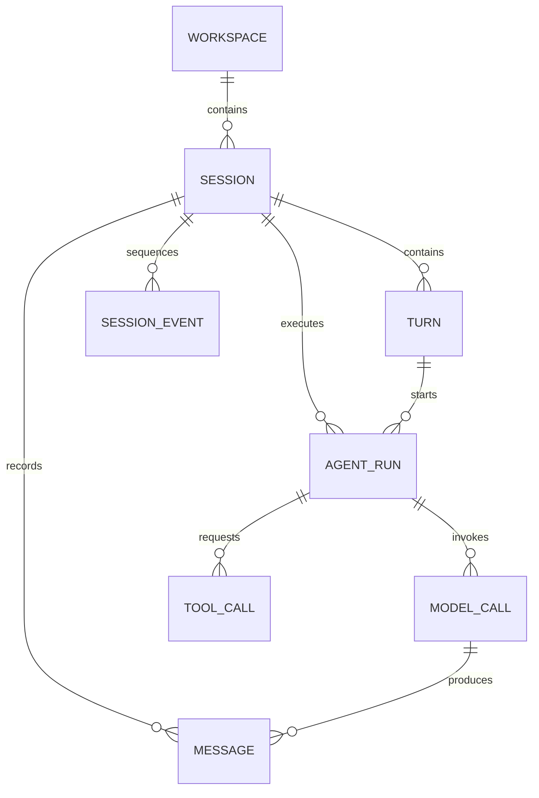
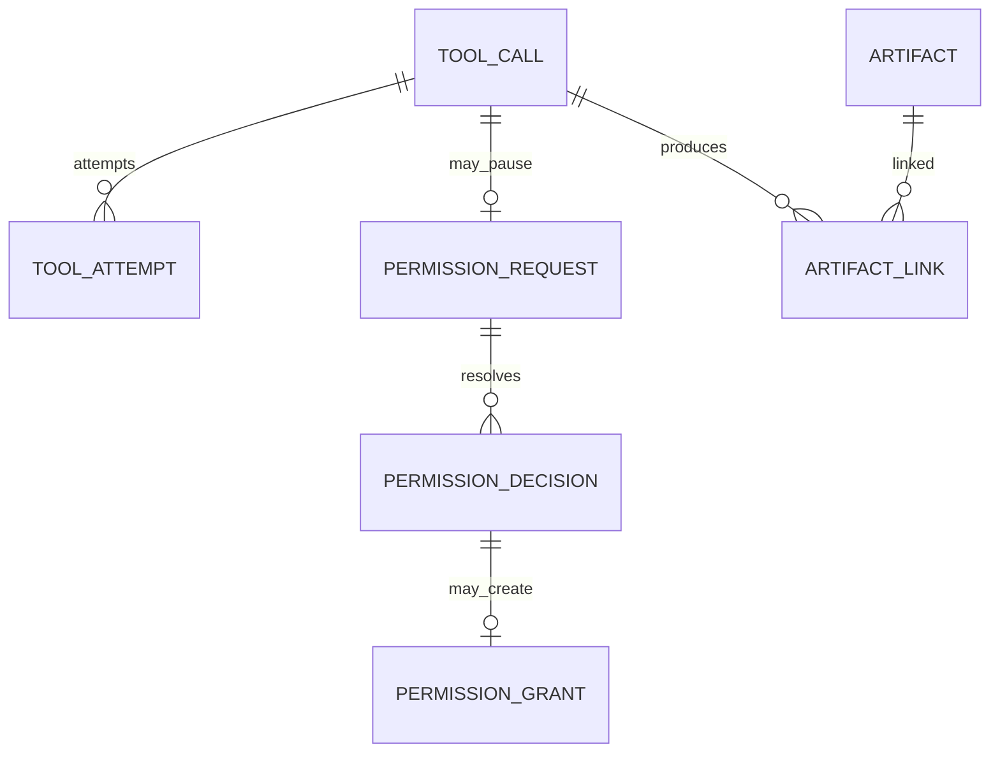
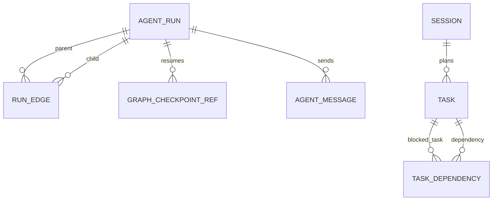
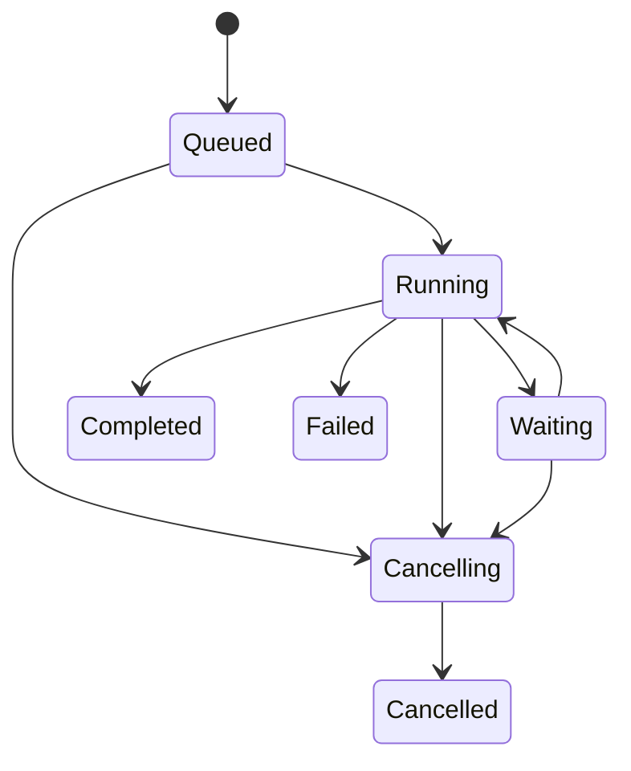
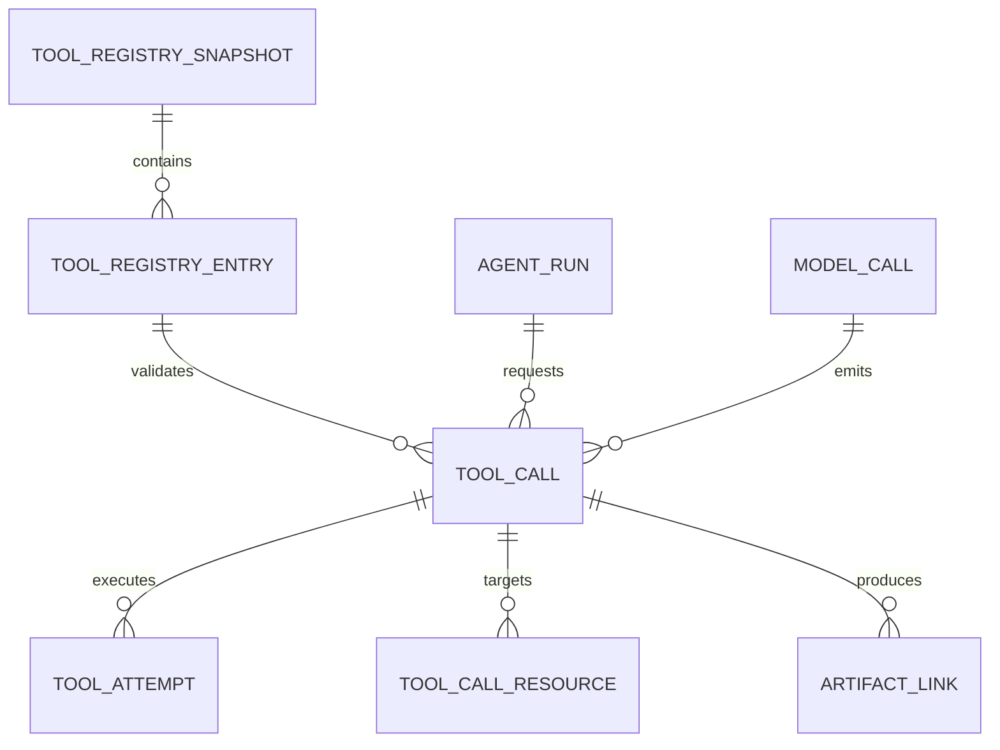
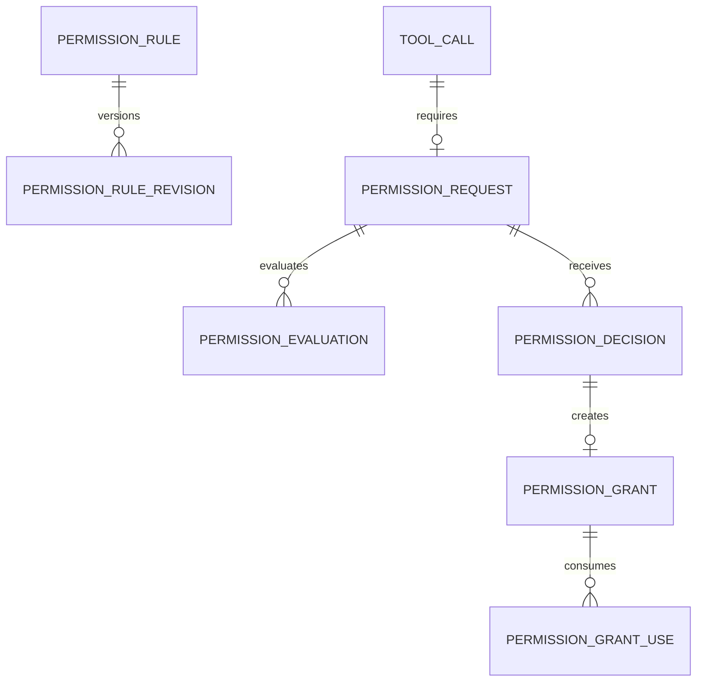
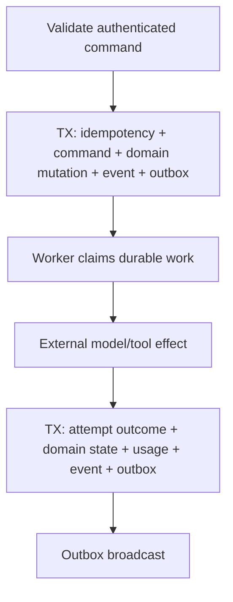

# Data Model SRS

> Normative durable data model for sessions, runs, messages, tools,
> permissions, events, tasks, artifacts, MCP, and recovery.

[Runtime SRS index](README.md) | [Docs start page](../README.md) | [Diagram standard](../diagram-standard.md)

## Repository evidence and target boundary

| Status | Source | Behavior reused |
| --- | --- | --- |
| **CURRENT** | [`sessionStorage.ts`](../../utils/sessionStorage.ts) | Session/message parent chains, queue operations, metadata, content replacement, and file snapshots in JSONL. |
| **CURRENT** | [`Task.ts`](../../Task.ts), [`tasks.ts`](../../tasks.ts) | Typed background/task lifecycle and task implementations. |
| **CURRENT** | [`teammateMailbox.ts`](../../utils/teammateMailbox.ts) | Typed inter-agent messages and permission/sandbox coordination payloads. |
| **CURRENT** | [`toolResultStorage.ts`](../../utils/toolResultStorage.ts), [`fileHistory.ts`](../../utils/fileHistory.ts) | Session artifacts and recoverable file snapshots. |
| **TARGET** | This SRS | Normalized SQL entities, constraints, outbox, artifact manifests, and LangGraph checkpoint references. |

## Storage decision

Use three intentionally separate stores:

| Store | Owns | Does not own |
| --- | --- | --- |
| Application SQL database | Product history, session/run state, permissions, events, tasks, metadata, audit evidence | Large blobs or transient Python objects |
| Artifact store | Immutable/bounded large content such as diffs, outputs, uploads, images, PDFs, provider traces | Authorization metadata or mutable workflow state |
| LangGraph checkpointer | Resumable graph channel state and interrupt continuation | Canonical messages, audit log, permissions, or client projections |

`DATA-001`: The application database is authoritative for user-visible and
security-relevant state. A missing or corrupt checkpoint may affect resumability
but MUST NOT erase the durable audit/history records.

`DATA-002`: Product code accesses storage through repositories/unit-of-work
interfaces. SQLAlchemy ORM rows, checkpointer records, and artifact backend
objects MUST NOT cross the API boundary directly.

### Recommended engines

- Local single-user daemon: SQLite in WAL mode is acceptable for the first
  release when one runtime process owns writes and migrations are tested.
- Multi-user or remote service: PostgreSQL is the required production target.
- SQLAlchemy 2.x models and Alembic migrations SHOULD remain portable across
  both for ordinary application tables.
- Engine-specific checkpointer packages MAY be used behind a separate adapter.

SQLite is not treated as a distributed queue or multi-daemon coordination
system. A workspace lock prevents two local daemons from owning the same local
database concurrently.

## Conventions

| Concern | Convention |
| --- | --- |
| Primary keys | Opaque UUIDv7/ULID stored in a consistent native/binary/text representation. |
| Time | UTC timezone-aware timestamp; database default plus application value where ordering matters. |
| Revisions | Positive integer incremented with optimistic compare-and-swap. |
| Soft deletion | `archived_at`, `revoked_at`, or tombstone state; security/audit rows are not hard-deleted normally. |
| Hashes | Algorithm-prefixed values; sensitive payload hash may be keyed/HMAC to prevent guessing. |
| JSON | Only for schema-versioned extensible payloads not requiring relational queries/invariants. |
| Enums | Stable lowercase strings validated by domain code; database check constraints for core states. |
| Money | Integer micros in a declared currency, never floating point. |
| Tokens/bytes | Nonnegative 64-bit integers. |
| URI/path | Canonical workspace URI in shared records; host absolute paths encrypted/restricted where needed. |

All mutable rows include `created_at` and `updated_at`; revisioned rows include
`revision`. Security-sensitive rows also include actor and request provenance.

## High-level entity graph

The data model is split into three small relationship maps. The tables below are
canonical and contain the complete columns/constraints.

### Conversation and execution

**Question:** what is the durable path from workspace to tool call?



How to read it:

1. Workspace is the security/resource scope.
2. Session owns ordered turns, messages, events, and all linked runs.
3. A turn starts a foreground main run; child runs remain in the same session lineage.
4. Runs create logical model and tool calls.
5. Model calls produce assistant messages and proposed tool calls.

### Tool, permission, and artifacts

**Question:** what evidence surrounds one tool call?



How to read it:

1. A logical call may have multiple attempts only under its idempotency policy.
2. A permission request binds exact request revision/argument/schema hashes.
3. Decisions are append-only evidence; an allow may create a bounded grant.
4. Full output/diff/review bytes live in artifacts linked to the producing call.

### Coordination and recovery

**Question:** how are children, tasks, and checkpoints connected?



How to read it:

1. Every child/teammate/skill run remains a first-class run linked by edges.
2. Each run has independent checkpointer references.
3. Tasks and dependency edges coordinate work without sharing graph dictionaries.
4. Agent messages are addressed durable records, separate from model transcript until delivered.

## Identity, runtime, and workspace tables

### `actors`

Represents authenticated users and service principals without coupling to one
authentication provider.

| Column | Type | Rules |
| --- | --- | --- |
| `actor_id` | PK | Opaque ID. |
| `actor_type` | string | `user`, `service`, `scheduler`, or `system`. |
| `external_subject` | string nullable | Provider-scoped subject; encrypted/hashed when appropriate. |
| `display_name` | string | Bounded safe label. |
| `status` | string | `active`, `disabled`, `deleted`. |
| `auth_epoch` | integer | Increment to invalidate tokens/sessions. |
| `metadata_json` | JSON | Schema-versioned nonsecurity preferences only. |

Unique constraint: `(auth_provider, external_subject)` when external auth is
used. A local-only installation creates one local user actor.

### `runtime_instances`

| Column | Type | Rules |
| --- | --- | --- |
| `runtime_id` | PK | Daemon/service instance ID. |
| `installation_id` | string | Stable installation identity; not a secret. |
| `version` | string | Backend release. |
| `host_fingerprint` | string nullable | Privacy-preserving local host identity. |
| `started_at` | timestamp | Required. |
| `heartbeat_at` | timestamp | Updated while live. |
| `status` | string | `starting`, `ready`, `draining`, `stopped`, `failed`. |
| `capabilities_json` | JSON | Versioned runtime capability snapshot. |

### `client_instances`

| Column | Type | Rules |
| --- | --- | --- |
| `client_id` | PK | CLI/extension instance. |
| `actor_id` | FK actors | Owner. |
| `runtime_id` | FK runtime_instances | Registering runtime. |
| `client_type` | string | `cli`, `vscode`, `automation`, future explicit types. |
| `client_version` | string | Semantic version. |
| `capabilities_json` | JSON | Validated editor/UI capabilities, not authority. |
| `registered_at`, `last_seen_at` | timestamp | Lifecycle. |
| `revoked_at` | timestamp nullable | Disables use. |

Indexes: `(actor_id, last_seen_at desc)` and `(runtime_id, last_seen_at desc)`.

### `workspaces`

| Column | Type | Rules |
| --- | --- | --- |
| `workspace_id` | PK | Opaque ID. |
| `owner_actor_id` | FK actors | Local owner/tenant owner. |
| `display_name` | string | User-visible bounded name. |
| `canonical_root_ciphertext` | bytes/string | Host path protected at rest when required. |
| `root_fingerprint` | string | Canonical root/repository/filesystem identity hash. |
| `repository_identity` | string nullable | Remote/repository identity, not trusted by itself. |
| `trust_state` | string | `trusted`, `restricted`, `untrusted`. |
| `policy_epoch` | integer | Incremented for security policy/trust changes. |
| `settings_json` | JSON | Versioned nonsecret workspace settings. |
| `revision` | integer | Optimistic update. |
| `archived_at` | timestamp nullable | Soft archive. |

Unique constraint for an actor's active root fingerprint. Index `(owner_actor_id,
archived_at, updated_at desc)`.

### `workspace_roots`

Supports additional explicitly approved roots without embedding them in policy
JSON.

| Column | Type | Rules |
| --- | --- | --- |
| `workspace_root_id` | PK | Opaque ID. |
| `workspace_id` | FK workspaces | Owner. |
| `kind` | string | `primary`, `read_only`, `write`, `artifact_import`. |
| `canonical_path_ciphertext` | bytes/string | Restricted absolute path. |
| `path_fingerprint` | string | Match/replacement identity. |
| `read_allowed`, `write_allowed` | boolean | Explicit bounds. |
| `approved_by` | FK actors | Human/admin provenance. |
| `expires_at`, `revoked_at` | timestamp nullable | Lifecycle. |

### `workspace_trust_decisions`

Append-only evidence: prior/new state, root fingerprint, actor/client/request,
reason, policy epoch, and timestamp. Every `workspaces.trust_state` change MUST
have exactly one corresponding decision row.

## Session and graph execution tables

### `sessions`

| Column | Type | Rules |
| --- | --- | --- |
| `session_id` | PK | Application conversation/thread identity; each agent run uses its own checkpointer thread. |
| `workspace_id` | FK workspaces | Required. |
| `created_by` | FK actors | Required. |
| `title` | string | Bounded; user or generated. |
| `status` | string | `idle`, `queued`, `running`, `waiting`, `cancelling`, `failed`, `archived`. |
| `permission_mode` | string | Valid mode from permission SRS. |
| `model_profile_id` | string | Approved profile, not credential. |
| `current_foreground_run_id` | FK agent_runs nullable | Maintained consistently. |
| `last_sequence` | bigint | Last allocated session event sequence. |
| `last_message_at` | timestamp nullable | List sort. |
| `revision` | integer | Optimistic metadata changes. |
| `archived_at` | timestamp nullable | Soft archive. |

Constraints: at most one nonterminal foreground main run per session, enforced by
transaction/advisory lock and, where supported, a partial unique index.

Indexes: `(workspace_id, archived_at, last_message_at desc)`, `(created_by,
last_message_at desc)`, `(status, updated_at)`.

### `turns`

One accepted user intent and its foreground outcome.

| Column | Type | Rules |
| --- | --- | --- |
| `turn_id` | PK | Opaque ID. |
| `session_id` | FK sessions | Required. |
| `ordinal` | integer | Monotonic within session. |
| `user_message_id` | FK messages | Exactly one initiating user message. |
| `main_run_id` | FK agent_runs nullable initially | Bound when run is created. |
| `status` | string | `accepted`, `queued`, `running`, `waiting`, terminal states. |
| `stop_reason` | string nullable | Stable terminal category. |
| `accepted_by_client_id` | FK client_instances | Provenance. |
| `started_at`, `completed_at` | timestamp nullable | Lifecycle. |

Unique `(session_id, ordinal)` and unique `user_message_id`.

### `agent_runs`

Every main, child, teammate, skill-fork, scheduled, or remote execution is a
first-class run.

| Column | Type | Rules |
| --- | --- | --- |
| `run_id` | PK | Opaque ID. |
| `session_id` | FK sessions | Owning transcript/session. |
| `turn_id` | FK turns nullable | Foreground turn lineage. |
| `run_kind` | string | `main`, `subagent`, `teammate`, `skill`, `scheduled`, `remote`. |
| `status` | string | See run state machine below. |
| `parent_run_id` | FK agent_runs nullable | Convenience adjacency; mirrored by run edge. |
| `root_run_id` | FK agent_runs | Cancellation/budget tree root. |
| `agent_profile` | string | Versioned behavior/tool profile. |
| `model_profile_id` | string | Approved model profile. |
| `permission_mode` | string | Effective child-safe mode. |
| `capability_scope_json` | JSON | Validated bounded scope snapshot. |
| `registry_snapshot_id` | FK tool_registry_snapshots | Immutable tool view for call validation. |
| `graph_version` | string | Graph topology/code compatibility version. |
| `policy_epoch` | integer | Workspace epoch at start/latest evaluation. |
| `current_node` | string nullable | Operational visibility, not graph checkpoint. |
| `stop_requested_at` | timestamp nullable | Cancellation signal. |
| `stop_reason` | string nullable | Stable terminal reason. |
| `deadline_at` | timestamp nullable | Hard wall-clock bound. |
| `model_call_limit`, `tool_call_limit` | integer | Safety budgets. |
| `input_token_limit`, `output_token_limit` | bigint | Token budgets. |
| `cost_limit_micros` | bigint nullable | Optional cost budget. |
| `model_calls_used`, `tool_calls_used` | integer | Durable counters. |
| `input_tokens_used`, `output_tokens_used` | bigint | Durable counters. |
| `cost_used_micros` | bigint | Durable counter. |
| `started_at`, `completed_at` | timestamp nullable | Lifecycle. |
| `revision` | integer | Compare-and-swap state. |

Run states:



`Waiting` is a readable product state. The stored status/reason distinguishes
`waiting_permission`, `waiting_user`, `waiting_children`, and `retry_wait`.
`Failed` similarly retains `budget_exceeded`, `timed_out`, provider, integrity,
and other stable terminal reason codes. The allowed-transition table operates
on those precise values.

`DATA-010`: Every transition uses an allowed-transition table and compare-and-
swap revision. A terminal run is immutable except for reconciliation metadata.

`DATA-011`: Budget counters increment in the transaction that accepts the model
or tool operation, preventing concurrent child calls from overspending one
shared bound.

### `run_edges`

Stores parent/child graph explicitly for queries and future non-tree relations.

| Column | Type | Rules |
| --- | --- | --- |
| `run_edge_id` | PK | Opaque ID. |
| `parent_run_id`, `child_run_id` | FK agent_runs | Distinct runs in same session/root tree. |
| `edge_type` | string | `spawned`, `delegated`, `teammate`, `retry_of`. |
| `ordinal` | integer | Child order under parent. |
| `input_message_id` | FK messages nullable | Delegation prompt. |

Unique `(parent_run_id, child_run_id, edge_type)` and cycle prevention in domain
logic; descendants are bounded to protect recursive queries.

### `graph_checkpoint_refs`

Application-side references to checkpointer state:

| Column | Type | Rules |
| --- | --- | --- |
| `checkpoint_ref_id` | PK | Opaque app ID. |
| `run_id` | FK agent_runs | Required. |
| `thread_id`, `checkpoint_namespace`, `checkpoint_id` | string | Opaque checkpointer key. |
| `graph_version` | string | Compatibility. |
| `reason` | string | `node_complete`, `interrupt`, `recovery`, `terminal`. |
| `state_hash` | string nullable | Integrity/debug, not user data API. |
| `created_at` | timestamp | Required. |

This table does not duplicate checkpoint channel values. Permission and question
waits also store their domain IDs in graph state so resume can correlate them.

## Conversation and model tables

### `messages`

| Column | Type | Rules |
| --- | --- | --- |
| `message_id` | PK | Opaque ID. |
| `session_id` | FK sessions | Required. |
| `turn_id` | FK turns nullable | User/assistant turn association. |
| `run_id` | FK agent_runs nullable | Producing run. |
| `role` | string | `user`, `assistant`, `tool`, `system_summary`. |
| `status` | string | `streaming`, `complete`, `failed`, `superseded`. |
| `parent_message_id` | FK messages nullable | Provider/conversation lineage. |
| `supersedes_message_id` | FK messages nullable | Immutable correction/compaction relationship. |
| `ordinal` | bigint | Stable order within session. |
| `content_hash` | string nullable until complete | Hash of normalized ordered blocks. |
| `visibility` | string | `user`, `internal_safe`, `restricted`. |
| `completed_at` | timestamp nullable | Lifecycle. |

Unique `(session_id, ordinal)`. Index `(session_id, ordinal)` is the primary
conversation traversal.

### `content_blocks`

| Column | Type | Rules |
| --- | --- | --- |
| `content_block_id` | PK | Opaque ID. |
| `message_id` | FK messages | Required, cascade only under controlled retention deletion. |
| `ordinal` | integer | Unique within message. |
| `block_type` | string | `text`, `tool_use`, `tool_result`, `image`, `document`, `status`, `summary`. |
| `text_content` | text nullable | Bounded inline safe text. |
| `data_json` | JSON nullable | Versioned structured fields. |
| `artifact_id` | FK artifacts nullable | Large/sensitive content. |
| `tool_call_id` | FK tool_calls nullable | Tool block relation. |
| `content_hash` | string | Required when complete. |
| `redaction_class` | string | Field-level output policy. |

Exactly one appropriate content carrier is used according to block type.
Unique `(message_id, ordinal)`.

### `model_calls`

| Column | Type | Rules |
| --- | --- | --- |
| `model_call_id` | PK | Opaque ID. |
| `run_id` | FK agent_runs | Required. |
| `ordinal` | integer | Monotonic within run. |
| `provider`, `model` | string | Actual provider/model names. |
| `request_schema_version` | integer | Normalized provider request contract. |
| `request_hash` | string | Canonical safe request identity. |
| `request_artifact_id` | FK artifacts nullable | Restricted full trace when enabled. |
| `tool_registry_snapshot_id` | FK snapshots | Exact definitions sent. |
| `status` | string | `requested`, `streaming`, `completed`, `failed`, `cancelled`. |
| `provider_request_id` | string nullable | Restricted support identifier. |
| `stop_category` | string nullable | Normalized `tool_calls`, `final`, `length`, `content_filter`, `error`. |
| `input_tokens`, `output_tokens`, `cache_*_tokens` | bigint | Nonnegative usage. |
| `cost_micros` | bigint nullable | Normalized estimated/reported cost. |
| `latency_ms`, `time_to_first_token_ms` | bigint nullable | Performance. |
| `attempt` | integer | Provider retry attempt. |
| `error_code`, `error_safe_message` | string nullable | Terminal failure. |
| `started_at`, `completed_at` | timestamp nullable | Lifecycle. |

Unique `(run_id, ordinal, attempt)` or use a separate provider attempt table if
one logical call has multiple transport attempts. The recommended design is one
logical `model_calls` row plus `model_call_attempts` for full retry evidence.

### `model_call_attempts`

Stores provider endpoint, request ID, start/end, status, retry class, usage if
reported, and restricted trace artifact. This prevents retry history from being
overwritten on the logical call.

## Tool registry and execution tables

**Question:** how does an immutable registry definition reach attempts and artifacts?



How to read it:

1. A snapshot freezes the exact tool view used by a model call.
2. A registry entry supplies schema, provenance, and execution metadata.
3. Run/model lineage records why the call exists.
4. Attempts, normalized resources, and artifacts preserve execution/recovery evidence.

### `tool_registry_snapshots`

| Column | Type | Rules |
| --- | --- | --- |
| `registry_snapshot_id` | PK | Immutable snapshot. |
| `workspace_id` | FK workspaces | Context. |
| `registry_hash` | string | Hash of canonical ordered definitions. |
| `source_versions_json` | JSON | Backend/plugin/MCP provenance versions. |
| `policy_epoch` | integer | Epoch at creation. |
| `created_by_runtime_id` | FK runtime_instances | Provenance. |
| `created_at` | timestamp | Required. |

Deduplicate identical `(workspace_id, registry_hash)` snapshots where retention
and provenance permit.

### `tool_registry_entries`

| Column | Type | Rules |
| --- | --- | --- |
| `registry_entry_id` | PK | Opaque ID. |
| `registry_snapshot_id` | FK snapshots | Required. |
| `canonical_name` | string | Unique in snapshot. |
| `aliases_json` | JSON | Validated list; no collisions. |
| `description_hash` | string | Prompt metadata integrity. |
| `input_schema_json`, `output_schema_json` | JSON | Canonical JSON Schema snapshots. |
| `schema_hash` | string | Includes relevant contract metadata. |
| `capabilities_json` | JSON | Stable capability set. |
| `execution_metadata_json` | JSON | Timeout, concurrency, idempotency, classification. |
| `source_kind`, `source_identity`, `source_version` | string | Built-in/plugin/MCP provenance. |
| `enabled` | boolean | Model-visible in this snapshot. |
| `disabled_reason` | string nullable | Operator-visible explanation. |

Unique `(registry_snapshot_id, canonical_name)` and alias collision check during
snapshot construction.

### `tool_calls`

One model-proposed or application-requested logical operation.

| Column | Type | Rules |
| --- | --- | --- |
| `tool_call_id` | PK | Prefer preserving provider tool-use ID mapping separately if format differs. |
| `run_id` | FK agent_runs | Required. |
| `model_call_id` | FK model_calls nullable | Source model call. |
| `registry_entry_id` | FK entries | Exact contract. |
| `provider_tool_use_id` | string nullable | Unique within model call. |
| `ordinal` | integer | Original order within model response. |
| `canonical_name`, `requested_name` | string | Alias resolution evidence. |
| `status` | string | Proposed-to-terminal state. |
| `raw_arguments_artifact_id` | FK artifacts nullable | Restricted malformed/original payload. |
| `validated_arguments_json` | JSON nullable | Bounded redacted/canonical args or artifact reference. |
| `arguments_hash` | string nullable | Required after validation. |
| `schema_hash` | string | Exact entry hash. |
| `risk` | string nullable | Computed after validation. |
| `parallel_group_id` | string nullable | Scheduling group. |
| `timeout_ms` | bigint | Effective bounded timeout. |
| `idempotency_class` | string | `pure`, `retry_safe`, `effect_idempotent`, `non_retryable`, `unknown`. |
| `result_message_id` | FK messages nullable | Tool-result message delivered to model. |
| `result_artifact_id` | FK artifacts nullable | Full normalized result. |
| `result_summary` | text nullable | Bounded safe preview. |
| `error_code`, `error_safe_message` | string nullable | Failure result. |
| `side_effect_certainty` | string nullable | `none`, `not_started`, `committed`, `partial`, `unknown`. |
| `queued_at`, `started_at`, `completed_at` | timestamp nullable | Lifecycle. |
| `revision` | integer | Compare-and-swap. |

Unique `(model_call_id, provider_tool_use_id)` when model-sourced and unique
`(run_id, model_call_id, ordinal)`.

Tool-call states:

```text
proposed -> validating -> awaiting_permission -> authorized -> queued
         -> running -> succeeded | failed | cancelled | outcome_unknown

proposed/validating -> rejected
awaiting_permission -> denied | expired | cancelled
authorized/queued -> cancelled | invalidated
```

`DATA-020`: A tool adapter receives a call only in `authorized`/`queued` state
with a linked final allow decision or a recorded safe default decision.

`DATA-021`: Terminal tool state, normalized result, tool-result message, usage,
and terminal events commit atomically after the adapter returns.

### `tool_call_resources`

Normalized authorization/execution targets:

| Column | Type | Rules |
| --- | --- | --- |
| `tool_call_resource_id` | PK | Opaque ID. |
| `tool_call_id` | FK tool_calls | Required. |
| `ordinal` | integer | Stable display/matcher order. |
| `resource_kind` | string | Path/command/URL/MCP/task/channel/config. |
| `canonical_value_ciphertext` | bytes/string | Protected full value where sensitive. |
| `canonical_hash` | string | Indexed equality/grouping as policy permits. |
| `display_value` | string | Safe bounded review form. |
| `observed_version` | string nullable | File hash/identity, task revision, schema hash. |
| `attributes_json` | JSON | Validated type-specific facts. |

Index `(resource_kind, canonical_hash)` and `(tool_call_id, ordinal)`.

### `tool_attempts`

| Column | Type | Rules |
| --- | --- | --- |
| `tool_attempt_id` | PK | Opaque ID. |
| `tool_call_id` | FK tool_calls | Required. |
| `attempt` | integer | Starts at 1. |
| `executor_instance_id` | FK runtime_instances | Worker ownership. |
| `status` | string | `claimed`, `running`, terminal attempt state. |
| `claim_token_hash` | string | Prevents stale worker completion. |
| `adapter_id`, `adapter_version` | string | Provenance. |
| `sandbox_profile` | string nullable | Effective execution boundary. |
| `external_idempotency_key` | string nullable | Downstream dedupe. |
| `stdout_artifact_id`, `stderr_artifact_id` | FK artifacts nullable | Bounded output. |
| `side_effect_certainty` | string | Required terminal classification. |
| `heartbeat_at`, `started_at`, `completed_at` | timestamp nullable | Recovery. |
| `error_code`, `error_safe_message` | string nullable | Failure. |

Unique `(tool_call_id, attempt)`. Non-retryable calls generally have one attempt;
additional attempts require a recorded reconciliation decision.

## Permission tables

**Question:** how does exact-request approval become a reusable bounded grant?



How to read it:

1. Rules are versioned rather than overwritten.
2. A tool call may create one request for its exact revision.
3. Ordered evaluations explain deterministic policy matching.
4. A final decision settles the request.
5. An allow may create a scoped/expiring grant whose uses are recorded atomically.

### `permission_requests`

| Column | Type | Rules |
| --- | --- | --- |
| `permission_request_id` | PK | Durable wait identity. |
| `tool_call_id` | FK tool_calls unique | Exactly one active request per call revision. |
| `session_id`, `run_id`, `workspace_id` | FK | Denormalized integrity/query scope. |
| `request_revision` | integer | Increment for edited/invalidated request. |
| `status` | string | `pending`, `presented`, `approved`, `denied`, `expired`, `cancelled`, `invalidated`, `consumed`. |
| `arguments_hash`, `schema_hash` | string | Exact reviewed operation. |
| `policy_epoch` | integer | Evaluation epoch. |
| `risk`, `reason_code`, `explanation` | string | Review model. |
| `review_artifact_id` | FK artifacts nullable | Full diff/command/args. |
| `allowed_choices_json` | JSON | Backend-generated scope options. |
| `presented_to_client_id` | FK clients nullable | Lease UI evidence. |
| `expires_at`, `decided_at`, `consumed_at` | timestamp nullable | Lifecycle. |
| `revision` | integer | Race control. |

Unique `(tool_call_id, request_revision)` if revisions are represented as
separate rows; if one row is revised, all prior payloads MUST remain in an
append-only history table. Separate revision rows are preferred.

### `permission_evaluations`

Stores ordered evidence per request:

| Column | Type | Rules |
| --- | --- | --- |
| `permission_evaluation_id` | PK | Opaque ID. |
| `permission_request_id` | FK requests | Required. |
| `ordinal` | integer | Exact evaluation order. |
| `check_kind` | string | `rule`, `safety`, `mode`, `grant`, `default`. |
| `check_id`, `check_version` | string | Reproducible engine/rule reference. |
| `matched` | boolean | Whether selector matched. |
| `effect` | string nullable | `allow`, `ask`, `deny`, `continue`. |
| `reason_code`, `safe_facts_json` | string/JSON | Explainability without secrets. |
| `terminal` | boolean | Ended evaluation. |

Unique `(permission_request_id, ordinal)`.

### `permission_decisions`

| Column | Type | Rules |
| --- | --- | --- |
| `permission_decision_id` | PK | Opaque ID. |
| `permission_request_id` | FK requests | Required. |
| `decision_source` | string | `policy`, `user`, `admin`, `system`. |
| `outcome` | string | `allow` or `deny`; `ask` exists only on request/evaluation. |
| `scope` | string | `exact`, `session`, `workspace`, `system`. |
| `arguments_hash`, `request_revision` | string/integer | Must match request. |
| `decided_by_actor_id`, `client_id` | FK nullable | Human decision provenance. |
| `idempotency_key_id` | FK nullable | Command dedupe. |
| `reason_code`, `reason` | string | Safe explanation. |
| `created_at` | timestamp | Required. |

At most one accepted final decision for each request revision. Conflicting late
decisions are retained as rejected command audit, not additional final rows.

### `permission_rules` and `permission_rule_revisions`

`permission_rules` stores stable ID, authority, workspace/actor scope, current
revision, creator, and revoked time. Each immutable revision stores effect,
actor/capability/tool/resource selectors, constraints, validity/use bounds,
reason, canonical hash, and timestamps.

Indexes support active rule selection by `(workspace_id, authority, effect,
revoked_at)` and `(actor_id, effect, revoked_at)`. Policy evaluation still
validates every candidate selector in domain code.

### `permission_grants` and `permission_grant_uses`

A grant stores the source decision, scope, canonical selector/constraints,
validity period, max uses, consumed count, policy epoch, and revocation. A use
row links one grant to one tool call and decision.

`DATA-030`: Grant use count increments and the unique use row is inserted in the
authorization transaction. A one-use grant cannot be consumed concurrently.

`DATA-031`: Rule/grant revocation is append-only and increments workspace/session
policy epoch where appropriate.

## Event, command, and idempotency tables

### `session_events`

| Column | Type | Rules |
| --- | --- | --- |
| `event_id` | PK | Opaque ID. |
| `session_id` | FK sessions | Required. |
| `sequence` | bigint | Contiguous within session. |
| `event_type` | string | Versioned catalog name. |
| `schema_version` | integer | Payload version. |
| `correlation_id`, `causation_id` | string nullable | Trace lineage. |
| `actor_kind`, `actor_id` | string | Event actor. |
| `payload_json` | JSON | Validated, bounded, redacted event body. |
| `payload_hash` | string | Integrity/deduplication. |
| `occurred_at` | timestamp | Domain time. |
| `created_at` | timestamp | Database commit time. |

Unique `(session_id, sequence)` and `(session_id, event_id)`. Index
`(session_id, sequence)` covers replay.

`DATA-040`: Sequence allocation and event insert occur while locking/updating
the session's `last_sequence` in the same transaction. No committed sequence is
skipped.

### `outbox_messages`

Contains event ID, topic/session, payload reference/hash, publish status,
attempts, next attempt, worker claim, and timestamps. A row is inserted in the
same transaction as each broadcast-required event.

Unique event ID prevents duplicate logical publication. Delivery is at least
once; clients deduplicate by event ID/sequence.

### `commands`

Records command ID/type, actor/client/session/workspace, canonical request hash,
status, accepted/completed sequences, safe response/error JSON, timestamps, and
audit context. Long-running domain work references the command but does not keep
the HTTP transaction open.

### `idempotency_keys`

| Column | Type | Rules |
| --- | --- | --- |
| `idempotency_key_id` | PK | Internal ID. |
| `actor_id`, `scope` | FK/string | Key namespace. |
| `key_hash` | string | Hash, not raw key if policy requires. |
| `request_hash` | string | Canonical intent. |
| `command_id` | FK commands | Result owner. |
| `status` | string | `processing`, `completed`, `failed_replayable`. |
| `response_status`, `response_json` | integer/JSON nullable | Exact replay response. |
| `expires_at` | timestamp | Required retention. |

Unique `(actor_id, scope, key_hash)`. Different request hash yields conflict.

### `audit_events`

Security/administrative audit distinct from the user session timeline. Fields:
audit ID, actor/principal/client/runtime, action, target type/ID, workspace and
session when relevant, outcome, reason, request/correlation IDs, source address
class, safe details JSON, timestamp, and integrity chain/batch signature when
required by deployment.

`DATA-041`: Audit writes required for authorization or external effects are
transactional release gates. If required evidence cannot be stored, execution
does not proceed.

## Tasks and coordination

### `tasks`

| Column | Type | Rules |
| --- | --- | --- |
| `task_id` | PK | Opaque ID, mapped from tool-visible task ID. |
| `session_id` | FK sessions | Required. |
| `created_by_run_id` | FK runs nullable | Provenance. |
| `owner_run_id` | FK runs nullable | Current agent owner. |
| `subject`, `description`, `active_form` | text/string | Bounded, safe user-visible fields. |
| `status` | string | `pending`, `in_progress`, `completed`, `deleted`. |
| `metadata_json` | JSON | Schema-versioned bounded metadata. |
| `ordinal` | integer | Stable display order. |
| `revision` | integer | Optimistic concurrency. |
| `completed_at`, `deleted_at` | timestamp nullable | Lifecycle. |

Indexes `(session_id, status, ordinal)` and `(owner_run_id, status)`.

### `task_dependencies`

| Column | Type | Rules |
| --- | --- | --- |
| `blocked_task_id`, `dependency_task_id` | FK tasks | Same session, distinct. |
| `created_by_run_id` | FK runs nullable | Provenance. |
| `created_at` | timestamp | Required. |

Composite primary key `(blocked_task_id, dependency_task_id)`. Domain logic
prevents cycles and applies a maximum graph size/depth.

### `agent_messages`

Stores typed inter-agent/team communication separately from model transcript:
sender/recipient run/team, message type, summary, body artifact, status,
correlation, and timestamps. Only messages intentionally delivered to a model
become normal `messages`/content blocks.

### `teams` and `team_memberships`

Team metadata, owning session/root run, status, member run, role, join/leave,
and revision. A run belongs to at most one active team unless a future protocol
explicitly allows otherwise.

## Artifacts

### `artifacts` table

| Column | Type | Rules |
| --- | --- | --- |
| `artifact_id` | PK | Immutable content ID. |
| `workspace_id`, `session_id` | FK nullable according to scope | Authorization ownership. |
| `created_by_actor_id`, `created_by_run_id` | FK nullable | Provenance. |
| `kind` | string | `diff`, `tool_output`, `upload`, `image`, `pdf`, `trace`, etc. |
| `media_type`, `encoding` | string | Validated. |
| `byte_size` | bigint | Required and bounded. |
| `content_hash` | string | Integrity/deduplication. |
| `storage_backend`, `storage_key_ciphertext` | string | Backend locator is not public. |
| `sensitivity` | string | `normal`, `sensitive`, `secret`, `restricted`. |
| `redaction_status` | string | `none`, `redacted`, `quarantined`. |
| `retention_class` | string | Policy key. |
| `expires_at`, `deleted_at` | timestamp nullable | Lifecycle/tombstone. |
| `encryption_key_id` | string nullable | Envelope encryption metadata. |

Unique by `(workspace_id, content_hash, sensitivity, retention_class)` only when
deduplication does not create a confidentiality side channel.

### `artifact_links`

Generic typed relation from artifact to message, tool call/attempt, model call,
permission review, event, task, or audit item. It stores entity type/ID, purpose,
ordinal, and visibility.

`DATA-050`: Database transaction creates artifact metadata in `pending_upload`;
content is uploaded atomically; finalization verifies size/hash and changes it
to `available`. Unfinalized content is never exposed.

`DATA-051`: Deletion removes access first, writes a tombstone/audit event, then
garbage-collects backend content asynchronously after all retention/legal holds.

## MCP, plugins, schedules, and remote triggers

### `mcp_servers`

Stores workspace/installation scope, display name, transport type, endpoint-safe
identity, encrypted config/credential reference, trust state, status, manifest
hash, authenticated principal fingerprint, last connect/error, and revision.

### `mcp_registry_snapshots` and `mcp_registry_entries`

Immutable server identity/manifest/auth/schema snapshots and normalized tool or
resource entries. Every dynamic registry entry references the MCP snapshot from
which it was built.

`DATA-060`: Server reconnect or identity/schema change creates a new snapshot;
historical calls continue to reference the prior immutable schema.

### `plugins` and `plugin_installations`

Plugin identity/version/provenance/signature, installation scope, requested and
approved capabilities, enabled status, manifest/schema hash, installed-by actor,
and revision. Secrets are referenced through secret storage, not manifest JSON.

### `schedules` and `schedule_fires`

Schedules store owner, workspace/session policy, validated cron/trigger,
timezone, prompt artifact, approved execution profile and capability scope,
misfire/concurrency policy, status, next fire, revision, and revocation. Each
fire has unique scheduled time, status, resulting run, and idempotency key.

Unique `(schedule_id, scheduled_for)` prevents duplicate fire on restart.

### `remote_triggers` and `remote_invocations`

Triggers store authenticated source configuration, enabled state, approved
execution profile, input schema/hash, rate/concurrency policy, and revision.
Invocations store source request identity, canonical input hash/artifact,
authentication result, resulting run, status, and response summary.

## Transaction boundaries

**Question:** where do SQL transactions stop around an external effect?



How to read it:

1. Validate identity/schema before opening the mutation transaction.
2. First transaction records idempotency, intent, domain mutation, event, and outbox.
3. A worker claims durable work after commit.
4. Model/tool/filesystem/network work occurs outside SQL transactions.
5. Second transaction records observed outcome, usage, state, event, and outbox.
6. Broadcast is asynchronous and replayable; it never determines commit success.

Required transaction units:

| Operation | Atomic records |
| --- | --- |
| Create session | Idempotency, command, session, registry binding, initial event/outbox. |
| Accept prompt | Idempotency, command, message/blocks, turn, main run, status, events/outbox. |
| Start model call | Run budget claim, model call/attempt, run transition, event/outbox. |
| Complete model call | Attempt/call usage, message/blocks, proposed tool calls, run counters, events/outbox. |
| Ask permission | Tool state, request/revision/evaluations, run wait state, checkpoint ref, event/outbox. |
| Resolve permission | Idempotency, command, decision/grant, request/tool/run state, event/outbox. |
| Claim tool attempt | Authorization recheck, grant use, attempt claim, tool/run state, event/outbox. |
| Complete tool | Attempt/call result, artifact links, result message/blocks, run state, events/outbox. |
| Cancel run | Command, cancellation marker, run/tool state changes, events/outbox; adapter interruption follows. |

External API/filesystem/process effects cannot participate in a SQL transaction.
Use intent/attempt rows, idempotency keys where supported, and reconciliation:

```text
record authorized intent -> commit -> perform effect -> commit observed outcome
```

`DATA-070`: Never hold a database transaction open across model streaming, a
permission wait, shell execution, network I/O, or artifact upload.

`DATA-071`: If the worker dies after an uncertain external effect, mark the
attempt `outcome_unknown`; do not blind retry. Pure/read/retry-safe operations
may be reclaimed according to their declared idempotency contract.

## Checkpoint consistency

The checkpointer and application database generally cannot share one atomic
transaction. Use a recoverable handshake:

1. Write domain state/event indicating the graph will wait or advance.
2. Persist the graph checkpoint containing the same run ID, node, domain event
   high-water mark, and interrupt/request ID.
3. Store/update `graph_checkpoint_refs`.
4. On recovery, compare checkpoint high-water mark to application state and run
   an idempotent reconciliation node before continuing.

`DATA-080`: Graph nodes that may replay MUST use idempotent domain commands and
stable operation IDs. A checkpoint replay cannot create a second tool call,
permission request, message, or external delivery.

`DATA-081`: Checkpoints contain identifiers and bounded graph working state,
not ORM sessions, open files, subprocess handles, sockets, callbacks, clients,
or provider SDK objects.

## Index strategy

Minimum hot-path indexes:

| Query | Index |
| --- | --- |
| Session list | `sessions(workspace_id, archived_at, last_message_at desc)` |
| Active runs | `agent_runs(session_id, status, updated_at)` and parent/root indexes |
| Conversation | `messages(session_id, ordinal)` and `content_blocks(message_id, ordinal)` |
| Event replay | unique `session_events(session_id, sequence)` |
| Pending approvals | `permission_requests(session_id, status, expires_at)` |
| Tool timeline | `tool_calls(run_id, model_call_id, ordinal)` and `(session via run, status)` |
| Worker recovery | `tool_attempts(status, heartbeat_at)`, `agent_runs(status, updated_at)` |
| Task board | `tasks(session_id, status, ordinal)` |
| Artifact expiry | `artifacts(status, expires_at)` |
| Outbox | `outbox_messages(status, next_attempt_at, created_at)` |
| Schedules | `schedules(status, next_fire_at)` |

Avoid indexing unbounded JSON fields by default. Promote frequently filtered
facts to typed columns and add indexes from measured query plans.

## Retention and deletion

Retention is policy-driven per data class:

| Class | Default behavior |
| --- | --- |
| Session/messages/events | Retain until user archives/deletes plus recovery window. |
| Checkpoints | Keep recent and interrupt/terminal checkpoints; compact older intermediate states. |
| Tool/model trace artifacts | Shorter retention; restricted and opt-in where content is sensitive. |
| Permission/audit evidence | Retain according to security policy, often longer than previews. |
| Idempotency records | Keep beyond maximum retry/reconciliation window. |
| Ephemeral stream chunks | Compact after canonical completed message/result exists. |
| Secrets/credentials | Store only in secret backend; references follow independent rotation/deletion. |

`DATA-090`: A user deletion request first revokes access and stops active runs,
then asynchronously deletes eligible content across SQL, artifact, checkpoint,
cache, and search indexes. Completion is recorded without retaining deleted
content.

`DATA-091`: Referential deletion order and retention exceptions are explicit;
database cascades MUST NOT accidentally remove audit evidence or shared
deduplicated artifacts.

`DATA-092`: Event compaction creates a signed/hashed snapshot boundary before
removing replay-detail events. Security/audit requirements may retain restricted
copies independently.

## Encryption and secret handling

- Database and artifact volumes use platform encryption at rest.
- Credentials and provider keys live in OS keychain/secret manager, referenced
  by opaque secret ID.
- Particularly sensitive paths, external subjects, provider traces, and storage
  keys use application-level envelope encryption where threat model requires.
- Encryption keys have version IDs and rotation procedures.
- Hashes of low-entropy secrets/paths use keyed hashing when plain hashes would
  permit dictionary attacks.
- Backups are encrypted, access-controlled, tested for restore, and included in
  deletion/retention policy.

`DATA-100`: ORM/event serialization MUST reject secret-typed values unless an
explicit encrypted/restricted destination serializer is used.

## Migrations

`DATA-110`: Every schema change uses an ordered Alembic migration and a tested
downgrade or documented forward-only recovery strategy.

For remote/PostgreSQL deployments, use expand-and-contract:

1. add nullable/new structures compatible with old code;
2. deploy dual-read/write or backfill worker;
3. verify counts/hashes/invariants;
4. switch reads;
5. enforce constraints;
6. remove legacy fields in a later incompatible window.

Local SQLite upgrades create a verified backup/checkpoint, run migration under
an exclusive application lock, execute integrity checks, then update runtime
version. A failed migration leaves the original database recoverable.

Schema records include application schema version, event schema versions,
graph/checkpoint compatibility versions, and migration timestamp/checksum.

## Invariants

Release-blocking invariants:

1. Every session event sequence is unique and contiguous for committed events.
2. Every non-root run has a valid parent in the same session/root tree.
3. Every model-sourced tool call references its exact model call and registry
   entry/schema hash.
4. Every executed tool call has one effective final allow decision and at least
   one attempt.
5. Every permission decision matches the request revision and argument hash.
6. Every user-visible tool call has exactly one terminal result message or an
   explicit pending/nonterminal state.
7. Every terminal turn points to a terminal main run and stable stop reason.
8. Every artifact link points to an authorized available artifact or retained
   tombstone.
9. Every grant use is unique per grant/tool call and within validity/use count.
10. Every outbox event references a committed immutable domain event.
11. No terminal row is silently rewritten to a different outcome.
12. No checkpoint is the sole copy of a security or user-visible decision.

## Verification

Required tests include:

- migration from every supported prior release on SQLite and PostgreSQL;
- randomized transition/invariant/property tests;
- concurrent prompt, approval, grant-use, tool-completion, and sequence races;
- crash injection before/after each transaction and external-effect boundary;
- event-log projection rebuilt against materialized session snapshot;
- stale worker claim and checkpoint replay resistance;
- retention/deletion across SQL, artifacts, checkpoints, and backups;
- secret canaries proving API/events/logs do not expose protected columns;
- load tests for event append/replay, session list, tool timeline, and pending
  approval queries with production-scale cardinality;
- backup restore plus hash/invariant verification.

## Release acceptance

The persistence layer is ready when the full run can be killed and restarted at
every model/tool/approval boundary without duplicating messages or effects,
when the interaction timeline can explain every authorization and attempt, and
when both clients derive identical state from the same snapshot/event records.
