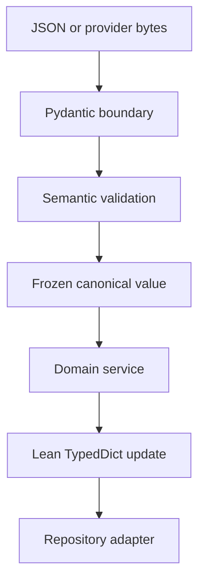

# Python Types and LangGraph Performance

> Normative placement of Pydantic models, `TypedDict`, dataclasses, protocols,
> ORM rows, and validation work in the FastAPI/LangGraph runtime.

[Runtime SRS index](README.md) | [Docs start page](../README.md) | [Diagram standard](../diagram-standard.md)

## The short decision

| Location | Use | Why |
| --- | --- | --- |
| FastAPI request/response | Pydantic `BaseModel` | Untrusted boundary, OpenAPI, strict validation, stable errors. |
| Model tool inputs/outputs | Pydantic `BaseModel` or cached `TypeAdapter` | Untrusted provider data and generated JSON Schema. |
| Event/command payloads | Pydantic tagged unions | Versioned protocol and safe serialization. |
| Configuration/manifests | `pydantic-settings` `BaseSettings` plus Pydantic `BaseModel` | Untrusted environment/files, explicit defaults. |
| LangGraph mutable channel state | `TypedDict` with reducers | Lowest practical overhead and native graph shape. |
| Trusted runtime dependencies | `@dataclass(slots=True, frozen=True)` | Fast attribute access and explicit construction. |
| Pure internal value object | Frozen/slotted dataclass | Invariants established once; no repeated parsing. |
| Service/adapter interface | `Protocol` | Structural typing without inheritance/runtime payload cost. |
| SQL persistence | SQLAlchemy mapped classes | Identity map, relationships, transactions; not API DTOs. |
| Cross-boundary read model | Pydantic response DTO | Prevents accidental ORM/internal-field exposure. |

**Recommended rule:** Pydantic at every untrusted or serialized boundary;
`TypedDict` inside LangGraph state; dataclasses for trusted in-process context;
SQLAlchemy only in repositories.

`TYPE-001`: Do not choose one model system for the whole application. Each
serves a different trust and lifecycle boundary.

`TYPE-002`: Conversion occurs once at an architectural boundary. Graph nodes
MUST NOT repeatedly convert the complete state between Pydantic, dict,
dataclass, and ORM forms.

## Why this is the fastest safe layout

The model provider call normally dominates turn latency, followed by tools,
database/checkpoint I/O, and prompt construction. Micro-optimizing type access
cannot compensate for an unnecessary model call or serialized tool execution.
The architecture therefore optimizes in this order:

1. avoid unnecessary model-loop iterations;
2. execute independent read-only tools concurrently;
3. reuse provider/HTTP/database connections and stream visible output;
4. checkpoint only bounded state at meaningful graph steps;
5. validate untrusted input exactly once, before it reaches policy or execution;
6. avoid reconstructing/recursively validating the full graph state per node;
7. optimize schema/serialization hot paths from measurements.

This still preserves safety: skipping validation is not a performance strategy.

## LangGraph state: use `TypedDict`

Current official LangGraph guidance uses `TypedDict` as the main state schema.
Dataclass and Pydantic state schemas are supported by `StateGraph`, but the
official docs note that Pydantic state is less performant. The higher-level
`create_agent` factory does not support Pydantic state schemas. See the
[LangGraph Graph API](https://docs.langchain.com/oss/python/langgraph/graph-api),
[Graph API usage guide](https://docs.langchain.com/oss/python/langgraph/use-graph-api),
and [LangChain agents guide](https://docs.langchain.com/oss/python/langchain/agents).

Use a compact state made of IDs, counters, normalized messages, and routing
facts:

```python
from __future__ import annotations

import operator
from typing import Annotated, Literal, NotRequired, TypedDict

from langchain.messages import AnyMessage
from langgraph.graph.message import add_messages


class BudgetState(TypedDict):
    model_calls_used: int
    tool_calls_used: int
    input_tokens_used: int
    output_tokens_used: int
    cost_used_micros: int


class AgentState(TypedDict):
    session_id: str
    run_id: str
    workspace_id: str
    registry_snapshot_id: str
    policy_epoch: int
    messages: Annotated[list[AnyMessage], add_messages]
    pending_tool_call_ids: list[str]
    completed_tool_call_ids: Annotated[list[str], operator.add]
    budget: BudgetState
    route: Literal[
        "model",
        "tools",
        "permission",
        "user",
        "children",
        "finalize",
        "failed",
    ]
    final_message_id: NotRequired[str]
    stop_reason: NotRequired[str]
    last_progress_fingerprint: NotRequired[str]
    repeated_progress_count: NotRequired[int]
```

Keep the shape shallow. Prefer IDs over embedded database objects and artifacts
over large strings.

`TYPE-010`: Every state key MUST have one owner or an explicit reducer.
Concurrent nodes MUST NOT update a key without a deterministic reducer.

`TYPE-011`: Reducers MUST be associative and deterministic for values that can
arrive concurrently. List concatenation is used only when order is explicitly
defined or entries carry sortable ordinals.

`TYPE-012`: The graph state contains no SQLAlchemy session/model instances,
FastAPI request, WebSocket, callbacks, file/process handles, provider clients,
locks, or secrets.

`TYPE-013`: A graph-level input validator validates the initial invocation;
node outputs remain the responsibility of explicit node contracts and
invariant tests. A Pydantic state class MUST NOT be treated as automatic
per-node output enforcement or as protection against an invalid checkpoint.

`TYPE-014`: LangGraph state is never streamed directly to a client. Input,
output, and private state schemas are type/channel boundaries, not secrecy
boundaries; value streaming can include private channels. The runtime MUST
project an explicit allowlisted domain event or use explicitly bounded output
keys, and graph state MUST contain no secrets.

### Input and output schemas can be separate

Use narrower schemas to keep caller-visible input and final output precise:

```python
class AgentInput(TypedDict):
    session_id: str
    run_id: str
    workspace_id: str


class AgentOutput(TypedDict):
    run_id: str
    final_message_id: str | None
    stop_reason: str


# StateGraph(AgentState, input_schema=AgentInput, output_schema=AgentOutput)
```

The application service loads persisted conversation/budgets by ID. Clients do
not submit arbitrary internal graph state.

## Runtime dependencies: use slotted dataclasses

LangGraph runtime context carries trusted, nonserialized dependencies. Build it
once per run invocation:

```python
from dataclasses import dataclass
from pathlib import Path


@dataclass(slots=True, frozen=True, kw_only=True)
class RunLimits:
    deadline_monotonic: float
    max_parallel_tools: int
    max_inline_result_bytes: int


@dataclass(slots=True, frozen=True, kw_only=True)
class AgentRuntime:
    workspace_root: Path
    command_service: "CommandService"
    query_service: "QueryService"
    model_gateway: "ModelGateway"
    tool_executor: "ToolExecutor"
    event_sink: "EventSink"
    limits: RunLimits
```

`slots=True` avoids a per-instance `__dict__`; `frozen=True` prevents nodes from
silently replacing dependencies. These are useful properties, not a reason to
dataclass untrusted payloads.

`TYPE-020`: Runtime context is reconstructed after process restart. It MUST NOT
be checkpointed.

`TYPE-021`: Dataclass `__post_init__` may assert trusted construction invariants,
but it is not a substitute for boundary validation of model/client JSON.

`TYPE-022`: Use default factories for mutable values. Never use a shared list,
dict, lock, or client as a dataclass field default.

### When to use a Pydantic dataclass

Use `pydantic.dataclasses.dataclass` only when an integration specifically
requires dataclass behavior while values still need Pydantic parsing. It is not
the default compromise:

- choose `BaseModel` for JSON/API/tool/event schemas because its validation,
  JSON Schema, serialization, strict configuration, and error behavior are more
  explicit;
- choose the standard library slotted/frozen dataclass for trusted values and
  runtime context because no parsing is needed;
- choose `TypedDict` for LangGraph channel state;
- use a Pydantic dataclass only for a measured interoperability need, and do not
  assume it is faster than a `BaseModel` without benchmarking the actual shape.

## Tool inputs and outputs: Pydantic

Model-produced arguments are untrusted and security-sensitive. Each tool owns
a strict input and result schema:

```python
from typing import Annotated, Literal

from pydantic import BaseModel, ConfigDict, Field, StringConstraints


RelativePath = Annotated[
    str,
    StringConstraints(strip_whitespace=False, min_length=1, max_length=4096),
]


class ReadInput(BaseModel):
    model_config = ConfigDict(extra="forbid", strict=True, frozen=True)

    file_path: RelativePath
    offset: int = Field(default=1, ge=1)
    limit: int = Field(default=200, ge=1, le=2_000)


class TextReadResult(BaseModel):
    model_config = ConfigDict(extra="forbid", frozen=True)

    kind: Literal["text"]
    artifact_id: str
    preview: str
    start_line: int
    line_count: int
    truncated: bool


class ToolFailure(BaseModel):
    model_config = ConfigDict(extra="forbid", frozen=True)

    kind: Literal["error"]
    code: str
    message: str
    retryable: bool = False
```

Use strict mode deliberately. Provider JSON may require carefully documented
coercion for a small field set, but broad implicit coercion can change policy
meaning.

`TYPE-030`: JSON Schema sent to a model is generated from the exact validator
used by the executor and stored with a schema hash in the registry snapshot.

`TYPE-031`: Pydantic field validators handle local shape/canonicalization only.
Filesystem access, database queries, permission checks, and network work belong
in asynchronous semantic validation/services.

`TYPE-032`: Validation errors are mapped to stable safe error objects. Raw input
and exception representations are not automatically returned to the model.

## API, command, and event models: Pydantic tagged unions

Pydantic is appropriate because these payloads cross process/language trust
boundaries and generate OpenAPI/JSON Schema.

```python
from datetime import datetime
from typing import Annotated, Literal, Union

from pydantic import BaseModel, ConfigDict, Field, TypeAdapter


class EventBase(BaseModel):
    model_config = ConfigDict(extra="forbid", frozen=True)

    protocol: Literal["1"]
    event_id: str
    session_id: str
    sequence: int = Field(ge=1)
    occurred_at: datetime


class ToolStarted(EventBase):
    type: Literal["tool.started"]
    payload: "ToolStartedPayload"


class PermissionRequested(EventBase):
    type: Literal["permission.requested"]
    payload: "PermissionRequestedPayload"


ServerEvent = Annotated[
    Union[ToolStarted, PermissionRequested],
    Field(discriminator="type"),
]

# Construct once at module/startup time, not inside the event loop.
SERVER_EVENT_ADAPTER = TypeAdapter(ServerEvent)
```

The official [Pydantic performance guide](https://pydantic.dev/docs/validation/latest/concepts/performance/)
recommends tagged unions, reusing `TypeAdapter`, concrete collection types, and
`model_validate_json()` when validating JSON bytes. It also warns that wrap
validators add overhead.

`TYPE-040`: Every union crossing a boundary SHOULD use an explicit discriminator
instead of trying every member.

`TYPE-041`: `TypeAdapter` instances and generated JSON Schemas are initialized
once at module/application startup and reused.

`TYPE-042`: When bytes arrive as JSON and no preprocessing requires a Python
object first, use `model_validate_json()`/`validate_json()` to avoid a separate
JSON decode plus validation pass.

`TYPE-043`: Use concrete `list`, `dict`, and `tuple` annotations on hot payloads
unless any sequence/mapping implementation is truly required.

## ORM rows are not domain or API models

SQLAlchemy mapped classes optimize persistence and relationships. They may
contain encrypted columns, internal foreign keys, lazy relationships, and stale
session state, so they are not returned from FastAPI.

```text
Pydantic request DTO
        -> application command / dataclass value objects
        -> repository + SQLAlchemy rows
        -> query projection
        -> Pydantic response DTO
```

`TYPE-050`: Repositories return explicit domain values/read projections. API
serializers do not trigger lazy database loads.

`TYPE-051`: Never use `model_dump()` from an internal record as an unrestricted
database update map. Update commands enumerate allowed fields.

`TYPE-052`: JSON columns have Pydantic schema/version adapters at repository
entry/exit; arbitrary dictionaries do not spread through the domain layer.

## Protocols for services and adapters

Use structural protocols to keep graph nodes testable without inheritance-heavy
framework objects:

```python
from collections.abc import AsyncIterator
from typing import Protocol


class ModelGateway(Protocol):
    async def stream(self, request: "ModelRequest") -> AsyncIterator["ModelEvent"]:
        ...


class ToolExecutor(Protocol):
    async def execute_batch(
        self,
        calls: tuple["ValidatedToolCall", ...],
        runtime: AgentRuntime,
    ) -> tuple["ToolOutcome", ...]:
        ...
```

Protocols are for static contracts. Runtime input still uses validated concrete
models. Add `@runtime_checkable` only when actual `isinstance` checks are needed.

## Validation pipeline

**Question:** where should validation end so the LangGraph hot path stays lean?



How to read it:

1. Untrusted transport/provider data is Pydantic-validated once.
2. Async checks resolve paths, registry identity, policy facts, and resources.
3. Trusted canonical values become frozen dataclasses/typed domain values and hashes.
4. Domain services own commands/invariants; graph nodes orchestrate them.
5. Graph state carries IDs, enums, counters, and bounded context in a `TypedDict`.
6. Repository adapters translate domain values to SQL/checkpoint storage.

Do not instantiate nested Pydantic models repeatedly on every graph edge. A
rewrite or changed security-relevant input is the reason to restart validation.

For a tool call:

1. decode and validate raw provider tool-use structure;
2. resolve canonical tool from immutable registry snapshot;
3. validate arguments once with the tool's Pydantic model/adapter;
4. run asynchronous semantic validation and normalize resources;
5. freeze canonical argument/value object and compute hash;
6. authorize that exact hash;
7. pass canonical arguments to the adapter;
8. validate adapter output once before persistence/model delivery.

`TYPE-060`: Hooks that rewrite input invalidate downstream values and restart at
step 3. No mutation occurs after hashing/approval.

`TYPE-061`: Internal graph routing reads already validated facts/IDs. It does not
re-parse the entire provider response or session history each node.

## State size and serialization

Checkpoint latency grows with state size and update frequency. Keep graph state
bounded:

- store message IDs plus the bounded current model context, not every artifact;
- store artifact IDs instead of command output/file/PDF/image bytes;
- store pending call/request IDs, not ORM rows or complete audit evidence;
- use integer counters and compact route enums;
- compact model context independently of immutable transcript retention;
- do not duplicate service configuration or tool schemas in every checkpoint;
  reference immutable snapshot IDs.

`TYPE-070`: Set and measure a serialized checkpoint-state byte budget. Nodes that
would exceed it create an artifact/summary and retain a reference.

`TYPE-071`: Checkpoint serialization MUST be deterministic enough for debugging,
versioned, and safe for the configured trust boundary. Never deserialize
untrusted pickle data.

## FastAPI performance rules

- Create provider HTTP clients and database engines once in FastAPI lifespan;
  close them at shutdown.
- Use one SQLAlchemy session per application unit of work, not a global session
  and not one session kept across graph waits.
- Keep CPU-heavy parsing, diffing, media conversion, and large serialization off
  the async event loop using a bounded worker mechanism.
- Use streaming for model text and artifact downloads; keep event frames bounded.
- Batch durable event/outbox writes only when transaction semantics and visible
  latency remain correct.
- Eliminate N+1 relationship loads from session snapshots and interaction views.
- Generate OpenAPI/event schemas at build/startup, not per request.
- Preserve response validation for public endpoints; optimize schemas/queries
  before considering a measured, reviewed exception.

`TYPE-080`: An async function MUST NOT perform blocking filesystem, subprocess,
database-driver, or provider SDK work on the event loop.

`TYPE-081`: Concurrency is bounded separately for model calls, tools, database
connections, artifact transfers, and client streams. Unbounded `gather()` is
forbidden.

## Recommended package layout

```text
backend/
  api/
    v1/
      routers/
      models/              # Pydantic transport DTOs
  application/
    commands/
    queries/
    services/
  domain/
    values/                # frozen/slotted dataclasses
    protocols.py
    errors.py
  agent/
    state.py               # TypedDict state and reducers
    context.py             # slotted runtime dataclasses
    graph.py
    nodes/
  tools/
    contracts.py           # Pydantic tool schemas
    registry.py
    executor.py
    adapters/
  permissions/
    models.py              # Pydantic boundary + dataclass compiled rules
    engine.py
  persistence/
    orm/                   # SQLAlchemy models
    repositories/
    migrations/
  protocol/
    events.py              # Pydantic tagged unions
    commands.py
```

The detailed graph package is specified in
[Agent Architecture](../agent-architecture/README.md). It belongs in a separate
code package and documentation folder because graph control flow changes at a
different rate from tool contracts, adapters, and public protocol.

## What not to do

- Do not use Pydantic models as mutable graph state solely because validation
  feels safer; it adds recursive construction cost and still does not validate
  every node output automatically.
- Do not replace untrusted Pydantic inputs with plain dataclasses for speed.
- Do not call `model_validate()` repeatedly on values already canonicalized and
  frozen inside one operation.
- Do not instantiate `TypeAdapter` in a per-message/per-event loop.
- Do not put callbacks, SDK clients, locks, DB sessions, or process handles in
  graph state.
- Do not expose SQLAlchemy models through `from_attributes=True` without an
  explicit response projection and authorization review.
- Do not use `Any` for tool arguments, event payloads, permission facts, or
  persisted JSON merely to avoid writing a contract.
- Do not optimize away durable checkpoints/permissions based on a microbenchmark.

## Benchmark plan

Measure the complete critical path before selecting optimizations. Use realistic
payload distributions, warm and cold runs, and p50/p95/p99.

| Benchmark | Compare/measure |
| --- | --- |
| Tool argument validation | `model_validate_json` versus decode + `model_validate`; typical and worst valid/invalid inputs. |
| Event validation/encoding | Cached tagged-union adapter, payload sizes, event throughput. |
| Graph node overhead | Lean `TypedDict` state versus dataclass/Pydantic StateGraph on actual state shape. |
| Checkpoint | Serialization bytes and write latency by message/context size. |
| Snapshot query | Query count, rows/bytes, serialization, p95 with large sessions. |
| Model loop | Time to first text, model calls per turn, tool parallelism, checkpoint overhead. |
| Permission resume | Ask persistence through event emission and decision through resumed node. |
| Tool execution | Queue wait, validation, policy, adapter, artifact, result persistence. |

Benchmark correctness gates:

- outputs and validation errors remain equivalent;
- permission hash and normalized resources remain identical;
- no event, audit record, checkpoint, or cancellation behavior is removed;
- test setup does not include provider/network latency when comparing local type
  systems, but end-to-end results report it separately.

`TYPE-090`: No optimization is accepted from a single microbenchmark. Record
hardware, Python/Pydantic/LangGraph versions, payload corpus, concurrency,
statistics, and profile evidence.

## Practical recommendation for the first implementation

1. Define strict Pydantic v2 DTOs for FastAPI, tool arguments/results, commands,
   and tagged events.
2. Compile tool schemas and `TypeAdapter` instances once when the registry is
   built.
3. Define one lean `AgentState(TypedDict)` and reducers; use a custom
   `StateGraph` because this product needs explicit permission, recovery,
   observability, and child-run nodes.
4. Put services in a frozen slotted `AgentRuntime` context reconstructed per
   invocation/resume.
5. Keep SQLAlchemy rows inside repositories and map to small read projections.
6. Instrument model/tool/checkpoint/database time before tuning type internals.

This combination gives the fastest practical LangGraph call path without
turning validation, permission, or persistence into optional behavior.

## Release acceptance

The type architecture is complete when:

- every external JSON boundary has a strict versioned Pydantic schema;
- every graph state key/reducer is declared and checkpoint-serializable;
- no runtime dependency appears in serialized state;
- tool input is validated only before hash/policy and is immutable afterward;
- generated OpenAPI/event/tool schemas are reproducible and compatibility tested;
- benchmark evidence shows no repeated full-state validation or major event-loop
  blocking on the run hot path.
