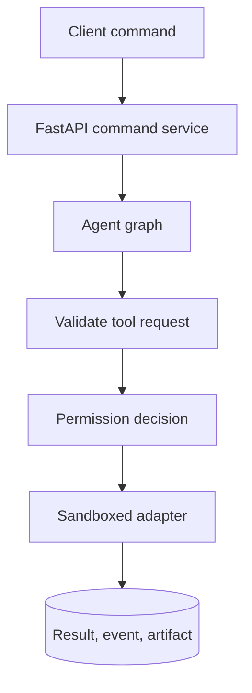

# Runtime Software Requirements Specification

> Normative specification for the Python/FastAPI runtime. This folder expands
> the architectural overview into contracts that can be implemented and tested.

[Docs start page](../README.md) | [Diagram standard](../diagram-standard.md)

## Status legend

| Label | Meaning |
| --- | --- |
| `CURRENT` | Verified behavior or structure in the TypeScript snapshot. |
| `REQUIRED` | Requirement for the proposed Python runtime. |
| `OPTIONAL` | Capability that may be added after the required core is stable. |
| `UNRESOLVED` | The snapshot references a component whose implementation is absent. |

The words **MUST**, **MUST NOT**, **SHOULD**, **SHOULD NOT**, and **MAY** are
normative. They follow the usual SRS interpretation: a MUST is release-blocking;
a SHOULD requires a recorded reason if omitted.

## Scope

This specification covers the backend-owned parts of the product:

- tool definitions, discovery, validation, execution, and result handling;
- permission rules, human approval, workspace trust, and audit evidence;
- REST and WebSocket contracts shared by the CLI and VS Code extension;
- relational data, append-only events, artifacts, and checkpoint storage;
- Python model choices for safe boundaries and low-overhead graph execution.

Agent graph topology, loop termination, subagents, checkpoints, and interaction
inspection are specified separately in
[Agent Architecture](../agent-architecture/README.md).

## Document map

| Document | Implementation question answered |
| --- | --- |
| [01 - Tool Contract](01-tool-contract.md) | What every tool must declare and what the executor guarantees. |
| [02 - Complete Tool Catalog](02-tool-catalog.md) | Which tools exist, their full inputs/outputs, risks, and build priority. |
| [03 - Permission System](03-permission-system.md) | How a request becomes allow, ask, or deny without bypass paths. |
| [04 - API and Event Protocol](04-api-and-event-protocol.md) | How clients command the runtime and replay every transition. |
| [05 - Data Model](05-data-model.md) | Which records are durable, their relationships, indexes, and invariants. |
| [06 - Python Types and Performance](06-python-types-and-performance.md) | Where to use Pydantic, TypedDict, dataclasses, and ORM models. |

## System boundary

**Question:** what path must every model-requested capability follow?

How to read it:

1. A client submits typed intent; it never invokes adapters directly.
2. The command service owns idempotency and transaction boundaries.
3. The graph determines when a capability is needed.
4. Registry schema validation occurs before policy matching.
5. Permission may allow, deny, or create a durable interrupt.
6. Approved work executes through a bounded adapter/sandbox.
7. Outcome and evidence persist before the next model continuation.

Model calls, client replay, checkpoint recovery, and artifact storage have
separate diagrams in their detailed documents so this boundary stays readable.

## Sources of truth

| Concern | Authoritative owner |
| --- | --- |
| Public request and event shape | Pydantic transport models and generated JSON Schema |
| Tool availability and metadata | `ToolRegistry` snapshot stored for each run |
| Permission outcome | Durable `permission_requests` and `permission_decisions` records |
| Agent progress | Ordered domain event log plus graph checkpoint |
| Conversation content | Message and content-block records |
| Large output and diffs | Artifact store referenced by immutable artifact IDs |
| UI state | Client projection rebuilt from REST snapshot plus sequenced events |

The LangGraph checkpointer is not a second product database. It stores resumable
execution state. User-visible history and permission evidence remain in the
application tables defined in [05 - Data Model](05-data-model.md).

## Functional requirement groups

| Prefix | Requirement family |
| --- | --- |
| `TOOL` | Tool contract and executor behavior |
| `PERM` | Permission and approval behavior |
| `API` | REST endpoint behavior |
| `EVT` | WebSocket and event-log behavior |
| `DATA` | Persistence and relational integrity |
| `TYPE` | Python modeling and validation placement |
| `AGT` | Agent graph behavior, defined in the agent folder |
| `OBS` | Interaction visibility and observability |

## Cross-cutting acceptance rules

1. Every model-produced tool argument MUST be validated before policy matching.
2. Every external side effect MUST have a durable call record before execution.
3. Every permission request MUST survive a daemon or client restart.
4. Every accepted command MUST have an idempotency key or an explicitly
   documented non-idempotent execution strategy.
5. Every client-visible transition MUST carry a session sequence number.
6. Every terminal state MUST include a stable machine code and human-readable
   explanation.
7. Every plugin or MCP tool MUST pass through the same executor and policy
   engine as built-in tools.
8. No React, Ink, or VS Code object may be stored in graph state or backend
   domain records.
9. No raw hidden model reasoning is required for observability. The product
   exposes actions, results, state transitions, summaries, and decisions.
10. Current snapshot behavior is a migration reference, not an automatic
    security requirement. Unsafe defaults MUST be replaced deliberately.

## Verification strategy

Each normative requirement is verified by one or more of:

| Verification type | Examples |
| --- | --- |
| Unit | Schema rejection, rule matching, path normalization, graph routing |
| Contract | Python JSON Schema against generated TypeScript fixtures |
| Integration | Prompt, permission interrupt, tool execution, reconnect |
| Property | Rule precedence, idempotency, event sequence monotonicity |
| Fault injection | Crash before/after side effect, database lock, dropped socket |
| Security | Traversal, symlink race, command injection, token leakage, MCP spoofing |
| Performance | Validation overhead, event throughput, graph checkpoint latency |

## Relationship to the overview

The original guides remain the readable architecture tour:

- [Project Architecture Dashboard](../project-architecture/README.md)
- [FastAPI Backend](../project-architecture/03-fastapi-backend.md)
- [Tool and Agent Runtime](../project-architecture/04-tool-agent-runtime.md)
- [Protocol and Data](../project-architecture/07-protocol-and-data.md)
- [Security and Operations](../project-architecture/08-security-and-operations.md)

Additional deep specifications:

- [CLI Architecture](../cli-architecture/README.md)
- [CLI Improvement Program](../cli-improvements/README.md)
- [Memory Architecture](../memory-architecture/README.md)
- [Skills Architecture](../skills-architecture/README.md)
- [Execution Architecture](../execution-architecture/README.md)

When an overview and this folder differ, this SRS controls implementation.
