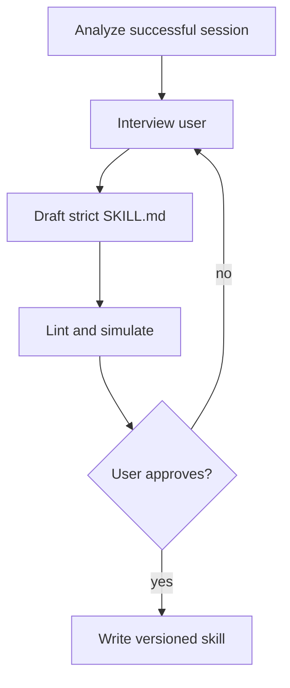

# Skill Contract and Builder

> A strict `SKILL.md` contract and a user-reviewed pipeline for turning a
> successful session into a reusable workflow.

[Skills architecture index](README.md) | [Docs start page](../README.md) | [Diagram standard](../diagram-standard.md)

## Canonical local format

```text
.claude/skills/
  release-check/
    SKILL.md
    references/           # optional, bounded supporting docs
    fixtures/             # optional evaluation inputs/expected outputs
```

The current repository's canonical file is `<skill-name>/SKILL.md`. Legacy
command Markdown can remain a migration input, but new target skills should use
one canonical structure.

## Frontmatter contract

```yaml
---
name: release-check
description: Validate a release candidate and produce a signed readiness report.
version: 1.0.0
when_to_use: >-
  Use when the user asks to validate a release candidate, run a release check,
  or prepare a release readiness report.
user-invocable: true
disable-model-invocation: false
argument-hint: "<version> [environment]"
arguments:
  - version
  - environment
allowed-tools:
  - Read
  - Grep
  - Bash(pytest:*)
context: fork
agent: verification
model: inherit
effort: medium
paths:
  - backend/**
---
```

### Fields

| Field | Required | Contract |
| --- | --- | --- |
| `name` | Yes in target | Stable slug; source namespace handled separately. |
| `description` | Yes | One-line user/model discovery summary. |
| `version` | Yes in target | Immutable revision identity with content digest. |
| `when_to_use` | For model invocation | Concrete triggers and examples; not vague capability marketing. |
| `user-invocable` | No | Whether slash/manual invocation is exposed. |
| `disable-model-invocation` | No | Forces user-only invocation for sensitive builders/actions. |
| `argument-hint` | No | UI help only; does not replace argument validation. |
| `arguments` | No | Named substitution inputs. Target may extend to typed argument schema. |
| `allowed-tools` | Yes in target | Minimum requested patterns, intersected with effective permissions. |
| `context` | No | Omit/`inline`, or `fork` for isolated self-contained execution. |
| `agent` | No | Requested profile; policy decides availability. |
| `model` | No | `inherit` or allowed profile alias, not arbitrary provider escape. |
| `effort` | No | Runtime hint bounded by policy/budget. |
| `hooks` | No | Restricted and reviewed; remote skills should not supply executable hooks by default. |
| `shell` | No | Local trusted source only under explicit policy. |
| `paths` | No | Conditional activation after matching files are operated on. |

The current parser in [`loadSkillsDir.ts`](../../skills/loadSkillsDir.ts)
supports these families. The Python target should reject unknown security-
meaningful fields unless a schema version explicitly defines them.

## Body contract

Every skill body should contain:

1. purpose and non-goals;
2. typed inputs and defaults;
3. expected final artifacts;
4. numbered steps;
5. success criteria for every step;
6. execution owner: direct, child agent, teammate, or human;
7. dependencies/artifacts passed to later steps;
8. required human checkpoints before irreversible work;
9. hard rules derived from user correction or policy;
10. failure/retry/rollback behavior.

Example:

```markdown
# Release Check

## Inputs
- `$version`: Candidate semantic version.
- `$environment`: `staging` by default.

## Goal
Produce `release-readiness.json` and a human-readable report with every required
check settled.

## Steps

### 1. Validate repository state
Run the declared read-only checks.

**Success criteria**
- Version matches the release manifest.
- Working tree policy is satisfied.

**Artifacts**: normalized candidate metadata.

### 2. Run independent verification
**Execution**: Task agent

**Success criteria**
- Required test suites have canonical result artifacts.
- Failures include exact command, exit status, and artifact reference.
```

## Inline versus forked

| Choose | When | Tradeoff |
| --- | --- | --- |
| Inline | User must steer mid-process; workflow depends on current conversation; small context addition | Fast and interactive, but consumes parent context. |
| Forked | Self-contained objective; independent artifacts; no expected mid-process input | Isolated context/budget and resumable child, but adds spawn/coordination cost. |

The current `skillify` prompt uses this same distinction. Do not mark a skill
forked merely because it is long; use fork when its interaction contract fits.

## Target typed definition

```python
class SkillSource(BaseModel):
    model_config = ConfigDict(extra="forbid")

    kind: Literal["managed", "user", "project", "plugin", "bundled", "mcp", "remote"]
    namespace: str
    locator: str
    trust_level: Literal["managed", "trusted_local", "project_untrusted", "remote_untrusted"]


class SkillDefinition(BaseModel):
    model_config = ConfigDict(extra="forbid")

    skill_id: str
    name: str = Field(pattern=r"^[a-z0-9][a-z0-9-]{0,63}$")
    version: str
    digest: str
    description: str = Field(max_length=500)
    when_to_use: str | None = Field(default=None, max_length=2_000)
    arguments: list[str]
    allowed_tools: list[str]
    execution: Literal["inline", "fork"]
    user_invocable: bool
    model_invocable: bool
    requested_agent: str | None
    source: SkillSource
```

Full Markdown body is lazy content addressed by digest. The registry sends only
bounded discovery metadata to the model until invocation.

## Session-to-skill builder

The current [`skillify.ts`](../../skills/bundled/skillify.ts) provides the
source-backed workflow. It is internal-build-only here, so the target must
implement/generalize it explicitly.

### Builder flow

**Question:** how does a session become a committed skill?



How to read it:

1. Analyze session summary plus relevant user steering after the compact boundary.
2. Confirm name, goal, arguments, steps, artifacts, checkpoints, parallelism, and scope.
3. Generate minimal permissions and required success criteria.
4. Parse, lint, check paths/tool patterns, and run safe dry simulations.
5. Show the exact file and destination before any write.
6. Write only after explicit approval and emit a registry-change event.

### Builder commands

```python
class BuildSkillCommand(BaseModel):
    model_config = ConfigDict(extra="forbid")

    command_id: UUID
    session_id: UUID
    description: str | None = None
    source_range: list[UUID] | None = None
    destination: Literal["project", "user"]


class CommitSkillDraftCommand(BaseModel):
    model_config = ConfigDict(extra="forbid")

    command_id: UUID
    draft_id: UUID
    expected_digest: str
    destination: Literal["project", "user"]
    approved: Literal[True]
```

The digest prevents approving one draft and writing a changed one.

## Builder interview

Ask only consequential questions, grouped into bounded rounds:

| Round | Resolve |
| --- | --- |
| Purpose | Name, description, goal, final success artifacts. |
| Interface | Arguments, defaults, trigger phrases, user-only/model invocation. |
| Execution | Inline/forked, agent profile, parallel steps, expected user steering. |
| Steps | Per-step artifacts, success criteria, dependencies, failure behavior. |
| Safety | Minimum tools, irreversible checkpoints, scope, secrets/data. |
| Destination | Project versus user and version/ownership. |
| Review | Exact rendered file, lint/evaluation results, final confirmation. |

Simple two-step skills should not require a long interview. Missing irreversible
action or permission detail is substantial and must be resolved.

## Permission derivation

Builder may suggest permissions observed in the session, but must minimize them:

- prefer `Bash(pytest:*)` over unrestricted `Bash`;
- prefer exact provider/tool families;
- omit a tool used accidentally or only for debugging;
- mark user-only if workflow modifies permissions/skills or sends irreversible actions;
- never copy parent bypass mode into the skill;
- require reauthorization at invocation.

## Builder tests

1. Generated frontmatter parses with no unknown fields.
2. Every step has success criteria.
3. Arguments referenced in body are declared and vice versa.
4. Allowed-tool patterns resolve and are minimal.
5. Forked skill has no mandatory mid-process user checkpoint.
6. Irreversible actions have explicit human checkpoint.
7. Preview digest equals committed digest.
8. Project path remains under `.claude/skills/<name>/SKILL.md` after symlink resolution.
9. Secret canaries from session/tool output do not enter the draft.
10. The builder cannot overwrite an existing revision without a versioned update decision.
