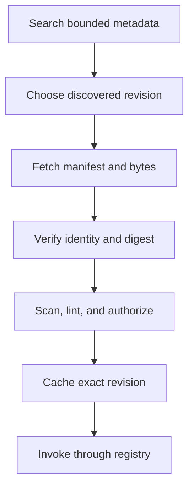

# Skill Discovery, Search, and Fetch

> Find metadata cheaply, fetch an exact immutable revision, review it as
> untrusted content, and invoke only through normal policy.

[Skills architecture index](README.md) | [Docs start page](../README.md) | [Diagram standard](../diagram-standard.md)

## Current local discovery

[`loadSkillsDir.ts`](../../skills/loadSkillsDir.ts) currently provides:

- managed, user, project, plugin, bundled, MCP, and legacy command sources;
- canonical-path deduplication through `realpath`;
- lazy body loading and frontmatter-only token estimation;
- parallel loading of source directories;
- bare/plugin-only policy gates;
- dynamic nested `.claude/skills` discovery while walking operated paths;
- `.gitignore` awareness for nested discovery;
- deeper matching skill directories taking precedence;
- conditional `paths` skills activated after matching files are touched;
- argument and session/skill-directory substitutions;
- shell expansion disabled for remote MCP skills.

This is strong evidence for the target local loader.

## Current remote gap

[`SkillTool.ts`](../../tools/SkillTool/SkillTool.ts) references:

- remote skill state;
- a remote skill loader;
- telemetry and feature checks;
- a required `DiscoverSkills`-before-load rule;
- canonical remote skill caching.

However, `services/skillSearch/*` and `tools/DiscoverSkillsTool/*` are absent
from the visible source tree. Therefore remote discovery/fetch is **GAP**, not
current implementation we can fully document from source.

The target below fills that gap while preserving discover-before-fetch.

## Provider interface

```python
class SkillProvider(Protocol):
    provider_id: str

    async def search(
        self,
        query: "SkillSearchQuery",
        context: "SkillDiscoveryContext",
    ) -> list["SkillSearchHit"]: ...

    async def fetch_manifest(
        self,
        ref: "SkillRevisionRef",
        context: "SkillDiscoveryContext",
    ) -> "RemoteSkillManifest": ...

    async def fetch_content(
        self,
        ref: "SkillRevisionRef",
        context: "SkillDiscoveryContext",
    ) -> bytes: ...
```

Providers may be filesystem, managed registry, MCP, plugin, or remote catalog.
They return data only; they do not register tools or execute hooks during search.

## Discover-then-fetch flow

**Question:** how can a remote skill be used without trusting a search result?



How to read it:

1. Search returns safe summaries and immutable revision references.
2. Only refs discovered for this actor/session/provider may be fetched.
3. Fetch has byte/time/redirect limits and no execution.
4. Verify provider namespace, revision, digest, optional signature, and media type.
5. Parse strict frontmatter, scan content, and compute requested capabilities.
6. Cache by digest with provenance and expiry.
7. Invocation still performs normal permission, sandbox, budget, and source checks.

## Search contract

```python
class SkillSearchQuery(BaseModel):
    model_config = ConfigDict(extra="forbid")

    text: str = Field(min_length=2, max_length=300)
    max_results: int = Field(default=5, ge=1, le=20)
    source_kinds: set[str] = Field(default_factory=set)
    required_capabilities: set[str] = Field(default_factory=set)
    compatible_protocol: str


class SkillSearchHit(BaseModel):
    model_config = ConfigDict(extra="forbid")

    provider_id: str
    namespace: str
    name: str
    version: str
    revision: str
    digest: str
    description: str
    capability_summary: list[str]
    trust_level: str
    discovered_token: str
```

`discovered_token` is a short-lived server-side-bound reference to the actor,
session, provider, result, and expiry. It prevents fetching an arbitrary slug
that was never presented by discovery.

## Search ranking

Borrow the transparent pattern from
[`ToolSearchTool.ts`](../../tools/ToolSearchTool/ToolSearchTool.ts):

1. exact qualified name;
2. explicit `select:<provider>/<name>@<version>`;
3. required `+term` matches;
4. name/namespace parts;
5. curated description and `when_to_use` metadata;
6. compatibility and trust signals;
7. bounded semantic rerank only when needed.

Do not rank by requested permission breadth or provider-paid placement without
clear policy/UI disclosure.

## Fetch contract

```python
class FetchSkillCommand(BaseModel):
    model_config = ConfigDict(extra="forbid")

    command_id: UUID
    discovered_token: str
    expected_digest: str
    cache_policy: Literal["session", "workspace", "none"] = "session"


class FetchedSkill(BaseModel):
    model_config = ConfigDict(extra="forbid")

    skill_id: str
    revision: str
    digest: str
    source: SkillSource
    requested_tools: list[str]
    execution: Literal["inline", "fork"]
    review_status: Literal["clean", "warning", "blocked", "needs_approval"]
    cache_artifact_id: UUID | None
```

Fetch limits:

- HTTPS/approved provider transport only;
- allowlisted redirect policy and destination revalidation;
- compressed and uncompressed byte limits;
- timeout and cancellation;
- Markdown/text media type unless a declared bundle format is supported;
- archive entry/path traversal and symlink rejection;
- no shell interpolation, hook execution, or plugin installation;
- content digest computed over canonical bytes.

## Cache

Use content-addressed cache keys:

```text
skills/<provider-id>/<namespace>/<name>/<revision>/<sha256>/SKILL.md
```

Metadata records actor/workspace scope, fetched time, expiry, signature result,
scan version, manifest, source URL identifier without credentials, and last use.
Cache access never upgrades source trust. Revocation can block an existing
digest immediately even before bytes are purged.

## Registry identity and conflicts

Use qualified IDs internally:

```text
project/release-check@1.0.0
user/release-check@2.0.0
plugin:acme/release-check@1.4.2
remote:catalog/acme/release-check@sha256:...
```

The short slash name is a resolved alias. Resolution must be deterministic and
visible. Managed deny/lock policy can suppress lower-trust sources. A remote
skill never silently shadows a local project skill.

## MCP skills

MCP-provided skills are remote/untrusted unless deployment policy says
otherwise. The current source deliberately disables inline shell expansion for
MCP skills. Preserve that rule and additionally:

- bind content to MCP server identity and connection instance;
- revalidate if server tools/schema/identity change;
- keep skill-requested MCP tools within effective server permissions;
- do not persist remote content to project/user skill directories without
  explicit install/review command.

## Events and API

Minimum commands/events:

- `skills.search` / `skill.search_completed`
- `skills.fetch` / `skill.fetch_started|verified|blocked|completed`
- `skills.inspect`
- `skills.invoke` / `skill.invocation_started|completed|failed`
- `skills.cache.delete`
- `skills.install` with explicit destination approval
- `skills.revoke`
- `skill.registry_changed`

Search and fetch are read/data operations. Install is a write to a privileged
auto-discovered directory and requires a separate permission.

## Build checklist

- [ ] Provider protocol and filesystem provider.
- [ ] Bounded metadata search and deterministic ranking.
- [ ] Session-bound discovered tokens.
- [ ] Exact revision/digest fetch with network/archive limits.
- [ ] Strict parser, secret/injection scanner, and capability diff.
- [ ] Content-addressed cache and revocation table.
- [ ] Registry conflict/precedence fixtures.
- [ ] Separate fetch, invoke, and install permissions.
- [ ] MCP identity-change and remote-content tests.
