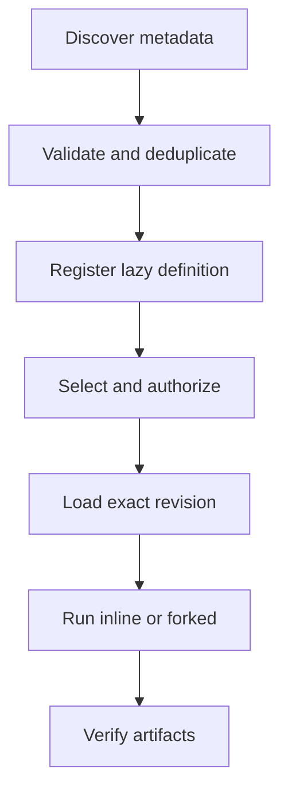

# Skills Architecture

> Reusable, reviewable workflows loaded from `SKILL.md`, invoked inline or in a
> child run, and discovered without granting fetched content automatic trust.

[Docs start page](../README.md) | [Tool catalog](../runtime-srs/02-tool-catalog.md) | [Diagram standard](../diagram-standard.md)

## Skill versus tool versus agent

| Concept | Defines | Executes |
| --- | --- | --- |
| Tool | One typed capability and permission contract | Central tool executor |
| Skill | A reusable workflow/instruction package using allowed capabilities | Current run or a forked child run |
| Agent profile | System behavior, tools, model, memory, and runtime defaults | Independent agent run |

A skill does not bypass tool validation, permissions, sandboxing, or run
budgets. It composes them.

## Source status

| Status | Capability |
| --- | --- |
| **CURRENT** | Canonical `<name>/SKILL.md` loading plus legacy command loading. |
| **CURRENT** | Managed, user, project, plugin, bundled, dynamic nested, and MCP skill sources. |
| **CURRENT** | Frontmatter for invocation, arguments, allowed tools, model, effort, hooks, fork context, agent, shell, and path conditions. |
| **CURRENT** | Full skill body is lazy-loaded only on invocation. |
| **CURRENT** | Inline and forked skill execution with permission checks. |
| **CURRENT** | A bundled `skillify` workflow analyzes a session, interviews the user, reviews, then writes a skill. It is gated to an internal build in this source. |
| **GAP** | `SkillTool` references remote discovery/fetch modules and `DiscoverSkills`, but those implementation files are absent from the visible repository. |
| **TARGET** | A provider-neutral, discover-then-fetch service with signatures, cache, review, policy, and evaluation. |

## Architecture

**Question:** how does a skill become executable?



How to read it:

1. Discovery reads bounded metadata, not arbitrary workflow execution.
2. Names, source identity, paths, arguments, and frontmatter validate.
3. Registry stores a stable revision and lazy content locator.
4. Invocation policy intersects skill requests with effective run capabilities.
5. Local or remote content is loaded and digest-verified.
6. Inline modifies bounded context; forked creates a separate run.
7. Declared success artifacts are verified before completion.

## Documents

| Document | Build question |
| --- | --- |
| [01 - Skill Contract and Builder](01-skill-contract-and-builder.md) | What is a valid skill and how does a session become one safely? |
| [02 - Discovery, Search, and Fetch](02-discovery-search-and-fetch.md) | How are local/remote skills found and loaded without executing untrusted content? |
| [03 - Security and Evaluation](03-security-and-evaluation.md) | How are permissions, supply chain, quality, versioning, and tests enforced? |

## Recommended target package

```text
backend/skills/
  contracts.py            # Pydantic definitions and command/event schemas
  frontmatter.py          # strict YAML/frontmatter parser
  loader.py               # local/managed/plugin/MCP loaders
  registry.py             # names, revisions, source precedence, lazy content
  invocation.py           # inline/forked execution adapter
  builder.py              # session analysis, interview, preview, commit
  discovery.py            # local and provider metadata search
  fetch.py                # exact revision fetch and content verification
  cache.py                # content-addressed cache
  policy.py               # trust, permissions, source, shell/hook restrictions
  evaluation.py           # lint, simulations, fixtures, quality scores
  providers/              # filesystem, MCP, marketplace/internal providers
```

## Build order

1. Strict local `SKILL.md` parser and registry.
2. Explicit user invocation with argument substitution.
3. Permission intersection and inline execution.
4. Forked execution with a child result contract.
5. Project/user/managed/plugin precedence and dynamic path conditions.
6. Skill builder with preview and confirmation.
7. Search over local metadata.
8. Remote discovery and fetch only after trust/cache/evaluation controls exist.

## Repository evidence

| Source | Current behavior |
| --- | --- |
| [`loadSkillsDir.ts`](../../skills/loadSkillsDir.ts) | Sources, frontmatter parsing, lazy loading, dynamic nested discovery, deduplication. |
| [`SkillTool.ts`](../../tools/SkillTool/SkillTool.ts) | Invocation, permission checks, inline/forked execution, and remote module references. |
| [`skillify.ts`](../../skills/bundled/skillify.ts) | Session-to-skill analysis/interview/review workflow. |
| [`ToolSearchTool.ts`](../../tools/ToolSearchTool/ToolSearchTool.ts) | Deferred capability search pattern and direct selection syntax. |
| [`mcpSkillBuilders.ts`](../../skills/mcpSkillBuilders.ts) | Registration boundary for MCP-provided skill builders. |
