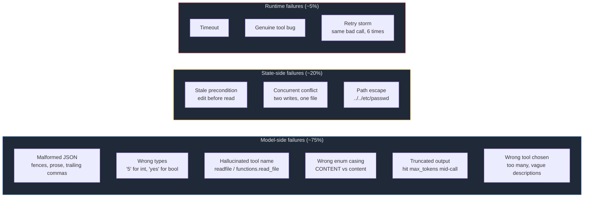
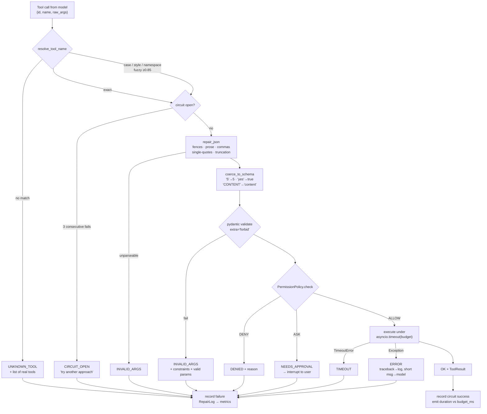
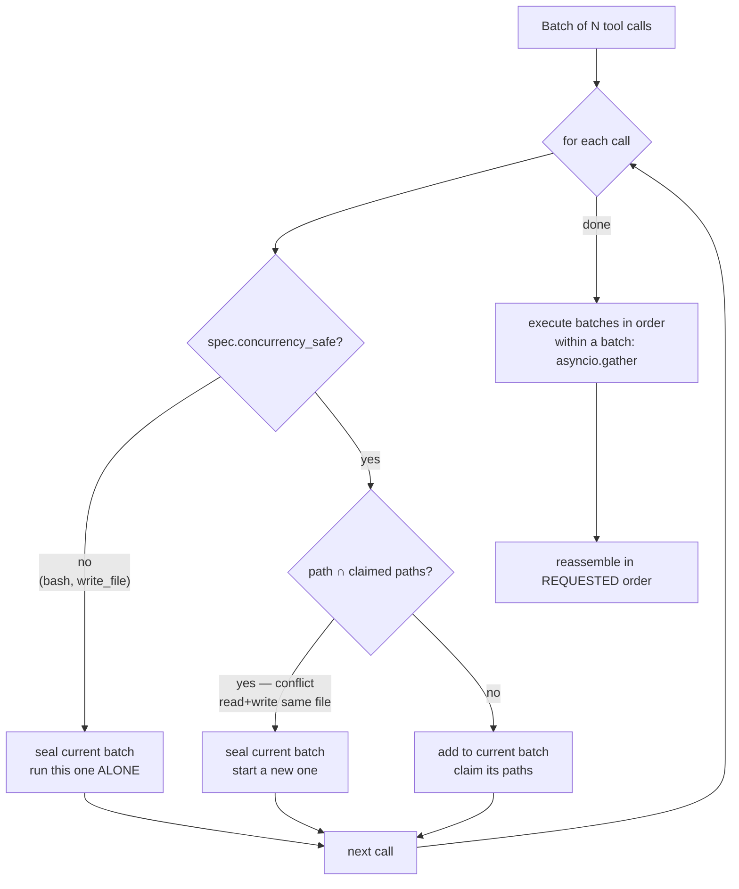
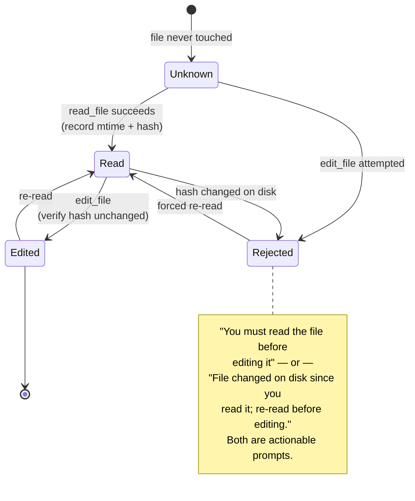
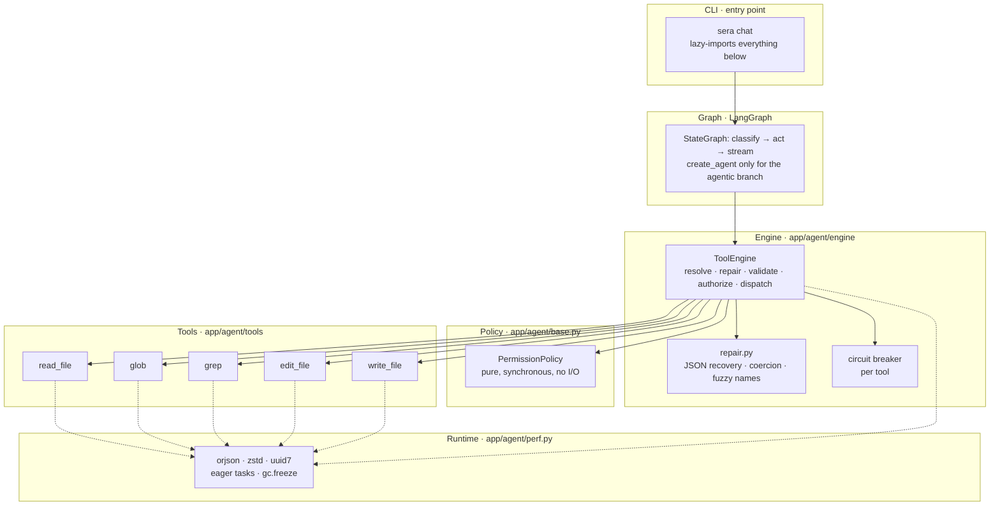
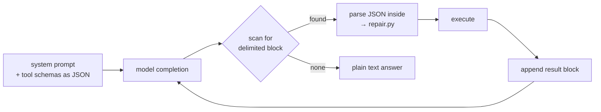
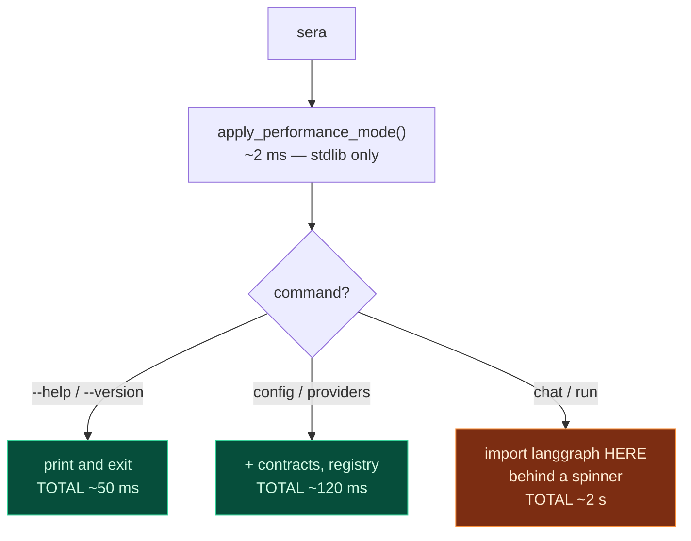
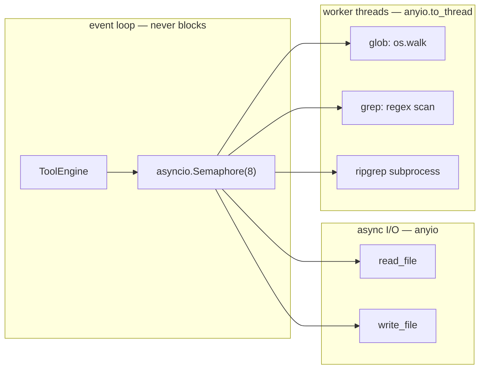

# Tool Engine Architecture

**Part of the [SERA Agent implementation plan](README.md).**

> The goal of this document: **make tool calls fail less, and make the failures that
> remain self-correcting.** A tool call that fails and teaches the model nothing costs
> a full LLM round-trip — the most expensive thing in the system.

---

## 1. Why tool calls fail

Most "tool failures" are not the tool failing. They are the *model* producing something
the schema rejects, and a naive executor turning that into a dead turn.



The split matters: **three quarters of failures are recoverable without an LLM
round-trip.** That is the entire thesis of this engine.

---

## 2. The pipeline

Each stage either fixes the problem locally or produces an error message written as a
*prompt* — something the model can act on next turn.



**No path escapes as an exception.** Every terminal state is a `ToolResult` the model
reads. An exception reaching the agent loop kills the turn and loses all in-flight work
— the worst possible outcome.

---

## 3. Errors are prompts

This is the highest-leverage idea in the document, and it costs nothing to implement.

| Naive error | What the model does next | Engine error | What the model does next |
|---|---|---|---|
| `ValidationError` | repeats the same call | `top_n: Input should be ≤ 10 — expected type=integer, maximum=10` | sends `10` |
| `KeyError: 'pat'` | guesses another name | `extra_forbidden — valid parameters are: pattern, path, glob, limit` | sends `pattern` |
| `Tool not found` | invents another name | `Unknown tool 'gerp'. Available: edit_file, glob, grep, read_file, write_file` | sends `grep` |
| `Permission denied` | retries identically | `write_file needs approval (default). Ask the user, or use plan mode.` | asks first |

Implemented in `_actionable_validation_error()` in
[executor.py](../../app/agent/engine/executor.py) — it appends the offending field's
JSON-Schema constraints to Pydantic's message.

---

## 4. Parallel dispatch and conflict detection

Running independent tools concurrently is the biggest latency win available inside a
single turn. But naive parallelism introduces correctness bugs.



Two rules, both in `_plan_batches()`:

1. **Not `concurrency_safe` ⇒ runs alone.** `bash` and `write_file` never share a batch.
2. **Overlapping paths ⇒ separate batches**, even when both tools are individually safe.
   A read racing a write on one file is a genuine correctness bug.

**Ordering guarantee:** results are reassembled in the order requested, regardless of
completion order. Models reason about tool results positionally — shuffling them causes
confusing downstream errors.

```mermaid
gantt
    title Serial vs batched dispatch — 5 calls
    dateFormat X
    axisFormat %s
    section Serial
    read_file a      :0, 25
    read_file b      :25, 50
    grep             :50, 300
    glob             :300, 420
    write_file       :420, 480
    section Batched
    "read a ∥ read b ∥ grep ∥ glob"  :0, 300
    write_file (alone, conflicts)     :300, 360
```



Same work, 480 ms → 360 ms, with the write still correctly serialized.

---

## 5. Preconditions as a state machine

The most damaging tool failure is not an error — it is a *successful* edit against a
stale view of the file. The engine tracks per-file state within a turn.



Enforcing read-before-edit removes an entire class of silent data loss, and the hash
check catches the case where an external process (or a parallel batch) modified the file
mid-turn.

---

## 6. Layered architecture



**The dependency rule:** arrows point downward only. Tools never import the engine, the
engine never imports the graph, and nothing below L5 imports LangGraph. That last one is
not stylistic — see §8.

---

## 7. Reference architectures

Two patterns worth borrowing. I am confident about the first; **treat the second as a
sketch to verify** rather than a specification — say the word and I will look up the
current design before you build against it.

### Hermes-style text-protocol tool calling

Nous Research's Hermes models call tools through a *text* protocol rather than a
provider-native API: schemas are injected into the system prompt, and the model emits
delimited blocks that the harness parses out of the completion stream.



**Why this matters for SERA specifically:** many Ollama models have no native
tool-calling endpoint. A text protocol is the *universal fallback* — it works on any
model that can follow a format. This is what lets "sign in with Ollama" work with models
that Codex-style native function calling would exclude.

The cost is parsing fragility, which is exactly what
[repair.py](../../app/agent/engine/repair.py) already absorbs. Recommendation:
**native tool calling when `supports_tools`, text protocol as the fallback**, with the
same repair layer behind both.

### Gateway / skills separation

The pattern (as seen in assistant frameworks such as OpenClaw and others in that family)
separates a long-lived **gateway** process from swappable **skill** modules, so
capabilities can be added without restarting or redeploying the core.

Worth borrowing for SERA: the tool registry is already the right seam for this — a
`load_from_directory()` on `ToolRegistry` would give plugin-style tools. Worth deferring
until the core loop is proven, exactly as `docs/tools.md`'s build order says.

---

## 8. Making it fast in Python

Measured on this machine, CPython 3.14.7 — full results in
[bench_runtime.py](../../scripts/bench_runtime.py).

### The finding that dominates a CLI

```
import langgraph.graph   →   1798 ms
import langchain.agents  →    235 ms
import langchain_ollama  →    251 ms
```

**A CLI that pays 1.8 s before printing anything is dead on arrival.** So:



Rules that follow:
- `perf.py`, `contracts.py`, `base.py` and every tool module import **stdlib + pydantic only**.
- LangGraph is imported inside the function that builds the graph, never at module scope.
- The graph is compiled **once** and cached; compiling per invocation is pure waste.
- Warm the import in a background thread the moment the user starts typing their prompt.

### Measured runtime wins

| Optimization | Before | After | Δ | Where |
|---|---:|---:|---:|---|
| `orjson.dumps` vs `json.dumps` | 89.9 ms | 21.0 ms | **+77%** | `perf.dumps` |
| `array('f')` vs JSON floats *(decode)* | 974 ms | 8.2 ms | **+99%** | `perf.unpack_vector` |
| `zstd-1` vs `gzip-6` *(compress)* | 8.4 ms | 1.8 ms | **+79%** | `perf.compress` |
| `eager_task_factory` | 53.9 ms | 28.9 ms | **+46%** | `perf.enable_eager_tasks` |
| `gc.freeze()` after warmup | 9.7 ms | ~0 ms | **+100%** | `perf.freeze_after_warmup` |
| `uuid7` index locality | 50% ordered | 100% ordered | — | `perf.new_id` |

Two honest negatives, so nobody repeats the experiment:

- **`uuid7` is 73% slower to generate** than `uuid4` (0.6 µs vs 0.45 µs). Irrelevant at
  our call volume — adopt it for the B-tree locality, not for speed.
- **`InterpreterPoolExecutor` (PEP 734) is unproven here.** My benchmark compared
  `len()` against a regex scan, which is not a valid comparison, and the number it
  printed should be ignored. Subinterpreters also cannot host torch or numpy. Revisit
  only for sustained pure-Python CPU work in a long-lived pool.
- **Free-threading is not available** in this venv (`cpython-3.14.7-...-none`, GIL
  enabled), and the tail-call interpreter needs a clang-19 build — this is MSVC.

### Concurrency model



Anything that blocks — `os.walk`, a regex scan over a repo, a subprocess — goes to a
thread. One blocking `glob` on the event loop freezes every other concurrent tool call,
which under load does not degrade gracefully; it collapses.

---

## 9. What to build next

| # | Item | Why |
|---|---|---|
| 1 | `preconditions.py` — the §5 state machine | removes silent stale-edit data loss |
| 2 | `edit_file` / `write_file` tools | completes `docs/tools.md` build step 3 |
| 3 | `graph/adapter.py` — `Tool` → LangChain `BaseTool` | keeps LangGraph out of the tool modules |
| 4 | Text-protocol fallback parser | makes non-tool-calling Ollama models work |
| 5 | `bash` tool + allow/deny rules | `docs/tools.md` build step 4 — **after** 1–3 |
| 6 | Golden-set repair tests | lock in the recovery rates before they regress |

---

← [Previous](09-phases.md) · [Index](README.md)
