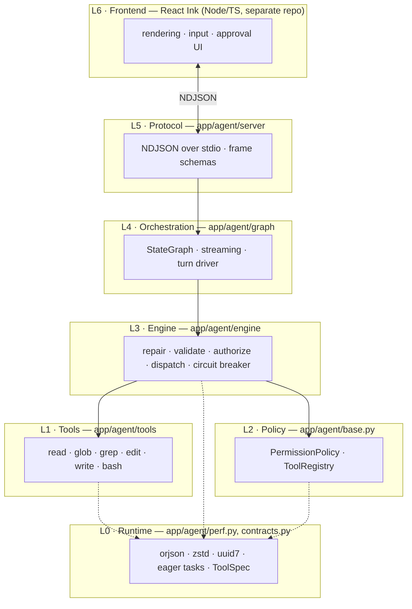
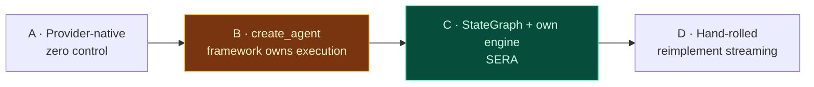

# Phase 00 — Architecture

**Effort:** 0.5 day (reading and deciding, not coding)
**Prerequisite for:** everything

---

## 1. Why this phase exists

Every agent that ships badly ships badly for the same reason: someone started with the
agent loop. The loop is the *easy* part — twenty lines of "call model, run tools,
repeat." What determines whether the product is good is everything the loop delegates
to, and those decisions are nearly impossible to reverse once code exists.

Three decisions in particular become permanent within about a week of coding:

| Decision | If you get it wrong | Reversal cost |
|---|---|---|
| Where the import boundary sits | Every command pays ~1.8 s | Touches every module |
| Whether tool metadata exists | No parallelism, no caching, no permission model | Rewrite every tool |
| Whether the framework owns execution | You cannot fix tool-call failures | Rewrite the loop |

This phase is where you make them deliberately instead of by accident.

---

## 2. The competitive picture

You asked how to compete. The honest starting point is that the agent-loop layer is
**commoditised** — LangGraph, the OpenAI SDK, and a hundred tutorials all give you
"model calls tools in a loop" for free. Nobody wins there.

Where products actually differ:

| Product | Locked to | Runs where | Notable design choice |
|---|---|---|---|
| Claude Code | Anthropic | terminal | Permission modes, hooks, subagents, MCP |
| Codex CLI | OpenAI | terminal | Tight model/harness co-design |
| Cursor | its own backend | IDE fork | Tab-completion + agent in one surface |
| Aider | BYO | terminal | Git-native, repo map, diff-based edits |
| Cline / Roo | BYO | VS Code ext | Plan/Act separation, explicit approvals |
| OpenHands | BYO | Docker sandbox | Strong isolation, browser tool |
| Antigravity | Google | IDE | Agentic IDE surface |
| **SERA** | **BYO** | **terminal (Ink)** | **See below** |

### Where the opening is

Three gaps are real, and all three are architecture, not features:

**1. Provider neutrality that actually holds.** Most "BYO model" tools degrade badly on
weaker models — they assume flawless native tool-calling, and when a local 4B model
emits `{'path': 'a.py',}` with single quotes and a trailing comma, the turn dies. If
your engine *repairs* that, a 4B local model becomes usable where competitors need a
frontier model. That is a category difference for anyone who cannot send code to a
third party.

**2. Tool-call reliability as a product feature.** Roughly three quarters of tool
failures are model-side and mechanically recoverable **without another LLM round-trip**
([Phase 05](phase-05-tool-engine.md)). Most harnesses either fail hard or burn a
round-trip asking the model to try again. Every round-trip you avoid is ~1–2 seconds and
real money.

**3. A stated, measured latency contract.** Almost nobody publishes one. "Everything but
the LLM is under X ms, and here is the benchmark" is defensible, testable, and something
a buyer can verify.

### What not to compete on

Do not compete on tool *count*. A harness with 40 tools is worse than one with 8 good
ones — every tool schema is tokens in every request, and tool-selection accuracy falls
as the menu grows. Competitors with sprawling tool lists are carrying a liability.

---

## 3. The layer model



**The dependency rule: arrows point down only.** Tools never import the engine. The
engine never imports the graph. Nothing below L4 imports LangGraph.

That last rule is not stylistic. `import langgraph.graph` costs **~1800 ms** on this
machine (measured). If a tool module imports it transitively, every process start pays
it. Enforce with a test:

```python
def test_no_langgraph_below_orchestration():
    subprocess.run([sys.executable, "-c",
        "import app.agent.tools.read, app.agent.engine, sys;"
        " assert 'langgraph' not in sys.modules"], check=True)
```

### Why layers rather than a monolith

The pressure to collapse L1–L3 into "just write tools as functions and let the framework
run them" is real, and it is what most tutorials show. Resist it for one reason: **you
cannot insert a repair layer into someone else's executor.** The moment tool execution
belongs to the framework, the single biggest differentiator in §2 becomes unavailable.

---

## 4. How to choose an agent architecture

The decision is not "which framework." It is **how much of the loop you own.** Four
positions, in increasing order of control:

| Position | Example | You own | You give up |
|---|---|---|---|
| **A. Provider-native** | OpenAI Assistants, tool-runner loops | prompt + tools | execution, streaming, state, portability |
| **B. Framework agent** | `create_agent`, `create_react_agent` | prompt + tools + middleware | tool execution, dispatch policy |
| **C. Framework graph** | `StateGraph` + your own tool node | control flow + execution | scheduling primitives only |
| **D. Hand-rolled** | pure asyncio loop | everything | streaming, checkpointing, interrupts, fan-out |

**SERA chooses C.** The reasoning:

- **A is out** — it defeats provider neutrality entirely. The whole product premise is
  that the LLM is swappable.
- **B is tempting and wrong.** `create_agent` bundles a `ToolNode` that executes tool
  calls for you. That is exactly the code we need to replace: no repair, no conflict
  detection, no circuit breaker, no `ToolSpec`-driven batching. You would be adopting a
  framework to get a loop, and then fighting it over the part that matters.
- **D is a trap.** Streaming, interrupts, and parallel fan-out are genuinely fiddly.
  LangGraph's `astream`, `Send`, and `interrupt` are worth having, and reimplementing
  them is a week you do not get back.

C gives you the scheduling primitives and keeps execution. Concretely: a `StateGraph`
whose `tools` node delegates to `ToolEngine`. Detail in
[Phase 08](phase-08-langgraph.md).



### The general rule

> Adopt a framework for its **scheduling primitives**. Never adopt one for its
> **execution semantics**, because execution semantics are where your product lives.

---

## 5. The latency contract

Numbers make the architecture testable. These are the budgets every later phase is
measured against.

| Metric | Definition | Target |
|---|---|---|
| `handshake_ms` | process start → `ready` frame | **≤ 400 ms** |
| `tool_overhead_p50` | engine time excluding the tool's own work | **≤ 5 ms** |
| `tool_overhead_p95` | same | **≤ 15 ms** |
| `turn_overhead_p50` | everything in a turn that is not LLM generation | **≤ 120 ms** |
| `turn_overhead_p95` | same | **≤ 300 ms** |
| `roundtrips` | LLM calls per completed task | **≤ 4** for a single-file fix |

**`roundtrips` is the one that matters most.** At ~1–2 s per round-trip, cutting one is
worth more than every microsecond optimisation combined. That is why
[Phase 05](phase-05-tool-engine.md) (repair, avoiding retry round-trips) and
[Phase 04](phase-04-search-tools.md) (search, avoiding read-everything round-trips)
outrank everything else.

**Measure against a stub provider** that returns a fixed tool-call script instantly.
Benchmarking against a real LLM measures the LLM, not you.

---

## 6. File structure

```
app/agent/
├── perf.py                  L0  runtime switches (stdlib only)
├── contracts.py             L0  ToolSpec, ToolResult, AgentContext, RiskLevel
├── base.py                  L2  Tool ABC, PermissionPolicy, ToolRegistry
│
├── tools/                   L1  one module per tool
│   ├── read.py  glob.py  grep.py  edit.py  write.py  bash.py
│
├── engine/                  L3  the differentiator
│   ├── repair.py            JSON recovery, coercion, fuzzy names
│   ├── executor.py          ToolEngine, batching, circuit breaker
│   └── preconditions.py     read-before-edit state machine
│
├── providers/               L3  warm client registry
│   ├── base.py  ollama.py  openai_compat.py
│
├── graph/                   L4  LangGraph lives here and nowhere else
│   ├── agent.py             build_agent()
│   └── state.py             AgentState
│
└── server/                  L5  protocol boundary
    ├── __main__.py          stdio loop
    ├── protocol.py          frame schemas
    └── session.py           turn driver
```

One rule per directory:

- `perf.py` and `contracts.py` import **stdlib + pydantic only**
- `tools/` never imports `engine/`
- `engine/` never imports `graph/`
- `graph/` is the only place `langgraph` appears

---

## 7. Decisions to lock now

| # | Question | Options | Decision |
|---|---|---|---|
| 1 | How much loop do we own? | A / B / C / D | **C** — StateGraph + own engine (§4) |
| 2 | Process model | sidecar / spawn-per-command | **Persistent sidecar.** Pays the 1800 ms import once, behind the Ink splash |
| 3 | Transport | NDJSON stdio / HTTP / WebSocket | **NDJSON stdio.** No port, no auth, no TLS; parent owns lifetime |
| 4 | Edit representation | line numbers / diff / exact string | **Exact string.** Uniqueness is a free correctness check ([Phase 06](phase-06-mutation-tools.md)) |
| 5 | Tool count at v1 | 5 / 8 / 15+ | **5, then 6.** Schemas cost tokens on every request; selection accuracy falls with menu size |
| 6 | Guardrail placement | model weights / harness | **Harness.** Keeps model choice free ([Phase 12](phase-12-guardrails.md)) |
| 7 | Native tool-calling required? | yes / fallback to text protocol | **Fallback later.** Native for v1; text protocol in [Phase 13](phase-13-deferred.md) unlocks non-tool-calling local models |

---

## 8. Gate

This phase produces no code. It is complete when you can answer, without re-deriving:

- [ ] Which of positions A–D we occupy, and the one-sentence reason
- [ ] Which directory is allowed to import `langgraph`
- [ ] What `roundtrips ≤ 4` means and why it outranks microsecond work
- [ ] Which two of the three competitive openings in §2 you intend to press

---

← [Index](README.md) · [Next: Phase 01 — Runtime & Protocol](phase-01-runtime.md) →
