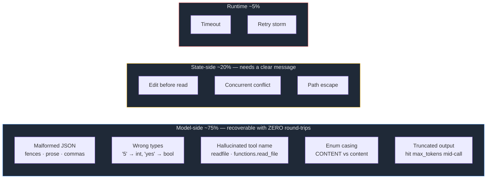
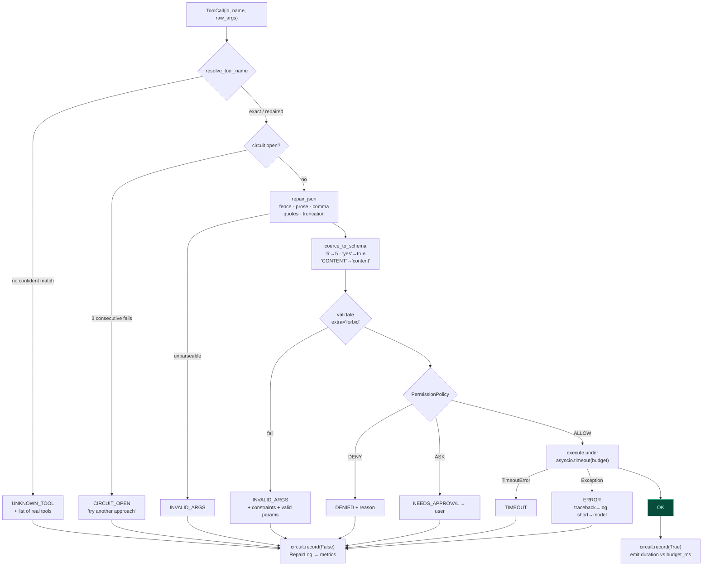
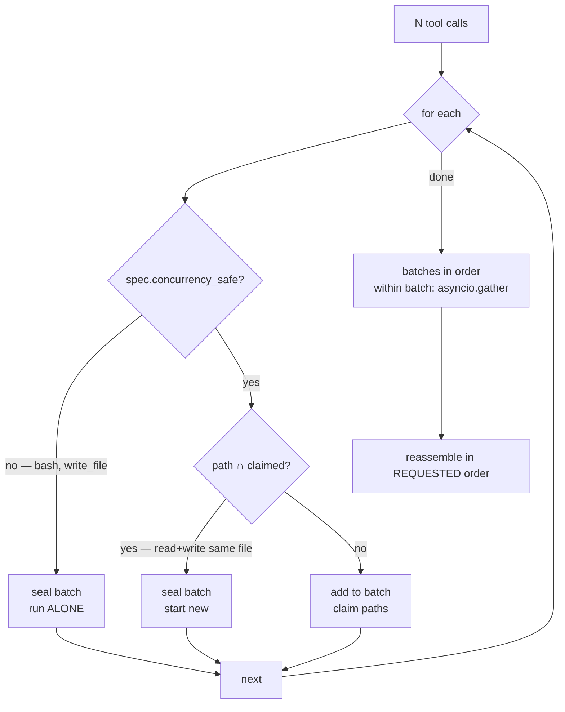
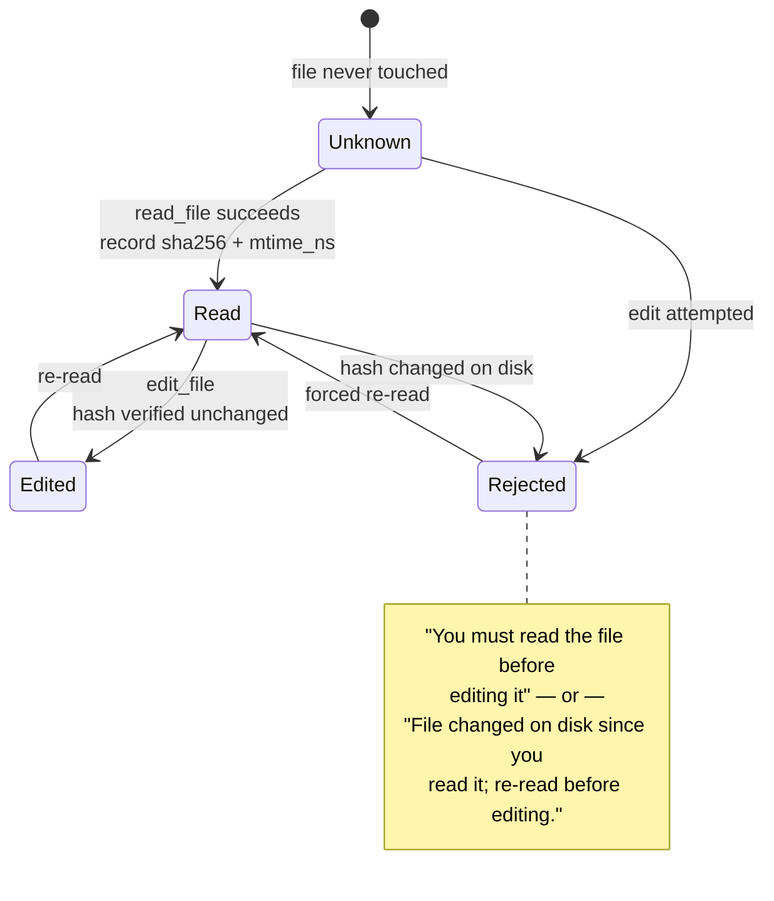

# Phase 05 — The Tool Engine

**Effort:** 2 days · **Depends on:** [02](phase-02-tool-contract.md), [03](phase-03-read-tool.md), [04](phase-04-search-tools.md)
**This is the phase that differentiates the product.**

---

## 1. Why this phase exists

Run a weak model against a naive harness and watch what happens. The model emits:

```
```json
{'path': 'src/app.py', 'max_lines': '50',}
```
```

Single quotes. Trailing comma. A string where an int belongs. Wrapped in a markdown
fence. A naive executor calls `json.loads`, gets a `JSONDecodeError`, and returns
`"Invalid arguments"`. The model — which was *almost right* — now burns a full LLM
round-trip guessing what went wrong, and often guesses wrong again.

That is ~1–2 seconds and real money, for a problem a 40-line function solves
deterministically.

**The distribution of tool-call failures:**



**Three quarters of failures never need to reach the model at all.** That is the thesis.

### What this buys competitively

A harness that repairs these makes a **local 4B model usable** where competitors need a
frontier model. For anyone who cannot send source code to a third party, that is not an
optimisation — it is the difference between the product working and not existing.

---

## 2. The architecture decision

### Why not use LangGraph's `ToolNode`

`langgraph.prebuilt.ToolNode` executes tool calls for you. It is competent: parallel
dispatch, error capture, state injection. And it is the wrong choice here, because it
has no seam for any of the following:

| Need | `ToolNode` | Our engine |
|---|---|---|
| Repair malformed arguments | ✗ validation fails, turn burns | ✓ before validation |
| Fuzzy tool-name resolution | ✗ unknown tool | ✓ case/style/namespace/fuzzy |
| Conflict-aware batching | ✗ parallel by default | ✓ write-set intersection |
| Circuit breaker | ✗ | ✓ per tool |
| `ToolSpec`-driven concurrency | ✗ | ✓ `concurrency_safe` |
| Errors written as prompts | ✗ raw Pydantic | ✓ constraints + valid values |

This is the concrete instance of the Phase 00 rule: **adopt a framework for scheduling
primitives, never for execution semantics.** We keep `StateGraph`; we replace `ToolNode`.

### What we keep from `docs/tools.md`

`docs/tools.md` sketches a hand-rolled `execute_tool_call`. Its *concepts* are right and
we keep all of them — schema, validate, authorize, execute, `ToolResult`. What we add is
the repair stage it does not have, and what we drop is its assumption that we also need
to write the dispatch loop from scratch.

---

## 3. The pipeline



**No path escapes as an exception.** Every terminal state is a `ToolResult` the model
reads. An exception reaching the agent loop kills the turn and loses all in-flight work.

---

## 4. What to build

### `engine/repair.py`

```python
@dataclass(slots=True)
class RepairLog:
    repairs: list[str] = field(default_factory=list)
    def note(self, what: str) -> None: ...

def repair_json(raw: str | dict, log: RepairLog | None = None) -> dict: ...
def coerce_to_schema(args: dict, schema: dict, log=None) -> dict: ...
def resolve_tool_name(requested: str, known: list[str], log=None) -> str | None: ...
```

**The ten failure modes and their repairs:**

| # | Input | Repair |
|---|---|---|
| 1 | ` ```json {…} ``` ` | strip fence |
| 2 | `Sure! {…} hope that helps` | brace-balanced scan, string-aware |
| 3 | `{"a": 1,}` | regex strip trailing commas |
| 4 | `{'a': 1}` | `ast.literal_eval` |
| 5 | `{"a": 1, "b": "unclo` | close to last complete pair |
| 6 | `{"limit": "5"}` | schema-directed int coercion |
| 7 | `{"tags": "py"}` for array | wrap scalar |
| 8 | `True` / `None` | `ast.literal_eval` |
| 9 | `functions.read_file` | case → style → namespace → fuzzy ≥0.85 |
| 10 | `"CONTENT"` | enum near-match |

**Implementation style — the balanced scanner.** Do not regex for `{.*}`; braces appear
inside strings. Track `depth`, `in_string`, `escape`:

```python
for i, ch in enumerate(text[start:], start):
    if escape: escape = False; continue
    if ch == "\\": escape = True; continue
    if ch == '"': in_string = not in_string; continue
    if in_string: continue
    if ch == "{": depth += 1
    elif ch == "}":
        depth -= 1
        if depth == 0: return text[start:i+1]
```

**Why `ast.literal_eval` is safe here:** it evaluates *literals only* — no calls, no
attribute access, no imports. It is not `eval`.

**Order matters.** Try strict `json.loads` first (the common case, zero cost), then
progressively looser strategies. Never start with the lenient parser: it can mask a
genuinely different problem.

**What we deliberately do NOT repair:** missing *required* values. Inventing a file path
is worse than a clean error, because a clean error is a prompt the model can act on.

### `engine/executor.py`

```python
class Outcome(StrEnum):
    OK, INVALID_ARGS, UNKNOWN_TOOL, DENIED,
    NEEDS_APPROVAL, TIMEOUT, ERROR, CIRCUIT_OPEN

@dataclass(slots=True)
class ToolOutcome:
    call_id: str; tool_name: str; outcome: Outcome
    result: ToolResult; duration_ms: float
    repairs: list[str]; over_budget: bool

class ToolEngine:
    def __init__(self, registry, policy=None, *, max_parallel: int = 8): ...
    async def execute(self, call: ToolCall, ctx: AgentContext) -> ToolOutcome: ...
    async def execute_many(self, calls, ctx) -> list[ToolOutcome]: ...
```

### `engine/preconditions.py`

```python
@dataclass(slots=True)
class FileSnapshot:
    sha256: str; size: int; mtime_ns: int; lines: int

class FileStateTracker:
    def record_read(self, path: Path, content: bytes) -> None: ...
    def check_editable(self, path: Path) -> str | None: ...   # None = OK

def tracker_for(ctx: AgentContext) -> FileStateTracker: ...   # per-turn, in ctx.extras
```

---

## 5. Errors are prompts

The highest-leverage idea here, and it costs nothing.

Whatever the engine returns becomes the model's next input. Treat it as prompt
engineering, not error reporting.

| Naive | Model's next move | Ours | Model's next move |
|---|---|---|---|
| `ValidationError` | repeats the call | `max_lines: Input should be ≤ 10000 — expected type=integer, minimum=1, maximum=10000` | sends `10000` |
| `KeyError: 'pat'` | guesses again | `pat: Extra inputs are not permitted — valid parameters are: case_insensitive, context_lines, glob, limit, output_mode, path, pattern` | sends `pattern` |
| `Tool not found` | invents a name | `Unknown tool 'grpe'. Available tools: edit_file, glob, grep, read_file, write_file.` | sends `grep` |
| `Permission denied` | retries identically | `write_file would modify state, and the session is in plan mode.` | stops trying |

Implementation: append the offending field's JSON-Schema constraints to Pydantic's
message.

```python
def _actionable_validation_error(tool_name, exc, schema) -> str:
    props, required = schema.get("properties", {}), schema.get("required", [])
    lines = [f"Invalid arguments for {tool_name}:"]
    for err in exc.errors()[:5]:
        loc, msg = ".".join(map(str, err["loc"])) or "(root)", err["msg"]
        if err["type"] == "extra_forbidden":
            hint = f" -- valid parameters are: {', '.join(sorted(props))}"
        else:
            prop = props.get(str(err["loc"][0])) if err["loc"] else None
            bits = [f"{k}={prop[k]}" for k in
                    ("type","enum","minimum","maximum","minLength","maxLength")
                    if prop and k in prop]
            hint = f" -- expected {', '.join(bits)}" if bits else ""
        lines.append(f"  - {loc}: {msg}{hint}")
    return "\n".join(lines)
```

Cap at 5 errors. In an agent loop, tool output is re-sent on every subsequent turn, so
verbosity compounds.

---

## 6. Parallel dispatch

Running independent tools concurrently is the largest latency win available *inside* a
turn. Naive parallelism introduces correctness bugs, so batching is `ToolSpec`-driven.



Two rules:

1. **Not `concurrency_safe` ⇒ alone.**
2. **Overlapping paths ⇒ separate batches**, even when both tools are individually safe.
   A read racing a write on one file is a correctness bug, not a performance question.

**Ordering guarantee.** Reassemble in requested order regardless of completion order.
Models reason about tool results positionally; shuffling causes confusing downstream
errors.

**Implementation style — write-set extraction is deliberately sloppy:**

```python
_PATH_KEYS = ("path", "file_path", "filename", "target", "dest", "destination")
```

This runs *before* validation, so arguments may still be malformed. A missed path costs
parallelism, never correctness — unsafe tools already run alone.

```mermaid
gantt
    title Serial vs batched — 5 calls
    dateFormat X
    axisFormat %s
    section Serial
    read a       :0, 25
    read b       :25, 50
    grep         :50, 300
    glob         :300, 420
    write        :420, 480
    section Batched
    "read a ∥ read b ∥ grep ∥ glob"  :0, 300
    write (alone)                     :300, 360
```



---

## 7. The circuit breaker

A model that receives an error frequently retries the same call. If the tool is
genuinely broken — bad credentials, unreachable service — that loop consumes every
remaining step in the turn.

```python
@dataclass
class _Circuit:
    threshold: int = 3
    cooldown_s: float = 30.0
    failures: int = 0
    opened_at: float = 0.0
```

After 3 consecutive failures, short-circuit with a message that tells the model to
**change approach**, not to retry. This is the cheapest possible protection against the
worst failure mode: a turn that accomplishes nothing and bills for twelve round-trips.

---

## 8. Preconditions as a state machine

The most damaging tool failure is not an error. It is a *successful* edit applied to a
stale view of the file, silently discarding whatever changed in between.



**Implementation style — cheap check first:**

```python
if stat.st_size == snap.size and stat.st_mtime_ns == snap.mtime_ns:
    return None                       # ~1 µs, the common case
current = hashlib.sha256(path.read_bytes()).hexdigest()   # only when ambiguous
```

State is per-turn, held in `AgentContext.extras`, so nothing leaks between requests.

---

## 9. Traps

Each of these cost real debugging time.

**A falsy log object silently discards itself.**

```python
def __bool__(self): return bool(self.repairs)   # empty log is falsy
...
log = log or RepairLog()      # ← BUG: replaces the caller's log every time
log = RepairLog() if log is None else log   # ← correct
```

Symptom: everything works, `RepairLog` is always empty, and you have no observability at
the exact moment you need it.

**Pydantic renders enums as `$ref`, not inline `enum`.**

A `StrEnum` field becomes `{"$ref": "#/$defs/OutputMode"}` — often wrapped in `allOf` or
`anyOf`. Coercion that only reads `prop["enum"]` misses **every** enum near-miss. You
must dereference `$defs`:

```python
def _deref(prop: dict, defs: dict) -> dict:
    if "$ref" in prop: return {**prop, **defs.get(prop["$ref"].removeprefix("#/$defs/"), {})}
    for comb in ("allOf", "anyOf", "oneOf"):
        for branch in prop.get(comb, []) or []:
            target = defs.get(branch.get("$ref","").removeprefix("#/$defs/"), branch)
            if target.get("enum") or target.get("type"): return {**target}
    return prop
```

**`gather()` must never see an exception.** One raising sibling cancels the whole batch.
Wrap each call:

```python
async def _execute_guarded(self, call, ctx):
    try: return await self.execute(call, ctx)
    except asyncio.CancelledError: raise
    except Exception as exc:
        return ToolOutcome(..., outcome=Outcome.ERROR, result=ToolResult.error(...))
```

**Fuzzy matching should be conservative.** At cutoff 0.75, `gerp`→`grep` resolves — but
so do genuine mistakes, and running the *wrong* tool is worse than a clean "unknown tool,
here is the list." Use **0.85**.

---

## 10. Gate

Build a golden set of ~40 real malformed tool calls (capture them from actual local-model
runs — do not invent them).

| Metric | Target |
|---|---|
| Recovery rate on the golden set | **≥ 90%** |
| False repairs (altered a *valid* call) | **0** |
| Unhandled exceptions escaping the engine | **0** |
| Unsafe tool shares a batch | **never** |
| Overlapping paths share a batch | **never** |
| Requested-order preservation | **100%** |
| Engine overhead p95 (excluding tool work) | **≤ 15 ms** |

Smoke test to write alongside: happy path, seven malformed shapes, five teaching errors,
the read→edit→external-change sequence, batch planning, plan mode, and circuit-breaker
opening.

---

## 11. Why this ordering

`docs/tools.md` puts write/edit at step 3 and the engine later. We invert it: **the
engine lands before anything can write to disk.** Mutation tools are where a malformed
argument does permanent damage, so repair and preconditions must exist first.

---

← [Previous: Phase 04 — Search Tools](phase-04-search-tools.md) · [Index](README.md) · [Next: Phase 06 — Mutation Tools](phase-06-mutation-tools.md) →
