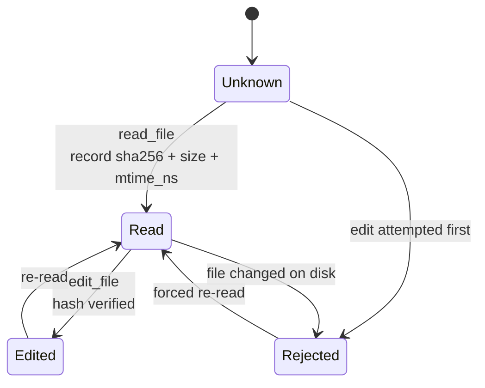

# Phase 06 — Mutation Tools

**Effort:** 1 day · **Depends on:** [05](phase-05-tool-engine.md)

---

## 1. Why this phase exists

Everything so far has been read-only. This is where the agent can destroy work, and the
failure mode that matters is not an error message — it is a **successful** edit applied
to a stale view of the file, silently discarding whatever changed in between.

An error is recoverable: the model sees it and adapts. Silent data loss is not, and the
user may not notice until much later.

That is why this phase comes **after** the engine. `docs/tools.md` puts write/edit at
step 3, before the executor is hardened. We inverted it deliberately: mutation is where a
malformed argument does permanent damage, so repair and preconditions must exist first.

---

## 2. The architecture decision

### Exact string replacement — not line numbers, not diffs

Three options, and the choice is not obvious until you have watched each fail:

| Approach | Failure mode |
|---|---|
| **Line numbers** | Go stale the instant anything above the edit changes. The model computes a correct edit against a line that has already moved, and it lands in the wrong place — silently |
| **Unified diff** | Needs fuzzy hunk matching to be usable at all. Fuzzy matching on source code produces confidently wrong results |
| **Exact string** | Fails loudly when the model's view is wrong |

**Exact string wins because its failure mode is loud.** And it comes with a free
correctness check:

> If `old_string` appears **twice**, the model's mental model of the file is wrong.

Requiring uniqueness turns "I guessed which occurrence you meant" into "tell me which one
you meant." That is a bug caught for zero cost.

```python
count = text.count(args.old_string)
if count == 0:
    return ToolResult.error(
        "old_string not found. It must match byte-for-byte, including indentation "
        "and line endings. Re-read the file and copy the exact text.")
if count > 1 and not args.replace_all:
    return ToolResult.error(
        f"old_string appears {count} times. Add surrounding context to make it "
        f"unique, or set replace_all=true to change all {count} occurrences.")
```

Both messages are prompts, per [Phase 05](phase-05-tool-engine.md) §5 — they tell the
model exactly what to do next.

### Why `edit_file` and `write_file` are separate

`edit_file` is for **partial** changes; `write_file` replaces the whole file. Keeping them
apart matters for cost: `write_file` sends the entire file as an argument, so using it for
a one-line change burns thousands of tokens for no reason.

Say so in the description, so the model chooses correctly:

> "For partial changes use edit_file instead — it is safer and far cheaper in tokens."

### Asymmetric read requirement

| Operation | Prior read required? | Why |
|---|---|---|
| `edit_file` on any file | **yes** | The edit is relative to content you must have seen |
| `write_file` on an existing file | **yes** | Overwriting destroys content |
| `write_file` on a new file | **no** | There is nothing to lose |

---

## 3. The precondition state machine

Enforced by `engine/preconditions.py` from [Phase 05](phase-05-tool-engine.md) §8:



Two distinct rejections, two distinct messages:

```
You must read app.py before editing it. Call read_file on it first so your
edit is based on its current contents.

app.py changed on disk since you read it. Re-read it before editing, or your
change would discard that edit.
```

The second catches an external process, a parallel batch, or the user editing in their
own editor mid-turn.

**Cheap check first:**

```python
if stat.st_size == snap.size and stat.st_mtime_ns == snap.mtime_ns:
    return None                                # ~1 µs, the common case
current = hashlib.sha256(path.read_bytes()).hexdigest()   # only when ambiguous
```

A file touched but not modified (`mtime` changed, content identical) refreshes the
snapshot and proceeds rather than blocking on a false positive.

---

## 4. Implementation details that matter

### Preserve the newline convention

```python
newline = "\r\n" if "\r\n" in text else "\n"
```

Rewriting a CRLF file with LF endings produces a diff touching **every line**. The change
becomes unreviewable, and on a team with mixed platforms it triggers a merge conflict on
a file nobody meaningfully edited.

### Never `concurrency_safe`

```python
spec = ToolSpec(
    name="edit_file", risk=RiskLevel.MEDIUM,
    read_only=False, concurrency_safe=False, plan_mode_safe=False,
    timeout_s=15.0, budget_ms=60,
)
```

`concurrency_safe=False` makes Phase 05's batch planner run these alone.
`plan_mode_safe=False` removes them from the tool list entirely in plan mode — the
`ToolSpec` invariant from [Phase 02](phase-02-tool-contract.md) enforces that a mutating
tool cannot claim otherwise.

### Refuse absurd writes

```python
MAX_WRITE_BYTES = 5 * 1024 * 1024
```

A model that has gone wrong can emit a very large `content`. Refuse with a clear number
rather than filling the disk.

### Update the tracker after writing

```python
await apath.write_bytes(encoded)
tracker.record_read(path, encoded)      # the agent now knows the new content
```

Without this, a second edit in the same turn is rejected — the agent just wrote the file,
so it *does* know its contents.

### Report the delta

```
Edited src/calc.py: 1 replacement, +0 lines.
Created src/new.py (12 lines, 340 bytes).
```

Confirmation the model can reason about, without echoing the file back and burning tokens.

---

## 5. Gate

- [ ] Editing without a prior read → refused, actionable message
- [ ] Editing after an external modification → refused, actionable message
- [ ] Non-unique `old_string` without `replace_all` → refused, reports the count
- [ ] `old_string == new_string` → rejected at validation
- [ ] CRLF file edited → still CRLF
- [ ] `write_file` on a new file → no prior read needed
- [ ] `write_file` on an existing file → prior read required
- [ ] Second edit in the same turn → allowed (tracker updated)
- [ ] Plan mode → neither tool appears in `registry.for_mode(PLAN)`
- [ ] Both refuse paths outside the project
- [ ] p95 ≤ 60 ms

---

← [Previous: Phase 05 — Tool Engine](phase-05-tool-engine.md) · [Index](README.md) · [Next: Phase 07 — Providers](phase-07-providers.md) →
