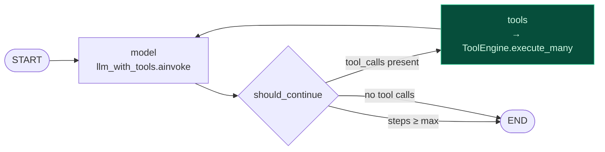
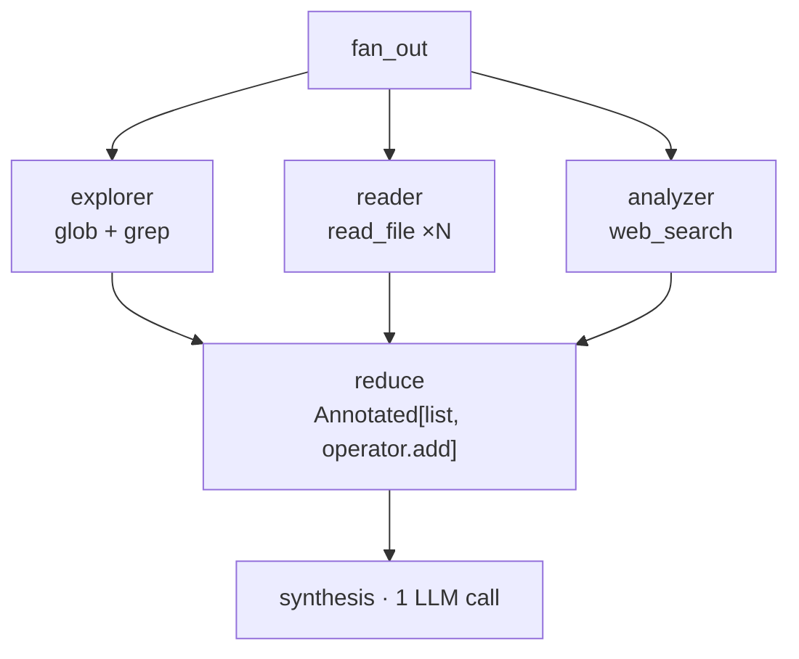

# Phase 08 — LangGraph Architecture

**Effort:** 1 day · **Depends on:** [05](phase-05-tool-engine.md), [07](phase-07-providers.md)
**Verified against:** `langgraph 1.2.11`, `langgraph-prebuilt 1.1.0`, `langgraph-checkpoint 4.2.0`, `langchain 1.3.15`, `langchain-core 1.6.0`

---

## 1. Why this phase exists

By now you have a tool engine that repairs, authorises, batches and executes. What you
do not have is anything that decides *when* to call it, streams tokens while it runs, or
survives a mid-turn interrupt.

That is genuinely fiddly code — async streaming with backpressure, interrupt/resume,
parallel fan-out with a join. It is also completely undifferentiated: nobody buys your
product because your `asyncio.gather` is elegant. So we take it off the shelf.

The whole question of this phase is **exactly how much to take.**

---

## 2. The architecture decision

### The four positions, again

From [Phase 00](phase-00-architecture.md) §4:

| | You own | You give up |
|---|---|---|
| A · Provider-native | prompt + tools | portability — **disqualifying** |
| B · `create_agent` | prompt + tools + middleware | **tool execution** |
| C · `StateGraph` + own engine | control flow + execution | scheduling primitives only |
| D · Hand-rolled | everything | streaming, interrupts, fan-out |

**We choose C.** The decisive argument is one line in the LangChain source:

`langchain.agents.create_agent` bundles `langgraph.prebuilt.ToolNode`, and `ToolNode`
executes tool calls itself. That is precisely the code
[Phase 05](phase-05-tool-engine.md) exists to replace. Choosing B means adopting a
framework for a twenty-line loop and then fighting it over the part that carries your
product.

### What `create_agent` would cost us

| Capability | Survives under `create_agent`? |
|---|---|
| Argument repair before validation | ✗ |
| Fuzzy tool-name resolution | ✗ |
| Conflict-aware batching (`concurrency_safe` + write-set) | ✗ |
| Circuit breaker | ✗ |
| Errors rendered as prompts | ✗ |
| Per-tool `budget_ms` enforcement | ✗ |

Six of the seven things that make SERA different.

### What we still want from LangGraph

Real value, worth the dependency:

- **`astream(stream_mode="messages")`** — token streaming with correct backpressure
- **`Send`** — parallel fan-out in one superstep (§7)
- **`interrupt` / `Command(resume=…)`** — the mechanism behind
  [Phase 11](phase-11-permissions.md)'s approval flow
- **Checkpointers** with `durability` control — resumable sessions in
  [Phase 10](phase-10-sessions.md)
- **Conditional edges** — declarative control flow that stays readable at 10 nodes

> **The rule:** adopt a framework for its **scheduling primitives**, never for its
> **execution semantics**.

---

## 3. The graph

The loop itself is small. The value is in what `tools` delegates to.



```python
graph = StateGraph(_State)
graph.add_node("model", model_node)
graph.add_node("tools", tools_node)
graph.add_edge(START, "model")
graph.add_conditional_edges("model", should_continue, {"tools": "tools", END: END})
graph.add_edge("tools", "model")
return graph.compile()
```

`tools_node` is a thin adapter — it converts LangChain `tool_calls` into our `ToolCall`
objects, hands the batch to `ToolEngine`, and converts `ToolOutcome`s back into
`ToolMessage`s. All the intelligence is one layer down.

---

## 4. State design

```python
_State = TypedDict("_State", {
    "messages": Annotated[list, add_messages],
    "steps": int,
})
```

**Keep state small.** Every field is serialised on every checkpoint write. Two rules:

1. **Never carry tool payloads in state.** A 20 KB `grep` result belongs in the
   `ToolMessage`, not in a separate state field that gets re-serialised each superstep.
2. **`steps` is a hard ceiling, not telemetry.** It is what bounds worst-case turn
   latency when a model gets stuck in a tool loop.

### The two Python 3.14 traps

Both cost real debugging time. Both come from PEP 563/649 annotations plus LangGraph's
use of `get_type_hints()`.

**Trap 1 — function-local `class _State(TypedDict)`.**

A TypedDict declared inside `build_agent()` stores its annotations as *strings*.
LangGraph resolves them with `get_type_hints()` against **module** globals — where
`add_messages` does not exist, because we import it locally to keep langgraph off the
fast path.

```
NameError: name 'add_messages' is not defined
```

Fix: **functional syntax**, which stores the real object rather than a string.

```python
_State = TypedDict("_State", {"messages": Annotated[list, add_messages], "steps": int})
```

**Trap 2 — the branch function is inspected too.**

`add_conditional_edges` calls `get_type_hints()` on the callable you pass. Annotate it
`state: _State` where `_State` is function-local and you get:

```
NameError: name '_State' is not defined
```

Fix: leave the branch function's parameter unannotated, or annotate it `dict`.

```python
def should_continue(state) -> str:      # ← no annotation
    if state.get("steps", 0) >= max_steps: return END
    last = state["messages"][-1]
    return "tools" if getattr(last, "tool_calls", None) else END
```

These two are the reason this phase has its own document rather than three bullet points
in the agent-loop phase.

---

## 5. Performance

Ordered by measured impact.

| # | Practice | Why | Saving |
|---|---|---|---|
| 1 | **Import langgraph inside `build_agent()`** | `import langgraph.graph` = **1798 ms** measured | 1.8 s/start |
| 2 | **Compile once, cache the result** | compilation is not free | 5–20 ms/turn |
| 3 | **Pool provider clients** ([07](phase-07-providers.md)) | TLS + pool setup dominates | 50–300 ms/turn |
| 4 | **`durability="exit"`** when checkpointing | `"sync"` writes at every superstep | 15–60 ms/turn |
| 5 | **No checkpointer for one-shot turns** | nothing to resume | 10–40 ms/turn |
| 6 | **`stream_mode="messages"`**, print token 0 immediately | perceived latency | large |
| 7 | **Bound `steps`** | caps worst-case turn | tail |

`Durability = Literal["sync", "async", "exit"]` — verified in `langgraph/types.py`.
`checkpoint_during` is deprecated in favour of it.

**Node-level caching** is available (`langgraph.cache.redis` and `.memory` are both
installed) via `CachePolicy`. Not useful for a coding agent — file contents change under
you — but relevant if you later add a retrieval node.

---

## 6. Streaming

```python
async for chunk, meta in graph.astream(
    {"messages": messages, "steps": 0},
    {"configurable": {"agent_context": ctx}},
    stream_mode="messages",
    durability="exit",
):
```

Map graph events onto protocol frames ([Phase 01](phase-01-runtime.md)):

| Graph event | Frame |
|---|---|
| first `AIMessage` chunk | `token` |
| entering `tools` | `tool_start` per call |
| `ToolOutcome` returned | `tool_end` with `ms` + `repairs` |
| `interrupt` raised | `permission_request` |
| graph completes | `done` |

**Emit `tool_start` before the tool runs, not after.** The Ink frontend renders "reading
src/app.py…" while it happens; waiting until completion throws away the one place where
perceived latency is free to improve.

---

## 7. Multi-agent — and when not to

### Default: don't

Every handoff costs an LLM call plus a context re-read. A supervisor delegating to two
specialists is **three** LLM calls minimum. At ~1–2 s each that is 3–6 s before the user
sees anything.

Against the Phase 00 budget of `roundtrips ≤ 4`, a supervisor spends most of it on
routing rather than work.

> **Use a single agent until you can name the specific capability that fails without a
> second one.** Most things that feel multi-agent are one agent with better tools.

### When it is justified

| Pattern | Use when | Latency cost |
|---|---|---|
| **Agent-as-tool** | sub-task needs its own prompt and tool set, result is a *value* | +1 call, sequential |
| **Parallel fan-out (`Send`)** | N genuinely independent sub-tasks | **+1× wall clock** (concurrent) |
| **Supervisor handoff** | distinct long-lived roles | +2 or more, sequential |
| **Sequential pipeline** | fixed stages, no routing decision | use a `StateGraph`, not agents |

### `Send` is the only latency-neutral option

`Send` (verified in `langgraph.types`) dispatches to N nodes in the **same superstep** —
they execute concurrently. Wall-clock cost is the slowest branch, not the sum.



```python
def fan_out(state):
    return [Send("explorer", {...}), Send("reader", {...}), Send("analyzer", {...})]
```

Three specialists' work, one call's wall clock. Rules:

- Only when branches are **truly independent** — any dependency serialises it
- Reduce with `Annotated[list, operator.add]`, not a second LLM call, when the merge is
  mechanical
- Give each branch its own deadline; one slow branch must not hold the turn

### For SERA specifically

Ship **one** agent. The tool engine's parallel batching (Phase 05 §6) already gives you
concurrency *within* a turn without any of the handoff cost. Revisit only if evals show
single-agent quality is genuinely insufficient — and then use `Send`, never a supervisor.

---

## 8. Checkpointing

Only `base`, `memory` and `serde` savers are installed. **There is no Postgres saver
today** — add `langgraph-checkpoint-postgres` when [Phase 10](phase-10-sessions.md)
needs it.

| Situation | Checkpointer | Durability |
|---|---|---|
| One-shot turn | none | — |
| Resumable session | `AsyncPostgresSaver` | `"exit"` |
| Human-in-the-loop interrupt | required | `"async"` |

`"exit"` writes once at the end rather than at every superstep. Use `"async"` only when
an interrupt must survive a process crash mid-turn.

---

## 9. Middleware — available, mostly unused

All verified present in `langchain/agents/middleware/`. Most attach to `create_agent`,
which we are not using, so treat this as a reference for what to reimplement if needed:

| Middleware | Verdict for SERA |
|---|---|
| `ModelFallbackMiddleware` | **Worth porting** — provider dies mid-turn, degrade instead of failing |
| `SummarizationMiddleware` | **Worth porting** in [Phase 10](phase-10-sessions.md), on a token threshold |
| `ContextEditingMiddleware` + `ClearToolUsesEdit` | **Worth porting** — strips stale tool results |
| `HumanInTheLoopMiddleware` | Reference for [Phase 11](phase-11-permissions.md) |
| `ToolRetryMiddleware` / `ToolErrorMiddleware` | Superseded — our engine does this better |
| `PIIMiddleware` | **Usable directly** in [Phase 12](phase-12-guardrails.md) |
| `LLMToolSelectorMiddleware` | Skip — costs an LLM call; we have 6 tools, not 40 |

---

## 10. Gate

- [ ] `import langgraph` occurs in **exactly one** directory (`app/agent/graph/`)
- [ ] Graph compiles once per process; compilation time is not in the per-turn path
- [ ] `steps` ceiling is enforced and testable
- [ ] Token streaming starts before the first tool completes
- [ ] Both `get_type_hints` traps (§4) are avoided, with a regression test
- [ ] `tools_node` contains **no** execution logic — it only adapts to/from `ToolEngine`

---

## 11. Decisions locked here

| # | Question | Decision |
|---|---|---|
| 1 | `create_agent` or `StateGraph`? | **`StateGraph`.** `create_agent` bundles `ToolNode`, which we replace |
| 2 | Checkpointer at v1? | **None.** Add `AsyncPostgresSaver` + `durability="exit"` in Phase 10 |
| 3 | Multi-agent at v1? | **No.** Single agent; parallel batching covers intra-turn concurrency |
| 4 | If multi-agent later, which pattern? | **`Send` fan-out.** Never a supervisor — it spends the round-trip budget on routing |
| 5 | Max steps | **12.** Bounds worst-case turn latency |

---

← [Previous: Phase 07 — Providers](phase-07-providers.md) · [Index](README.md) · [Next: Phase 09 — Agent Loop](phase-09-agent-loop.md) →
