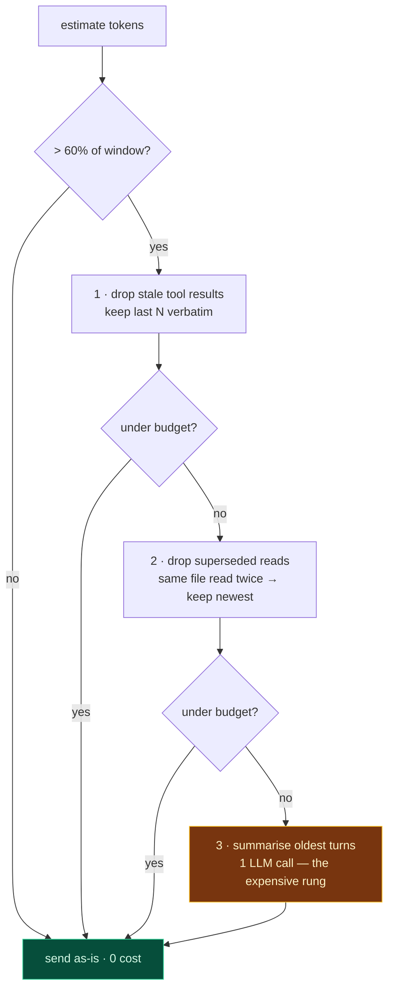

# Phase 10 — Sessions & Context

**Effort:** 1.5 days · **Depends on:** [09](phase-09-agent-loop.md)

---

## 1. Why this phase exists

A working agent gets slower and more expensive with every turn, and the reason is
structural: **the entire conversation is re-sent on every request.**

Turn 20 pays for turns 1–19. A 20 KB `grep` result from turn 3 is still in the payload at
turn 30, having contributed nothing since. Left alone, a session ends one of two ways —
a context-limit error, or a bill nobody expected.

```
turn 1   →   1,200 tokens
turn 5   →   8,400 tokens
turn 10  →  24,000 tokens
turn 20  →  61,000 tokens        ← context limit, or a surprise invoice
```

The fix is not a bigger context window. It is deciding, deliberately, what stops being
sent.

---

## 2. The architecture decision

### JSONL, append-only

| Option | Verdict |
|---|---|
| **JSONL** | **Chosen.** Append-only is crash-safe by construction; greppable; trivially tailable; no schema migration |
| SQLite | Real value only once you need *search across* sessions. Adds a schema and migrations you do not need yet |
| In-memory | Loses everything on restart, and a sidecar restarts |

One message per line. A crash mid-write loses at most the final line, and a truncated
final line is detectable and discardable.

```
~/.sera/sessions/<session_id>.jsonl
```

Use `perf.new_id()` (uuid7) for message and session ids — time-ordered, so the log sorts
naturally and any future index appends rather than scattering
([Phase 01](phase-01-runtime.md) §4).

### Compact on a threshold, not per turn

Summarising every turn adds an LLM call to every turn. That is a round-trip against the
`roundtrips ≤ 4` budget, spent on bookkeeping.

Trigger at a **token threshold** — say 60% of the model's context window — so most
sessions never compact at all.

---

## 3. The compaction ladder

Cheapest first. Stop as soon as you are under budget.



**Rung 1 does most of the work and costs nothing.** Tool results are the bulk of a coding
agent's context, and their value decays fast — a `grep` from six turns ago has already
been acted on. Keep the last ~3 verbatim; replace older ones with a stub:

```
[grep "def handle_login" → 3 matches in 2 files · elided]
```

**Rung 2 is a coding-agent specific win.** If `read_file("src/app.py")` appears at turns
2 and 9, the turn-2 copy is not merely stale — it is *wrong*, because the file was edited
in between. Dropping it saves tokens **and** removes a source of confusion.

**Rung 3 is the only one that costs an LLM call.** Summarise the oldest turns into a
single message. Always preserve verbatim:

- the original user request
- the current file-state facts (what was read, what was edited)
- any unresolved error

`ContextEditingMiddleware` + `ClearToolUsesEdit` in LangChain implement rung 1; worth
porting rather than reimplementing ([Phase 08](phase-08-langgraph.md) §9).

---

## 4. Resume

```
→ {"id":"…","type":"resume","session_id":"01J…"}
← {"id":"…","type":"ready","turns":12,"tokens":18400}
```

Replay the JSONL into message objects and continue. Two details:

**Re-validate the file state.** The tracker from
[Phase 05](phase-05-tool-engine.md) §8 is **per-turn** and must not be restored — files
have almost certainly changed since. Resuming with a stale tracker would let an edit
proceed against a file the agent has not actually read this session, which is exactly the
data-loss path Phase 06 exists to close.

**Re-validate `cwd`.** The project may have moved, or the user may resume from elsewhere.

**Never persist permission grants beyond the session** unless the user explicitly chose
"always". A resumed session inheriting silent approvals is a security bug
([Phase 11](phase-11-permissions.md)).

---

## 5. Redaction

The session log is a file on disk that will get shared in bug reports.

Run the [Phase 12](phase-12-guardrails.md) Tier 1–2 scan over each message **before**
writing it. Structured credentials — API keys, tokens, private keys — get redacted at
rest.

This runs in the cold lane. The user is not waiting on a log write, so the scan is free.

---

## 6. Implementation style

**Estimate tokens, do not count them.** A real tokenizer means loading one per provider.
`len(text) // 4` is within ~10% for code and costs nothing. Reserve exact counting for
the moment you are near the limit.

**Write with `perf.dumps`** (orjson, +77% measured) and compress the archive with
`perf.compress` (zstd-1, +79% measured, 4.3% of raw on a 21 KB payload).

**Never block the turn on a session write.** Append via the cold-lane queue; the user does
not wait on disk.

**Cap the log.** Rotate at ~50 MB. A runaway session should not fill the disk.

---

## 7. Gate

- [ ] 50-turn session stays under the context limit without truncation errors
- [ ] Tokens per turn is **flat**, not monotonically rising, after compaction engages
- [ ] Resume reproduces conversation state exactly
- [ ] Resume does **not** restore the file-state tracker
- [ ] Resume does **not** restore session-scoped permission grants
- [ ] Crash mid-write → log still parses, losing at most the final line
- [ ] Structured credentials never appear in the log
- [ ] Session write never appears in the turn's critical path

---

← [Previous: Phase 09 — Agent Loop](phase-09-agent-loop.md) · [Index](README.md) · [Next: Phase 11 — Permissions](phase-11-permissions.md) →
