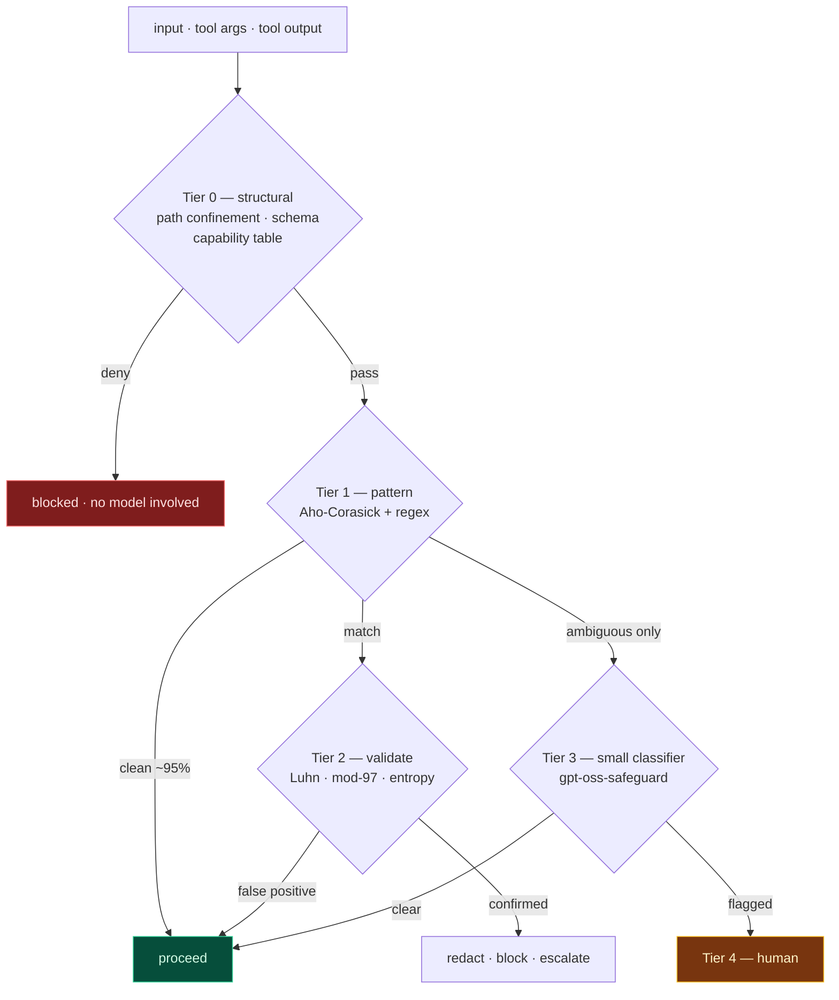
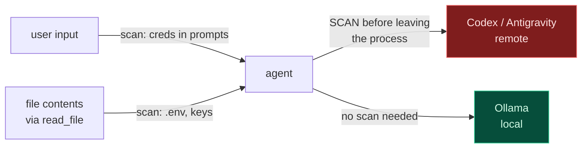

# Phase 12 — Guardrails & PII

**Effort:** 1 day · **Depends on:** [11](phase-11-permissions.md)

> Answers the question: how do Hermes and OpenClaw enforce policy while staying **small
> and fast**?

---

## 1. The inversion

Nous Research calls their approach **"neutral alignment"** — Hermes follows the system
prompt exactly rather than applying built-in content restrictions. Their stated position:
*guardrails belong at the system level, not baked into the model weights.*

That single choice is the whole answer.

| Guardrails in the weights | Guardrails in the harness |
|---|---|
| Parameters spent refusing rather than reasoning | **Zero** model parameters |
| Cannot inspect, version, or disable per context | Inspectable, versionable, testable |
| Every deployment inherits every other deployment's policy | Policy is yours, per context |
| Model can be argued out of a decision | Deterministic — never has a bad day |

**A 4B model with a good harness enforces policy more reliably than a 70B model with
policy in its weights**, because the harness is deterministic.

**Consequence for SERA:** model choice becomes a pure quality/latency decision. Codex,
Antigravity and Ollama are interchangeable precisely because none of them carries the
safety layer. That is [Phase 00](phase-00-architecture.md) §2's provider-neutrality
claim, and this is why it holds.

---

## 2. Why it is fast: the cascade

Checks form a cascade. Cheap deterministic tests resolve nearly everything; only genuine
ambiguity escalates.

| Tier | Mechanism | Latency | Resolves |
|---|---|---:|---:|
| 0 | Structural | **~0.01 ms** | ~40% of *attacks* |
| 1 | Aho-Corasick scan | **~0.1–2 ms** | ~95% |
| 2 | Checksum + entropy | **~0.05 ms** | ~4% |
| 3 | Small classifier | ~50–300 ms | ~1% |
| 4 | Human | seconds | <0.1% |

**Weighted average: well under 2 ms.** The expensive tier exists but is almost never
reached.

**The mistake that makes guardrails slow is running Tier 3 on everything.**

---

## 3. Tier 0 is the one that matters

> **The cheapest guardrail is one you never have to evaluate.**

Content filtering asks "is this string dangerous?" — hard and probabilistic. Capability
restriction asks "can this tool do that at all?" — trivial and deterministic.

| Content filtering (weak, slow) | Capability restriction (strong, free) |
|---|---|
| Detect `../../etc/passwd` in arguments | `resolve_in_project()` — it **cannot** escape |
| Classify whether a shell command is destructive | `bash` is not in the registry unless enabled |
| Detect an attempt to overwrite work | read-before-edit + hash guard makes it impossible |
| Detect exfiltration | no network tool exists by default |

**You have already built most of this.** Phases 02, 06 and 11 are capability
restrictions, not filters. `ToolSpec` **is** the guardrail layer, and it costs a
dictionary lookup.

OpenClaw's gateway does the same at a different altitude — authentication, signature
verification and access control at the boundary, with nodes declaring
`caps`/`commands`/`permissions` on connect and new device IDs requiring pairing approval.
Decide what is *possible* before worrying about what is *said*.

---

## 4. PII without the 300 ms

Presidio costs 80–300 ms because of spaCy NER, and NER is only needed for **unstructured**
PII. Splitting the problem is what makes it cheap.

### Structured — regex + checksum, ~0.1 ms

These have *mathematical structure*, which makes them nearly false-positive-free:

| Identifier | Validation beyond the regex |
|---|---|
| Credit card | **Luhn** |
| IBAN | mod-97 |
| Emirates ID | checksum digit |
| Email | shape + TLD table |
| Phone (E.164) | country code + length |
| API keys | prefix (`sk-`, `ghp_`) + **Shannon entropy** |
| Private keys | `-----BEGIN` marker |

The checksum is what makes it viable. A bare 16-digit regex fires on order numbers and
git hashes constantly; a Luhn-validated one essentially does not.

### Unstructured — usually not your problem

For a **coding agent**, names and addresses are rarely the risk; **credentials are**. So:

- Structured detection in the **hot lane** (Tier 1–2)
- NER in the **cold lane** as an audit, alerting when it disagrees with the regex pass

You get the compliance evidence without paying for it on the critical path.

### Why pattern count is free

| Approach | Cost for *k* patterns over *n* bytes |
|---|---|
| Loop of `k` regexes | **O(k · n)** — 500 patterns = 500 passes |
| Aho-Corasick | **O(n + matches)** — 500 patterns ≈ cost of 5 |

That is how a secret scanner carries thousands of rules at hundreds of MB/s. Python:
`pyahocorasick`. Add a Bloom pre-check on short inputs to skip the scan entirely.

**Already available:** LangChain ships `PIIMiddleware` (verified installed,
`langchain/agents/middleware/pii.py`) with `RedactionRule` / `apply_strategy` including a
`block` strategy. That is Tier 1 for free.

### Scan at the egress boundary

A local model seeing a secret is a non-event; the same bytes going to a hosted provider
is a disclosure. **Make the scan conditional on provider locality** — it halves the cost
for local users and puts it exactly where the risk is.

---

## 5. Tier 3, when you need it

You already have the right model. `doctor` reports **`gpt-oss-safeguard:latest`** in your
Ollama library — an open-weight *safety classifier*.

> Worth repeating from [Phase 07](phase-07-providers.md): the first draft of this repo
> used `gpt-oss-safeguard` as the **chat** model. That is a category error. It is the
> right model for Tier 3 and the wrong one for generation.

Rules:

- **Never on the critical path by default** — only for Tier-1 ambiguous inputs
- **Run it in parallel with generation**, not before. Start streaming; cut the stream if
  it trips. Users perceive a fast start far more than a rare retraction
- **A separate small model**, never the user's provider — or your policy varies by
  whichever back end they signed in with
- **Cache by content hash**

---

## 6. Obligations by phase

Nothing here is new work. It is properties the earlier phases must already have.

| Phase | Obligation | Tier | Cost |
|---|---|---|---|
| [02](phase-02-tool-contract.md) | `resolve_in_project()` chokepoint; `extra="forbid"` | 0 | ~0 |
| [02](phase-02-tool-contract.md) | `ToolSpec.risk` drives the permission table | 0 | ~0 |
| [04](phase-04-search-tools.md) | `PRUNE_DIRS` excludes `.git` and `.env`-bearing dirs | 0 | ~0 |
| [05](phase-05-tool-engine.md) | Repair layer — malformed args never reach a tool | 0 | ~0 |
| [06](phase-06-mutation-tools.md) | read-before-edit + hash guard | 0 | ~0 |
| [07](phase-07-providers.md) | **Egress scan before non-local providers** | 1–2 | ~1 ms |
| [09](phase-09-agent-loop.md) | Tool output framed as data, never instructions | 0 | ~0 |
| [10](phase-10-sessions.md) | Redact credentials before writing the session log | 1–2 | cold lane |
| [11](phase-11-permissions.md) | Human approval for HIGH; deny-list unbypassable | 4 | user time |
| [13](phase-13-deferred.md) | **Plugin sandboxing before any third-party skill loads** | 0 | — |

---

## 7. Gate

- [ ] Egress scan runs before non-local providers, skipped for Ollama
- [ ] Structured-credential detection: **zero** false negatives on a fixture set
- [ ] Luhn/entropy validation eliminates git hashes and order numbers
- [ ] Tier 1 scan p95 ≤ 2 ms on a 100 KB payload
- [ ] Tier 3 never runs on a Tier-1-clean input
- [ ] Session log contains no credentials
- [ ] Total added `turn_overhead` ≤ 5 ms for local providers

---

## 8. Summary

1. **Guardrails live in the harness, not the weights.** Hermes' explicit position, and
   why model size and policy are independent axes.
2. **Cascade the checks.** ~99% resolve deterministically; weighted average under 2 ms.
3. **Capability restriction beats content filtering.** `ToolSpec` already is one.
4. **Split PII by structure.** Checksummed identifiers hot, NER cold.
5. **Aho-Corasick makes pattern count free.**
6. **Scan at egress, and only when the provider is remote.**
7. **Prompt injection outranks PII for a coding agent** — and the
   [Phase 11](phase-11-permissions.md) gate is the defence.
8. **Extensibility is the attack surface.** ~12% of audited ClawHub skills carried
   malicious code — which is why plugins are [Phase 13](phase-13-deferred.md).

---

## Sources

- [Hermes 3 Technical Report — Nous Research](https://nousresearch.com/wp-content/uploads/2024/08/Hermes-3-Technical-Report.pdf)
- [Hermes 3 — Nous Research](https://nousresearch.com/hermes3)
- [NousResearch/Hermes-Function-Calling](https://github.com/NousResearch/Hermes-Function-Calling)
- [Gateway architecture — OpenClaw docs](https://docs.openclaw.ai/concepts/architecture)
- [Security — OpenClaw docs](https://docs.openclaw.ai/gateway/security)
- [A Security Analysis of the OpenClaw AI Agent Framework](https://arxiv.org/pdf/2603.27517)
- [Security, Privacy, and Ethical Risks in OpenClaw](https://arxiv.org/pdf/2605.23330)
- [Trojan's Whisper: Stealthy Manipulation of OpenClaw](https://arxiv.org/pdf/2603.19974)
- [OpenClaw security hardening guide — Nebius](https://nebius.com/blog/posts/openclaw-security)

---

← [Previous: Phase 11 — Permissions](phase-11-permissions.md) · [Index](README.md) · [Next: Phase 13 — Deferred](phase-13-deferred.md) →
